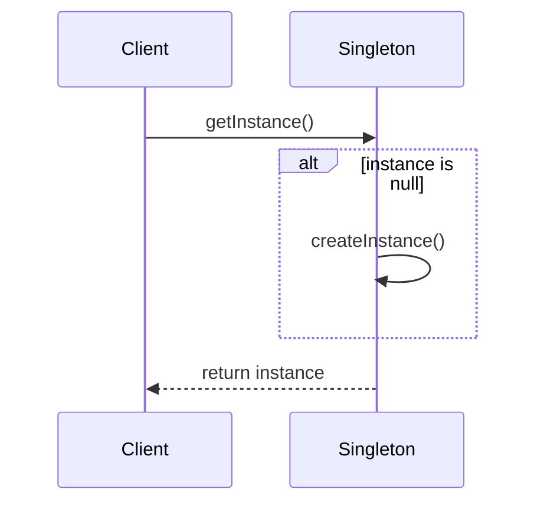

## 3.2 Singleton Pattern

In the realm of software design, the Singleton pattern stands out as a fundamental creational pattern that ensures a class has only one instance while providing a global access point to that instance. This pattern is particularly useful in scenarios where a single instance of a class is required to coordinate actions across the system, such as configuration managers, logging systems, or connection pools.

### Understanding the Singleton Pattern

**Definition**: The Singleton pattern restricts the instantiation of a class to a single object and provides a global point of access to that object. This is achieved by making the class itself responsible for managing its sole instance.

**Intent**: The primary intent of the Singleton pattern is to control object creation, limiting the number of instances to one and providing a single point of access to that instance. This ensures consistency across the application, as all components interact with the same instance.

### When to Use the Singleton Pattern

The Singleton pattern is ideal in scenarios where:

- **Configuration Managers**: Applications often require a centralized configuration manager to handle settings and preferences. A singleton ensures that all parts of the application access the same configuration data.
  
- **Logging Systems**: Logging is a cross-cutting concern that benefits from a single point of access to ensure consistency and manage log file access.
  
- **Resource Management**: Singletons can manage shared resources like database connections or thread pools, ensuring efficient resource utilization.

- **Caching**: A singleton cache can store data that needs to be accessed globally, reducing redundant data retrieval operations.

### Structure of the Singleton Pattern

The Singleton pattern typically involves the following components:

- **Private Constructor**: Prevents the instantiation of the class from outside.
  
- **Static Instance**: Holds the single instance of the class.
  
- **Public Static Method**: Provides a global access point to the instance.

Here is a UML diagram illustrating the Singleton pattern:

```mermaid
classDiagram
    class Singleton {
        -Singleton instance
        -Singleton()
        +getInstance() Singleton
    }
    Singleton : -instance : Singleton
    Singleton : -Singleton()
    Singleton : +getInstance() : Singleton
```

### Implementing the Singleton Pattern in Java

Let's explore a basic implementation of the Singleton pattern in Java:

```java
public class Singleton {
    // Static variable to hold the single instance
    private static Singleton instance;

    // Private constructor to prevent instantiation
    private Singleton() {}

    // Public method to provide access to the instance
    public static Singleton getInstance() {
        if (instance == null) {
            instance = new Singleton();
        }
        return instance;
    }
}
```

**Key Points**:
- The constructor is private, preventing any external instantiation.
- The `getInstance()` method checks if the instance is `null` and creates it if necessary, ensuring only one instance is created.

### Implications of Using the Singleton Pattern

**Benefits**:
- **Controlled Access**: Singleton provides a controlled access point to the instance.
- **Reduced Memory Footprint**: Only one instance is created, reducing memory usage.
- **Consistency**: Ensures consistent behavior across the application.

**Drawbacks**:
- **Hidden Dependencies**: Singletons can introduce hidden dependencies, making the system harder to understand and maintain.
- **Testing Challenges**: Singletons can complicate unit testing, as they introduce global state.
- **Concurrency Issues**: Without proper synchronization, singletons can lead to concurrency issues in multithreaded environments.

### Best Practices for Implementing Singletons in Java

1. **Thread Safety**: Ensure the singleton is thread-safe, especially in multithreaded applications. Use synchronized methods or blocks to prevent race conditions.

2. **Lazy Initialization**: Consider lazy initialization to delay object creation until it's needed, improving startup performance.

3. **Use of Enums**: Java enums provide a simple and effective way to implement singletons, as they inherently support serialization and thread safety.

4. **Avoid Reflection**: Protect the singleton from being instantiated via reflection by throwing exceptions in the constructor.

5. **Serialization**: Handle serialization carefully to maintain the singleton property. Override `readResolve()` to return the existing instance.

### Preparing for Detailed Subsections

In the following subsections, we will delve into various implementation strategies and considerations for the Singleton pattern in Java. We will explore:

- **Thread-Safe Singleton Implementations**: Techniques to ensure thread safety in singleton instances.
- **Lazy Initialization vs. Eager Initialization**: Comparing strategies for initializing singletons.
- **Singleton Using Enum**: Leveraging Java enums for a robust singleton implementation.
- **Serialization Issues with Singleton**: Addressing challenges in maintaining singleton properties during serialization.
- **Use Cases and Examples**: Practical scenarios where the Singleton pattern is applicable.

By understanding these aspects, you will be equipped to implement the Singleton pattern effectively in your Java applications, balancing the benefits and challenges it presents.

### Try It Yourself

To deepen your understanding, try modifying the basic Singleton implementation:

- **Add Thread Safety**: Introduce synchronization to the `getInstance()` method and observe the impact on performance.
- **Implement Lazy Initialization**: Modify the implementation to use lazy initialization and test the startup performance.
- **Use an Enum**: Refactor the Singleton class to use an enum and compare the simplicity and robustness of this approach.

### Visualizing Singleton Pattern

To further illustrate the Singleton pattern, let's visualize the process of accessing the singleton instance:



This sequence diagram shows how the client requests the singleton instance and how the instance is created if it does not already exist.

### References and Further Reading

- [Java Design Patterns - Singleton Pattern](https://www.journaldev.com/1377/java-singleton-design-pattern-best-practices-examples)
- [Effective Java by Joshua Bloch](https://www.amazon.com/Effective-Java-Joshua-Bloch/dp/0134685997)
- [Java Concurrency in Practice by Brian Goetz](https://www.amazon.com/Java-Concurrency-Practice-Brian-Goetz/dp/0321349601)

### Knowledge Check

1. **What is the primary intent of the Singleton pattern?**
   - To ensure a class has only one instance and provide a global access point to it.

2. **What are some common use cases for the Singleton pattern?**
   - Configuration managers, logging systems, resource management, and caching.

3. **What are the key components of the Singleton pattern?**
   - Private constructor, static instance, and public static method.

4. **What are some potential drawbacks of using the Singleton pattern?**
   - Hidden dependencies, testing challenges, and concurrency issues.

5. **How can you ensure thread safety in a Singleton implementation?**
   - Use synchronized methods or blocks, or implement the singleton using an enum.

### Embrace the Journey

Remember, mastering design patterns like Singleton is just the beginning. As you progress, you'll build more complex and efficient systems. Keep experimenting, stay curious, and enjoy the journey!

## Quiz Time!



### What is the primary intent of the Singleton pattern?

- [x] To ensure a class has only one instance and provide a global access point to it.
- [ ] To allow multiple instances of a class with restricted access.
- [ ] To create a new instance of a class every time it is needed.
- [ ] To provide a private access point to a class instance.

> **Explanation:** The Singleton pattern is designed to ensure that a class has only one instance and provides a global access point to that instance.

### Which of the following is a common use case for the Singleton pattern?

- [x] Configuration managers
- [ ] User interface components
- [ ] Data transfer objects
- [ ] Algorithm implementations

> **Explanation:** Configuration managers are a common use case for the Singleton pattern, as they require a single point of access to configuration data.

### What is a key component of the Singleton pattern?

- [x] Private constructor
- [ ] Public constructor
- [ ] Multiple instances
- [ ] Instance pool

> **Explanation:** A private constructor is a key component of the Singleton pattern, as it prevents external instantiation of the class.

### What is a potential drawback of using the Singleton pattern?

- [x] Hidden dependencies
- [ ] Increased memory usage
- [ ] Simplified testing
- [ ] Enhanced concurrency

> **Explanation:** Hidden dependencies are a potential drawback of the Singleton pattern, as they can make the system harder to understand and maintain.

### How can you ensure thread safety in a Singleton implementation?

- [x] Use synchronized methods or blocks
- [x] Implement the singleton using an enum
- [ ] Use a public constructor
- [ ] Allow multiple instances

> **Explanation:** Thread safety in a Singleton implementation can be ensured by using synchronized methods or blocks, or by implementing the singleton using an enum.

### What is the benefit of using an enum for Singleton implementation?

- [x] Thread safety
- [ ] Increased complexity
- [ ] Multiple instances
- [ ] Reduced performance

> **Explanation:** Using an enum for Singleton implementation provides inherent thread safety and simplicity.

### What is lazy initialization in the context of Singleton?

- [x] Delaying object creation until it is needed
- [ ] Creating the object at application startup
- [ ] Creating multiple instances
- [ ] Using a public constructor

> **Explanation:** Lazy initialization refers to delaying the creation of the singleton instance until it is needed, improving startup performance.

### What is a common challenge when testing Singletons?

- [x] Global state
- [ ] Local state
- [ ] Simplified setup
- [ ] Enhanced isolation

> **Explanation:** Singletons introduce global state, which can complicate unit testing by making tests dependent on each other.

### What is the role of the `getInstance()` method in a Singleton?

- [x] To provide access to the single instance
- [ ] To create multiple instances
- [ ] To delete the instance
- [ ] To modify the instance

> **Explanation:** The `getInstance()` method provides access to the single instance of the Singleton class.

### True or False: A Singleton pattern can have multiple instances in a multithreaded environment without synchronization.

- [ ] True
- [x] False

> **Explanation:** Without proper synchronization, a Singleton pattern can result in multiple instances being created in a multithreaded environment.




