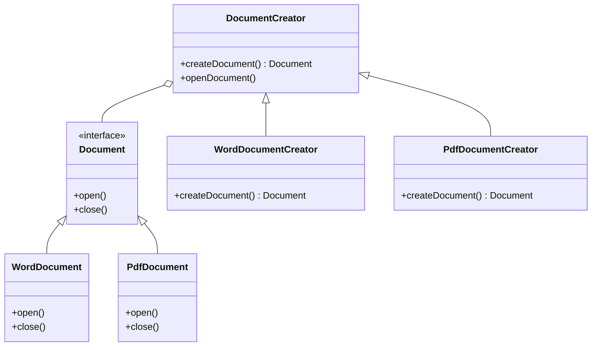

## 3.3.1 Implementing Factory Method in Java

The Factory Method pattern is a creational design pattern that provides an interface for creating objects in a superclass but allows subclasses to alter the type of objects that will be created. This pattern is particularly useful when a class cannot anticipate the class of objects it must create or when a class wants its subclasses to specify the objects it creates.

### Understanding the Factory Method Pattern

Before diving into the implementation, let's break down the key components of the Factory Method pattern:

1. **Product**: This is the interface or abstract class that defines the type of objects the factory method will create.
2. **ConcreteProduct**: These are the classes that implement the Product interface.
3. **Creator**: This is an abstract class or interface that declares the factory method, which returns an object of type Product.
4. **ConcreteCreator**: These are the subclasses that implement the factory method to create and return instances of ConcreteProduct.

### Step-by-Step Implementation

Let's walk through the implementation of the Factory Method pattern in Java with a practical example. We'll create a simple application to manage different types of documents (e.g., Word, PDF).

#### Step 1: Define the Product Interface

First, define the `Product` interface. This interface will be implemented by all concrete products.

```java
// Product.java
public interface Document {
    void open();
    void close();
}
```

#### Step 2: Implement Concrete Products

Next, implement the concrete products that will implement the `Document` interface.

```java
// WordDocument.java
public class WordDocument implements Document {
    @Override
    public void open() {
        System.out.println("Opening Word document...");
    }

    @Override
    public void close() {
        System.out.println("Closing Word document...");
    }
}

// PdfDocument.java
public class PdfDocument implements Document {
    @Override
    public void open() {
        System.out.println("Opening PDF document...");
    }

    @Override
    public void close() {
        System.out.println("Closing PDF document...");
    }
}
```

#### Step 3: Define the Creator Abstract Class

Now, define the `Creator` abstract class, which declares the factory method. This method will return an object of type `Document`.

```java
// DocumentCreator.java
public abstract class DocumentCreator {
    public abstract Document createDocument();

    public void openDocument() {
        Document doc = createDocument();
        doc.open();
    }
}
```

#### Step 4: Implement Concrete Creators

Implement the concrete creators that override the factory method to instantiate specific product objects.

```java
// WordDocumentCreator.java
public class WordDocumentCreator extends DocumentCreator {
    @Override
    public Document createDocument() {
        return new WordDocument();
    }
}

// PdfDocumentCreator.java
public class PdfDocumentCreator extends DocumentCreator {
    @Override
    public Document createDocument() {
        return new PdfDocument();
    }
}
```

#### Step 5: Client Code

Finally, use the factory method in the client code to create and use different types of documents without knowing their concrete classes.

```java
public class Client {
    public static void main(String[] args) {
        DocumentCreator creator = new WordDocumentCreator();
        creator.openDocument();

        creator = new PdfDocumentCreator();
        creator.openDocument();
    }
}
```

### Role of Polymorphism

In this pattern, polymorphism plays a crucial role in decoupling the client code from the specific implementations of the product objects. The client interacts with the abstract `Document` interface, which allows it to work with any concrete product without knowing its specific type. This decoupling enhances flexibility and maintainability, as new product types can be added with minimal changes to the existing codebase.

### Benefits of the Factory Method Pattern

- **Flexibility**: The Factory Method pattern allows the client code to work with different products without knowing their concrete classes.
- **Scalability**: New product types can be added easily by creating new concrete creator classes.
- **Maintainability**: Changes to product creation logic are confined to the creator classes, reducing the impact on client code.

### Best Practices

- **Program to Interfaces**: Always program to the `Product` interface rather than concrete classes to leverage polymorphism.
- **Use Abstract Classes for Creators**: Define the creator as an abstract class if you want to provide a default implementation for some methods.
- **Keep Factory Methods Simple**: The factory method should only be responsible for creating product objects. Avoid adding complex logic within it.

### Visualizing the Factory Method Pattern

To better understand the relationships between the components of the Factory Method pattern, let's visualize it using a class diagram.



### Try It Yourself

Experiment with the Factory Method pattern by extending the example above:

- **Add a New Document Type**: Create a new document type, such as `ExcelDocument`, and implement the necessary classes.
- **Modify the Client Code**: Update the client code to use the new document type and observe how the pattern facilitates this change.
- **Refactor the Creator Class**: Try refactoring the `DocumentCreator` class to include additional methods that might be common across all document creators.

### References and Further Reading

- [Design Patterns: Elements of Reusable Object-Oriented Software](https://www.amazon.com/Design-Patterns-Elements-Reusable-Object-Oriented/dp/0201633612) by Erich Gamma et al.
- [Java Design Patterns](https://www.journaldev.com/1827/java-design-patterns-example-tutorial) on JournalDev
- [Factory Method Pattern](https://refactoring.guru/design-patterns/factory-method) on Refactoring Guru

### Knowledge Check

- **What is the primary purpose of the Factory Method pattern?**
- **How does polymorphism enhance the flexibility of the Factory Method pattern?**
- **What are the key components of the Factory Method pattern?**

### Embrace the Journey

Remember, mastering design patterns is a journey. As you continue to explore and implement different patterns, you'll gain a deeper understanding of their nuances and applications. Keep experimenting, stay curious, and enjoy the journey!

## Quiz Time!



### What is the primary role of the Creator class in the Factory Method pattern?

- [x] To declare the factory method that returns an object of type Product.
- [ ] To implement the concrete product classes.
- [ ] To provide a user interface for the application.
- [ ] To manage the lifecycle of the application.

> **Explanation:** The Creator class declares the factory method, which is responsible for returning an object of type Product.

### How does polymorphism contribute to the Factory Method pattern?

- [x] It decouples the client code from the specific implementations of the product objects.
- [ ] It allows multiple inheritance in Java.
- [ ] It provides a way to implement multiple interfaces.
- [ ] It enables the use of abstract classes.

> **Explanation:** Polymorphism allows the client code to interact with the abstract Product interface, decoupling it from specific implementations.

### Which of the following is a benefit of using the Factory Method pattern?

- [x] Flexibility in adding new product types.
- [ ] Direct access to concrete product classes.
- [ ] Simplified user interface design.
- [ ] Reduced need for error handling.

> **Explanation:** The Factory Method pattern provides flexibility by allowing new product types to be added with minimal changes to existing code.

### What should the factory method primarily focus on?

- [x] Creating product objects.
- [ ] Managing user input.
- [ ] Handling database connections.
- [ ] Logging application errors.

> **Explanation:** The factory method's primary responsibility is to create product objects.

### In the Factory Method pattern, what is the relationship between the Creator and ConcreteCreator?

- [x] ConcreteCreator is a subclass of Creator.
- [ ] Creator is a subclass of ConcreteCreator.
- [ ] They are unrelated classes.
- [ ] They are both interfaces.

> **Explanation:** ConcreteCreator is a subclass of Creator and overrides the factory method to instantiate specific product objects.

### What is a key advantage of programming to interfaces in the Factory Method pattern?

- [x] It enhances code flexibility and maintainability.
- [ ] It simplifies the user interface.
- [ ] It reduces the need for error handling.
- [ ] It improves database connectivity.

> **Explanation:** Programming to interfaces enhances flexibility and maintainability by allowing different implementations to be used interchangeably.

### How can new product types be added in the Factory Method pattern?

- [x] By creating new ConcreteCreator classes.
- [ ] By modifying the existing Creator class.
- [ ] By changing the client code.
- [ ] By updating the Product interface.

> **Explanation:** New product types can be added by creating new ConcreteCreator classes that implement the factory method.

### What is the role of the Product interface in the Factory Method pattern?

- [x] To define the type of objects the factory method will create.
- [ ] To manage the application's user interface.
- [ ] To handle database operations.
- [ ] To provide logging functionality.

> **Explanation:** The Product interface defines the type of objects that the factory method will create.

### Which of the following is a common use case for the Factory Method pattern?

- [x] Creating different types of documents in an application.
- [ ] Managing user authentication.
- [ ] Handling network connections.
- [ ] Logging application errors.

> **Explanation:** The Factory Method pattern is commonly used to create different types of objects, such as documents, without specifying their concrete classes.

### True or False: The Factory Method pattern requires the client code to know the specific classes of the products it creates.

- [ ] True
- [x] False

> **Explanation:** False. The Factory Method pattern allows the client code to work with the abstract Product interface, without knowing the specific classes of the products.


