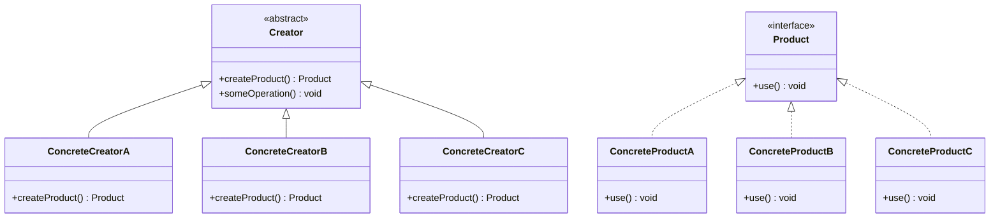

## 3.3.2 Product and Creator Hierarchies

In the realm of design patterns, the Factory Method pattern stands out as a quintessential example of how object creation can be abstracted to promote flexibility and scalability. At the heart of this pattern are the **Creator** and **Product** classes, which work in tandem to decouple the instantiation process from the client code. This section delves into the intricate relationship between these classes, exploring their roles, interactions, and the hierarchies they form.

### Understanding the Creator and Product Relationship

The Factory Method pattern revolves around two primary participants: the **Creator** and the **Product**. The Creator class is responsible for defining the factory method, which returns an instance of the Product. However, the actual instantiation of the Product is deferred to subclasses of the Creator, allowing for flexibility in the types of objects that can be created.

#### The Creator Class

The Creator class is an abstract class or interface that declares the factory method. This method is intended to return an object of type Product. The Creator class may also contain some default implementation, but the core idea is that the factory method is meant to be overridden by subclasses to produce specific types of Products.

```java
// Abstract Creator class
abstract class Creator {
    // Factory method
    public abstract Product createProduct();

    // Some operation that uses the Product
    public void someOperation() {
        Product product = createProduct();
        // Use the product
    }
}
```

#### The Product Class

The Product class is an interface or abstract class that defines the type of objects the factory method will create. Concrete implementations of this class represent the various products that can be instantiated by the factory method.

```java
// Product interface
interface Product {
    void use();
}

// Concrete Product classes
class ConcreteProductA implements Product {
    public void use() {
        System.out.println("Using ConcreteProductA");
    }
}

class ConcreteProductB implements Product {
    public void use() {
        System.out.println("Using ConcreteProductB");
    }
}
```

### Class Hierarchies in Factory Method Pattern

The Factory Method pattern encourages the use of class hierarchies for both Creators and Products. This hierarchical structure allows for the creation of new product types without altering existing creator code, adhering to the Open/Closed Principle.

#### Creator Hierarchy

The Creator hierarchy consists of an abstract Creator class and its concrete subclasses. Each subclass implements the factory method to instantiate a specific type of Product.

```java
// Concrete Creator classes
class ConcreteCreatorA extends Creator {
    public Product createProduct() {
        return new ConcreteProductA();
    }
}

class ConcreteCreatorB extends Creator {
    public Product createProduct() {
        return new ConcreteProductB();
    }
}
```

#### Product Hierarchy

The Product hierarchy is composed of an interface or abstract Product class and its concrete implementations. Each concrete Product class represents a specific type of product that can be created by the factory method.

### Introducing New Product Subclasses

One of the key advantages of the Factory Method pattern is its support for introducing new Product subclasses without modifying existing Creator code. This is achieved through polymorphism, where the factory method's return type is the Product interface, allowing for any of its implementations to be returned.

To introduce a new product, simply create a new subclass of the Product interface and a corresponding Creator subclass that overrides the factory method to instantiate the new product.

```java
// New Concrete Product class
class ConcreteProductC implements Product {
    public void use() {
        System.out.println("Using ConcreteProductC");
    }
}

// New Concrete Creator class
class ConcreteCreatorC extends Creator {
    public Product createProduct() {
        return new ConcreteProductC();
    }
}
```

### UML Diagram of Product and Creator Hierarchies

To better visualize the relationships and interactions between the Creator and Product hierarchies, let's examine a UML class diagram:



**Diagram Description:** This UML diagram illustrates the hierarchy of Creator and Product classes. The Creator class is abstract, with three concrete subclasses: ConcreteCreatorA, ConcreteCreatorB, and ConcreteCreatorC. Each subclass implements the `createProduct()` method to return a specific type of Product. The Product interface is implemented by three concrete classes: ConcreteProductA, ConcreteProductB, and ConcreteProductC.

### Importance of Polymorphism

Polymorphism is a cornerstone of the Factory Method pattern, enabling the flexibility and extensibility that make this pattern so powerful. By relying on the Product interface, the Creator class can work with any Product implementation, allowing for seamless integration of new product types.

#### Benefits of Polymorphism

1. **Extensibility:** New product types can be added without modifying existing creator code, adhering to the Open/Closed Principle.
2. **Flexibility:** The client code can work with any product type, as long as it adheres to the Product interface.
3. **Maintainability:** Changes to product implementations do not affect the creator or client code, as long as the interface remains consistent.

### Practical Example: Document Creation System

Let's consider a practical example of a document creation system where different types of documents (e.g., Word, PDF, Excel) are created using the Factory Method pattern.

#### Product Interface and Concrete Products

```java
// Product interface
interface Document {
    void open();
    void close();
}

// Concrete Product classes
class WordDocument implements Document {
    public void open() {
        System.out.println("Opening Word document");
    }
    public void close() {
        System.out.println("Closing Word document");
    }
}

class PdfDocument implements Document {
    public void open() {
        System.out.println("Opening PDF document");
    }
    public void close() {
        System.out.println("Closing PDF document");
    }
}

class ExcelDocument implements Document {
    public void open() {
        System.out.println("Opening Excel document");
    }
    public void close() {
        System.out.println("Closing Excel document");
    }
}
```

#### Creator Class and Concrete Creators

```java
// Abstract Creator class
abstract class DocumentCreator {
    public abstract Document createDocument();

    public void newDocument() {
        Document doc = createDocument();
        doc.open();
        // Perform operations on the document
        doc.close();
    }
}

// Concrete Creator classes
class WordDocumentCreator extends DocumentCreator {
    public Document createDocument() {
        return new WordDocument();
    }
}

class PdfDocumentCreator extends DocumentCreator {
    public Document createDocument() {
        return new PdfDocument();
    }
}

class ExcelDocumentCreator extends DocumentCreator {
    public Document createDocument() {
        return new ExcelDocument();
    }
}
```

#### Client Code

```java
public class DocumentFactoryDemo {
    public static void main(String[] args) {
        DocumentCreator wordCreator = new WordDocumentCreator();
        DocumentCreator pdfCreator = new PdfDocumentCreator();
        DocumentCreator excelCreator = new ExcelDocumentCreator();

        wordCreator.newDocument();
        pdfCreator.newDocument();
        excelCreator.newDocument();
    }
}
```

**Explanation:** In this example, the Document interface defines the operations that all document types must implement. Concrete classes like WordDocument, PdfDocument, and ExcelDocument provide specific implementations. The DocumentCreator class is an abstract creator that defines the factory method `createDocument()`. Concrete creators like WordDocumentCreator, PdfDocumentCreator, and ExcelDocumentCreator implement this method to return specific document types.

### Try It Yourself

To deepen your understanding of the Factory Method pattern, try modifying the code examples provided:

- **Add a New Document Type:** Create a new document type, such as `PresentationDocument`, and implement the necessary classes and methods.
- **Experiment with Different Operations:** Add more operations to the Document interface, such as `save()` or `print()`, and implement them in the concrete product classes.
- **Refactor the Client Code:** Modify the client code to dynamically choose the document creator based on user input or configuration.

### Conclusion

The Factory Method pattern, with its emphasis on product and creator hierarchies, provides a robust framework for managing object creation in a flexible and scalable manner. By adhering to principles like polymorphism and the Open/Closed Principle, this pattern enables developers to introduce new product types seamlessly, enhancing the maintainability and extensibility of their codebases.

As you continue to explore design patterns, remember that the Factory Method pattern is just one tool in your arsenal. Keep experimenting, stay curious, and enjoy the journey of mastering design patterns in Java.

## Quiz Time!



### What is the primary role of the Creator class in the Factory Method pattern?

- [x] To define the factory method that returns an instance of the Product.
- [ ] To implement all concrete products.
- [ ] To manage the lifecycle of the Product.
- [ ] To provide user interfaces for the Product.

> **Explanation:** The Creator class defines the factory method, which is responsible for returning an instance of the Product. The actual instantiation is deferred to subclasses.

### How does the Factory Method pattern adhere to the Open/Closed Principle?

- [x] By allowing new product types to be added without modifying existing creator code.
- [ ] By requiring all products to be defined in the Creator class.
- [ ] By using static methods for product creation.
- [ ] By enforcing a single product type for all creators.

> **Explanation:** The Factory Method pattern allows new product types to be introduced by creating new subclasses, thus adhering to the Open/Closed Principle.

### What is the benefit of using polymorphism in the Factory Method pattern?

- [x] It allows the client code to work with any product type that adheres to the Product interface.
- [ ] It ensures that all products are created in a single class.
- [ ] It eliminates the need for concrete product classes.
- [ ] It simplifies the implementation of the factory method.

> **Explanation:** Polymorphism enables the client code to interact with any product type through the Product interface, enhancing flexibility and extensibility.

### In the Factory Method pattern, what is the relationship between the Creator and Product classes?

- [x] The Creator class defines a factory method that returns an instance of the Product class.
- [ ] The Creator class implements the Product interface.
- [ ] The Product class manages the Creator class.
- [ ] The Creator class is a subclass of the Product class.

> **Explanation:** The Creator class defines the factory method, which returns an instance of the Product class, establishing a relationship between them.

### Which of the following is a key advantage of using the Factory Method pattern?

- [x] It allows for the seamless introduction of new product types.
- [ ] It eliminates the need for abstract classes.
- [ ] It enforces a single product type for all applications.
- [ ] It simplifies the user interface design.

> **Explanation:** The Factory Method pattern allows for the introduction of new product types without modifying existing code, making it highly extensible.

### What is the purpose of the Product interface in the Factory Method pattern?

- [x] To define the type of objects that the factory method will create.
- [ ] To implement the factory method.
- [ ] To manage the lifecycle of the Creator class.
- [ ] To provide a user interface for the Creator class.

> **Explanation:** The Product interface defines the type of objects that the factory method will create, allowing for different implementations.

### How can new Product subclasses be introduced in the Factory Method pattern?

- [x] By creating new subclasses of the Product interface and corresponding Creator subclasses.
- [ ] By modifying the existing Creator class.
- [ ] By using static methods in the Product class.
- [ ] By implementing the Product interface in the Creator class.

> **Explanation:** New Product subclasses can be introduced by creating new subclasses of the Product interface and corresponding Creator subclasses.

### What is the role of concrete creators in the Factory Method pattern?

- [x] To implement the factory method and return specific product types.
- [ ] To define the Product interface.
- [ ] To manage the lifecycle of all products.
- [ ] To provide user interfaces for all products.

> **Explanation:** Concrete creators implement the factory method to return specific product types, defining the actual product creation process.

### How does the Factory Method pattern promote maintainability?

- [x] By decoupling the instantiation process from the client code.
- [ ] By requiring all products to be defined in a single class.
- [ ] By enforcing a single product type for all applications.
- [ ] By simplifying the user interface design.

> **Explanation:** The Factory Method pattern promotes maintainability by decoupling the instantiation process from the client code, allowing for easier updates and modifications.

### True or False: In the Factory Method pattern, the Creator class must always be an abstract class.

- [x] False
- [ ] True

> **Explanation:** The Creator class can be an abstract class or an interface, depending on the design requirements and the need for default implementation.


