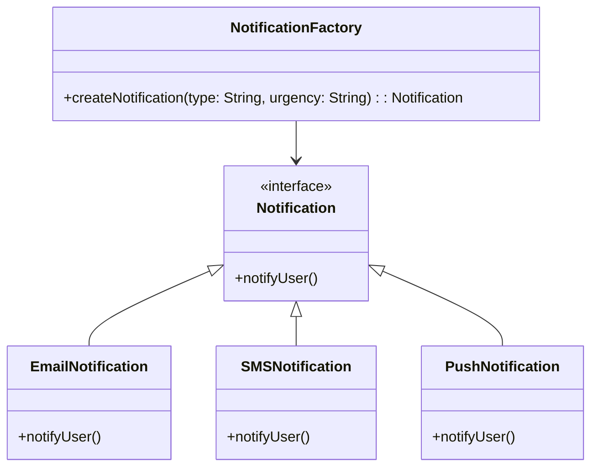

## 3.3.3 Parameterized Factories

In the realm of software design patterns, the Factory Method pattern stands out for its ability to define an interface for creating objects while allowing subclasses to alter the type of objects that will be created. However, as systems grow in complexity, the need for more flexible and dynamic object creation becomes apparent. This is where parameterized factories come into play. By introducing parameters into the factory method, we can enhance the pattern's flexibility, allowing clients to specify criteria for object creation. This section delves into the concept of parameterized factories, illustrating their implementation, benefits, and potential drawbacks.

### Understanding Parameterized Factories

Parameterized factories extend the traditional Factory Method pattern by accepting parameters that influence the object creation process. This approach allows the factory to make decisions based on the input parameters, determining which subclass of a product to instantiate. This flexibility is particularly useful in scenarios where the number of potential products is large or dynamic, and subclassing alone would lead to an unwieldy hierarchy.

#### Key Concepts

- **Parameterization**: The process of using parameters to guide the factory in selecting the appropriate product subclass.
- **Dynamic Object Creation**: The ability to create different types of objects based on runtime information.
- **Flexibility and Scalability**: Parameterized factories offer a scalable solution for systems with a large or evolving set of product types.

### Implementing Parameterized Factories in Java

Let's explore how to implement parameterized factories in Java. We'll start with a simple example and gradually introduce more complexity to demonstrate the pattern's versatility.

#### Basic Example

Consider a scenario where we need to create different types of notifications (e.g., Email, SMS, Push). A parameterized factory can decide which notification type to create based on input parameters.

```java
// Product Interface
interface Notification {
    void notifyUser();
}

// Concrete Products
class EmailNotification implements Notification {
    @Override
    public void notifyUser() {
        System.out.println("Sending an Email notification");
    }
}

class SMSNotification implements Notification {
    @Override
    public void notifyUser() {
        System.out.println("Sending an SMS notification");
    }
}

class PushNotification implements Notification {
    @Override
    public void notifyUser() {
        System.out.println("Sending a Push notification");
    }
}

// Parameterized Factory
class NotificationFactory {
    public static Notification createNotification(String type) {
        switch (type.toLowerCase()) {
            case "email":
                return new EmailNotification();
            case "sms":
                return new SMSNotification();
            case "push":
                return new PushNotification();
            default:
                throw new IllegalArgumentException("Unknown notification type");
        }
    }
}

// Client Code
public class NotificationService {
    public static void main(String[] args) {
        Notification notification = NotificationFactory.createNotification("email");
        notification.notifyUser();
    }
}
```

In this example, the `NotificationFactory` uses a parameter (`type`) to decide which `Notification` subclass to instantiate. This approach allows for flexible and dynamic object creation without the need for a complex hierarchy of subclasses.

#### Enhancing the Factory with Additional Parameters

As systems evolve, the need for more complex decision-making in the factory method may arise. We can enhance our factory to accept additional parameters, allowing for more nuanced object creation.

Consider a scenario where we need to create notifications with varying levels of urgency. We can modify our factory to accept an additional parameter for urgency.

```java
// Enhanced Parameterized Factory
class EnhancedNotificationFactory {
    public static Notification createNotification(String type, String urgency) {
        Notification notification;
        switch (type.toLowerCase()) {
            case "email":
                notification = new EmailNotification();
                break;
            case "sms":
                notification = new SMSNotification();
                break;
            case "push":
                notification = new PushNotification();
                break;
            default:
                throw new IllegalArgumentException("Unknown notification type");
        }
        // Additional logic based on urgency
        if ("high".equalsIgnoreCase(urgency)) {
            System.out.println("This is a high urgency notification");
        }
        return notification;
    }
}

// Client Code
public class EnhancedNotificationService {
    public static void main(String[] args) {
        Notification notification = EnhancedNotificationFactory.createNotification("sms", "high");
        notification.notifyUser();
    }
}
```

In this enhanced example, the factory method not only decides the type of notification but also incorporates additional logic based on the urgency parameter.

### Trade-offs of Parameterized Factories

While parameterized factories offer significant flexibility, they also come with trade-offs that must be carefully considered.

#### Benefits

1. **Flexibility**: Parameterized factories allow for dynamic object creation based on runtime information, making them suitable for systems with a large or evolving set of product types.
2. **Reduced Subclassing**: By using parameters, we can avoid creating a large hierarchy of subclasses, simplifying the class structure.
3. **Scalability**: As new product types are introduced, the factory can be easily extended to accommodate them without modifying existing code.

#### Drawbacks

1. **Increased Complexity**: Introducing parameters can lead to more complex factory methods, making them harder to understand and maintain.
2. **Potential Violation of the Open/Closed Principle**: If not managed carefully, parameterized factories can violate the Open/Closed Principle, as changes to the factory logic may require modifying existing code.
3. **Performance Overhead**: The decision-making logic in parameterized factories can introduce performance overhead, especially if the logic is complex or involves expensive operations.

### Scenarios Where Parameterization is Beneficial

Parameterized factories are particularly beneficial in scenarios where:

- The number of potential products is large or dynamic, and subclassing would lead to an unwieldy hierarchy.
- The decision-making process for object creation involves multiple criteria or complex logic.
- The system needs to support a wide range of configurations or variations in product types.

### Potential Drawbacks and Mitigation Strategies

While parameterized factories offer flexibility, they can also introduce complexity and potential pitfalls. It's important to be aware of these drawbacks and consider strategies to mitigate them.

#### Complexity and Maintainability

As the decision-making logic in parameterized factories becomes more complex, it can lead to maintainability challenges. To address this, consider the following strategies:

- **Modularize Decision Logic**: Break down complex decision logic into smaller, reusable methods or classes. This can help keep the factory method concise and easier to understand.
- **Use Configuration Files**: Externalize configuration data into files or databases, allowing the factory to read and apply configurations without hardcoding them into the codebase.
- **Leverage Design Patterns**: Consider using other design patterns, such as the Strategy or Chain of Responsibility patterns, to encapsulate complex decision-making logic.

#### Open/Closed Principle Violation

Parameterized factories can potentially violate the Open/Closed Principle if changes to the factory logic require modifying existing code. To mitigate this risk:

- **Use Interfaces and Abstractions**: Define interfaces or abstract classes for product types, allowing new products to be introduced without modifying existing code.
- **Implement Extension Points**: Design the factory with extension points, such as hooks or callbacks, that allow new logic to be added without altering the core factory method.

#### Performance Considerations

The decision-making logic in parameterized factories can introduce performance overhead, especially if it involves complex operations. To optimize performance:

- **Cache Results**: Cache the results of expensive operations or computations to avoid redundant processing.
- **Optimize Decision Logic**: Review and optimize the decision logic to minimize unnecessary computations or checks.
- **Profile and Benchmark**: Use profiling and benchmarking tools to identify and address performance bottlenecks in the factory method.

### Visualizing Parameterized Factories

To better understand the concept of parameterized factories, let's visualize the process using a class diagram. This diagram illustrates the relationships between the factory, product interface, and concrete product classes.



In this diagram, the `NotificationFactory` class is responsible for creating instances of the `Notification` interface. The concrete product classes (`EmailNotification`, `SMSNotification`, `PushNotification`) implement the `Notification` interface, and the factory method uses parameters to decide which subclass to instantiate.

### Try It Yourself

Now that we've explored the concept of parameterized factories, let's encourage you to experiment with the code examples. Here are a few suggestions for modifications:

1. **Add New Notification Types**: Extend the factory to support additional notification types, such as `InAppNotification` or `VoiceCallNotification`.
2. **Introduce Additional Parameters**: Modify the factory to accept additional parameters, such as `priority` or `recipient`, and incorporate them into the decision-making logic.
3. **Externalize Configuration**: Move the notification type and urgency configurations to an external file or database, and update the factory to read from this source.

### References and Further Reading

- [Design Patterns: Elements of Reusable Object-Oriented Software](https://www.amazon.com/Design-Patterns-Elements-Reusable-Object-Oriented/dp/0201633612) by Erich Gamma, Richard Helm, Ralph Johnson, and John Vlissides
- [Effective Java](https://www.amazon.com/Effective-Java-Joshua-Bloch/dp/0134685997) by Joshua Bloch
- [Java Design Patterns](https://www.oreilly.com/library/view/java-design-patterns/9781786463599/) by Vaskaran Sarcar

### Knowledge Check

To reinforce your understanding of parameterized factories, consider the following questions:

1. What are the key benefits of using parameterized factories in Java?
2. How can parameterized factories potentially violate the Open/Closed Principle?
3. What strategies can be used to mitigate the complexity introduced by parameterized factories?
4. In what scenarios are parameterized factories particularly beneficial?
5. How can performance overhead be addressed in parameterized factories?

Remember, this is just the beginning. As you progress, you'll build more complex and dynamic systems using parameterized factories. Keep experimenting, stay curious, and enjoy the journey!

## Quiz Time!



### What is a primary benefit of parameterized factories?

- [x] They allow dynamic object creation based on runtime information.
- [ ] They simplify the class hierarchy by eliminating the need for interfaces.
- [ ] They automatically optimize performance without additional logic.
- [ ] They enforce strict adherence to the Open/Closed Principle.

> **Explanation:** Parameterized factories enable dynamic object creation by using parameters to influence which subclass of a product to instantiate, providing flexibility in object creation.

### How can parameterized factories violate the Open/Closed Principle?

- [x] By requiring modifications to existing code when new logic is introduced.
- [ ] By using interfaces to define product types.
- [ ] By caching results of expensive operations.
- [ ] By using configuration files for decision-making.

> **Explanation:** Parameterized factories can violate the Open/Closed Principle if changes to the factory logic necessitate modifying existing code, rather than allowing for extension without alteration.

### Which design pattern can be used to encapsulate complex decision-making logic in parameterized factories?

- [x] Strategy Pattern
- [ ] Singleton Pattern
- [ ] Observer Pattern
- [ ] Decorator Pattern

> **Explanation:** The Strategy Pattern can encapsulate complex decision-making logic, allowing for flexible and interchangeable strategies within parameterized factories.

### What is a potential drawback of parameterized factories?

- [x] Increased complexity in the factory method.
- [ ] Reduced flexibility in object creation.
- [ ] Decreased scalability of the system.
- [ ] Automatic violation of the Single Responsibility Principle.

> **Explanation:** Parameterized factories can introduce increased complexity in the factory method, making it harder to understand and maintain.

### In which scenario are parameterized factories particularly beneficial?

- [x] When the number of potential products is large or dynamic.
- [ ] When the system requires strict adherence to a fixed set of products.
- [ ] When performance is the sole concern.
- [ ] When subclassing is preferred over parameterization.

> **Explanation:** Parameterized factories are beneficial when the number of potential products is large or dynamic, allowing for flexible and scalable object creation.

### How can performance overhead be addressed in parameterized factories?

- [x] By caching results of expensive operations.
- [ ] By eliminating all parameters from the factory method.
- [ ] By using subclassing exclusively.
- [ ] By avoiding the use of interfaces.

> **Explanation:** Caching results of expensive operations can help address performance overhead in parameterized factories, reducing redundant processing.

### What is a strategy to mitigate complexity in parameterized factories?

- [x] Modularize decision logic into smaller methods or classes.
- [ ] Use a single monolithic method for all decision-making.
- [ ] Avoid using parameters altogether.
- [ ] Rely solely on subclassing for flexibility.

> **Explanation:** Modularizing decision logic into smaller, reusable methods or classes can help mitigate complexity in parameterized factories, making them easier to understand and maintain.

### How can parameterized factories be extended without violating the Open/Closed Principle?

- [x] By defining interfaces or abstract classes for product types.
- [ ] By hardcoding all possible product types within the factory method.
- [ ] By avoiding the use of parameters in the factory method.
- [ ] By using only concrete classes for product types.

> **Explanation:** Defining interfaces or abstract classes for product types allows parameterized factories to be extended with new products without modifying existing code, adhering to the Open/Closed Principle.

### What is a potential benefit of using configuration files with parameterized factories?

- [x] They allow for externalizing configuration data, reducing hardcoding.
- [ ] They eliminate the need for parameters in the factory method.
- [ ] They automatically optimize the factory method's performance.
- [ ] They enforce a fixed set of product types.

> **Explanation:** Configuration files allow for externalizing configuration data, reducing hardcoding and enabling more flexible and maintainable parameterized factories.

### Parameterized factories are always the best choice for object creation.

- [ ] True
- [x] False

> **Explanation:** Parameterized factories are not always the best choice; they are beneficial in specific scenarios where flexibility and dynamic object creation are needed, but they can introduce complexity and potential drawbacks if not managed carefully.


