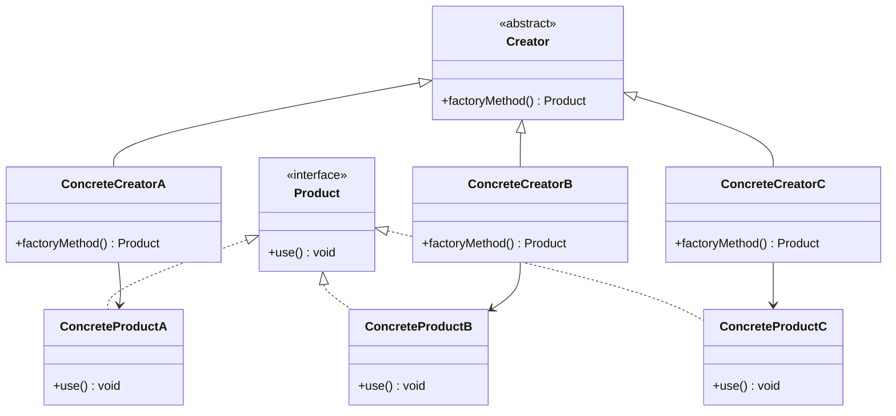

## 3.3.4 Extending Factories

In the realm of software design, the Factory Method Pattern stands out as a powerful tool for creating objects without specifying the exact class of object that will be created. This pattern is particularly useful when the system needs to be open for extension but closed for modification, adhering to the Open/Closed Principle (OCP). This section delves into extending factories to support new product types, ensuring that the system remains flexible and maintainable.

### Understanding the Factory Method Pattern

Before we dive into extending factories, let's briefly revisit the Factory Method Pattern. This pattern involves a Creator class that declares a factory method for creating objects, while the subclasses of the Creator override this method to produce different types of objects. This setup allows the client code to work with the Creator interface, while the actual product creation is deferred to the subclasses.

### Strategies for Extending Factories

When extending factories, the goal is to introduce new product types without altering existing code. This can be achieved through various strategies:

1. **Subclassing the Creator Class**: By subclassing the Creator class, you can introduce new factory methods specific to the new product types. This approach allows you to encapsulate the creation logic for new products within the subclass, keeping the original Creator class unchanged.

2. **Registering New Products at Runtime**: Another strategy involves registering new products with the factory at runtime. This can be done using a registry or a map that associates product identifiers with their respective creation logic. This approach provides flexibility in adding new products dynamically.

3. **Using Reflection or Configuration Files**: Reflection and configuration files can be leveraged to add new products without modifying the code. By reading product configurations from external files or using reflection to instantiate classes dynamically, you can extend the factory's capabilities without recompiling the code.

4. **Designing for Extensibility**: When designing a factory, it's crucial to consider extensibility from the outset. This involves creating a flexible architecture that can accommodate new product types with minimal effort. Techniques such as interface-based design and dependency injection can aid in achieving this goal.

### Subclassing the Creator Class

Subclassing is a straightforward way to extend factories. By creating a new subclass of the Creator class, you can override the factory method to produce new product types. Let's explore this approach with an example.

```java
// Product interface
interface Product {
    void use();
}

// Concrete Product A
class ConcreteProductA implements Product {
    @Override
    public void use() {
        System.out.println("Using ConcreteProductA");
    }
}

// Concrete Product B
class ConcreteProductB implements Product {
    @Override
    public void use() {
        System.out.println("Using ConcreteProductB");
    }
}

// Creator class
abstract class Creator {
    public abstract Product factoryMethod();
}

// Concrete Creator A
class ConcreteCreatorA extends Creator {
    @Override
    public Product factoryMethod() {
        return new ConcreteProductA();
    }
}

// Concrete Creator B
class ConcreteCreatorB extends Creator {
    @Override
    public Product factoryMethod() {
        return new ConcreteProductB();
    }
}

// New Concrete Creator for a new product
class ConcreteCreatorC extends Creator {
    @Override
    public Product factoryMethod() {
        return new ConcreteProductC(); // New product type
    }
}

// New Concrete Product C
class ConcreteProductC implements Product {
    @Override
    public void use() {
        System.out.println("Using ConcreteProductC");
    }
}
```

In this example, `ConcreteCreatorC` is a new subclass of `Creator` that introduces a new product type, `ConcreteProductC`. This approach keeps the original `Creator` class unchanged, adhering to the Open/Closed Principle.

### Registering New Products at Runtime

Registering new products at runtime offers a dynamic way to extend factories. This method involves maintaining a registry of product types and their corresponding creation logic. Let's see how this can be implemented.

```java
import java.util.HashMap;
import java.util.Map;
import java.util.function.Supplier;

// Product interface
interface Product {
    void use();
}

// Concrete Product A
class ConcreteProductA implements Product {
    @Override
    public void use() {
        System.out.println("Using ConcreteProductA");
    }
}

// Concrete Product B
class ConcreteProductB implements Product {
    @Override
    public void use() {
        System.out.println("Using ConcreteProductB");
    }
}

// Factory class with registry
class ProductFactory {
    private static final Map<String, Supplier<Product>> registry = new HashMap<>();

    static {
        // Register default products
        registry.put("A", ConcreteProductA::new);
        registry.put("B", ConcreteProductB::new);
    }

    public static void registerProduct(String key, Supplier<Product> supplier) {
        registry.put(key, supplier);
    }

    public static Product createProduct(String key) {
        Supplier<Product> supplier = registry.get(key);
        if (supplier != null) {
            return supplier.get();
        }
        throw new IllegalArgumentException("No such product registered");
    }
}

// New Concrete Product C
class ConcreteProductC implements Product {
    @Override
    public void use() {
        System.out.println("Using ConcreteProductC");
    }
}

// Registering and using new products
public class FactoryExtensionExample {
    public static void main(String[] args) {
        // Register new product at runtime
        ProductFactory.registerProduct("C", ConcreteProductC::new);

        // Create and use products
        Product productA = ProductFactory.createProduct("A");
        productA.use();

        Product productC = ProductFactory.createProduct("C");
        productC.use();
    }
}
```

In this example, the `ProductFactory` class maintains a registry of product types. New products can be registered at runtime using the `registerProduct` method, allowing for dynamic extension of the factory.

### Using Reflection or Configuration Files

Reflection and configuration files offer a powerful way to extend factories without altering the code. By using reflection, you can instantiate classes dynamically based on their names or configurations specified in external files.

#### Reflection Example

```java
import java.util.HashMap;
import java.util.Map;

// Product interface
interface Product {
    void use();
}

// Concrete Product A
class ConcreteProductA implements Product {
    @Override
    public void use() {
        System.out.println("Using ConcreteProductA");
    }
}

// Factory class using reflection
class ReflectiveProductFactory {
    private static final Map<String, String> registry = new HashMap<>();

    static {
        // Register default products
        registry.put("A", "ConcreteProductA");
    }

    public static void registerProduct(String key, String className) {
        registry.put(key, className);
    }

    public static Product createProduct(String key) {
        String className = registry.get(key);
        if (className != null) {
            try {
                Class<?> clazz = Class.forName(className);
                return (Product) clazz.getDeclaredConstructor().newInstance();
            } catch (Exception e) {
                throw new RuntimeException("Product creation failed", e);
            }
        }
        throw new IllegalArgumentException("No such product registered");
    }
}

// Registering and using new products
public class ReflectiveFactoryExample {
    public static void main(String[] args) {
        // Register new product using reflection
        ReflectiveProductFactory.registerProduct("B", "ConcreteProductB");

        // Create and use products
        Product productA = ReflectiveProductFactory.createProduct("A");
        productA.use();

        Product productB = ReflectiveProductFactory.createProduct("B");
        productB.use();
    }
}
```

In this example, the `ReflectiveProductFactory` uses reflection to instantiate products based on class names stored in a registry. This approach allows for adding new products without changing the code.

#### Configuration Files Example

Configuration files can be used to specify product types and their corresponding classes. The factory can read these configurations at runtime to create products.

```properties
A=ConcreteProductA
B=ConcreteProductB
```

```java
import java.io.IOException;
import java.io.InputStream;
import java.util.Properties;

// Factory class using configuration files
class ConfigurableProductFactory {
    private static final Properties properties = new Properties();

    static {
        try (InputStream input = ConfigurableProductFactory.class.getClassLoader().getResourceAsStream("products.properties")) {
            if (input == null) {
                throw new IOException("Properties file not found");
            }
            properties.load(input);
        } catch (IOException e) {
            throw new RuntimeException("Failed to load properties", e);
        }
    }

    public static Product createProduct(String key) {
        String className = properties.getProperty(key);
        if (className != null) {
            try {
                Class<?> clazz = Class.forName(className);
                return (Product) clazz.getDeclaredConstructor().newInstance();
            } catch (Exception e) {
                throw new RuntimeException("Product creation failed", e);
            }
        }
        throw new IllegalArgumentException("No such product registered");
    }
}

// Using products from configuration
public class ConfigurableFactoryExample {
    public static void main(String[] args) {
        // Create and use products
        Product productA = ConfigurableProductFactory.createProduct("A");
        productA.use();

        Product productB = ConfigurableProductFactory.createProduct("B");
        productB.use();
    }
}
```

In this example, the `ConfigurableProductFactory` reads product configurations from a properties file. This setup allows for adding new products by simply updating the configuration file.

### Designing for Extensibility

Designing a factory to be easily extendable requires careful consideration of the architecture. Here are some best practices:

- **Interface-Based Design**: Use interfaces to define product types and factory methods. This approach allows for flexibility in adding new implementations.

- **Dependency Injection**: Leverage dependency injection to decouple the factory from specific product implementations. This can be achieved using frameworks like Spring.

- **Modular Design**: Organize the codebase into modules that can be independently developed and deployed. This setup facilitates adding new product types without affecting existing modules.

- **Configuration-Driven**: Design the factory to be driven by configurations, enabling dynamic addition of new products without code changes.

### Maintaining the Open/Closed Principle

The Open/Closed Principle (OCP) is a fundamental tenet of software design that states that software entities should be open for extension but closed for modification. When extending factories, it's crucial to adhere to this principle to ensure maintainability and scalability.

- **Avoid Modifying Existing Code**: When adding new product types, strive to avoid changes to existing code. Instead, use subclassing, registration, or configuration to introduce new functionality.

- **Encapsulate Changes**: Encapsulate the creation logic for new products within subclasses or separate modules. This approach minimizes the impact of changes on the existing system.

- **Leverage Polymorphism**: Use polymorphism to handle new product types seamlessly. This allows the client code to interact with products through a common interface, regardless of their specific implementations.

### Visualizing Factory Extensions

To better understand the process of extending factories, let's visualize the architecture using a class diagram.



**Diagram Description**: This class diagram illustrates the relationship between the `Creator` class and its subclasses, `ConcreteCreatorA`, `ConcreteCreatorB`, and `ConcreteCreatorC`. Each subclass is responsible for creating a specific product type, demonstrating how factories can be extended through subclassing.

### Try It Yourself

To solidify your understanding of extending factories, try modifying the code examples provided. Here are some suggestions:

- **Add a New Product Type**: Create a new product class and a corresponding creator subclass. Register this new product with the factory and test its creation.

- **Experiment with Reflection**: Modify the reflective factory example to handle exceptions more gracefully or to log product creation.

- **Use Configuration Files**: Extend the configuration file example to support additional properties, such as product descriptions or categories.

### Knowledge Check

- **Question**: What is the primary benefit of using subclassing to extend factories?
  - **Answer**: Subclassing allows new product types to be introduced without modifying the existing Creator class, adhering to the Open/Closed Principle.

- **Question**: How does registering products at runtime enhance factory extensibility?
  - **Answer**: It allows new products to be added dynamically without changing the code, providing flexibility in product creation.

### Summary

In this section, we explored various strategies for extending factories to support new product types while adhering to the Open/Closed Principle. By leveraging subclassing, runtime registration, reflection, and configuration files, you can design factories that are both flexible and maintainable. Remember, the key to successful factory extension lies in designing for extensibility from the outset and encapsulating changes to minimize their impact on the existing system.

## Quiz Time!



### What is the primary benefit of subclassing the Creator class to extend factories?

- [x] It allows new product types to be introduced without modifying the existing Creator class.
- [ ] It simplifies the factory method implementation.
- [ ] It reduces the number of classes in the system.
- [ ] It eliminates the need for interfaces.

> **Explanation:** Subclassing allows new product types to be introduced without modifying the existing Creator class, adhering to the Open/Closed Principle.

### How does registering new products at runtime enhance factory extensibility?

- [x] It allows new products to be added dynamically without changing the code.
- [ ] It simplifies the product creation logic.
- [ ] It reduces the need for subclassing.
- [ ] It eliminates the need for a registry.

> **Explanation:** Registering new products at runtime provides flexibility in product creation, allowing for dynamic extension of the factory.

### What is the role of reflection in extending factories?

- [x] It enables dynamic instantiation of classes based on their names.
- [ ] It simplifies the factory method implementation.
- [ ] It reduces the number of classes in the system.
- [ ] It eliminates the need for configuration files.

> **Explanation:** Reflection allows for dynamic instantiation of classes based on their names, enabling the addition of new products without modifying the code.

### Why is it important to design factories for extensibility?

- [x] To accommodate new product types with minimal effort.
- [ ] To reduce the number of classes in the system.
- [ ] To simplify the factory method implementation.
- [ ] To eliminate the need for interfaces.

> **Explanation:** Designing factories for extensibility allows for the addition of new product types with minimal effort, ensuring the system remains flexible and maintainable.

### Which of the following is a best practice for designing extendable factories?

- [x] Use interface-based design.
- [ ] Avoid using interfaces.
- [ ] Hard-code product types.
- [ ] Minimize the use of polymorphism.

> **Explanation:** Interface-based design provides flexibility in adding new implementations, making it a best practice for designing extendable factories.

### How can configuration files be used to extend factories?

- [x] By specifying product types and their corresponding classes.
- [ ] By simplifying the factory method implementation.
- [ ] By reducing the number of classes in the system.
- [ ] By eliminating the need for reflection.

> **Explanation:** Configuration files can specify product types and their corresponding classes, allowing for dynamic addition of new products.

### What is the Open/Closed Principle?

- [x] Software entities should be open for extension but closed for modification.
- [ ] Software entities should be closed for extension but open for modification.
- [ ] Software entities should be open for both extension and modification.
- [ ] Software entities should be closed for both extension and modification.

> **Explanation:** The Open/Closed Principle states that software entities should be open for extension but closed for modification, ensuring maintainability and scalability.

### How does dependency injection aid in designing extendable factories?

- [x] By decoupling the factory from specific product implementations.
- [ ] By simplifying the factory method implementation.
- [ ] By reducing the number of classes in the system.
- [ ] By eliminating the need for interfaces.

> **Explanation:** Dependency injection decouples the factory from specific product implementations, enhancing flexibility and extensibility.

### What is the advantage of using a modular design for factories?

- [x] It facilitates adding new product types without affecting existing modules.
- [ ] It simplifies the factory method implementation.
- [ ] It reduces the number of classes in the system.
- [ ] It eliminates the need for interfaces.

> **Explanation:** A modular design allows for the independent development and deployment of modules, facilitating the addition of new product types without affecting existing ones.

### True or False: Reflection can be used to instantiate classes dynamically based on their names.

- [x] True
- [ ] False

> **Explanation:** True. Reflection allows for dynamic instantiation of classes based on their names, enabling the addition of new products without modifying the code.


