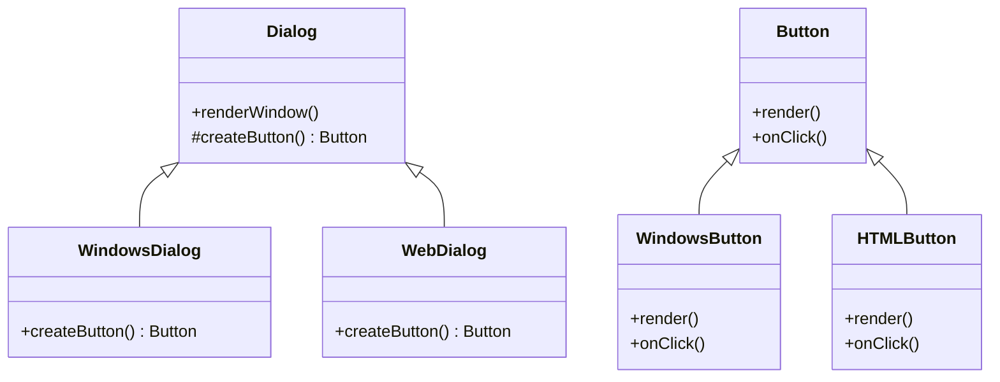

## 3.3.5 Use Cases and Examples

In the world of software engineering, the Factory Method pattern is a cornerstone of creational design patterns. It provides a way to delegate the instantiation of objects to subclasses, enhancing flexibility and promoting code reuse. In this section, we will delve into practical scenarios where the Factory Method pattern is effectively employed, such as in dialog boxes creating different types of buttons and document creation in word processors and spreadsheets. We will discuss why the pattern is suitable for these scenarios, provide illustrative code snippets, and highlight the benefits realized, such as ease of extension and decoupling of code.

### Understanding the Factory Method Pattern

Before diving into examples, let's briefly revisit what the Factory Method pattern entails. The Factory Method pattern defines an interface for creating an object, but allows subclasses to alter the type of objects that will be created. This pattern is particularly useful when a class cannot anticipate the class of objects it must create or when a class wants its subclasses to specify the objects to be created.

### Real-World Example 1: Dialog Boxes Creating Different Types of Buttons

In graphical user interfaces (GUIs), dialog boxes often need to create buttons that perform various actions. Depending on the context, these buttons might have different appearances or behaviors. The Factory Method pattern can be used to encapsulate the creation logic for these buttons, allowing for easy extension and customization.

#### Why the Factory Method Pattern?

- **Decoupling**: The dialog box class does not need to know the specifics of the button creation, which promotes loose coupling.
- **Extensibility**: New button types can be added without modifying existing code, adhering to the Open/Closed Principle.
- **Reusability**: The button creation logic can be reused across different dialog boxes.

#### Code Example

Let's consider a scenario where we have a `Dialog` class that needs to create buttons. We will define an abstract `Dialog` class with a `createButton` method, which will be implemented by subclasses.

```java
// Abstract Product
interface Button {
    void render();
    void onClick();
}

// Concrete Product 1
class WindowsButton implements Button {
    @Override
    public void render() {
        System.out.println("Rendering Windows button.");
    }

    @Override
    public void onClick() {
        System.out.println("Windows button clicked!");
    }
}

// Concrete Product 2
class HTMLButton implements Button {
    @Override
    public void render() {
        System.out.println("Rendering HTML button.");
    }

    @Override
    public void onClick() {
        System.out.println("HTML button clicked!");
    }
}

// Creator
abstract class Dialog {
    public void renderWindow() {
        Button okButton = createButton();
        okButton.render();
    }

    // Factory Method
    protected abstract Button createButton();
}

// Concrete Creator 1
class WindowsDialog extends Dialog {
    @Override
    protected Button createButton() {
        return new WindowsButton();
    }
}

// Concrete Creator 2
class WebDialog extends Dialog {
    @Override
    protected Button createButton() {
        return new HTMLButton();
    }
}

// Client code
public class FactoryMethodDemo {
    public static void main(String[] args) {
        Dialog dialog = new WindowsDialog();
        dialog.renderWindow();

        dialog = new WebDialog();
        dialog.renderWindow();
    }
}
```

In this example, the `Dialog` class defines the `createButton` method, which is implemented by `WindowsDialog` and `WebDialog` to create `WindowsButton` and `HTMLButton`, respectively. This setup allows for easy addition of new button types without altering the existing dialog classes.

### Real-World Example 2: Document Creation in Software

Consider a word processor that supports different document types, such as text documents, spreadsheets, and presentations. The Factory Method pattern can be used to manage the creation of these documents, allowing the application to support new document types without modifying existing code.

#### Why the Factory Method Pattern?

- **Flexibility**: The application can easily switch between different document types.
- **Scalability**: New document types can be added with minimal changes to the existing codebase.
- **Maintainability**: The creation logic is centralized, making it easier to manage and update.

#### Code Example

Let's implement a simple document creation system using the Factory Method pattern.

```java
// Abstract Product
interface Document {
    void open();
    void close();
}

// Concrete Product 1
class TextDocument implements Document {
    @Override
    public void open() {
        System.out.println("Opening text document.");
    }

    @Override
    public void close() {
        System.out.println("Closing text document.");
    }
}

// Concrete Product 2
class SpreadsheetDocument implements Document {
    @Override
    public void open() {
        System.out.println("Opening spreadsheet document.");
    }

    @Override
    public void close() {
        System.out.println("Closing spreadsheet document.");
    }
}

// Creator
abstract class Application {
    public void newDocument() {
        Document doc = createDocument();
        doc.open();
    }

    // Factory Method
    protected abstract Document createDocument();
}

// Concrete Creator 1
class TextApplication extends Application {
    @Override
    protected Document createDocument() {
        return new TextDocument();
    }
}

// Concrete Creator 2
class SpreadsheetApplication extends Application {
    @Override
    protected Document createDocument() {
        return new SpreadsheetDocument();
    }
}

// Client code
public class FactoryMethodDemo {
    public static void main(String[] args) {
        Application app = new TextApplication();
        app.newDocument();

        app = new SpreadsheetApplication();
        app.newDocument();
    }
}
```

In this example, the `Application` class defines the `createDocument` method, which is implemented by `TextApplication` and `SpreadsheetApplication` to create `TextDocument` and `SpreadsheetDocument`, respectively. This approach allows the application to support new document types by simply adding new subclasses.

### Benefits of the Factory Method Pattern

The Factory Method pattern offers several benefits that make it a valuable tool in software development:

- **Decoupling**: By delegating object creation to subclasses, the Factory Method pattern promotes loose coupling between classes. This decoupling makes the system more flexible and easier to maintain.
- **Extensibility**: The pattern adheres to the Open/Closed Principle, allowing new product types to be added without modifying existing code. This extensibility is crucial in systems that need to evolve over time.
- **Reusability**: The creation logic is encapsulated within the factory method, making it reusable across different parts of the application. This reusability reduces code duplication and enhances maintainability.
- **Consistency**: The pattern provides a consistent way to create objects, ensuring that all objects are created in a controlled and predictable manner.

### Visualizing the Factory Method Pattern

To better understand the Factory Method pattern, let's visualize it using a class diagram.



This diagram illustrates the relationship between the `Dialog` class and its subclasses, as well as the `Button` interface and its implementations. The `Dialog` class defines the `createButton` method, which is implemented by `WindowsDialog` and `WebDialog` to create `WindowsButton` and `HTMLButton`, respectively.

### Try It Yourself

To deepen your understanding of the Factory Method pattern, try modifying the code examples provided:

1. **Add a New Button Type**: Extend the dialog example by adding a new button type, such as a `MacButton`. Implement the necessary classes and methods to support this new button type.
2. **Create a New Document Type**: Extend the document example by adding a new document type, such as a `PresentationDocument`. Implement the necessary classes and methods to support this new document type.
3. **Experiment with Different Scenarios**: Consider other scenarios where the Factory Method pattern might be applicable, such as creating different types of vehicles or animals. Implement these scenarios using the pattern.

### Knowledge Check

Before moving on, let's reinforce what we've learned:

- **What is the primary purpose of the Factory Method pattern?**
  - To delegate object creation to subclasses, promoting flexibility and code reuse.
- **How does the Factory Method pattern adhere to the Open/Closed Principle?**
  - By allowing new product types to be added without modifying existing code.
- **What are some benefits of using the Factory Method pattern?**
  - Decoupling, extensibility, reusability, and consistency.

### Conclusion

The Factory Method pattern is a powerful tool in the software engineer's toolkit, offering a flexible and reusable way to manage object creation. By delegating the instantiation of objects to subclasses, the pattern promotes loose coupling, enhances extensibility, and reduces code duplication. As we've seen in the examples of dialog boxes and document creation, the Factory Method pattern is well-suited for scenarios where the exact type of object to be created is determined at runtime. By understanding and applying this pattern, developers can create more maintainable and scalable software systems.

## Quiz Time!



### What is the primary purpose of the Factory Method pattern?

- [x] To delegate object creation to subclasses
- [ ] To encapsulate object creation logic in a single class
- [ ] To create objects without specifying their concrete classes
- [ ] To provide a simplified interface to a complex subsystem

> **Explanation:** The Factory Method pattern delegates object creation to subclasses, allowing them to specify the type of objects to be created.

### How does the Factory Method pattern adhere to the Open/Closed Principle?

- [x] By allowing new product types to be added without modifying existing code
- [ ] By encapsulating object creation logic in a single class
- [ ] By providing a simplified interface to a complex subsystem
- [ ] By creating objects without specifying their concrete classes

> **Explanation:** The Factory Method pattern allows new product types to be added by creating new subclasses, without altering existing code.

### What are some benefits of using the Factory Method pattern?

- [x] Decoupling, extensibility, reusability, and consistency
- [ ] Simplification, encapsulation, abstraction, and inheritance
- [ ] Flexibility, polymorphism, inheritance, and encapsulation
- [ ] Modularity, abstraction, encapsulation, and inheritance

> **Explanation:** The Factory Method pattern offers benefits such as decoupling, extensibility, reusability, and consistency in object creation.

### In the dialog box example, what is the role of the `createButton` method?

- [x] It is a factory method that subclasses implement to create specific button types
- [ ] It is a utility method that provides default button creation logic
- [ ] It is a helper method that assists in rendering buttons
- [ ] It is a static method that creates button instances

> **Explanation:** The `createButton` method is a factory method that subclasses implement to create specific button types, allowing for customization and extensibility.

### What is a key advantage of using the Factory Method pattern in GUI applications?

- [x] It allows for easy addition of new button types without modifying existing code
- [ ] It simplifies the rendering process for complex GUI components
- [ ] It provides a single entry point for all GUI-related operations
- [ ] It enhances the performance of GUI applications

> **Explanation:** The Factory Method pattern allows for easy addition of new button types by creating new subclasses, without altering existing code.

### How does the Factory Method pattern promote code reuse?

- [x] By encapsulating object creation logic within a factory method
- [ ] By providing a single class responsible for all object creation
- [ ] By using static methods to create objects
- [ ] By allowing objects to be created without specifying their concrete classes

> **Explanation:** The Factory Method pattern encapsulates object creation logic within a factory method, making it reusable across different parts of the application.

### In the document creation example, what is the role of the `createDocument` method?

- [x] It is a factory method that subclasses implement to create specific document types
- [ ] It is a utility method that provides default document creation logic
- [ ] It is a helper method that assists in opening documents
- [ ] It is a static method that creates document instances

> **Explanation:** The `createDocument` method is a factory method that subclasses implement to create specific document types, allowing for customization and extensibility.

### What is a common use case for the Factory Method pattern?

- [x] Creating different types of objects based on runtime conditions
- [ ] Managing complex object hierarchies
- [ ] Simplifying the interface to a complex subsystem
- [ ] Enhancing the performance of object creation

> **Explanation:** The Factory Method pattern is commonly used to create different types of objects based on runtime conditions, allowing for flexibility and extensibility.

### How does the Factory Method pattern enhance maintainability?

- [x] By centralizing object creation logic within factory methods
- [ ] By providing a single class responsible for all object creation
- [ ] By using static methods to create objects
- [ ] By allowing objects to be created without specifying their concrete classes

> **Explanation:** The Factory Method pattern centralizes object creation logic within factory methods, making it easier to manage and update.

### True or False: The Factory Method pattern is only applicable to GUI applications.

- [ ] True
- [x] False

> **Explanation:** False. The Factory Method pattern is applicable to a wide range of scenarios, not just GUI applications. It is useful whenever there is a need to delegate object creation to subclasses.


