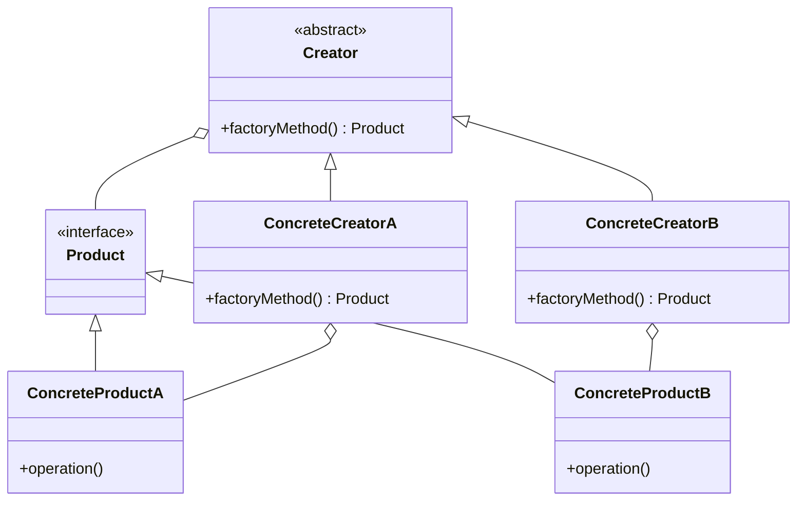
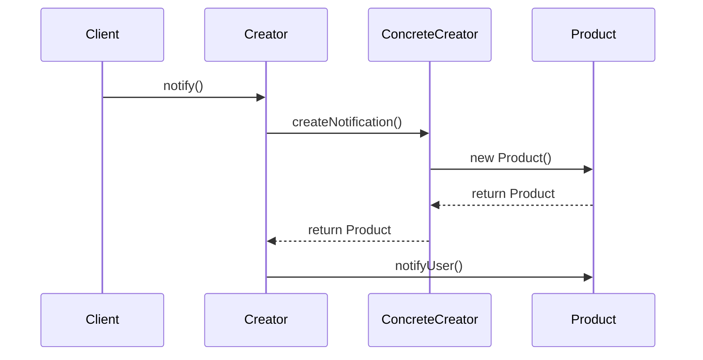

## 3.3 Factory Method Pattern

In the realm of software engineering, the Factory Method Pattern stands as a cornerstone for creating flexible and extensible software architectures. This pattern is a creational design pattern that provides an interface for creating objects in a superclass, but allows subclasses to alter the type of objects that will be created. By doing so, it promotes loose coupling and enhances the flexibility of your codebase.

### Understanding the Factory Method Pattern

The Factory Method Pattern is designed to solve the problem of creating objects without having to specify the exact class of object that will be created. This is particularly useful in scenarios where the exact types and dependencies of the objects are not known until runtime, or when the code needs to be flexible enough to accommodate future changes without significant refactoring.

#### The Intent of the Factory Method Pattern

The primary intent of the Factory Method Pattern is to define an interface for creating an object, but let subclasses decide which class to instantiate. This pattern allows a class to defer instantiation to subclasses, promoting a more flexible and reusable code structure.

### The Problem It Solves

In traditional object-oriented programming, object creation can lead to tight coupling between classes. For instance, if a class directly instantiates another class, it becomes dependent on the specific implementation of that class. This can lead to issues when the implementation needs to change, as it would require changes in all places where the class is instantiated.

The Factory Method Pattern addresses this problem by providing a way to encapsulate the instantiation logic. This means that the client code does not need to know the details of the object creation process, thus adhering to the Open/Closed Principle, which states that software entities should be open for extension but closed for modification.

### Structure of the Factory Method Pattern

The Factory Method Pattern involves several key components:

- **Product**: This is the interface or abstract class that defines the type of objects the factory method will create.
- **ConcreteProduct**: These are the classes that implement the Product interface. Each ConcreteProduct corresponds to a specific type of object that can be created by the factory method.
- **Creator**: This is an abstract class or interface that declares the factory method, which returns an object of type Product. The Creator may also define a default implementation of the factory method that returns a default ConcreteProduct object.
- **ConcreteCreator**: These are the subclasses of the Creator class. Each ConcreteCreator overrides the factory method to return an instance of a ConcreteProduct.

#### UML Diagram

To better understand the relationships between these components, let's visualize them using a UML class diagram.



**Diagram Description:** The UML diagram above illustrates the Factory Method Pattern's structure. The `Creator` class defines a `factoryMethod` that returns a `Product`. The `ConcreteCreatorA` and `ConcreteCreatorB` classes implement this method to return instances of `ConcreteProductA` and `ConcreteProductB`, respectively.

### How the Factory Method Pattern Promotes Extensibility

The Factory Method Pattern is a prime example of the Open/Closed Principle in action. By encapsulating the object creation logic within a factory method, the pattern allows new product types to be added with minimal changes to existing code. This is achieved by simply adding new ConcreteCreator and ConcreteProduct classes, without altering the existing Creator or Product classes.

#### Adherence to the Open/Closed Principle

The Open/Closed Principle is a fundamental tenet of object-oriented design that states that software entities should be open for extension but closed for modification. The Factory Method Pattern adheres to this principle by allowing new product types to be introduced without modifying existing code. This is particularly beneficial in large-scale systems where changes to existing code can have far-reaching consequences.

### Implementation Strategies

Implementing the Factory Method Pattern in Java involves defining a Creator class with a factory method, and then subclassing this Creator class to provide specific implementations of the factory method. Let's explore a detailed example to illustrate this process.

#### Example: Creating a Notification System

Consider a scenario where we need to implement a notification system that can send different types of notifications, such as email and SMS. We can use the Factory Method Pattern to encapsulate the creation of these notification objects.

```java
// Product interface
interface Notification {
    void notifyUser();
}

// ConcreteProduct: EmailNotification
class EmailNotification implements Notification {
    @Override
    public void notifyUser() {
        System.out.println("Sending an email notification");
    }
}

// ConcreteProduct: SMSNotification
class SMSNotification implements Notification {
    @Override
    public void notifyUser() {
        System.out.println("Sending an SMS notification");
    }
}

// Creator
abstract class NotificationCreator {
    public abstract Notification createNotification();

    public void notify() {
        Notification notification = createNotification();
        notification.notifyUser();
    }
}

// ConcreteCreator: EmailNotificationCreator
class EmailNotificationCreator extends NotificationCreator {
    @Override
    public Notification createNotification() {
        return new EmailNotification();
    }
}

// ConcreteCreator: SMSNotificationCreator
class SMSNotificationCreator extends NotificationCreator {
    @Override
    public Notification createNotification() {
        return new SMSNotification();
    }
}

// Client code
public class NotificationService {
    public static void main(String[] args) {
        NotificationCreator emailCreator = new EmailNotificationCreator();
        emailCreator.notify();

        NotificationCreator smsCreator = new SMSNotificationCreator();
        smsCreator.notify();
    }
}
```

**Code Explanation:**

- **Product Interface**: `Notification` defines the interface for notification objects.
- **ConcreteProduct Classes**: `EmailNotification` and `SMSNotification` implement the `Notification` interface.
- **Creator Class**: `NotificationCreator` declares the `createNotification` factory method and provides a `notify` method that uses the factory method to create and send notifications.
- **ConcreteCreator Classes**: `EmailNotificationCreator` and `SMSNotificationCreator` override the `createNotification` method to return instances of `EmailNotification` and `SMSNotification`, respectively.

### Common Scenarios for Using the Factory Method Pattern

The Factory Method Pattern is particularly useful in scenarios where:

1. **The exact type of object to be created is determined at runtime**: This is common in applications that need to support multiple product types or configurations.
2. **The code needs to be open for extension**: The pattern allows new product types to be added without modifying existing code, making it ideal for systems that need to evolve over time.
3. **There is a need to decouple the client code from the concrete classes**: By using the Factory Method Pattern, the client code interacts with the product interface, rather than specific implementations, promoting loose coupling.

### Preparing for Detailed Examples and Implementation Strategies

In the following subsections, we will delve deeper into the implementation strategies for the Factory Method Pattern. We will explore advanced techniques, such as parameterized factories and extending factories, to further enhance the flexibility and extensibility of your codebase.

### Try It Yourself

To gain a deeper understanding of the Factory Method Pattern, try modifying the example code provided above. For instance, you could:

- Add a new type of notification, such as a `PushNotification`, and implement a corresponding `PushNotificationCreator`.
- Experiment with parameterizing the factory method to create different types of notifications based on input parameters.
- Explore how the pattern can be integrated into a larger system, such as a notification service that supports multiple channels.

### Visualizing the Factory Method Pattern in Action

To further illustrate the Factory Method Pattern, let's visualize the process of creating and using notification objects using a sequence diagram.



**Diagram Description:** The sequence diagram above depicts the interaction between the client, creator, concrete creator, and product in the Factory Method Pattern. The client calls the `notify` method on the creator, which in turn calls the `createNotification` method on the concrete creator. The concrete creator instantiates a new product and returns it to the creator, which then calls the `notifyUser` method on the product.

### Key Takeaways

- The Factory Method Pattern provides a flexible and extensible way to create objects without specifying their concrete classes.
- By encapsulating the object creation logic within a factory method, the pattern promotes loose coupling and adherence to the Open/Closed Principle.
- The pattern is particularly useful in scenarios where the exact type of object to be created is determined at runtime, or when the code needs to be open for extension.
- Through the use of UML diagrams and code examples, we can better understand the relationships between the components of the pattern and how they interact to achieve the desired flexibility and extensibility.

### Embrace the Journey

Remember, mastering design patterns is a journey. As you continue to explore and apply the Factory Method Pattern in your projects, you'll gain a deeper understanding of its benefits and nuances. Keep experimenting, stay curious, and enjoy the journey of becoming a more proficient software engineer.

## Quiz Time!



### What is the primary intent of the Factory Method Pattern?

- [x] To define an interface for creating an object, but let subclasses decide which class to instantiate.
- [ ] To create a single instance of a class.
- [ ] To provide a simplified interface to a complex subsystem.
- [ ] To compose objects into tree structures to represent part-whole hierarchies.

> **Explanation:** The Factory Method Pattern aims to define an interface for creating objects, allowing subclasses to decide which class to instantiate, thus promoting flexibility and extensibility.

### Which of the following is NOT a component of the Factory Method Pattern?

- [ ] Product
- [ ] Creator
- [ ] ConcreteProduct
- [x] Singleton

> **Explanation:** The Factory Method Pattern involves Product, Creator, and ConcreteProduct components, but not Singleton, which is a separate design pattern.

### How does the Factory Method Pattern adhere to the Open/Closed Principle?

- [x] By allowing new product types to be added without modifying existing code.
- [ ] By ensuring only one instance of a class is created.
- [ ] By providing a simplified interface to a complex subsystem.
- [ ] By using shared objects to reduce memory usage.

> **Explanation:** The Factory Method Pattern allows for the addition of new product types without modifying existing code, adhering to the Open/Closed Principle.

### In the provided example, what role does the `Notification` interface play?

- [x] It defines the type of objects the factory method will create.
- [ ] It provides a simplified interface to a complex subsystem.
- [ ] It ensures only one instance of a class is created.
- [ ] It manages the lifecycle of mementos.

> **Explanation:** The `Notification` interface defines the type of objects the factory method will create, serving as the Product in the Factory Method Pattern.

### What is a common scenario for using the Factory Method Pattern?

- [x] When the exact type of object to be created is determined at runtime.
- [ ] When only one instance of a class is needed.
- [ ] When providing a simplified interface to a complex subsystem.
- [ ] When composing objects into tree structures.

> **Explanation:** The Factory Method Pattern is useful when the exact type of object to be created is determined at runtime, allowing for flexibility and extensibility.

### What is the role of the `ConcreteCreator` in the Factory Method Pattern?

- [x] To override the factory method to return an instance of a ConcreteProduct.
- [ ] To define the type of objects the factory method will create.
- [ ] To provide a simplified interface to a complex subsystem.
- [ ] To ensure only one instance of a class is created.

> **Explanation:** The `ConcreteCreator` overrides the factory method to return an instance of a ConcreteProduct, implementing the specific creation logic.

### How does the Factory Method Pattern promote loose coupling?

- [x] By decoupling the client code from the concrete classes.
- [ ] By ensuring only one instance of a class is created.
- [ ] By providing a simplified interface to a complex subsystem.
- [ ] By using shared objects to reduce memory usage.

> **Explanation:** The Factory Method Pattern promotes loose coupling by decoupling the client code from the concrete classes, allowing for more flexible and maintainable code.

### Which of the following best describes the relationship between Creator and ConcreteCreator?

- [x] Creator defines the factory method, and ConcreteCreator implements it.
- [ ] Creator provides a simplified interface, and ConcreteCreator uses it.
- [ ] Creator ensures only one instance, and ConcreteCreator manages it.
- [ ] Creator composes objects, and ConcreteCreator uses them.

> **Explanation:** The Creator defines the factory method, while the ConcreteCreator implements it to return specific product instances.

### True or False: The Factory Method Pattern can be used to create a single instance of a class.

- [ ] True
- [x] False

> **Explanation:** The Factory Method Pattern is not designed to create a single instance of a class; that is the purpose of the Singleton Pattern.

### What is the benefit of using a sequence diagram to illustrate the Factory Method Pattern?

- [x] It visually represents the interaction between the client, creator, concrete creator, and product.
- [ ] It ensures only one instance of a class is created.
- [ ] It provides a simplified interface to a complex subsystem.
- [ ] It reduces memory usage by sharing objects.

> **Explanation:** A sequence diagram visually represents the interaction between the client, creator, concrete creator, and product, helping to understand the flow of the Factory Method Pattern.




