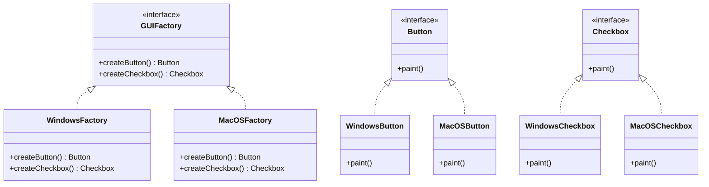

## 3.4.1 Implementing Abstract Factory in Java

The Abstract Factory pattern is a creational design pattern that provides an interface for creating families of related or dependent objects without specifying their concrete classes. This pattern is particularly useful when a system needs to be independent of how its objects are created, composed, and represented. In this section, we will explore how to implement the Abstract Factory pattern in Java, focusing on creating factories that produce compatible products.

### Understanding the Abstract Factory Pattern

Before diving into the implementation, let's understand the core components of the Abstract Factory pattern:

1. **Abstract Factory Interface**: Declares a set of methods for creating each type of product.
2. **Concrete Factory Classes**: Implement the Abstract Factory interface to produce specific product variants.
3. **Abstract Product Interfaces**: Define the products, with Concrete Products providing implementations.
4. **Concrete Products**: Implement the Abstract Product interfaces.
5. **Client Code**: Interacts with the factories and products through abstractions, promoting flexibility and extensibility.

### Step-by-Step Implementation Guide

Let's walk through the implementation of the Abstract Factory pattern in Java with a practical example. We'll create a simple GUI toolkit that can produce buttons and checkboxes for different operating systems.

#### Step 1: Define Abstract Product Interfaces

First, define the interfaces for the products that the factories will create. In our example, we have two product types: `Button` and `Checkbox`.

```java
// Abstract Product A
public interface Button {
    void paint();
}

// Abstract Product B
public interface Checkbox {
    void paint();
}
```

#### Step 2: Implement Concrete Products

Next, implement the concrete products for each operating system. For simplicity, we'll consider two operating systems: Windows and MacOS.

```java
// Concrete Product A1
public class WindowsButton implements Button {
    @Override
    public void paint() {
        System.out.println("Rendering a button in Windows style.");
    }
}

// Concrete Product B1
public class WindowsCheckbox implements Checkbox {
    @Override
    public void paint() {
        System.out.println("Rendering a checkbox in Windows style.");
    }
}

// Concrete Product A2
public class MacOSButton implements Button {
    @Override
    public void paint() {
        System.out.println("Rendering a button in MacOS style.");
    }
}

// Concrete Product B2
public class MacOSCheckbox implements Checkbox {
    @Override
    public void paint() {
        System.out.println("Rendering a checkbox in MacOS style.");
    }
}
```

#### Step 3: Define the Abstract Factory Interface

Define an interface for the factory that will create the products. This interface will declare methods for creating each type of product.

```java
public interface GUIFactory {
    Button createButton();
    Checkbox createCheckbox();
}
```

#### Step 4: Implement Concrete Factories

Implement the concrete factories that produce the specific product variants for each operating system.

```java
// Concrete Factory 1
public class WindowsFactory implements GUIFactory {
    @Override
    public Button createButton() {
        return new WindowsButton();
    }

    @Override
    public Checkbox createCheckbox() {
        return new WindowsCheckbox();
    }
}

// Concrete Factory 2
public class MacOSFactory implements GUIFactory {
    @Override
    public Button createButton() {
        return new MacOSButton();
    }

    @Override
    public Checkbox createCheckbox() {
        return new MacOSCheckbox();
    }
}
```

#### Step 5: Create Client Code

The client code interacts with the factories and products through the abstract interfaces, allowing it to work with any product family without being coupled to the concrete classes.

```java
public class Application {
    private Button button;
    private Checkbox checkbox;

    public Application(GUIFactory factory) {
        button = factory.createButton();
        checkbox = factory.createCheckbox();
    }

    public void paint() {
        button.paint();
        checkbox.paint();
    }
}

// Client code
public class Demo {
    private static Application configureApplication() {
        Application app;
        GUIFactory factory;
        String osName = System.getProperty("os.name").toLowerCase();
        if (osName.contains("mac")) {
            factory = new MacOSFactory();
        } else {
            factory = new WindowsFactory();
        }
        app = new Application(factory);
        return app;
    }

    public static void main(String[] args) {
        Application app = configureApplication();
        app.paint();
    }
}
```

### Visualizing the Abstract Factory Pattern

Let's visualize the structure of the Abstract Factory pattern using a class diagram:



### Key Points and Considerations

- **Flexibility**: The Abstract Factory pattern allows for easy addition of new product families without altering existing code. Simply implement new concrete factories and products.
- **Extensibility**: By using interfaces and abstract classes, the pattern promotes extensibility. New product types can be added with minimal changes to the existing codebase.
- **Complexity**: While the pattern provides flexibility and extensibility, it can introduce complexity due to the increased number of classes and interfaces.

### Try It Yourself

To get hands-on experience with the Abstract Factory pattern, try modifying the code examples:

1. **Add a New Product Type**: Introduce a new product type, such as `Slider`, and implement it for both Windows and MacOS.
2. **Create a New Operating System Family**: Add a new operating system, such as Linux, and implement the corresponding concrete products and factory.
3. **Experiment with Client Code**: Modify the client code to dynamically switch between different factories based on user input or configuration files.

### Further Reading

For more information on the Abstract Factory pattern and its applications, consider exploring the following resources:

- [Design Patterns: Elements of Reusable Object-Oriented Software](https://en.wikipedia.org/wiki/Design_Patterns) by Erich Gamma, Richard Helm, Ralph Johnson, and John Vlissides
- [Java Design Patterns](https://www.journaldev.com/1827/java-design-patterns-example-tutorial) on JournalDev
- [Abstract Factory Pattern](https://refactoring.guru/design-patterns/abstract-factory) on Refactoring Guru

### Quiz Time!



### What is the primary purpose of the Abstract Factory pattern?

- [x] To provide an interface for creating families of related or dependent objects without specifying their concrete classes.
- [ ] To allow objects to be created without exposing the creation logic to the client.
- [ ] To define an interface for creating a single object.
- [ ] To ensure a class has only one instance with a global access point.

> **Explanation:** The Abstract Factory pattern provides an interface for creating families of related or dependent objects without specifying their concrete classes, promoting flexibility and extensibility.

### Which component in the Abstract Factory pattern is responsible for creating specific product variants?

- [ ] Abstract Factory
- [x] Concrete Factory
- [ ] Abstract Product
- [ ] Client Code

> **Explanation:** Concrete Factory classes implement the Abstract Factory interface to produce specific product variants.

### In the provided example, which class is responsible for creating Windows-style buttons?

- [ ] MacOSFactory
- [x] WindowsFactory
- [ ] Application
- [ ] GUIFactory

> **Explanation:** The `WindowsFactory` class is responsible for creating Windows-style buttons and checkboxes.

### What is the role of the Abstract Product interface in the Abstract Factory pattern?

- [x] To define the products that the factories will create.
- [ ] To implement the concrete products.
- [ ] To interact with the factories and products.
- [ ] To provide a global access point for a single instance.

> **Explanation:** The Abstract Product interface defines the products that the factories will create, allowing for flexibility and extensibility.

### How does the client code interact with the factories and products in the Abstract Factory pattern?

- [x] Through abstractions, promoting flexibility and extensibility.
- [ ] By directly instantiating concrete products.
- [ ] By modifying existing code to add new product families.
- [ ] By using global access points for single instances.

> **Explanation:** The client code interacts with the factories and products through abstractions, promoting flexibility and extensibility.

### What is a key benefit of using the Abstract Factory pattern?

- [x] It allows for easy addition of new product families without altering existing code.
- [ ] It reduces the number of classes and interfaces in the codebase.
- [ ] It ensures a class has only one instance with a global access point.
- [ ] It simplifies the creation logic by exposing it to the client.

> **Explanation:** The Abstract Factory pattern allows for easy addition of new product families without altering existing code, promoting flexibility and extensibility.

### Which of the following is NOT a component of the Abstract Factory pattern?

- [ ] Abstract Factory Interface
- [ ] Concrete Factory Classes
- [ ] Abstract Product Interfaces
- [x] Singleton Instance

> **Explanation:** The Singleton Instance is not a component of the Abstract Factory pattern. The pattern involves Abstract Factory Interface, Concrete Factory Classes, and Abstract Product Interfaces.

### What is the relationship between the Abstract Factory and Concrete Factory classes?

- [x] Concrete Factory classes implement the Abstract Factory interface.
- [ ] Abstract Factory classes implement the Concrete Factory interface.
- [ ] Concrete Factory classes extend the Abstract Factory class.
- [ ] Abstract Factory classes extend the Concrete Factory class.

> **Explanation:** Concrete Factory classes implement the Abstract Factory interface to produce specific product variants.

### How does the Abstract Factory pattern promote extensibility?

- [x] By using interfaces and abstract classes, allowing new product types to be added with minimal changes.
- [ ] By reducing the number of classes and interfaces in the codebase.
- [ ] By ensuring a class has only one instance with a global access point.
- [ ] By exposing the creation logic to the client.

> **Explanation:** The Abstract Factory pattern promotes extensibility by using interfaces and abstract classes, allowing new product types to be added with minimal changes to the existing codebase.

### True or False: The Abstract Factory pattern can introduce complexity due to the increased number of classes and interfaces.

- [x] True
- [ ] False

> **Explanation:** True. While the Abstract Factory pattern provides flexibility and extensibility, it can introduce complexity due to the increased number of classes and interfaces.



Remember, this is just the beginning. As you progress, you'll build more complex and interactive applications. Keep experimenting, stay curious, and enjoy the journey!
