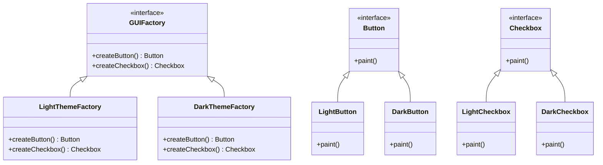

## 3.4.2 Managing Multiple Product Families

In the realm of software design, the ability to manage and interchange product families seamlessly is a hallmark of a robust and flexible architecture. The Abstract Factory pattern plays a pivotal role in achieving this by providing an interface for creating families of related or dependent objects without specifying their concrete classes. This section delves into how the Abstract Factory pattern can be leveraged to handle multiple product families within an application, ensuring scalability and maintainability.

### Understanding the Need for Multiple Product Families

In many applications, especially those with a graphical user interface (GUI), there is often a need to support multiple product families. Consider a scenario where an application needs to support different GUI themes, such as light and dark modes. Each theme represents a family of products (e.g., buttons, text fields, and windows) that must be interchangeable depending on the user's choice or system settings.

Another example is a cross-platform application that needs to support different operating systems. Each operating system may have its own set of UI components, requiring the application to switch between different product families seamlessly.

### The Role of Abstract Factory Pattern

The Abstract Factory pattern provides a way to encapsulate a group of individual factories that have a common theme. It defines an interface for creating all the products in a family, and each concrete factory corresponds to a specific product family. This allows clients to work with any product family by interacting with the abstract interfaces, without needing to know the details of the concrete classes.

#### Key Components of the Abstract Factory Pattern

1. **AbstractFactory**: Declares an interface for operations that create abstract product objects.
2. **ConcreteFactory**: Implements the operations to create concrete product objects.
3. **AbstractProduct**: Declares an interface for a type of product object.
4. **ConcreteProduct**: Defines a product object to be created by the corresponding concrete factory and implements the AbstractProduct interface.
5. **Client**: Uses only interfaces declared by AbstractFactory and AbstractProduct classes.

### Implementing Abstract Factory in Java

Let's explore how to implement the Abstract Factory pattern in Java, focusing on managing multiple product families.

#### Step 1: Define Abstract Products

First, define the abstract products that represent the different components of the product families.

```java
// Abstract product for Button
public interface Button {
    void paint();
}

// Abstract product for Checkbox
public interface Checkbox {
    void paint();
}
```

#### Step 2: Create Concrete Products

Next, create concrete products for each product family. For example, let's create products for two different themes: LightTheme and DarkTheme.

```java
// Concrete product for LightTheme Button
public class LightButton implements Button {
    @Override
    public void paint() {
        System.out.println("Rendering a button in Light Theme.");
    }
}

// Concrete product for DarkTheme Button
public class DarkButton implements Button {
    @Override
    public void paint() {
        System.out.println("Rendering a button in Dark Theme.");
    }
}

// Concrete product for LightTheme Checkbox
public class LightCheckbox implements Checkbox {
    @Override
    public void paint() {
        System.out.println("Rendering a checkbox in Light Theme.");
    }
}

// Concrete product for DarkTheme Checkbox
public class DarkCheckbox implements Checkbox {
    @Override
    public void paint() {
        System.out.println("Rendering a checkbox in Dark Theme.");
    }
}
```

#### Step 3: Define the Abstract Factory

Define an abstract factory interface that declares methods for creating each type of product.

```java
// Abstract factory interface
public interface GUIFactory {
    Button createButton();
    Checkbox createCheckbox();
}
```

#### Step 4: Implement Concrete Factories

Implement concrete factories for each product family. Each factory will create products that belong to a specific family.

```java
// Concrete factory for LightTheme
public class LightThemeFactory implements GUIFactory {
    @Override
    public Button createButton() {
        return new LightButton();
    }

    @Override
    public Checkbox createCheckbox() {
        return new LightCheckbox();
    }
}

// Concrete factory for DarkTheme
public class DarkThemeFactory implements GUIFactory {
    @Override
    public Button createButton() {
        return new DarkButton();
    }

    @Override
    public Checkbox createCheckbox() {
        return new DarkCheckbox();
    }
}
```

#### Step 5: Create the Client

The client interacts with the abstract factory and products through their interfaces, allowing it to work with any product family.

```java
// Client code
public class Application {
    private Button button;
    private Checkbox checkbox;

    public Application(GUIFactory factory) {
        button = factory.createButton();
        checkbox = factory.createCheckbox();
    }

    public void paint() {
        button.paint();
        checkbox.paint();
    }
}
```

### Switching Between Product Families

Switching between different product families is as simple as changing the factory that the client uses. This can be done at runtime, providing flexibility and scalability.

```java
public class Demo {
    private static Application configureApplication() {
        Application app;
        GUIFactory factory;
        
        // Simulate a condition to choose the theme
        String theme = "Dark"; // This could be a user preference or system setting

        if (theme.equals("Light")) {
            factory = new LightThemeFactory();
        } else {
            factory = new DarkThemeFactory();
        }
        app = new Application(factory);
        return app;
    }

    public static void main(String[] args) {
        Application app = configureApplication();
        app.paint();
    }
}
```

### Benefits of Using Abstract Factory for Multiple Product Families

1. **Scalability**: Adding a new product family is straightforward. You only need to create new concrete products and a concrete factory for the new family.
2. **Maintainability**: Changes to a product family are localized to the corresponding concrete factory and products, minimizing the impact on the rest of the application.
3. **Flexibility**: The client code is decoupled from the concrete products, allowing for easy switching between product families.
4. **Consistency**: Ensures that products from the same family are used together, maintaining a consistent look and feel.

### Visualizing the Abstract Factory Pattern

To better understand the relationships and interactions in the Abstract Factory pattern, let's visualize it using a class diagram.



### Try It Yourself

To solidify your understanding, try modifying the code examples:

- Add a new product type, such as a `Window`, and implement it for both themes.
- Create a new theme, such as `BlueTheme`, and implement the necessary products and factory.
- Experiment with different ways to determine which factory to use, such as reading from a configuration file or user input.

### Knowledge Check

- What are the key components of the Abstract Factory pattern?
- How does the Abstract Factory pattern promote scalability and maintainability?
- What are the benefits of using interfaces in the Abstract Factory pattern?

### Conclusion

The Abstract Factory pattern is a powerful tool for managing multiple product families in a Java application. By encapsulating the creation of related objects, it allows for flexibility, scalability, and maintainability. As you continue to explore design patterns, consider how the Abstract Factory pattern can be applied to your projects to enhance their architecture and adaptability.

## Quiz Time!



### What is the primary purpose of the Abstract Factory pattern?

- [x] To create families of related or dependent objects without specifying their concrete classes.
- [ ] To provide a single interface to a set of interfaces in a subsystem.
- [ ] To define an interface for creating a single object, but let subclasses decide which class to instantiate.
- [ ] To allow an object to alter its behavior when its internal state changes.

> **Explanation:** The Abstract Factory pattern is designed to create families of related or dependent objects without specifying their concrete classes, promoting flexibility and scalability.

### Which component in the Abstract Factory pattern is responsible for creating concrete product objects?

- [ ] AbstractFactory
- [x] ConcreteFactory
- [ ] Client
- [ ] AbstractProduct

> **Explanation:** The ConcreteFactory implements the operations to create concrete product objects, corresponding to a specific product family.

### How does the Abstract Factory pattern enhance maintainability?

- [x] By localizing changes to a product family within the corresponding concrete factory and products.
- [ ] By allowing multiple interfaces to be used interchangeably.
- [ ] By providing a single point of control for all product families.
- [ ] By reducing the number of classes needed in an application.

> **Explanation:** The Abstract Factory pattern enhances maintainability by localizing changes to a product family within the corresponding concrete factory and products, minimizing the impact on the rest of the application.

### What is a key benefit of using interfaces in the Abstract Factory pattern?

- [x] They decouple client code from concrete products, allowing easy switching between product families.
- [ ] They reduce the number of classes needed in an application.
- [ ] They provide a single point of control for all product families.
- [ ] They allow for the creation of singleton objects.

> **Explanation:** Interfaces decouple client code from concrete products, allowing for easy switching between product families and enhancing flexibility.

### In the provided code example, how is the product family determined?

- [x] By a conditional statement based on a theme variable.
- [ ] By user input at runtime.
- [ ] By a configuration file.
- [ ] By the operating system.

> **Explanation:** The product family is determined by a conditional statement based on a theme variable, which could be replaced by other methods like user input or configuration files.

### What is the role of the Client in the Abstract Factory pattern?

- [x] To use only interfaces declared by AbstractFactory and AbstractProduct classes.
- [ ] To implement the operations to create concrete product objects.
- [ ] To declare an interface for operations that create abstract product objects.
- [ ] To define a product object to be created by the corresponding concrete factory.

> **Explanation:** The Client in the Abstract Factory pattern uses only interfaces declared by AbstractFactory and AbstractProduct classes, allowing it to work with any product family.

### Which of the following is NOT a component of the Abstract Factory pattern?

- [ ] AbstractFactory
- [ ] ConcreteFactory
- [ ] AbstractProduct
- [x] Singleton

> **Explanation:** Singleton is not a component of the Abstract Factory pattern. The pattern includes AbstractFactory, ConcreteFactory, and AbstractProduct.

### How can new product families be added in the Abstract Factory pattern?

- [x] By creating new concrete products and a concrete factory for the new family.
- [ ] By modifying the existing concrete factory.
- [ ] By adding new methods to the AbstractFactory interface.
- [ ] By changing the client code to accommodate new products.

> **Explanation:** New product families can be added by creating new concrete products and a concrete factory for the new family, without modifying existing code.

### True or False: The Abstract Factory pattern can only be used for GUI applications.

- [x] False
- [ ] True

> **Explanation:** False. The Abstract Factory pattern can be used in various applications, not just GUI applications, wherever there is a need to manage multiple product families.

### Which of the following best describes the relationship between AbstractFactory and ConcreteFactory?

- [x] ConcreteFactory implements the operations declared by AbstractFactory.
- [ ] AbstractFactory extends ConcreteFactory.
- [ ] ConcreteFactory is a subclass of AbstractFactory.
- [ ] AbstractFactory is a singleton that manages ConcreteFactory instances.

> **Explanation:** ConcreteFactory implements the operations declared by AbstractFactory, providing concrete implementations for creating product objects.


