## 3.4.3 Extensibility in Abstract Factories

In the world of software design, the ability to extend and adapt systems is crucial. The Abstract Factory pattern is a creational design pattern that provides an interface for creating families of related or dependent objects without specifying their concrete classes. This pattern is particularly useful when a system needs to be independent of how its objects are created, composed, and represented. One of the key strengths of the Abstract Factory pattern is its extensibility, allowing developers to introduce new product families or types with minimal impact on existing code. In this section, we'll explore how to achieve this extensibility, adhering to the Open/Closed Principle, and discuss best practices for maintaining a flexible design.

### Understanding the Abstract Factory Pattern

Before diving into extensibility, let's briefly recap the Abstract Factory pattern. It involves the following components:

1. **AbstractFactory**: Declares an interface for operations that create abstract product objects.
2. **ConcreteFactory**: Implements the operations to create concrete product objects.
3. **AbstractProduct**: Declares an interface for a type of product object.
4. **ConcreteProduct**: Defines a product object to be created by the corresponding concrete factory and implements the AbstractProduct interface.
5. **Client**: Uses only interfaces declared by AbstractFactory and AbstractProduct classes.

The pattern allows a client to work with products through abstract interfaces, ensuring that the client code remains independent of the concrete classes.

### Extending the Abstract Factory Pattern

#### Adding New ConcreteFactory Classes

To introduce a new product family, you need to add a new ConcreteFactory class. This involves:

- **Defining New ConcreteFactory**: Create a new class that implements the AbstractFactory interface. This class will be responsible for creating instances of the new product family.

- **Implementing Product Creation Methods**: Implement the methods declared in the AbstractFactory interface to return instances of the new ConcreteProduct classes.

Here's a simple example to illustrate adding a new product family:

```java
// Abstract Factory Interface
interface GUIFactory {
    Button createButton();
    Checkbox createCheckbox();
}

// Concrete Factory for Windows
class WindowsFactory implements GUIFactory {
    public Button createButton() {
        return new WindowsButton();
    }
    public Checkbox createCheckbox() {
        return new WindowsCheckbox();
    }
}

// Concrete Factory for MacOS
class MacOSFactory implements GUIFactory {
    public Button createButton() {
        return new MacOSButton();
    }
    public Checkbox createCheckbox() {
        return new MacOSCheckbox();
    }
}

// New Concrete Factory for Linux
class LinuxFactory implements GUIFactory {
    public Button createButton() {
        return new LinuxButton();
    }
    public Checkbox createCheckbox() {
        return new LinuxCheckbox();
    }
}
```

In this example, adding a new `LinuxFactory` class allows the system to support a new product family for Linux without altering existing factories.

#### Extending AbstractFactory and AbstractProduct Interfaces

When introducing new product types, you need to:

- **Extend the AbstractFactory Interface**: Add new methods to the AbstractFactory interface for creating the new product types.

- **Extend the AbstractProduct Interface**: Define new interfaces for the new product types.

Here's how you can extend the interfaces to accommodate a new product type, `Slider`:

```java
// Extending Abstract Factory Interface
interface GUIFactory {
    Button createButton();
    Checkbox createCheckbox();
    Slider createSlider(); // New product type
}

// New Abstract Product Interface
interface Slider {
    void render();
}

// Concrete Product for Windows
class WindowsSlider implements Slider {
    public void render() {
        System.out.println("Rendering Windows Slider");
    }
}

// Concrete Product for MacOS
class MacOSSlider implements Slider {
    public void render() {
        System.out.println("Rendering MacOS Slider");
    }
}

// Concrete Product for Linux
class LinuxSlider implements Slider {
    public void render() {
        System.out.println("Rendering Linux Slider");
    }
}
```

By extending the `GUIFactory` interface and adding a new `Slider` interface, we can introduce a new product type seamlessly.

### Minimal Impact on Existing Code

One of the main advantages of the Abstract Factory pattern is that it adheres to the Open/Closed Principle, which states that software entities should be open for extension but closed for modification. This means that you can add new product families or types without altering existing code, minimizing the risk of introducing bugs.

In the examples above, notice how the existing `WindowsFactory` and `MacOSFactory` classes remain unchanged when adding the `LinuxFactory` or the new `Slider` product type. This ensures that the existing functionality is preserved while extending the system's capabilities.

### Challenges and Considerations

While the Abstract Factory pattern provides a robust framework for extensibility, there are challenges and considerations to keep in mind:

- **Complexity**: As the number of product families and types increases, the number of classes can grow significantly, leading to increased complexity.

- **Interface Changes**: Extending the AbstractFactory interface requires changes to all concrete factories, which can be cumbersome if there are many factories.

- **Testing**: Introducing new product families or types requires thorough testing to ensure compatibility and functionality across all factories.

- **Dependency Management**: Ensure that dependencies between products are managed carefully to avoid tight coupling.

### Best Practices for Extensible Design

To maintain a flexible and extensible design, consider the following best practices:

- **Use Interfaces and Abstract Classes**: Rely on interfaces and abstract classes to define product types and factories, allowing for easy extension.

- **Encapsulate Variations**: Encapsulate variations in product families and types within separate classes to minimize impact on existing code.

- **Adopt a Modular Approach**: Design the system in a modular way, allowing for independent development and testing of new product families and types.

- **Leverage Dependency Injection**: Use dependency injection to manage dependencies between products and factories, enhancing flexibility and testability.

- **Document Extensibility Points**: Clearly document the points in the system where extensions can be made, providing guidance for future developers.

### Visualization of Abstract Factory Extensibility

To better understand the extensibility of the Abstract Factory pattern, let's visualize the relationships between the components using a class diagram.

```mermaid
classDiagram
    class GUIFactory {
        <<interface>>
        +createButton() Button
        +createCheckbox() Checkbox
        +createSlider() Slider
    }

    class WindowsFactory {
        +createButton() Button
        +createCheckbox() Checkbox
        +createSlider() Slider
    }

    class MacOSFactory {
        +createButton() Button
        +createCheckbox() Checkbox
        +createSlider() Slider
    }

    class LinuxFactory {
        +createButton() Button
        +createCheckbox() Checkbox
        +createSlider() Slider
    }

    class Button {
        <<interface>>
        +render()
    }

    class WindowsButton {
        +render()
    }

    class MacOSButton {
        +render()
    }

    class LinuxButton {
        +render()
    }

    class Checkbox {
        <<interface>>
        +render()
    }

    class WindowsCheckbox {
        +render()
    }

    class MacOSCheckbox {
        +render()
    }

    class LinuxCheckbox {
        +render()
    }

    class Slider {
        <<interface>>
        +render()
    }

    class WindowsSlider {
        +render()
    }

    class MacOSSlider {
        +render()
    }

    class LinuxSlider {
        +render()
    }

    GUIFactory <|.. WindowsFactory
    GUIFactory <|.. MacOSFactory
    GUIFactory <|.. LinuxFactory
    Button <|.. WindowsButton
    Button <|.. MacOSButton
    Button <|.. LinuxButton
    Checkbox <|.. WindowsCheckbox
    Checkbox <|.. MacOSCheckbox
    Checkbox <|.. LinuxCheckbox
    Slider <|.. WindowsSlider
    Slider <|.. MacOSSlider
    Slider <|.. LinuxSlider
```



This diagram illustrates how the `GUIFactory` interface is extended to include a new product type, `Slider`, and how each concrete factory implements the creation methods for all product types.

### Try It Yourself

To solidify your understanding of extensibility in Abstract Factories, try the following exercises:

1. **Add a New Product Type**: Extend the `GUIFactory` interface to include a new product type, such as `Menu`. Implement this new product type for all existing factories.

2. **Introduce a New Product Family**: Create a new concrete factory for a different operating system, such as `AndroidFactory`, and implement all product types for this new family.

3. **Experiment with Dependency Injection**: Refactor the code to use dependency injection for managing product dependencies, enhancing flexibility and testability.

### References and Further Reading

- [Design Patterns: Elements of Reusable Object-Oriented Software](https://www.amazon.com/Design-Patterns-Elements-Reusable-Object-Oriented/dp/0201633612) by Erich Gamma, Richard Helm, Ralph Johnson, and John Vlissides.
- [Java Design Patterns](https://www.journaldev.com/1827/java-design-patterns-example-tutorial) - JournalDev
- [Abstract Factory Pattern](https://refactoring.guru/design-patterns/abstract-factory) - Refactoring Guru

### Knowledge Check

To reinforce your understanding, consider the following questions:

- How does the Abstract Factory pattern adhere to the Open/Closed Principle?
- What are the potential challenges when extending the Abstract Factory pattern?
- How can dependency injection enhance the flexibility of the Abstract Factory pattern?

### Embrace the Journey

Remember, mastering design patterns is a journey. As you explore and experiment with the Abstract Factory pattern, you'll gain valuable insights into creating flexible and extensible software systems. Keep experimenting, stay curious, and enjoy the journey!

## Quiz Time!



### What is the primary benefit of using the Abstract Factory pattern?

- [x] It allows for the creation of families of related objects without specifying their concrete classes.
- [ ] It reduces the number of classes in a system.
- [ ] It simplifies the client code by using concrete classes directly.
- [ ] It eliminates the need for interfaces.

> **Explanation:** The Abstract Factory pattern provides an interface for creating families of related or dependent objects without specifying their concrete classes, promoting flexibility and extensibility.

### How can you add a new product family in the Abstract Factory pattern?

- [x] By creating a new ConcreteFactory class that implements the AbstractFactory interface.
- [ ] By modifying the existing ConcreteFactory classes.
- [ ] By changing the AbstractProduct interface.
- [ ] By altering the client code to accommodate new products.

> **Explanation:** Adding a new product family involves creating a new ConcreteFactory class that implements the AbstractFactory interface, allowing for the creation of new product types without modifying existing code.

### What is the role of the AbstractProduct interface in the Abstract Factory pattern?

- [x] It declares an interface for a type of product object.
- [ ] It implements the operations to create concrete product objects.
- [ ] It provides a concrete implementation of a product.
- [ ] It manages the lifecycle of product objects.

> **Explanation:** The AbstractProduct interface declares an interface for a type of product object, allowing for the creation of different concrete products that adhere to the same interface.

### Which principle does the Abstract Factory pattern adhere to?

- [x] Open/Closed Principle
- [ ] Single Responsibility Principle
- [ ] Liskov Substitution Principle
- [ ] Dependency Inversion Principle

> **Explanation:** The Abstract Factory pattern adheres to the Open/Closed Principle, allowing for the extension of product families or types without modifying existing code.

### What is a potential challenge when extending the Abstract Factory pattern?

- [x] Increased complexity due to the number of classes.
- [ ] Difficulty in creating new product types.
- [ ] Lack of flexibility in the design.
- [ ] Inability to adhere to the Open/Closed Principle.

> **Explanation:** As the number of product families and types increases, the number of classes can grow significantly, leading to increased complexity.

### How can dependency injection enhance the flexibility of the Abstract Factory pattern?

- [x] By managing dependencies between products and factories, enhancing flexibility and testability.
- [ ] By reducing the number of classes needed for product creation.
- [ ] By eliminating the need for interfaces.
- [ ] By simplifying the client code.

> **Explanation:** Dependency injection manages dependencies between products and factories, enhancing flexibility and testability by decoupling components.

### What is the impact of adding a new product type on existing code in the Abstract Factory pattern?

- [x] Minimal impact, as existing code remains unchanged.
- [ ] Significant impact, requiring changes to all existing factories.
- [ ] Moderate impact, requiring changes to the client code.
- [ ] No impact, as new product types are independent of existing code.

> **Explanation:** Adding a new product type has minimal impact on existing code, as the Abstract Factory pattern allows for the extension of product types without modifying existing code.

### How can you ensure that the Abstract Factory pattern remains flexible and extensible?

- [x] By using interfaces and abstract classes to define product types and factories.
- [ ] By hardcoding product creation logic in the client code.
- [ ] By avoiding the use of interfaces.
- [ ] By minimizing the number of product types.

> **Explanation:** Using interfaces and abstract classes to define product types and factories allows for easy extension and maintains flexibility in the design.

### What is the purpose of the ConcreteFactory class in the Abstract Factory pattern?

- [x] It implements the operations to create concrete product objects.
- [ ] It declares an interface for a type of product object.
- [ ] It manages the lifecycle of product objects.
- [ ] It simplifies the client code by using concrete classes directly.

> **Explanation:** The ConcreteFactory class implements the operations to create concrete product objects, adhering to the AbstractFactory interface.

### True or False: The Abstract Factory pattern eliminates the need for interfaces.

- [ ] True
- [x] False

> **Explanation:** False. The Abstract Factory pattern relies on interfaces to define product types and factories, promoting flexibility and extensibility.


