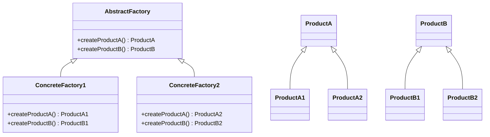
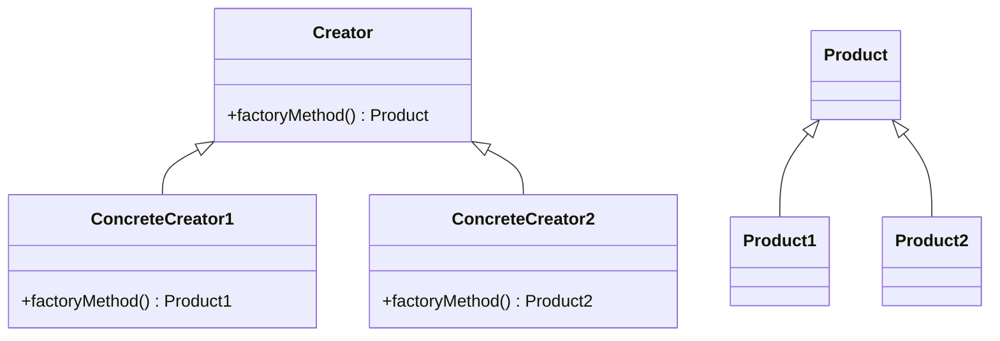
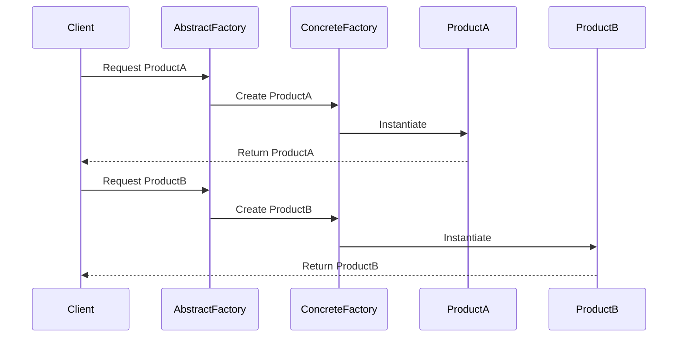
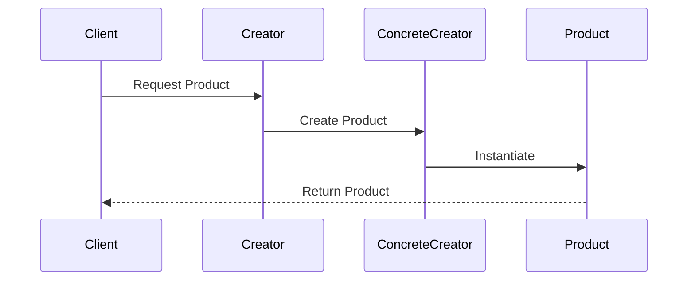

## 3.4.4 Abstract Factory vs. Factory Method

Design patterns are essential tools in a software engineer's toolkit, providing reusable solutions to common design problems. Among these, creational patterns play a crucial role in object creation mechanisms, enhancing flexibility and reuse. In this section, we delve into two pivotal creational patterns: the Abstract Factory and the Factory Method. Understanding their distinctions, similarities, and appropriate use cases will empower you to design more robust and maintainable Java applications.

### Understanding the Core Concepts

Before we dive into the comparison, let's briefly revisit the core concepts of each pattern.

#### Abstract Factory Pattern

The Abstract Factory pattern provides an interface for creating families of related or dependent objects without specifying their concrete classes. It encapsulates a group of individual factories with a common theme, allowing for the creation of various product families that are designed to work together.

**Key Characteristics:**
- **Family of Products**: It deals with creating a suite of related products.
- **Interface-Based**: Clients interact with the factory through an interface, ensuring flexibility.
- **Decoupling**: It decouples the client code from the concrete classes of the products.

#### Factory Method Pattern

The Factory Method pattern defines an interface for creating an object, but lets subclasses alter the type of objects that will be created. It allows a class to defer instantiation to subclasses, promoting flexibility and reuse.

**Key Characteristics:**
- **Single Product Creation**: Focuses on creating a single product.
- **Subclass Responsibility**: Subclasses decide which class to instantiate.
- **Polymorphism**: Utilizes inheritance and polymorphism to achieve flexibility.

### Comparing Abstract Factory and Factory Method

While both patterns aim to decouple the client from the concrete classes, they differ significantly in their scope and implementation.

#### Scope of Application

- **Abstract Factory**: Used when a system needs to create families of related products. It is ideal for scenarios where products are interdependent and need to be used together.
- **Factory Method**: Suitable for scenarios where a class cannot anticipate the class of objects it must create. It provides a way to delegate the instantiation to subclasses.

#### Level of Abstraction

- **Abstract Factory**: Operates at a higher level of abstraction, dealing with multiple products.
- **Factory Method**: Operates at a lower level, focusing on a single product.

#### Flexibility and Extensibility

- **Abstract Factory**: Offers greater flexibility in terms of adding new product families but can be more complex to implement.
- **Factory Method**: Easier to implement and extend for single product variations.

### Structural Differences

To better understand the structural differences, let's visualize these patterns using class diagrams.

#### Abstract Factory Pattern Structure



**Description**: The Abstract Factory pattern involves an abstract factory interface with methods for creating each type of product. Concrete factories implement these methods to produce specific products.

#### Factory Method Pattern Structure



**Description**: The Factory Method pattern involves a creator class with a factory method. Subclasses override this method to create specific products.

### Use Cases and Examples

Understanding when to use each pattern is crucial for effective design.

#### When to Use Abstract Factory

- **Cross-Platform Applications**: When you need to create UI components for different platforms (e.g., Windows, macOS).
- **Product Families**: When products are interdependent and need to be used together, such as a GUI toolkit with buttons and text fields.

**Example**: Consider a GUI library where you need to create different widgets for different operating systems. The Abstract Factory pattern can provide a consistent interface for creating these widgets, ensuring compatibility and reducing client code complexity.

#### When to Use Factory Method

- **Single Product Variations**: When a class needs to delegate the instantiation of a single product to subclasses.
- **Frameworks**: When creating frameworks that need to allow users to extend and customize object creation.

**Example**: In a logging framework, you might use the Factory Method pattern to allow users to define their own loggers by subclassing a base logger class and overriding the factory method to create specific logger instances.

### Combining Abstract Factory and Factory Method

These patterns can be used together to enhance design flexibility. The Abstract Factory can use Factory Methods to implement the creation operations.

**Example**: In a cross-platform application, an Abstract Factory can define methods for creating UI components. Each concrete factory can use Factory Methods to create specific components for a particular platform, allowing for easy extension and customization.

### Choosing the Right Pattern

Selecting the appropriate pattern depends on your design requirements.

- **Choose Abstract Factory** if you need to create families of related products that must work together.
- **Choose Factory Method** if you need to delegate the instantiation of a single product to subclasses.

### Code Examples

Let's explore code examples for each pattern to solidify our understanding.

#### Abstract Factory Example

```java
// Abstract Factory Interface
interface GUIFactory {
    Button createButton();
    Checkbox createCheckbox();
}

// Concrete Factory for Windows
class WindowsFactory implements GUIFactory {
    public Button createButton() {
        return new WindowsButton();
    }
    public Checkbox createCheckbox() {
        return new WindowsCheckbox();
    }
}

// Concrete Factory for MacOS
class MacOSFactory implements GUIFactory {
    public Button createButton() {
        return new MacOSButton();
    }
    public Checkbox createCheckbox() {
        return new MacOSCheckbox();
    }
}

// Product Interfaces
interface Button {
    void paint();
}

interface Checkbox {
    void paint();
}

// Concrete Products for Windows
class WindowsButton implements Button {
    public void paint() {
        System.out.println("Rendering a button in Windows style.");
    }
}

class WindowsCheckbox implements Checkbox {
    public void paint() {
        System.out.println("Rendering a checkbox in Windows style.");
    }
}

// Concrete Products for MacOS
class MacOSButton implements Button {
    public void paint() {
        System.out.println("Rendering a button in MacOS style.");
    }
}

class MacOSCheckbox implements Checkbox {
    public void paint() {
        System.out.println("Rendering a checkbox in MacOS style.");
    }
}

// Client Code
class Application {
    private Button button;
    private Checkbox checkbox;

    public Application(GUIFactory factory) {
        button = factory.createButton();
        checkbox = factory.createCheckbox();
    }

    public void paint() {
        button.paint();
        checkbox.paint();
    }
}

// Usage
public class Main {
    public static void main(String[] args) {
        GUIFactory factory = new WindowsFactory();
        Application app = new Application(factory);
        app.paint();
    }
}
```

**Explanation**: This example demonstrates the Abstract Factory pattern by creating a GUI application that can render components in different styles based on the factory used.

#### Factory Method Example

```java
// Product Interface
interface Transport {
    void deliver();
}

// Concrete Products
class Truck implements Transport {
    public void deliver() {
        System.out.println("Delivering by land in a box.");
    }
}

class Ship implements Transport {
    public void deliver() {
        System.out.println("Delivering by sea in a container.");
    }
}

// Creator Class
abstract class Logistics {
    public abstract Transport createTransport();

    public void planDelivery() {
        Transport transport = createTransport();
        transport.deliver();
    }
}

// Concrete Creators
class RoadLogistics extends Logistics {
    public Transport createTransport() {
        return new Truck();
    }
}

class SeaLogistics extends Logistics {
    public Transport createTransport() {
        return new Ship();
    }
}

// Usage
public class Main {
    public static void main(String[] args) {
        Logistics logistics = new RoadLogistics();
        logistics.planDelivery();
    }
}
```

**Explanation**: This example illustrates the Factory Method pattern by defining a logistics system that can plan deliveries using different modes of transport.

### Try It Yourself

To deepen your understanding, try modifying the code examples:

- **Abstract Factory**: Add a new product type, such as a `Slider`, and implement it for both Windows and MacOS.
- **Factory Method**: Create a new transport type, such as `Airplane`, and add a new logistics class `AirLogistics` that uses it.

### Visualizing the Patterns

To further clarify the differences and similarities between these patterns, let's visualize their interactions and relationships.

#### Abstract Factory Interaction



**Description**: The sequence diagram illustrates how a client interacts with an abstract factory to obtain products, with concrete factories handling the instantiation.

#### Factory Method Interaction



**Description**: The sequence diagram shows how a client requests a product from a creator, with concrete creators responsible for instantiation.

### Knowledge Check

To reinforce your understanding, consider the following questions:

- What are the primary differences between the Abstract Factory and Factory Method patterns?
- In what scenarios would you prefer to use the Abstract Factory pattern over the Factory Method pattern?
- How can these patterns be combined to enhance design flexibility?

### Conclusion

Understanding the nuances between the Abstract Factory and Factory Method patterns is crucial for making informed design decisions. By recognizing their strengths and limitations, you can choose the most appropriate pattern for your specific use case, leading to more maintainable and scalable Java applications.

Remember, this is just the beginning. As you progress, you'll encounter more complex design challenges. Keep experimenting, stay curious, and enjoy the journey!

## Quiz Time!



### What is the primary focus of the Abstract Factory pattern?

- [x] Creating families of related objects
- [ ] Creating a single product
- [ ] Delegating instantiation to subclasses
- [ ] Simplifying object creation

> **Explanation:** The Abstract Factory pattern focuses on creating families of related or dependent objects.

### Which pattern is more suitable for cross-platform applications?

- [x] Abstract Factory
- [ ] Factory Method
- [ ] Singleton
- [ ] Builder

> **Explanation:** The Abstract Factory pattern is ideal for cross-platform applications as it can create a suite of related products for different platforms.

### How does the Factory Method pattern achieve flexibility?

- [x] By allowing subclasses to decide which class to instantiate
- [ ] By creating families of related objects
- [ ] By using interfaces for product creation
- [ ] By simplifying client code

> **Explanation:** The Factory Method pattern achieves flexibility by letting subclasses decide which class to instantiate, promoting polymorphism.

### In the Factory Method pattern, who is responsible for creating the product?

- [ ] Client
- [ ] Abstract Factory
- [x] Subclasses
- [ ] Concrete Factory

> **Explanation:** In the Factory Method pattern, subclasses are responsible for creating the product.

### Can the Abstract Factory pattern use Factory Methods to implement operations?

- [x] Yes
- [ ] No

> **Explanation:** The Abstract Factory pattern can use Factory Methods to implement the creation operations, enhancing flexibility.

### Which pattern operates at a higher level of abstraction?

- [x] Abstract Factory
- [ ] Factory Method
- [ ] Singleton
- [ ] Prototype

> **Explanation:** The Abstract Factory pattern operates at a higher level of abstraction, dealing with multiple products.

### What is a key benefit of the Factory Method pattern?

- [x] It allows for easy extension of single product variations.
- [ ] It simplifies the creation of product families.
- [ ] It reduces the complexity of client code.
- [ ] It provides a global access point for a single instance.

> **Explanation:** The Factory Method pattern allows for easy extension of single product variations by delegating instantiation to subclasses.

### Which pattern is more complex to implement?

- [x] Abstract Factory
- [ ] Factory Method
- [ ] Singleton
- [ ] Builder

> **Explanation:** The Abstract Factory pattern is more complex to implement due to its focus on creating families of related products.

### What is a common use case for the Factory Method pattern?

- [x] Frameworks that need to allow users to extend and customize object creation
- [ ] Cross-platform UI components
- [ ] Creating a suite of related products
- [ ] Managing a pool of reusable objects

> **Explanation:** A common use case for the Factory Method pattern is frameworks that need to allow users to extend and customize object creation.

### True or False: The Abstract Factory pattern can only create one type of product.

- [ ] True
- [x] False

> **Explanation:** False. The Abstract Factory pattern is designed to create families of related or dependent products.


