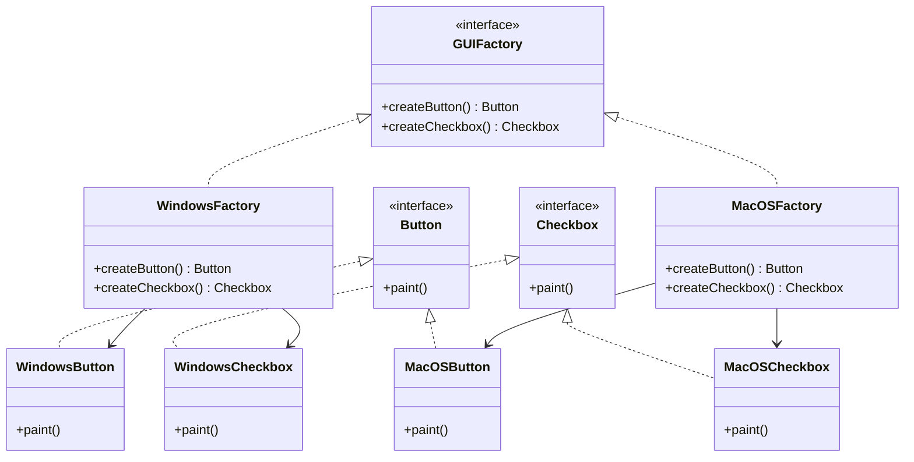

## 3.4.5 Use Cases and Examples

The Abstract Factory Pattern is a creational design pattern that provides an interface for creating families of related or dependent objects without specifying their concrete classes. This pattern is particularly useful in scenarios where a system needs to be independent of how its objects are created, composed, and represented. In this section, we will explore real-world use cases of the Abstract Factory Pattern, focusing on cross-platform GUI frameworks and database access layers. We will also provide code examples to illustrate how this pattern can be implemented in Java.

### Understanding the Abstract Factory Pattern

Before diving into the use cases, let's briefly recap the core concept of the Abstract Factory Pattern. This pattern involves the following components:

- **Abstract Factory**: Declares an interface for creating abstract product objects.
- **Concrete Factory**: Implements the operations to create concrete product objects.
- **Abstract Product**: Declares an interface for a type of product object.
- **Concrete Product**: Defines a product object to be created by the corresponding concrete factory and implements the Abstract Product interface.
- **Client**: Uses only interfaces declared by Abstract Factory and Abstract Product classes.

The Abstract Factory Pattern is ideal for systems that need to work with multiple families of products or when the system needs to be configured with one of multiple families of products.

### Use Case 1: Cross-Platform GUI Frameworks

One of the most common applications of the Abstract Factory Pattern is in the development of cross-platform GUI frameworks. These frameworks need to support multiple operating systems such as Windows, macOS, and Linux. Each operating system has its own set of UI components, such as buttons, checkboxes, and text fields, which behave differently.

#### Why Use Abstract Factory?

The Abstract Factory Pattern is suitable for this use case because it allows developers to create a framework that can produce UI components specific to each operating system without changing the client code. This ensures that the application remains platform-independent and can be easily extended to support new platforms.

#### Code Example: Cross-Platform UI Elements

Let's consider a simple example where we need to create buttons and checkboxes for different operating systems. We will use the Abstract Factory Pattern to achieve this.

```java
// Abstract Product: Button
interface Button {
    void paint();
}

// Concrete Product: WindowsButton
class WindowsButton implements Button {
    public void paint() {
        System.out.println("Rendering a button in Windows style.");
    }
}

// Concrete Product: MacOSButton
class MacOSButton implements Button {
    public void paint() {
        System.out.println("Rendering a button in macOS style.");
    }
}

// Abstract Product: Checkbox
interface Checkbox {
    void paint();
}

// Concrete Product: WindowsCheckbox
class WindowsCheckbox implements Checkbox {
    public void paint() {
        System.out.println("Rendering a checkbox in Windows style.");
    }
}

// Concrete Product: MacOSCheckbox
class MacOSCheckbox implements Checkbox {
    public void paint() {
        System.out.println("Rendering a checkbox in macOS style.");
    }
}

// Abstract Factory
interface GUIFactory {
    Button createButton();
    Checkbox createCheckbox();
}

// Concrete Factory: WindowsFactory
class WindowsFactory implements GUIFactory {
    public Button createButton() {
        return new WindowsButton();
    }

    public Checkbox createCheckbox() {
        return new WindowsCheckbox();
    }
}

// Concrete Factory: MacOSFactory
class MacOSFactory implements GUIFactory {
    public Button createButton() {
        return new MacOSButton();
    }

    public Checkbox createCheckbox() {
        return new MacOSCheckbox();
    }
}

// Client
class Application {
    private Button button;
    private Checkbox checkbox;

    public Application(GUIFactory factory) {
        button = factory.createButton();
        checkbox = factory.createCheckbox();
    }

    public void paint() {
        button.paint();
        checkbox.paint();
    }
}

// Usage
public class Demo {
    private static Application configureApplication() {
        Application app;
        GUIFactory factory;
        String osName = System.getProperty("os.name").toLowerCase();
        if (osName.contains("mac")) {
            factory = new MacOSFactory();
        } else {
            factory = new WindowsFactory();
        }
        app = new Application(factory);
        return app;
    }

    public static void main(String[] args) {
        Application app = configureApplication();
        app.paint();
    }
}
```

In this example, we define abstract products (`Button` and `Checkbox`) and their concrete implementations for Windows and macOS. The `GUIFactory` interface declares methods for creating these products. The `WindowsFactory` and `MacOSFactory` classes implement the `GUIFactory` interface to create Windows and macOS specific products, respectively. The `Application` class acts as the client, using the factory to create and paint the UI components.

#### Benefits

- **Platform Independence**: The client code is not dependent on the concrete classes of products, making it easy to switch between different platforms.
- **Ease of Maintenance**: Adding support for a new platform involves creating new concrete factories and products without modifying existing code.
- **Scalability**: New product families can be added without affecting the client code.

### Use Case 2: Database Access Layers

Another practical application of the Abstract Factory Pattern is in the development of database access layers that support multiple database engines, such as MySQL, PostgreSQL, and Oracle. Each database engine has its own API and connection mechanisms.

#### Why Use Abstract Factory?

The Abstract Factory Pattern is suitable for this use case because it allows developers to create a database access layer that can work with different database engines without changing the client code. This ensures that the application can easily switch between different databases or support multiple databases simultaneously.

#### Code Example: Database Access Layer

Let's consider an example where we need to create connections and queries for different database engines. We will use the Abstract Factory Pattern to achieve this.

```java
// Abstract Product: Connection
interface Connection {
    void connect();
}

// Concrete Product: MySQLConnection
class MySQLConnection implements Connection {
    public void connect() {
        System.out.println("Connecting to MySQL database.");
    }
}

// Concrete Product: PostgreSQLConnection
class PostgreSQLConnection implements Connection {
    public void connect() {
        System.out.println("Connecting to PostgreSQL database.");
    }
}

// Abstract Product: Query
interface Query {
    void execute();
}

// Concrete Product: MySQLQuery
class MySQLQuery implements Query {
    public void execute() {
        System.out.println("Executing MySQL query.");
    }
}

// Concrete Product: PostgreSQLQuery
class PostgreSQLQuery implements Query {
    public void execute() {
        System.out.println("Executing PostgreSQL query.");
    }
}

// Abstract Factory
interface DatabaseFactory {
    Connection createConnection();
    Query createQuery();
}

// Concrete Factory: MySQLFactory
class MySQLFactory implements DatabaseFactory {
    public Connection createConnection() {
        return new MySQLConnection();
    }

    public Query createQuery() {
        return new MySQLQuery();
    }
}

// Concrete Factory: PostgreSQLFactory
class PostgreSQLFactory implements DatabaseFactory {
    public Connection createConnection() {
        return new PostgreSQLConnection();
    }

    public Query createQuery() {
        return new PostgreSQLQuery();
    }
}

// Client
class DatabaseApplication {
    private Connection connection;
    private Query query;

    public DatabaseApplication(DatabaseFactory factory) {
        connection = factory.createConnection();
        query = factory.createQuery();
    }

    public void run() {
        connection.connect();
        query.execute();
    }
}

// Usage
public class DatabaseDemo {
    private static DatabaseApplication configureDatabaseApplication() {
        DatabaseApplication app;
        DatabaseFactory factory;
        String dbType = System.getenv("DB_TYPE");
        if ("postgresql".equalsIgnoreCase(dbType)) {
            factory = new PostgreSQLFactory();
        } else {
            factory = new MySQLFactory();
        }
        app = new DatabaseApplication(factory);
        return app;
    }

    public static void main(String[] args) {
        DatabaseApplication app = configureDatabaseApplication();
        app.run();
    }
}
```

In this example, we define abstract products (`Connection` and `Query`) and their concrete implementations for MySQL and PostgreSQL. The `DatabaseFactory` interface declares methods for creating these products. The `MySQLFactory` and `PostgreSQLFactory` classes implement the `DatabaseFactory` interface to create MySQL and PostgreSQL specific products, respectively. The `DatabaseApplication` class acts as the client, using the factory to create and run the database operations.

#### Benefits

- **Database Independence**: The client code is not dependent on the concrete classes of database products, making it easy to switch between different databases.
- **Ease of Maintenance**: Adding support for a new database involves creating new concrete factories and products without modifying existing code.
- **Scalability**: New database engines can be added without affecting the client code.

### Encouragement to Use Abstract Factory Pattern

When dealing with families of related products, consider using the Abstract Factory Pattern to achieve platform independence, ease of maintenance, and scalability. This pattern is particularly useful in scenarios where a system needs to support multiple platforms or database engines, as demonstrated in the examples above.

### Try It Yourself

To deepen your understanding of the Abstract Factory Pattern, try modifying the code examples provided:

- **Add a New Platform**: Extend the GUI example to support a new platform, such as Linux. Create new concrete products and factories for Linux UI components.
- **Add a New Database Engine**: Extend the database access example to support a new database engine, such as Oracle. Create new concrete products and factories for Oracle connections and queries.
- **Experiment with Different Configurations**: Modify the client code to dynamically switch between different factories based on user input or configuration files.

By experimenting with these modifications, you'll gain a better understanding of how the Abstract Factory Pattern can be applied to real-world scenarios.

### Visualizing the Abstract Factory Pattern

To further illustrate the Abstract Factory Pattern, let's use a class diagram to visualize the relationships between the components in the GUI example.



This diagram shows how the `GUIFactory` interface is implemented by `WindowsFactory` and `MacOSFactory`, which in turn create `WindowsButton`, `MacOSButton`, `WindowsCheckbox`, and `MacOSCheckbox` objects.

### Knowledge Check

To reinforce your understanding of the Abstract Factory Pattern, consider the following questions:

- What are the main components of the Abstract Factory Pattern?
- How does the Abstract Factory Pattern promote platform independence?
- In what scenarios is the Abstract Factory Pattern particularly useful?
- How does the Abstract Factory Pattern differ from the Factory Method Pattern?
- What are the benefits of using the Abstract Factory Pattern in cross-platform GUI frameworks and database access layers?

### Conclusion

The Abstract Factory Pattern is a powerful tool for creating families of related products while maintaining platform independence and ease of maintenance. By applying this pattern to real-world scenarios such as cross-platform GUI frameworks and database access layers, developers can create flexible and scalable systems that can easily adapt to changing requirements. Remember, this is just the beginning. As you progress, you'll discover even more ways to leverage design patterns to build robust and maintainable software. Keep experimenting, stay curious, and enjoy the journey!

## Quiz Time!



### What is the primary purpose of the Abstract Factory Pattern?

- [x] To create families of related or dependent objects without specifying their concrete classes.
- [ ] To provide a single interface to a set of interfaces in a subsystem.
- [ ] To define an interface for creating a single object, but let subclasses decide which class to instantiate.
- [ ] To ensure a class has only one instance and provide a global point of access to it.

> **Explanation:** The Abstract Factory Pattern is designed to create families of related or dependent objects without specifying their concrete classes.

### Which of the following is a key benefit of using the Abstract Factory Pattern in cross-platform GUI frameworks?

- [x] Platform independence
- [ ] Increased complexity
- [ ] Reduced code readability
- [ ] Limited scalability

> **Explanation:** The Abstract Factory Pattern promotes platform independence by allowing the client code to remain unchanged while supporting different platforms.

### In the provided GUI example, what role does the `GUIFactory` interface play?

- [x] It declares methods for creating abstract product objects.
- [ ] It implements the operations to create concrete product objects.
- [ ] It acts as the client using the factory to create UI components.
- [ ] It defines a product object to be created by the corresponding concrete factory.

> **Explanation:** The `GUIFactory` interface declares methods for creating abstract product objects, allowing different concrete factories to implement these methods.

### How does the Abstract Factory Pattern differ from the Factory Method Pattern?

- [x] Abstract Factory creates families of related objects, while Factory Method creates a single object.
- [ ] Abstract Factory is used for creating a single object, while Factory Method creates families of related objects.
- [ ] Abstract Factory is more suitable for singleton objects, while Factory Method is for multiple instances.
- [ ] Abstract Factory is used for dynamic object creation, while Factory Method is for static object creation.

> **Explanation:** The Abstract Factory Pattern creates families of related objects, whereas the Factory Method Pattern focuses on creating a single object.

### Which component in the database access example is responsible for creating MySQL-specific products?

- [x] MySQLFactory
- [ ] DatabaseApplication
- [ ] Connection
- [ ] Query

> **Explanation:** The `MySQLFactory` is responsible for creating MySQL-specific products such as `MySQLConnection` and `MySQLQuery`.

### What is a potential use case for the Abstract Factory Pattern outside of GUI frameworks and database access layers?

- [x] Creating different types of document parsers for various file formats.
- [ ] Implementing a singleton logger.
- [ ] Managing a pool of reusable threads.
- [ ] Providing a simplified interface to a complex subsystem.

> **Explanation:** The Abstract Factory Pattern can be used to create different types of document parsers for various file formats, as it allows for the creation of related objects.

### In the GUI example, which class acts as the client?

- [x] Application
- [ ] WindowsFactory
- [ ] Button
- [ ] MacOSButton

> **Explanation:** The `Application` class acts as the client, using the factory to create and paint the UI components.

### What is a key advantage of using the Abstract Factory Pattern in database access layers?

- [x] Database independence
- [ ] Increased dependency on specific database engines
- [ ] Complexity in adding new databases
- [ ] Reduced flexibility

> **Explanation:** The Abstract Factory Pattern promotes database independence by allowing the client code to remain unchanged while supporting different databases.

### True or False: The Abstract Factory Pattern is only suitable for creating UI components.

- [ ] True
- [x] False

> **Explanation:** False. The Abstract Factory Pattern is suitable for any scenario where families of related or dependent objects need to be created, not just UI components.

### Which of the following is NOT a component of the Abstract Factory Pattern?

- [ ] Abstract Factory
- [ ] Concrete Factory
- [ ] Abstract Product
- [x] Singleton

> **Explanation:** Singleton is not a component of the Abstract Factory Pattern. The pattern involves Abstract Factory, Concrete Factory, Abstract Product, and Concrete Product.


