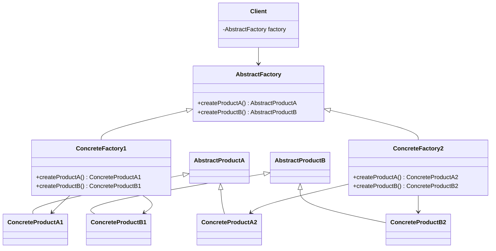
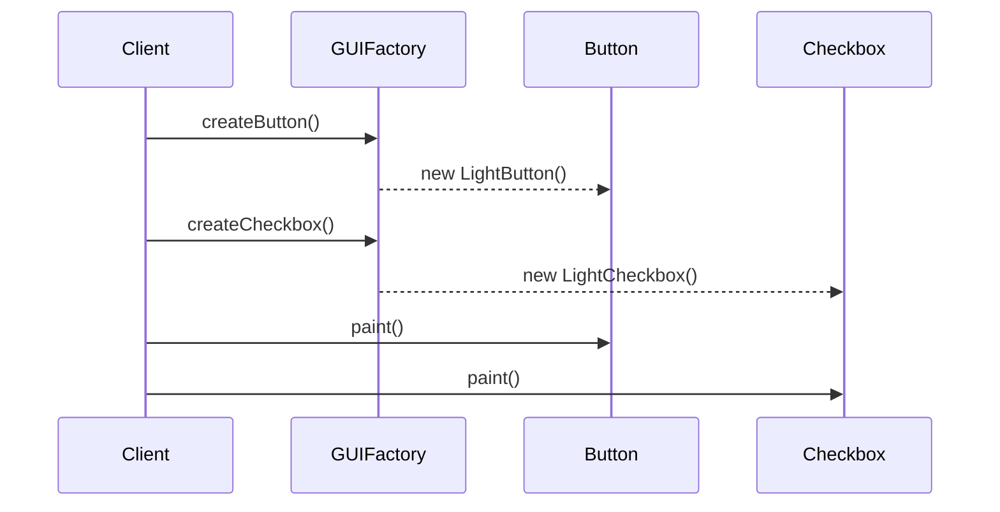

## 3.4 Abstract Factory Pattern

The Abstract Factory Pattern is a cornerstone of creational design patterns, offering a robust solution for creating families of related or dependent objects without specifying their concrete classes. This pattern is particularly useful when a system must be independent of how its objects are created, composed, and represented. In this section, we will delve into the intricacies of the Abstract Factory Pattern, its structure, implementation, and the problems it elegantly solves in software design.

### Understanding the Abstract Factory Pattern

The Abstract Factory Pattern provides an interface for creating families of related objects. It encapsulates a group of individual factories with a common theme. This pattern is often employed in systems that require a high degree of flexibility and scalability, allowing for the creation of a suite of related products without coupling the client code to specific implementations.

#### The Problem It Solves

In complex systems, there is often a need to create objects that belong to a particular family or theme. For example, consider a graphical user interface (GUI) toolkit that supports multiple look-and-feel standards, such as Windows, macOS, and Linux. Each platform has its own set of widgets (buttons, checkboxes, etc.), and the toolkit must be able to create these widgets without hardcoding their specific classes. The Abstract Factory Pattern addresses this problem by providing a way to encapsulate a group of individual factories, each responsible for creating products in a specific family.

### Structure of the Abstract Factory Pattern

The Abstract Factory Pattern involves several key components:

- **AbstractFactory**: Declares an interface for operations that create abstract product objects.
- **ConcreteFactory**: Implements the operations to create concrete product objects.
- **AbstractProduct**: Declares an interface for a type of product object.
- **ConcreteProduct**: Defines a product object to be created by the corresponding concrete factory and implements the AbstractProduct interface.
- **Client**: Uses only interfaces declared by AbstractFactory and AbstractProduct classes.

#### UML Diagram

To better understand the relationships between these components, let's visualize them using a UML class diagram:



### Promoting Consistency Among Products

One of the significant advantages of the Abstract Factory Pattern is its ability to promote consistency among products in the same family. By ensuring that all products created by a particular factory are compatible with each other, the pattern helps maintain a coherent design across the entire system. This is particularly beneficial in scenarios where products need to interact closely or share common behaviors.

### Compliance with the Open/Closed Principle

The Abstract Factory Pattern adheres to the Open/Closed Principle, one of the SOLID principles of object-oriented design. This principle states that software entities should be open for extension but closed for modification. By encapsulating the creation logic within factory classes, the Abstract Factory Pattern allows new product families to be added without altering existing code. This makes the system more flexible and easier to maintain.

### Implementing the Abstract Factory Pattern in Java

Let's explore how to implement the Abstract Factory Pattern in Java. We'll create a simple example of a GUI toolkit that supports different themes, such as Light and Dark.

#### Step-by-Step Implementation

1. **Define Abstract Products**

   First, we define interfaces for the abstract products. In this case, we'll have `Button` and `Checkbox` as our product types.

   ```java
   // AbstractProductA
   public interface Button {
       void paint();
   }

   // AbstractProductB
   public interface Checkbox {
       void paint();
   }
   ```

2. **Create Concrete Products**

   Next, we implement concrete products for each theme. Here, we have `LightButton`, `DarkButton`, `LightCheckbox`, and `DarkCheckbox`.

   ```java
   // ConcreteProductA1
   public class LightButton implements Button {
       @Override
       public void paint() {
           System.out.println("Rendering a light-themed button.");
       }
   }

   // ConcreteProductA2
   public class DarkButton implements Button {
       @Override
       public void paint() {
           System.out.println("Rendering a dark-themed button.");
       }
   }

   // ConcreteProductB1
   public class LightCheckbox implements Checkbox {
       @Override
       public void paint() {
           System.out.println("Rendering a light-themed checkbox.");
       }
   }

   // ConcreteProductB2
   public class DarkCheckbox implements Checkbox {
       @Override
       public void paint() {
           System.out.println("Rendering a dark-themed checkbox.");
       }
   }
   ```

3. **Define the Abstract Factory Interface**

   We then define an abstract factory interface that declares methods for creating each type of product.

   ```java
   public interface GUIFactory {
       Button createButton();
       Checkbox createCheckbox();
   }
   ```

4. **Implement Concrete Factories**

   Each concrete factory implements the abstract factory interface and is responsible for creating products of a specific theme.

   ```java
   // ConcreteFactory1
   public class LightThemeFactory implements GUIFactory {
       @Override
       public Button createButton() {
           return new LightButton();
       }

       @Override
       public Checkbox createCheckbox() {
           return new LightCheckbox();
       }
   }

   // ConcreteFactory2
   public class DarkThemeFactory implements GUIFactory {
       @Override
       public Button createButton() {
           return new DarkButton();
       }

       @Override
       public Checkbox createCheckbox() {
           return new DarkCheckbox();
       }
   }
   ```

5. **Create the Client**

   Finally, the client uses the abstract factory to create products. It is decoupled from the concrete product classes and only interacts with the abstract interfaces.

   ```java
   public class Application {
       private Button button;
       private Checkbox checkbox;

       public Application(GUIFactory factory) {
           button = factory.createButton();
           checkbox = factory.createCheckbox();
       }

       public void paint() {
           button.paint();
           checkbox.paint();
       }
   }
   ```

6. **Using the Abstract Factory**

   To use the Abstract Factory Pattern, the client code must decide which factory to instantiate based on the desired theme.

   ```java
   public class Demo {
       private static Application configureApplication() {
           Application app;
           GUIFactory factory;
           String theme = "dark"; // This could be determined at runtime

           if (theme.equals("light")) {
               factory = new LightThemeFactory();
           } else {
               factory = new DarkThemeFactory();
           }

           app = new Application(factory);
           return app;
       }

       public static void main(String[] args) {
           Application app = configureApplication();
           app.paint();
       }
   }
   ```

### Extending the Abstract Factory Pattern

The Abstract Factory Pattern is highly extensible. To add a new theme, you simply create new concrete product classes and a corresponding concrete factory. The existing client code remains unchanged, demonstrating the pattern's compliance with the Open/Closed Principle.

### Common Use Cases

The Abstract Factory Pattern is advantageous in several scenarios:

- **Cross-Platform Applications**: When developing applications that need to support multiple platforms, the Abstract Factory Pattern can be used to create platform-specific components.
- **Themed Applications**: Applications that offer different themes or skins can use the Abstract Factory Pattern to encapsulate theme-specific creation logic.
- **Product Families**: When a system requires a suite of related products that must be used together, the Abstract Factory Pattern ensures compatibility and consistency.

### Try It Yourself

To deepen your understanding of the Abstract Factory Pattern, try modifying the example code:

- **Add a New Theme**: Implement a new theme, such as "HighContrast", by creating new concrete product classes and a corresponding factory.
- **Experiment with Dynamic Theme Switching**: Modify the client code to allow switching between themes at runtime.
- **Enhance the Product Interfaces**: Add new methods to the `Button` and `Checkbox` interfaces and implement them in the concrete product classes.

### Visualizing the Abstract Factory Pattern

To further clarify the Abstract Factory Pattern, let's visualize the process of creating a themed GUI using a sequence diagram:



### Knowledge Check

- **What is the primary purpose of the Abstract Factory Pattern?**
- **How does the Abstract Factory Pattern promote consistency among products?**
- **Explain how the Abstract Factory Pattern adheres to the Open/Closed Principle.**

### Summary

The Abstract Factory Pattern is a powerful tool in the software engineer's toolkit, providing a flexible and scalable solution for creating families of related objects. By encapsulating the creation logic within factory classes, it promotes consistency, adheres to the Open/Closed Principle, and simplifies the addition of new product families. As you continue to explore design patterns, remember that the Abstract Factory Pattern is just one of many tools available to help you write more maintainable and scalable code.

### Further Reading

For more information on the Abstract Factory Pattern and other design patterns, consider the following resources:

- [Design Patterns: Elements of Reusable Object-Oriented Software](https://en.wikipedia.org/wiki/Design_Patterns) by Erich Gamma, Richard Helm, Ralph Johnson, and John Vlissides
- [Head First Design Patterns](https://www.oreilly.com/library/view/head-first-design/0596007124/) by Eric Freeman and Elisabeth Robson
- [Java Design Patterns](https://www.journaldev.com/1827/java-design-patterns-example-tutorial) by JournalDev

## Quiz Time!



### What is the main intent of the Abstract Factory Pattern?

- [x] To provide an interface for creating families of related or dependent objects without specifying their concrete classes.
- [ ] To define a one-to-many dependency between objects.
- [ ] To separate the construction of a complex object from its representation.
- [ ] To ensure a class has only one instance.

> **Explanation:** The Abstract Factory Pattern is designed to create families of related objects without specifying their concrete classes, allowing for flexibility and scalability in complex systems.

### Which component in the Abstract Factory Pattern declares an interface for creating abstract product objects?

- [x] AbstractFactory
- [ ] ConcreteFactory
- [ ] AbstractProduct
- [ ] ConcreteProduct

> **Explanation:** The AbstractFactory component declares an interface for creating abstract product objects, which are then implemented by concrete factories.

### How does the Abstract Factory Pattern promote consistency among products?

- [x] By ensuring all products created by a particular factory are compatible with each other.
- [ ] By using a single class to manage all product creation.
- [ ] By hardcoding product specifications into the client.
- [ ] By avoiding the use of interfaces.

> **Explanation:** The Abstract Factory Pattern promotes consistency by ensuring that all products created by a specific factory are compatible, maintaining a coherent design across the system.

### Which principle does the Abstract Factory Pattern adhere to?

- [x] Open/Closed Principle
- [ ] Single Responsibility Principle
- [ ] Liskov Substitution Principle
- [ ] Interface Segregation Principle

> **Explanation:** The Abstract Factory Pattern adheres to the Open/Closed Principle by allowing new product families to be added without altering existing code.

### What is a common use case for the Abstract Factory Pattern?

- [x] Cross-platform applications
- [ ] Real-time data processing
- [ ] Event handling systems
- [ ] Network protocol implementations

> **Explanation:** The Abstract Factory Pattern is commonly used in cross-platform applications to create platform-specific components.

### In the Abstract Factory Pattern, what role does the ConcreteFactory play?

- [x] It implements the operations to create concrete product objects.
- [ ] It declares an interface for creating abstract product objects.
- [ ] It defines a product object to be created by the corresponding concrete factory.
- [ ] It uses only interfaces declared by AbstractFactory and AbstractProduct classes.

> **Explanation:** The ConcreteFactory implements the operations to create concrete product objects, adhering to the interfaces defined by the AbstractFactory.

### How can you extend the Abstract Factory Pattern to support a new product family?

- [x] By creating new concrete product classes and a corresponding concrete factory.
- [ ] By modifying existing client code to accommodate new products.
- [ ] By altering the AbstractFactory interface to include new methods.
- [ ] By using inheritance to extend existing product classes.

> **Explanation:** To support a new product family, you create new concrete product classes and a corresponding concrete factory, leaving existing client code unchanged.

### What is the role of the Client in the Abstract Factory Pattern?

- [x] It uses only interfaces declared by AbstractFactory and AbstractProduct classes.
- [ ] It implements the operations to create concrete product objects.
- [ ] It declares an interface for creating abstract product objects.
- [ ] It defines a product object to be created by the corresponding concrete factory.

> **Explanation:** The Client in the Abstract Factory Pattern uses only interfaces declared by AbstractFactory and AbstractProduct classes, ensuring decoupling from concrete implementations.

### What is the benefit of using the Abstract Factory Pattern in themed applications?

- [x] It encapsulates theme-specific creation logic, allowing for easy theme switching.
- [ ] It ensures that all themes are hardcoded into the application.
- [ ] It simplifies the user interface by reducing the number of available themes.
- [ ] It eliminates the need for product interfaces.

> **Explanation:** The Abstract Factory Pattern encapsulates theme-specific creation logic, allowing for easy switching between themes without altering client code.

### True or False: The Abstract Factory Pattern is only applicable to GUI toolkits.

- [ ] True
- [x] False

> **Explanation:** False. While the Abstract Factory Pattern is commonly used in GUI toolkits, it is applicable to any system requiring the creation of families of related objects, such as cross-platform applications and themed applications.


