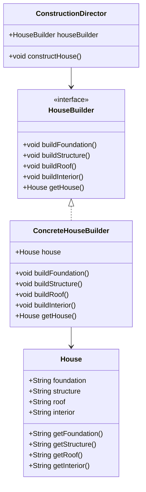

## 3.5.1 Implementing Builder in Java

In the world of software engineering, constructing complex objects can often become cumbersome and error-prone. This is where the Builder pattern comes into play, offering a robust solution to create objects step-by-step, ensuring clarity and precision in the process. In this section, we will delve into the intricacies of implementing the Builder pattern in Java, exploring its components, benefits, and variations.

### Understanding the Builder Pattern

The Builder pattern is a creational design pattern that allows for the step-by-step construction of complex objects. Unlike other creational patterns, the Builder pattern does not require that products have a common interface, which makes it particularly useful for constructing objects that require numerous parameters or configurations.

#### Key Components of the Builder Pattern

1. **Product**: The complex object that is being constructed.
2. **Builder**: An interface or abstract class that defines the construction process.
3. **Concrete Builder**: A class that implements the Builder interface, providing specific implementations for constructing the parts of the Product.
4. **Director**: An optional component that orchestrates the construction process using the Builder interface.

### Defining the Builder Interface

The Builder interface is crucial as it outlines the methods required to construct the different parts of the Product. Let's consider an example where we are building a `House` object.

```java
// The Product class
public class House {
    private String foundation;
    private String structure;
    private String roof;
    private String interior;

    // Getters and toString() for displaying the house details
    public String getFoundation() { return foundation; }
    public String getStructure() { return structure; }
    public String getRoof() { return roof; }
    public String getInterior() { return interior; }

    @Override
    public String toString() {
        return "House built with: Foundation = " + foundation + ", Structure = " + structure + 
               ", Roof = " + roof + ", Interior = " + interior;
    }
}

// The Builder interface
public interface HouseBuilder {
    void buildFoundation();
    void buildStructure();
    void buildRoof();
    void buildInterior();
    House getHouse();
}
```

### Implementing the Concrete Builder

The Concrete Builder class implements the Builder interface, providing specific implementations for constructing each part of the Product.

```java
// The Concrete Builder class
public class ConcreteHouseBuilder implements HouseBuilder {
    private House house;

    public ConcreteHouseBuilder() {
        this.house = new House();
    }

    @Override
    public void buildFoundation() {
        house.foundation = "Concrete, brick, and stone";
        System.out.println("Foundation complete.");
    }

    @Override
    public void buildStructure() {
        house.structure = "Wood and steel";
        System.out.println("Structure complete.");
    }

    @Override
    public void buildRoof() {
        house.roof = "Concrete and tiles";
        System.out.println("Roof complete.");
    }

    @Override
    public void buildInterior() {
        house.interior = "Drywall and paint";
        System.out.println("Interior complete.");
    }

    @Override
    public House getHouse() {
        return this.house;
    }
}
```

### The Role of the Director

The Director class is responsible for managing the construction process. It uses the Builder interface to construct the Product in a specific sequence.

```java
// The Director class
public class ConstructionDirector {
    private HouseBuilder houseBuilder;

    public ConstructionDirector(HouseBuilder houseBuilder) {
        this.houseBuilder = houseBuilder;
    }

    public void constructHouse() {
        houseBuilder.buildFoundation();
        houseBuilder.buildStructure();
        houseBuilder.buildRoof();
        houseBuilder.buildInterior();
    }
}
```

### Putting It All Together

Now that we have defined our Builder pattern components, let's see how they work together to construct a `House`.

```java
public class BuilderPatternDemo {
    public static void main(String[] args) {
        HouseBuilder builder = new ConcreteHouseBuilder();
        ConstructionDirector director = new ConstructionDirector(builder);

        director.constructHouse();
        House house = builder.getHouse();

        System.out.println(house);
    }
}
```

### Benefits of Using the Builder Pattern

- **Improved Code Clarity**: By separating the construction process from the representation, the Builder pattern makes the code more readable and maintainable.
- **Step-by-Step Construction**: The pattern allows for the construction of complex objects in a step-by-step manner, making it easier to manage and understand.
- **Immutable Objects**: The Builder pattern can be used to create immutable objects by only providing getters and no setters in the Product class.

### Modern Approach: Inner Static Classes

In modern Java, the Builder pattern is often implemented using inner static classes, which can provide a more concise and flexible way to construct objects.

```java
public class ModernHouse {
    private final String foundation;
    private final String structure;
    private final String roof;
    private final String interior;

    private ModernHouse(Builder builder) {
        this.foundation = builder.foundation;
        this.structure = builder.structure;
        this.roof = builder.roof;
        this.interior = builder.interior;
    }

    public static class Builder {
        private String foundation;
        private String structure;
        private String roof;
        private String interior;

        public Builder foundation(String foundation) {
            this.foundation = foundation;
            return this;
        }

        public Builder structure(String structure) {
            this.structure = structure;
            return this;
        }

        public Builder roof(String roof) {
            this.roof = roof;
            return this;
        }

        public Builder interior(String interior) {
            this.interior = interior;
            return this;
        }

        public ModernHouse build() {
            return new ModernHouse(this);
        }
    }

    @Override
    public String toString() {
        return "ModernHouse built with: Foundation = " + foundation + ", Structure = " + structure + 
               ", Roof = " + roof + ", Interior = " + interior;
    }
}
```

### Try It Yourself

Experiment with the provided code examples by modifying the `House` and `ModernHouse` classes. Try adding new components to the house, such as windows or doors, and see how the Builder pattern simplifies the construction process.

### Visualizing the Builder Pattern

To better understand the relationships between the components of the Builder pattern, let's visualize it using a class diagram.



### Key Takeaways

- The Builder pattern is ideal for constructing complex objects with numerous configurations.
- It separates the construction process from the representation, enhancing code clarity and maintainability.
- The pattern supports the creation of immutable objects, which can lead to safer and more predictable code.
- Modern implementations using inner static classes provide a more concise and flexible approach.

### References and Further Reading

- [Design Patterns: Elements of Reusable Object-Oriented Software](https://www.amazon.com/Design-Patterns-Elements-Reusable-Object-Oriented/dp/0201633612) by Erich Gamma et al.
- [Effective Java](https://www.amazon.com/Effective-Java-Joshua-Bloch/dp/0134685997) by Joshua Bloch
- [Oracle's Java Documentation](https://docs.oracle.com/en/java/)

## Quiz Time!



### What is the primary purpose of the Builder pattern?

- [x] To construct complex objects step-by-step
- [ ] To manage object lifecycles
- [ ] To enforce a single instance of a class
- [ ] To facilitate object cloning

> **Explanation:** The Builder pattern is designed to construct complex objects step-by-step, allowing for greater control over the construction process.

### Which component of the Builder pattern is responsible for orchestrating the construction process?

- [ ] Product
- [ ] Builder
- [x] Director
- [ ] Concrete Builder

> **Explanation:** The Director is responsible for orchestrating the construction process by using the Builder interface to construct the Product.

### What is a key benefit of using the Builder pattern?

- [x] Improved code clarity
- [ ] Reduced memory usage
- [ ] Faster execution time
- [ ] Simplified inheritance

> **Explanation:** The Builder pattern improves code clarity by separating the construction process from the representation, making the code more readable and maintainable.

### How does the modern approach to the Builder pattern differ from the classic approach?

- [ ] It uses inheritance instead of composition
- [x] It often uses inner static classes
- [ ] It eliminates the need for a Director
- [ ] It requires a common interface for products

> **Explanation:** The modern approach to the Builder pattern often uses inner static classes, which provide a more concise and flexible way to construct objects.

### In the provided code example, what is the role of the `ConcreteHouseBuilder` class?

- [x] It implements the Builder interface to construct the parts of the House
- [ ] It manages the lifecycle of the House object
- [ ] It provides a simplified interface for the House class
- [ ] It acts as a placeholder for the House object

> **Explanation:** The `ConcreteHouseBuilder` class implements the Builder interface, providing specific implementations for constructing the parts of the House.

### What is the advantage of using the Builder pattern to create immutable objects?

- [x] It ensures that objects are constructed with all necessary parameters
- [ ] It reduces the number of classes needed
- [ ] It increases the speed of object creation
- [ ] It simplifies the inheritance hierarchy

> **Explanation:** The Builder pattern can ensure that objects are constructed with all necessary parameters, which is crucial for creating immutable objects.

### Which method in the Builder interface is responsible for returning the final Product?

- [ ] buildFoundation()
- [ ] buildStructure()
- [ ] buildInterior()
- [x] getHouse()

> **Explanation:** The `getHouse()` method in the Builder interface is responsible for returning the final Product, which is the constructed House.

### What is a common use case for the Builder pattern?

- [ ] Managing database connections
- [ ] Implementing singleton instances
- [x] Constructing objects with numerous configurations
- [ ] Facilitating object cloning

> **Explanation:** The Builder pattern is commonly used for constructing objects with numerous configurations, as it allows for step-by-step construction.

### How does the Director interact with the Builder in the Builder pattern?

- [ ] The Director directly modifies the Product
- [x] The Director uses the Builder interface to construct the Product
- [ ] The Director implements the Builder interface
- [ ] The Director acts as a placeholder for the Builder

> **Explanation:** The Director interacts with the Builder by using the Builder interface to construct the Product, orchestrating the construction process.

### True or False: The Builder pattern requires that all products have a common interface.

- [ ] True
- [x] False

> **Explanation:** False. The Builder pattern does not require that products have a common interface, which allows for greater flexibility in constructing complex objects.


