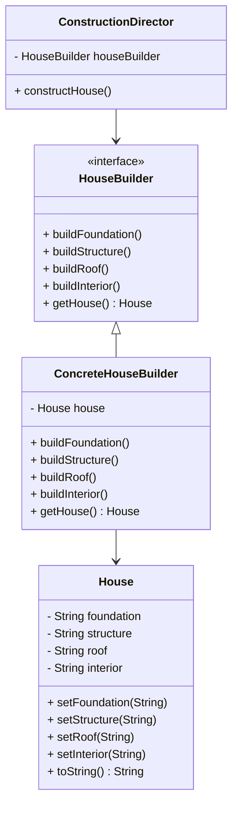

## 3.5.2 Director and Builder Roles

In the realm of software design patterns, the Builder pattern stands out as a powerful tool for constructing complex objects. It separates the construction of an object from its representation, allowing the same construction process to create different representations. This section delves into the roles of the Director and Builder within the Builder pattern, focusing on their responsibilities, interactions, and the advantages of their separation. We will explore these concepts through detailed explanations and practical Java code examples.

### Understanding the Director and Builder Roles

#### The Role of the Director

The Director is a crucial component in the Builder pattern. Its primary responsibility is to control the construction process of a product. The Director does not know the specifics of how the product is built; instead, it orchestrates the sequence of building steps. This separation allows the Director to focus on the "what" rather than the "how," delegating the actual construction to the Builder.

**Responsibilities of the Director:**

- **Orchestration:** The Director defines the order in which the construction steps are executed.
- **Abstraction:** It abstracts the construction process from the client, providing a simpler interface.
- **Reusability:** The Director can be reused with different Builders to create various representations of a product.

#### The Role of the Builder

The Builder is responsible for the actual construction of the product. It provides the methods needed to build the parts of the product, allowing for flexibility and customization in the construction process. The Builder pattern typically involves an abstract Builder interface or class, which defines the methods for building the product's parts. Concrete Builder classes implement these methods to create specific product representations.

**Responsibilities of the Builder:**

- **Construction:** The Builder implements the construction logic for the product's components.
- **Customization:** It allows for different implementations to create varied product representations.
- **Encapsulation:** The Builder encapsulates the construction details, hiding them from the Director and the client.

### Interaction Between Director and Builder

The interaction between the Director and Builder is central to the Builder pattern. The Director uses a Builder to construct a product by calling the Builder's methods in a specific sequence. This interaction is often encapsulated in a method within the Director, such as `construct()`, which outlines the construction process.

#### Java Code Example

Let's illustrate the interaction between the Director and Builder with a practical Java example. We'll create a simple scenario where we build a `House` object using the Builder pattern.

```java
// Product class
class House {
    private String foundation;
    private String structure;
    private String roof;
    private String interior;

    public void setFoundation(String foundation) {
        this.foundation = foundation;
    }

    public void setStructure(String structure) {
        this.structure = structure;
    }

    public void setRoof(String roof) {
        this.roof = roof;
    }

    public void setInterior(String interior) {
        this.interior = interior;
    }

    @Override
    public String toString() {
        return "House [foundation=" + foundation + ", structure=" + structure + ", roof=" + roof + ", interior=" + interior + "]";
    }
}

// Builder interface
interface HouseBuilder {
    void buildFoundation();
    void buildStructure();
    void buildRoof();
    void buildInterior();
    House getHouse();
}

// Concrete Builder
class ConcreteHouseBuilder implements HouseBuilder {
    private House house;

    public ConcreteHouseBuilder() {
        this.house = new House();
    }

    @Override
    public void buildFoundation() {
        house.setFoundation("Concrete, brick, and stone");
    }

    @Override
    public void buildStructure() {
        house.setStructure("Concrete and steel");
    }

    @Override
    public void buildRoof() {
        house.setRoof("Concrete and steel");
    }

    @Override
    public void buildInterior() {
        house.setInterior("Modern style");
    }

    @Override
    public House getHouse() {
        return this.house;
    }
}

// Director
class ConstructionDirector {
    private HouseBuilder houseBuilder;

    public ConstructionDirector(HouseBuilder houseBuilder) {
        this.houseBuilder = houseBuilder;
    }

    public void constructHouse() {
        houseBuilder.buildFoundation();
        houseBuilder.buildStructure();
        houseBuilder.buildRoof();
        houseBuilder.buildInterior();
    }
}

// Client
public class BuilderPatternExample {
    public static void main(String[] args) {
        HouseBuilder builder = new ConcreteHouseBuilder();
        ConstructionDirector director = new ConstructionDirector(builder);
        director.constructHouse();
        House house = builder.getHouse();
        System.out.println(house);
    }
}
```

**Explanation:**

- **House (Product):** The `House` class represents the complex object we want to build. It has various components like foundation, structure, roof, and interior.
- **HouseBuilder (Builder Interface):** This interface defines the methods for building the parts of the `House`.
- **ConcreteHouseBuilder (Concrete Builder):** This class implements the `HouseBuilder` interface and provides the actual construction logic.
- **ConstructionDirector (Director):** The Director class orchestrates the construction process by calling the Builder's methods in a specific sequence.
- **BuilderPatternExample (Client):** The client creates a `ConcreteHouseBuilder` and a `ConstructionDirector`, then uses the Director to construct the `House`.

### Advantages of Separating Director and Builder

The separation of concerns between the Director and Builder offers several advantages:

1. **Reusability:** The Director can be reused with different Builders to create various product representations. This flexibility allows for easy adaptation to new requirements without modifying the Director.

2. **Maintainability:** By encapsulating the construction logic within the Builder, changes to the construction process do not affect the Director or the client. This separation enhances maintainability and reduces the risk of introducing errors.

3. **Scalability:** The Builder pattern supports the creation of complex objects with multiple components. By separating the construction process, the pattern can scale to accommodate additional components or variations without significant changes to the existing codebase.

4. **Flexibility:** The Builder pattern allows for different implementations of the Builder interface, enabling the creation of varied product representations. This flexibility is particularly useful in scenarios where the product's components or configuration may change over time.

### Visualizing the Builder Pattern

To better understand the interaction between the Director and Builder, let's visualize the process using a class diagram.



**Diagram Explanation:**

- **House:** Represents the product being built.
- **HouseBuilder:** An interface defining the methods for building the product's parts.
- **ConcreteHouseBuilder:** Implements the `HouseBuilder` interface, providing specific construction logic.
- **ConstructionDirector:** Uses a `HouseBuilder` to orchestrate the construction process.

### Try It Yourself

To deepen your understanding of the Director and Builder roles, try modifying the code example:

- **Create a New Builder:** Implement a new `HouseBuilder` class, such as `WoodenHouseBuilder`, that constructs a house with different materials.
- **Modify the Director:** Adjust the `ConstructionDirector` to use your new `WoodenHouseBuilder` and observe how the output changes.
- **Experiment with Order:** Change the order of construction steps in the `constructHouse()` method and see how it affects the final product.

### Knowledge Check

Before we conclude, let's reinforce your understanding with a few questions:

1. What is the primary responsibility of the Director in the Builder pattern?
2. How does the Builder pattern enhance the reusability of the construction process?
3. Why is it beneficial to separate the construction logic from the Director?
4. How can the Builder pattern accommodate changes in product requirements?
5. What are the advantages of using interfaces in the Builder pattern?

### Conclusion

The Builder pattern, with its separation of concerns between the Director and Builder, provides a robust framework for constructing complex objects. By delegating the construction process to the Builder, the Director can focus on orchestrating the sequence of steps, enhancing reusability, maintainability, and flexibility. As you continue to explore design patterns, remember that the Builder pattern is a powerful tool for managing complexity in object construction.

## Quiz Time!



### What is the primary role of the Director in the Builder pattern?

- [x] To control the construction process
- [ ] To implement the construction logic
- [ ] To define the product's components
- [ ] To create different product representations

> **Explanation:** The Director's main responsibility is to control the construction process by orchestrating the sequence of building steps.

### How does the Builder pattern enhance reusability?

- [x] By allowing different Builders to be used with the same Director
- [ ] By embedding construction logic in the Director
- [ ] By hardcoding product representations
- [ ] By limiting the number of product variations

> **Explanation:** The Builder pattern enhances reusability by allowing the same Director to be used with different Builders, enabling the creation of various product representations.

### Why is it beneficial to separate construction logic from the Director?

- [x] To enhance maintainability and reduce errors
- [ ] To simplify the Builder's responsibilities
- [ ] To limit the number of product variations
- [ ] To increase the complexity of the Director

> **Explanation:** Separating construction logic from the Director enhances maintainability and reduces the risk of introducing errors when changes are made to the construction process.

### How can the Builder pattern accommodate changes in product requirements?

- [x] By allowing different implementations of the Builder interface
- [ ] By modifying the Director's construction sequence
- [ ] By embedding product details in the Director
- [ ] By limiting the number of Builders

> **Explanation:** The Builder pattern accommodates changes in product requirements by allowing different implementations of the Builder interface, enabling varied product representations.

### What are the advantages of using interfaces in the Builder pattern?

- [x] They provide flexibility and allow for different Builder implementations
- [ ] They simplify the Director's responsibilities
- [ ] They limit the number of product variations
- [ ] They increase the complexity of the Builder

> **Explanation:** Using interfaces in the Builder pattern provides flexibility and allows for different Builder implementations, supporting varied product representations.

### In the Builder pattern, what is the main responsibility of the Builder?

- [x] To implement the construction logic for the product's components
- [ ] To control the construction process
- [ ] To define the product's components
- [ ] To create different product representations

> **Explanation:** The Builder's main responsibility is to implement the construction logic for the product's components, allowing for flexibility and customization.

### How does the Director interact with the Builder in the Builder pattern?

- [x] By calling the Builder's methods in a specific sequence
- [ ] By implementing the Builder's methods
- [ ] By defining the product's components
- [ ] By creating different product representations

> **Explanation:** The Director interacts with the Builder by calling the Builder's methods in a specific sequence to construct the product.

### What is the benefit of using a Concrete Builder in the Builder pattern?

- [x] It provides specific construction logic for creating a product
- [ ] It controls the construction process
- [ ] It defines the product's components
- [ ] It creates different product representations

> **Explanation:** A Concrete Builder provides specific construction logic for creating a product, implementing the methods defined by the Builder interface.

### Can the Builder pattern be used to create multiple product representations?

- [x] Yes
- [ ] No

> **Explanation:** Yes, the Builder pattern can be used to create multiple product representations by using different Builders with the same Director.

### True or False: The Director in the Builder pattern is responsible for implementing the construction logic.

- [ ] True
- [x] False

> **Explanation:** False. The Director is responsible for controlling the construction process, while the Builder implements the construction logic.



Remember, the journey of mastering design patterns is ongoing. Keep experimenting, stay curious, and enjoy the process of building robust and flexible software solutions!
