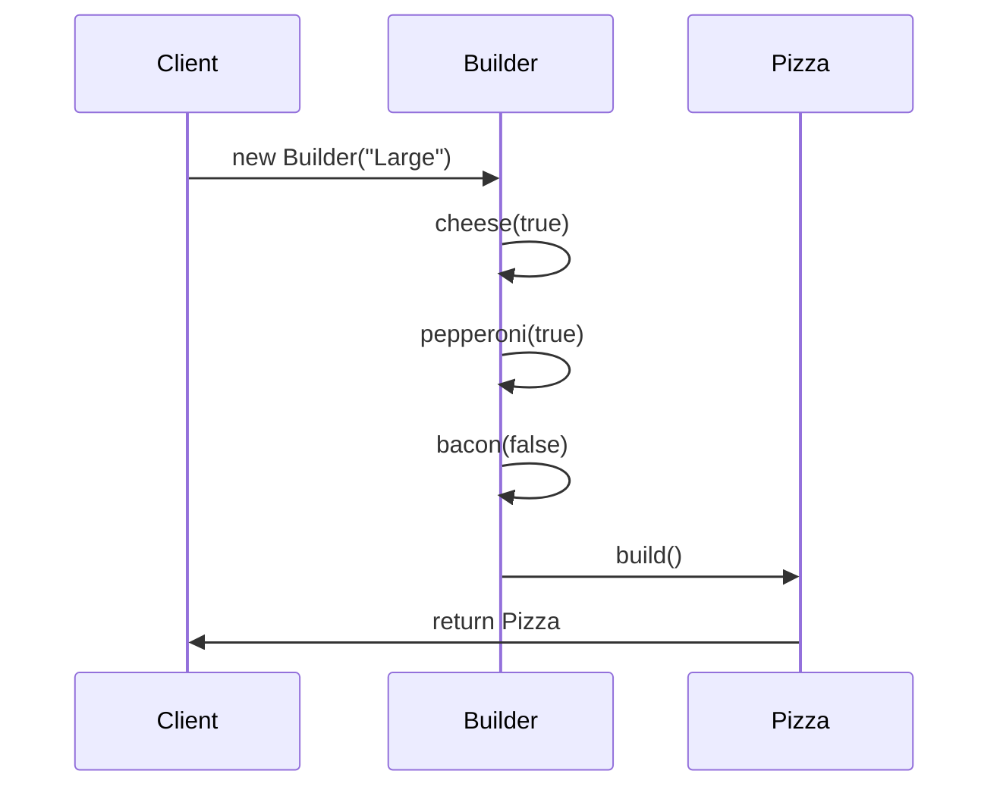

## 3.5.3 Fluent Interfaces in Java

In the realm of software engineering, the readability and maintainability of code are paramount. Fluent interfaces, a design approach that leverages method chaining, have emerged as a powerful tool to enhance these aspects. This section delves into the concept of fluent interfaces in Java, particularly in conjunction with the Builder pattern, to construct complex objects with ease and clarity.

### Understanding Fluent Interfaces

Fluent interfaces are a style of object-oriented API design that emphasizes readability and expressiveness. By allowing method chaining, fluent interfaces enable developers to write code that reads almost like natural language. This approach is particularly beneficial in scenarios where objects have numerous configuration options, as it simplifies the process of setting these options in a clear and concise manner.

#### Key Characteristics of Fluent Interfaces

1. **Method Chaining**: The core of fluent interfaces is method chaining, where each method returns an instance of the object, allowing multiple method calls to be linked together in a single statement.
2. **Readability**: Fluent interfaces aim to make the code more readable by using descriptive method names and chaining them in a logical sequence.
3. **Expressiveness**: They provide a way to express complex configurations in a straightforward manner, reducing the cognitive load on the developer.

### Fluent Interfaces and the Builder Pattern

The Builder pattern is a creational design pattern that provides a flexible solution to constructing complex objects. It separates the construction of an object from its representation, allowing the same construction process to create different representations. Fluent interfaces complement the Builder pattern by enhancing its readability and usability through method chaining.

#### How Fluent Interfaces Enhance the Builder Pattern

- **Simplified Syntax**: Fluent interfaces reduce the verbosity of the Builder pattern by allowing method calls to be chained together, resulting in a more concise and readable syntax.
- **Improved Clarity**: By using descriptive method names and chaining, fluent interfaces make it clear what each step of the building process is doing.
- **Enhanced Flexibility**: They allow for flexible object construction, enabling developers to easily add or modify parameters without disrupting the overall flow of the code.

### Benefits of Method Chaining in Object Construction

Method chaining offers several advantages when constructing objects, particularly in the context of the Builder pattern:

1. **Increased Readability**: Method chaining allows for a more natural and readable syntax, making it easier to understand the sequence of operations being performed.
2. **Reduced Boilerplate Code**: By chaining methods, developers can eliminate the need for repetitive code, reducing the overall amount of boilerplate.
3. **Enhanced Maintainability**: With a clear and concise syntax, fluent interfaces make it easier to maintain and update code, as changes can be made in a single, readable statement.
4. **Improved Code Expressiveness**: Fluent interfaces allow developers to express complex configurations in a straightforward manner, making the code more intuitive and easier to follow.

### Implementing Fluent Interfaces with the Builder Pattern in Java

To illustrate the power of fluent interfaces, let's explore a practical example of implementing a fluent Builder in Java. We'll create a `Pizza` class with various optional parameters, demonstrating how fluent interfaces can simplify the construction process.

#### Step-by-Step Implementation

1. **Define the Product Class**

```java
public class Pizza {
    private final String size;
    private final boolean cheese;
    private final boolean pepperoni;
    private final boolean bacon;

    private Pizza(Builder builder) {
        this.size = builder.size;
        this.cheese = builder.cheese;
        this.pepperoni = builder.pepperoni;
        this.bacon = builder.bacon;
    }

    public static class Builder {
        private final String size;
        private boolean cheese;
        private boolean pepperoni;
        private boolean bacon;

        public Builder(String size) {
            this.size = size;
        }

        public Builder cheese(boolean value) {
            cheese = value;
            return this;
        }

        public Builder pepperoni(boolean value) {
            pepperoni = value;
            return this;
        }

        public Builder bacon(boolean value) {
            bacon = value;
            return this;
        }

        public Pizza build() {
            return new Pizza(this);
        }
    }
}
```

2. **Constructing a Pizza Object Using Fluent Interfaces**

```java
Pizza pizza = new Pizza.Builder("Large")
    .cheese(true)
    .pepperoni(true)
    .bacon(false)
    .build();
```

In this example, the `Pizza` class is constructed using a `Builder` class that employs method chaining to set optional parameters. Each method in the `Builder` class returns `this`, allowing for the chaining of method calls.

### Best Practices for Designing Fluent Interfaces

When designing fluent interfaces, consider the following best practices to ensure clarity and usability:

1. **Return `this`**: Ensure that each method in the fluent interface returns the current instance (`this`) to facilitate method chaining.
2. **Descriptive Method Names**: Use clear and descriptive method names that convey the purpose of each method call, enhancing readability.
3. **Consistent Method Order**: Maintain a logical and consistent order of method calls to make the code intuitive and easy to follow.
4. **Avoid Overloading**: Minimize the use of overloaded methods to prevent confusion and maintain clarity in the method chaining process.

### Simplifying Complex Object Creation with Fluent Builders

Fluent Builders are particularly useful when dealing with complex objects that have multiple optional parameters. By providing a clear and concise way to set these parameters, fluent Builders simplify the object creation process and reduce the likelihood of errors.

#### Example: Building a Complex Configuration Object

Consider a `Configuration` class with multiple optional settings:

```java
public class Configuration {
    private final String host;
    private final int port;
    private final boolean useSSL;
    private final int timeout;

    private Configuration(Builder builder) {
        this.host = builder.host;
        this.port = builder.port;
        this.useSSL = builder.useSSL;
        this.timeout = builder.timeout;
    }

    public static class Builder {
        private String host;
        private int port = 80; // Default value
        private boolean useSSL = false; // Default value
        private int timeout = 30; // Default value

        public Builder host(String host) {
            this.host = host;
            return this;
        }

        public Builder port(int port) {
            this.port = port;
            return this;
        }

        public Builder useSSL(boolean useSSL) {
            this.useSSL = useSSL;
            return this;
        }

        public Builder timeout(int timeout) {
            this.timeout = timeout;
            return this;
        }

        public Configuration build() {
            return new Configuration(this);
        }
    }
}
```

Using the fluent Builder, a `Configuration` object can be constructed as follows:

```java
Configuration config = new Configuration.Builder()
    .host("example.com")
    .port(443)
    .useSSL(true)
    .timeout(60)
    .build();
```

This approach allows developers to easily configure complex objects with multiple optional parameters, enhancing both readability and maintainability.

### Encouraging the Use of Fluent Interfaces

Fluent interfaces are a powerful tool for enhancing code expressiveness and readability. By adopting fluent interfaces, developers can create APIs that are intuitive and easy to use, reducing the cognitive load on users and improving the overall quality of the codebase.

### Visualizing Fluent Interfaces

To better understand the flow of method chaining in fluent interfaces, let's visualize the process using a sequence diagram.



**Figure 1**: This sequence diagram illustrates the flow of method chaining in the fluent Builder pattern, showing how each method call returns the Builder instance, allowing for subsequent method calls.

### Try It Yourself

To fully grasp the power of fluent interfaces, try modifying the provided code examples:

1. **Add New Parameters**: Extend the `Pizza` or `Configuration` classes with additional optional parameters and update the Builder accordingly.
2. **Experiment with Method Order**: Change the order of method calls in the fluent interface and observe how it affects readability and usability.
3. **Create Your Own Fluent Interface**: Design a fluent interface for a different class or use case, applying the best practices discussed.

### Knowledge Check

Before moving on, take a moment to reflect on the key concepts covered in this section:

- How do fluent interfaces enhance the readability and maintainability of code?
- What are the benefits of method chaining in the context of the Builder pattern?
- How can fluent Builders simplify the creation of complex objects with multiple optional parameters?

### Conclusion

Fluent interfaces, when combined with the Builder pattern, offer a powerful approach to constructing complex objects in a readable and maintainable manner. By leveraging method chaining, developers can create APIs that are both expressive and intuitive, enhancing the overall quality of the codebase. As you continue your journey in software development, consider adopting fluent interfaces to improve the readability and usability of your code.

## Quiz Time!



### What is the primary advantage of using fluent interfaces in Java?

- [x] Improved readability and expressiveness
- [ ] Enhanced performance
- [ ] Reduced memory usage
- [ ] Simplified error handling

> **Explanation:** Fluent interfaces improve readability and expressiveness by allowing method chaining, making the code more intuitive and easier to follow.

### Which design pattern is commonly associated with fluent interfaces?

- [x] Builder Pattern
- [ ] Singleton Pattern
- [ ] Factory Method Pattern
- [ ] Observer Pattern

> **Explanation:** Fluent interfaces are often used in conjunction with the Builder pattern to construct complex objects in a readable and maintainable way.

### What is a key characteristic of fluent interfaces?

- [x] Method chaining
- [ ] Singleton enforcement
- [ ] Lazy initialization
- [ ] Event-driven architecture

> **Explanation:** Method chaining is a key characteristic of fluent interfaces, allowing multiple method calls to be linked together in a single statement.

### In a fluent interface, what should each method return to facilitate method chaining?

- [x] The current instance (`this`)
- [ ] A new instance of the class
- [ ] A boolean value
- [ ] A string representation

> **Explanation:** Each method in a fluent interface should return the current instance (`this`) to enable method chaining.

### What is the main benefit of using descriptive method names in fluent interfaces?

- [x] Enhanced readability
- [ ] Improved performance
- [ ] Reduced code size
- [ ] Increased security

> **Explanation:** Descriptive method names enhance readability by clearly conveying the purpose of each method call in the fluent interface.

### How do fluent interfaces simplify the creation of complex objects?

- [x] By allowing method chaining to set multiple parameters in a single statement
- [ ] By enforcing strict type checking
- [ ] By reducing the number of classes needed
- [ ] By using reflection to dynamically create objects

> **Explanation:** Fluent interfaces simplify the creation of complex objects by allowing method chaining to set multiple parameters in a single, readable statement.

### What is a common best practice when designing fluent interfaces?

- [x] Return `this` from each method
- [ ] Use overloaded methods extensively
- [ ] Minimize the number of methods
- [ ] Avoid using descriptive method names

> **Explanation:** A common best practice in designing fluent interfaces is to return `this` from each method to facilitate method chaining.

### Which of the following is NOT a benefit of fluent interfaces?

- [ ] Increased readability
- [ ] Reduced boilerplate code
- [ ] Enhanced maintainability
- [x] Improved runtime performance

> **Explanation:** While fluent interfaces improve readability, reduce boilerplate code, and enhance maintainability, they do not inherently improve runtime performance.

### What is the purpose of the `build()` method in a fluent Builder pattern?

- [x] To construct and return the final object
- [ ] To reset the Builder to its initial state
- [ ] To validate the parameters set
- [ ] To log the construction process

> **Explanation:** The `build()` method in a fluent Builder pattern is used to construct and return the final object after all parameters have been set.

### True or False: Fluent interfaces are only applicable to the Builder pattern.

- [ ] True
- [x] False

> **Explanation:** False. While fluent interfaces are commonly used with the Builder pattern, they can be applied to other design patterns and APIs to enhance readability and expressiveness.


