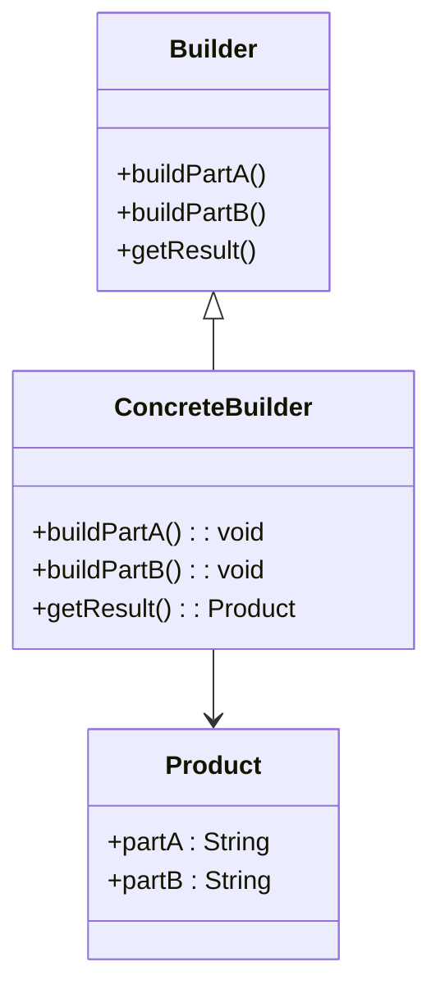

## 3.5.4 Builder Pattern in Java Libraries

The Builder pattern is a creational design pattern that provides a flexible solution to constructing complex objects. It separates the construction of a complex object from its representation, allowing the same construction process to create different representations. In this section, we delve into how the Builder pattern is implemented in various Java libraries and frameworks, such as `StringBuilder`, `StringBuffer`, `java.lang.ProcessBuilder`, and others. We will explore the principles behind these implementations, the benefits they offer, and how developers can leverage them to enhance their Java applications.

### Understanding the Builder Pattern

Before diving into specific Java libraries, let's briefly revisit the core principles of the Builder pattern. The Builder pattern is particularly useful when:

- The construction process of an object is complex.
- An object can be constructed in multiple ways.
- The object requires numerous optional parameters.

The pattern involves several key components:

- **Builder**: An interface or abstract class defining the steps to build the product.
- **Concrete Builder**: Implements the Builder interface and provides specific implementations for the construction steps.
- **Product**: The complex object being built.
- **Director**: (Optional) Orchestrates the building process using the Builder interface.

By employing the Builder pattern, developers can construct objects step-by-step, which is especially beneficial when dealing with immutable objects or objects with numerous configuration options.

### Builder Pattern in Java Libraries

Java's standard libraries provide several examples of the Builder pattern in action. These implementations demonstrate how the pattern can simplify object creation and improve code readability and maintainability.

#### StringBuilder and StringBuffer

`StringBuilder` and `StringBuffer` are two well-known classes in Java that utilize the Builder pattern principles. Both classes are used to create mutable sequences of characters, which can be modified without creating new objects, unlike `String`.

**StringBuilder Example:**

```java
public class StringBuilderExample {
    public static void main(String[] args) {
        // Create a StringBuilder instance
        StringBuilder sb = new StringBuilder();

        // Append strings to the builder
        sb.append("Hello, ");
        sb.append("world!");
        sb.append(" Welcome to Java.");

        // Convert the builder to a string
        String result = sb.toString();

        // Output the result
        System.out.println(result);
    }
}
```

**Key Features:**

- **Mutability**: Unlike `String`, `StringBuilder` allows for mutable sequences of characters, which can be modified without creating new objects.
- **Performance**: `StringBuilder` is more efficient than `String` when performing multiple string manipulations because it minimizes memory overhead.
- **Ease of Use**: The fluent interface provided by `StringBuilder` makes it easy to chain method calls, enhancing code readability.

**StringBuffer** is similar to `StringBuilder` but is synchronized, making it thread-safe. This comes at the cost of performance, so `StringBuffer` is preferred when thread safety is required.

#### ProcessBuilder

`java.lang.ProcessBuilder` is another example of the Builder pattern in Java. It is used to create and manage operating system processes.

**ProcessBuilder Example:**

```java
import java.io.IOException;

public class ProcessBuilderExample {
    public static void main(String[] args) {
        // Create a ProcessBuilder instance
        ProcessBuilder processBuilder = new ProcessBuilder("ping", "-c", "3", "google.com");

        try {
            // Start the process
            Process process = processBuilder.start();

            // Wait for the process to complete
            int exitCode = process.waitFor();
            System.out.println("Process exited with code: " + exitCode);
        } catch (IOException | InterruptedException e) {
            e.printStackTrace();
        }
    }
}
```

**Key Features:**

- **Configuration**: `ProcessBuilder` allows for detailed configuration of the process environment, including setting environment variables and working directories.
- **Flexibility**: It provides a flexible way to start and manage processes, supporting various configurations and command-line arguments.
- **Ease of Use**: The fluent interface allows for chaining method calls, making it easy to configure and start processes.

### Benefits of Using Builder Pattern in Java Libraries

The Builder pattern offers several benefits when used in Java libraries:

- **Improved Readability**: The fluent interface provided by builders makes code more readable and maintainable.
- **Reduced Complexity**: By separating the construction process from the final object, the Builder pattern reduces the complexity of object creation.
- **Enhanced Flexibility**: Builders allow for flexible object creation, supporting various configurations and optional parameters.
- **Performance Optimization**: In cases like `StringBuilder`, the Builder pattern can lead to performance improvements by minimizing memory overhead.

### Other Libraries and Frameworks Utilizing the Builder Pattern

Beyond the standard Java libraries, several other libraries and frameworks make use of the Builder pattern to simplify object creation and configuration.

#### Apache Commons Configuration

Apache Commons Configuration provides a flexible and powerful configuration management library. It uses the Builder pattern to create and manage configuration objects.

**Example:**

```java
import org.apache.commons.configuration2.builder.fluent.Configurations;
import org.apache.commons.configuration2.Configuration;

public class ApacheCommonsConfigExample {
    public static void main(String[] args) {
        Configurations configs = new Configurations();
        try {
            // Load a properties file using the builder
            Configuration config = configs.properties("config.properties");

            // Access configuration properties
            String appName = config.getString("app.name");
            int maxUsers = config.getInt("app.maxUsers");

            System.out.println("App Name: " + appName);
            System.out.println("Max Users: " + maxUsers);
        } catch (Exception e) {
            e.printStackTrace();
        }
    }
}
```

**Key Features:**

- **Ease of Use**: The Builder pattern simplifies the process of loading and accessing configuration data.
- **Flexibility**: Supports various configuration formats, including properties files, XML, and JSON.
- **Extensibility**: Easily extended to support custom configuration sources.

#### Lombok's @Builder Annotation

Lombok is a popular library that reduces boilerplate code in Java applications. It provides the `@Builder` annotation, which automatically generates a builder for a class.

**Example:**

```java
import lombok.Builder;
import lombok.ToString;

@Builder
@ToString
public class User {
    private String name;
    private int age;
    private String email;

    public static void main(String[] args) {
        // Create a User instance using the builder
        User user = User.builder()
                        .name("Alice")
                        .age(30)
                        .email("alice@example.com")
                        .build();

        // Output the user details
        System.out.println(user);
    }
}
```

**Key Features:**

- **Reduced Boilerplate**: Automatically generates builder code, reducing manual coding effort.
- **Fluent Interface**: Provides a fluent interface for constructing objects.
- **Immutability**: Supports the creation of immutable objects with optional parameters.

### Recognizing and Leveraging Builders in Java

As Java developers, recognizing and leveraging existing builders in Java libraries can greatly simplify code and improve maintainability. Builders provide a structured and flexible way to construct complex objects, making them a valuable tool in any developer's toolkit.

**Try It Yourself:**

To get hands-on experience with the Builder pattern, try modifying the examples provided in this section. Experiment with adding new methods to the builders, chaining method calls, and creating custom builders for your own classes. This practice will deepen your understanding of the Builder pattern and its applications in Java development.

### Visualizing the Builder Pattern

To further enhance your understanding, let's visualize the Builder pattern using a class diagram. This diagram illustrates the relationship between the components of the Builder pattern.



**Diagram Description:**

- **Builder**: Defines the interface for building parts of the product.
- **ConcreteBuilder**: Implements the Builder interface and constructs the product.
- **Product**: Represents the complex object being built.

### Conclusion

The Builder pattern is a powerful tool for constructing complex objects in Java. By separating the construction process from the final object, it provides flexibility, readability, and performance benefits. Java's standard libraries, such as `StringBuilder`, `StringBuffer`, and `ProcessBuilder`, demonstrate the practical applications of the Builder pattern. Additionally, libraries like Apache Commons Configuration and Lombok's `@Builder` annotation further showcase its versatility and ease of use.

As you continue your journey in Java development, remember to recognize and leverage existing builders to simplify your code and enhance maintainability. Keep experimenting, stay curious, and enjoy the journey!

## Quiz Time!



### Which Java class is an example of the Builder pattern for creating mutable sequences of characters?

- [x] StringBuilder
- [ ] String
- [ ] ArrayList
- [ ] HashMap

> **Explanation:** `StringBuilder` is used to create mutable sequences of characters, allowing for efficient string manipulation.


### What is the primary benefit of using `StringBuilder` over `String` for string manipulation?

- [x] Improved performance due to mutability
- [ ] Better readability
- [ ] Thread safety
- [ ] Simplicity

> **Explanation:** `StringBuilder` is mutable, which improves performance by reducing memory overhead during string manipulation.


### Which Java class uses the Builder pattern to create and manage operating system processes?

- [x] ProcessBuilder
- [ ] Thread
- [ ] ExecutorService
- [ ] Runnable

> **Explanation:** `ProcessBuilder` is used to create and manage operating system processes, providing a flexible way to configure and start them.


### What is the main difference between `StringBuilder` and `StringBuffer`?

- [x] `StringBuffer` is synchronized, making it thread-safe
- [ ] `StringBuilder` is synchronized, making it thread-safe
- [ ] `StringBuffer` is immutable
- [ ] `StringBuilder` is immutable

> **Explanation:** `StringBuffer` is synchronized, which makes it thread-safe, unlike `StringBuilder`.


### Which library provides the `@Builder` annotation to automatically generate builder code?

- [x] Lombok
- [ ] Apache Commons
- [ ] Guava
- [ ] Spring

> **Explanation:** Lombok provides the `@Builder` annotation to automatically generate builder code, reducing boilerplate.


### What is the main advantage of using the Builder pattern in Java libraries?

- [x] Improved readability and flexibility
- [ ] Increased complexity
- [ ] Reduced performance
- [ ] Simplified error handling

> **Explanation:** The Builder pattern improves readability and flexibility by providing a structured way to construct complex objects.


### Which of the following is a key feature of the Builder pattern?

- [x] Fluent interface for chaining method calls
- [ ] Immutable objects only
- [ ] Thread safety
- [ ] Automatic error handling

> **Explanation:** The Builder pattern often uses a fluent interface, allowing for chaining method calls to improve readability.


### What is a common use case for the Builder pattern in Java?

- [x] Constructing complex objects with multiple optional parameters
- [ ] Implementing singletons
- [ ] Managing collections
- [ ] Handling exceptions

> **Explanation:** The Builder pattern is commonly used for constructing complex objects with multiple optional parameters.


### Which of the following is NOT a benefit of using the Builder pattern?

- [ ] Improved readability
- [ ] Enhanced flexibility
- [x] Reduced code size
- [ ] Performance optimization

> **Explanation:** While the Builder pattern improves readability and flexibility, it may not necessarily reduce code size.


### True or False: The Builder pattern is only applicable to Java's standard libraries.

- [ ] True
- [x] False

> **Explanation:** The Builder pattern is widely applicable and can be used in various libraries and frameworks beyond Java's standard libraries.


