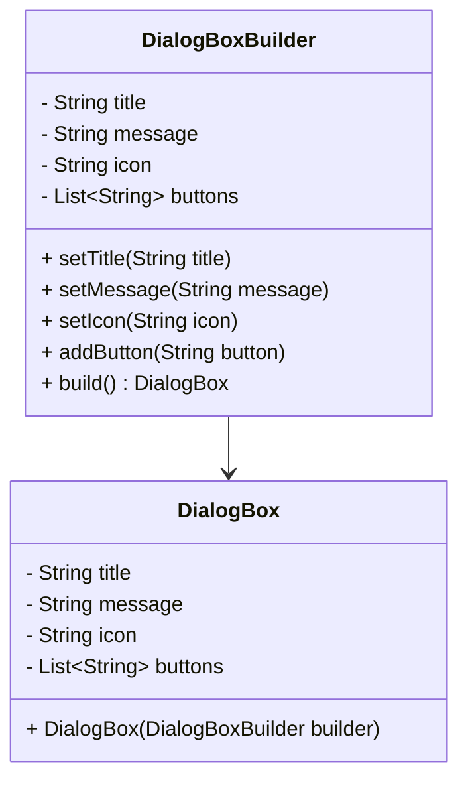

## 3.5.5 Use Cases and Examples

The Builder pattern is a powerful creational design pattern that allows for the step-by-step construction of complex objects. It is particularly useful when dealing with objects that require numerous parameters or have complex setup processes. In this section, we will explore several real-world examples where the Builder pattern shines, such as building complex GUI components, creating HTTP requests with multiple headers and parameters, and constructing complex domain objects with numerous optional attributes.

### Why Use the Builder Pattern?

Before delving into examples, let's briefly discuss why the Builder pattern is suitable for these scenarios:

1. **Improved Code Clarity**: The Builder pattern separates the construction of a complex object from its representation, making the code easier to understand and maintain.
2. **Immutability**: By using the Builder pattern, we can create immutable objects, which are inherently thread-safe and easier to reason about.
3. **Ease of Object Construction**: The pattern simplifies the creation of objects with numerous parameters, especially when many of them are optional.

### Real-World Example 1: Building Complex GUI Components

Graphical User Interfaces (GUIs) often involve complex components with numerous attributes, such as buttons, text fields, and panels. The Builder pattern can be used to construct these components in a flexible and readable manner.

#### Code Example: Building a Custom Dialog Box

Let's consider a scenario where we need to build a custom dialog box with optional attributes like title, message, buttons, and an icon.

```java
public class DialogBox {
    private final String title;
    private final String message;
    private final String icon;
    private final List<String> buttons;

    private DialogBox(DialogBoxBuilder builder) {
        this.title = builder.title;
        this.message = builder.message;
        this.icon = builder.icon;
        this.buttons = builder.buttons;
    }

    public static class DialogBoxBuilder {
        private String title;
        private String message;
        private String icon;
        private List<String> buttons = new ArrayList<>();

        public DialogBoxBuilder setTitle(String title) {
            this.title = title;
            return this;
        }

        public DialogBoxBuilder setMessage(String message) {
            this.message = message;
            return this;
        }

        public DialogBoxBuilder setIcon(String icon) {
            this.icon = icon;
            return this;
        }

        public DialogBoxBuilder addButton(String button) {
            this.buttons.add(button);
            return this;
        }

        public DialogBox build() {
            return new DialogBox(this);
        }
    }

    @Override
    public String toString() {
        return "DialogBox{" +
                "title='" + title + '\'' +
                ", message='" + message + '\'' +
                ", icon='" + icon + '\'' +
                ", buttons=" + buttons +
                '}';
    }
}

// Usage
DialogBox dialog = new DialogBox.DialogBoxBuilder()
        .setTitle("Warning")
        .setMessage("Are you sure you want to exit?")
        .setIcon("warning.png")
        .addButton("Yes")
        .addButton("No")
        .build();

System.out.println(dialog);
```

In this example, the `DialogBoxBuilder` class allows us to construct a `DialogBox` object step-by-step. Each method in the builder returns the builder itself, enabling method chaining for a fluent interface.

### Real-World Example 2: Creating HTTP Requests

HTTP requests often require multiple headers, parameters, and configurations. The Builder pattern can help manage this complexity by providing a clear and flexible way to construct requests.

#### Code Example: Building an HTTP Request

Consider a scenario where we need to create an HTTP request with various headers and parameters.

```java
public class HttpRequest {
    private final String method;
    private final String url;
    private final Map<String, String> headers;
    private final Map<String, String> parameters;

    private HttpRequest(HttpRequestBuilder builder) {
        this.method = builder.method;
        this.url = builder.url;
        this.headers = builder.headers;
        this.parameters = builder.parameters;
    }

    public static class HttpRequestBuilder {
        private String method;
        private String url;
        private Map<String, String> headers = new HashMap<>();
        private Map<String, String> parameters = new HashMap<>();

        public HttpRequestBuilder setMethod(String method) {
            this.method = method;
            return this;
        }

        public HttpRequestBuilder setUrl(String url) {
            this.url = url;
            return this;
        }

        public HttpRequestBuilder addHeader(String key, String value) {
            this.headers.put(key, value);
            return this;
        }

        public HttpRequestBuilder addParameter(String key, String value) {
            this.parameters.put(key, value);
            return this;
        }

        public HttpRequest build() {
            return new HttpRequest(this);
        }
    }

    @Override
    public String toString() {
        return "HttpRequest{" +
                "method='" + method + '\'' +
                ", url='" + url + '\'' +
                ", headers=" + headers +
                ", parameters=" + parameters +
                '}';
    }
}

// Usage
HttpRequest request = new HttpRequest.HttpRequestBuilder()
        .setMethod("GET")
        .setUrl("https://api.example.com/data")
        .addHeader("Authorization", "Bearer token")
        .addParameter("query", "java")
        .build();

System.out.println(request);
```

In this example, the `HttpRequestBuilder` class provides methods to set the HTTP method, URL, headers, and parameters, allowing for a flexible and clear construction process.

### Real-World Example 3: Constructing Complex Domain Objects

In many applications, domain objects can have numerous optional attributes. The Builder pattern is ideal for constructing such objects, as it allows for clear and flexible object creation.

#### Code Example: Building a User Profile

Consider a scenario where we need to build a user profile with optional attributes like name, email, phone number, and address.

```java
public class UserProfile {
    private final String name;
    private final String email;
    private final String phoneNumber;
    private final String address;

    private UserProfile(UserProfileBuilder builder) {
        this.name = builder.name;
        this.email = builder.email;
        this.phoneNumber = builder.phoneNumber;
        this.address = builder.address;
    }

    public static class UserProfileBuilder {
        private String name;
        private String email;
        private String phoneNumber;
        private String address;

        public UserProfileBuilder setName(String name) {
            this.name = name;
            return this;
        }

        public UserProfileBuilder setEmail(String email) {
            this.email = email;
            return this;
        }

        public UserProfileBuilder setPhoneNumber(String phoneNumber) {
            this.phoneNumber = phoneNumber;
            return this;
        }

        public UserProfileBuilder setAddress(String address) {
            this.address = address;
            return this;
        }

        public UserProfile build() {
            return new UserProfile(this);
        }
    }

    @Override
    public String toString() {
        return "UserProfile{" +
                "name='" + name + '\'' +
                ", email='" + email + '\'' +
                ", phoneNumber='" + phoneNumber + '\'' +
                ", address='" + address + '\'' +
                '}';
    }
}

// Usage
UserProfile userProfile = new UserProfile.UserProfileBuilder()
        .setName("John Doe")
        .setEmail("john.doe@example.com")
        .setPhoneNumber("123-456-7890")
        .setAddress("123 Main St, Anytown, USA")
        .build();

System.out.println(userProfile);
```

In this example, the `UserProfileBuilder` class allows us to construct a `UserProfile` object with optional attributes, providing flexibility in how the object is created.

### Benefits of Using the Builder Pattern

The Builder pattern offers several benefits, including:

- **Improved Readability**: The pattern provides a clear and fluent interface for constructing objects, making the code easier to read and understand.
- **Flexibility**: It allows for flexible object construction, enabling the creation of objects with optional attributes without the need for multiple constructors.
- **Immutability**: By using the Builder pattern, we can create immutable objects, which are easier to reason about and inherently thread-safe.
- **Separation of Concerns**: The pattern separates the construction of an object from its representation, allowing for greater flexibility and maintainability.

### Try It Yourself

To get a better understanding of the Builder pattern, try modifying the code examples above. For instance, add new attributes to the `DialogBox`, `HttpRequest`, or `UserProfile` classes, and update the builder classes accordingly. Experiment with different combinations of attributes to see how the Builder pattern simplifies the construction process.

### Visualizing the Builder Pattern

To further enhance your understanding, let's visualize the Builder pattern using a class diagram.



In this diagram, we can see the relationship between the `DialogBox` and `DialogBoxBuilder` classes. The builder class is responsible for constructing the `DialogBox` object, providing methods to set each attribute.

### References and Links

For further reading on the Builder pattern and its applications, consider the following resources:

- [Design Patterns: Elements of Reusable Object-Oriented Software](https://www.amazon.com/Design-Patterns-Elements-Reusable-Object-Oriented/dp/0201633612) by Erich Gamma, Richard Helm, Ralph Johnson, and John Vlissides.
- [Effective Java](https://www.amazon.com/Effective-Java-Joshua-Bloch/dp/0134685997) by Joshua Bloch.
- [Java Design Patterns](https://refactoring.guru/design-patterns/builder) on Refactoring Guru.

### Knowledge Check

To reinforce your understanding of the Builder pattern, consider the following questions:

1. What are the main benefits of using the Builder pattern?
2. How does the Builder pattern improve code readability and maintainability?
3. In what scenarios is the Builder pattern particularly useful?
4. How does the Builder pattern support the creation of immutable objects?
5. What is the role of the builder class in the Builder pattern?

### Embrace the Journey

Remember, this is just the beginning. As you progress, you'll discover more ways to apply the Builder pattern to simplify complex object construction in your projects. Keep experimenting, stay curious, and enjoy the journey!

## Quiz Time!



### What is a primary benefit of using the Builder pattern?

- [x] Improved code readability and maintainability
- [ ] Faster execution time
- [ ] Reduced memory usage
- [ ] Simplified inheritance structures

> **Explanation:** The Builder pattern improves code readability and maintainability by providing a clear and fluent interface for constructing complex objects.

### Which of the following scenarios is the Builder pattern most suitable for?

- [x] Constructing objects with numerous optional parameters
- [ ] Implementing simple data structures
- [ ] Managing database connections
- [ ] Handling user input validation

> **Explanation:** The Builder pattern is particularly useful for constructing objects with numerous optional parameters, as it allows for flexible and clear object creation.

### How does the Builder pattern support immutability?

- [x] By constructing objects with final fields
- [ ] By using synchronized methods
- [ ] By implementing the Cloneable interface
- [ ] By using static methods

> **Explanation:** The Builder pattern supports immutability by constructing objects with final fields, ensuring that the object's state cannot be changed after construction.

### What is the role of the builder class in the Builder pattern?

- [x] To construct and assemble the parts of a complex object
- [ ] To manage object serialization
- [ ] To handle object destruction
- [ ] To implement object cloning

> **Explanation:** The builder class is responsible for constructing and assembling the parts of a complex object, providing methods to set each attribute.

### In the provided examples, which method allows for method chaining in the Builder pattern?

- [x] Returning the builder instance from each setter method
- [ ] Using static methods
- [ ] Implementing the Cloneable interface
- [ ] Using synchronized methods

> **Explanation:** Method chaining is achieved by returning the builder instance from each setter method, allowing for a fluent interface.

### What is a key advantage of using the Builder pattern for constructing HTTP requests?

- [x] It allows for flexible and clear construction of requests with multiple headers and parameters
- [ ] It reduces network latency
- [ ] It simplifies error handling
- [ ] It enhances security

> **Explanation:** The Builder pattern allows for flexible and clear construction of HTTP requests with multiple headers and parameters, improving code readability and maintainability.

### How does the Builder pattern enhance the construction of complex domain objects?

- [x] By providing a clear and flexible way to construct objects with optional attributes
- [ ] By reducing the number of classes needed
- [ ] By simplifying inheritance hierarchies
- [ ] By improving runtime performance

> **Explanation:** The Builder pattern provides a clear and flexible way to construct complex domain objects with optional attributes, making the code easier to read and maintain.

### Which design principle does the Builder pattern exemplify?

- [x] Separation of concerns
- [ ] Single responsibility principle
- [ ] Open/closed principle
- [ ] Dependency inversion principle

> **Explanation:** The Builder pattern exemplifies the separation of concerns by separating the construction of an object from its representation.

### What is the purpose of the `build()` method in the Builder pattern?

- [x] To finalize the construction and return the complex object
- [ ] To initialize the builder instance
- [ ] To validate input parameters
- [ ] To reset the builder state

> **Explanation:** The `build()` method finalizes the construction process and returns the complex object that has been assembled by the builder.

### True or False: The Builder pattern can be used to create mutable objects.

- [x] True
- [ ] False

> **Explanation:** While the Builder pattern is often used to create immutable objects, it can also be used to create mutable objects if desired.


