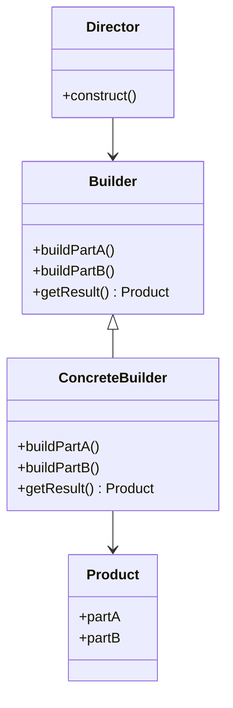
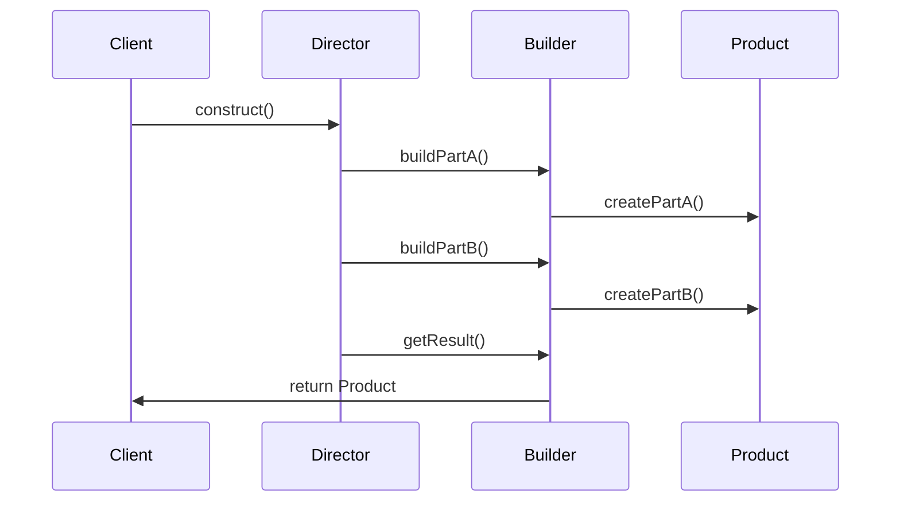

## 3.5 Builder Pattern

In the realm of software design, constructing complex objects can often become cumbersome and error-prone, especially when dealing with numerous parameters. The Builder Pattern offers a solution by separating the construction of a complex object from its representation, allowing the same construction process to create different representations. This pattern is particularly useful in scenarios where an object can be created with various configurations.

### Understanding the Builder Pattern

The Builder Pattern is a creational design pattern that provides a flexible solution to the problem of creating complex objects. It allows for the step-by-step construction of objects, ensuring that the process is both clear and manageable. The pattern is particularly beneficial when an object needs to be created with multiple optional parameters or when the construction process involves several steps.

#### The Problem It Solves

Consider a scenario where you need to create an object with numerous parameters, some of which are optional. Using a constructor with a long list of parameters can lead to code that is difficult to read and maintain. Moreover, the order of parameters becomes crucial, increasing the risk of errors. The Builder Pattern addresses this issue by allowing the construction process to be broken down into discrete steps, each of which can be configured independently.

### Structure of the Builder Pattern

The Builder Pattern typically involves the following components:

- **Builder**: An interface or abstract class defining the steps to build the product.
- **Concrete Builder**: A class that implements the Builder interface and provides specific implementations for the construction steps.
- **Director**: An optional component that controls the construction process, using the Builder interface.
- **Product**: The complex object that is being constructed.

#### UML Diagram

To better understand the interaction between these components, let's visualize them using a UML diagram:



In this diagram, the `Director` uses the `Builder` interface to construct a `Product`. The `ConcreteBuilder` provides the actual implementation of the construction steps, and the `Product` is the final object that results from this process.

### Implementing the Builder Pattern in Java

Let's dive into a practical implementation of the Builder Pattern in Java. We'll create a `House` class with various optional features, demonstrating how the Builder Pattern can simplify the construction process.

#### Step 1: Define the Product

First, we define the `House` class, which represents the complex object we want to build.

```java
public class House {
    private String foundation;
    private String structure;
    private String roof;
    private boolean hasGarage;
    private boolean hasSwimmingPool;
    private boolean hasGarden;

    // Private constructor to enforce object creation through the builder
    private House(HouseBuilder builder) {
        this.foundation = builder.foundation;
        this.structure = builder.structure;
        this.roof = builder.roof;
        this.hasGarage = builder.hasGarage;
        this.hasSwimmingPool = builder.hasSwimmingPool;
        this.hasGarden = builder.hasGarden;
    }

    // Getters for the attributes
    public String getFoundation() { return foundation; }
    public String getStructure() { return structure; }
    public String getRoof() { return roof; }
    public boolean hasGarage() { return hasGarage; }
    public boolean hasSwimmingPool() { return hasSwimmingPool; }
    public boolean hasGarden() { return hasGarden; }

    @Override
    public String toString() {
        return "House [foundation=" + foundation + ", structure=" + structure + ", roof=" + roof
                + ", hasGarage=" + hasGarage + ", hasSwimmingPool=" + hasSwimmingPool
                + ", hasGarden=" + hasGarden + "]";
    }
}
```

#### Step 2: Create the Builder

Next, we create the `HouseBuilder` class, which will be responsible for constructing the `House` object.

```java
public class HouseBuilder {
    public String foundation;
    public String structure;
    public String roof;
    public boolean hasGarage;
    public boolean hasSwimmingPool;
    public boolean hasGarden;

    public HouseBuilder setFoundation(String foundation) {
        this.foundation = foundation;
        return this;
    }

    public HouseBuilder setStructure(String structure) {
        this.structure = structure;
        return this;
    }

    public HouseBuilder setRoof(String roof) {
        this.roof = roof;
        return this;
    }

    public HouseBuilder setGarage(boolean hasGarage) {
        this.hasGarage = hasGarage;
        return this;
    }

    public HouseBuilder setSwimmingPool(boolean hasSwimmingPool) {
        this.hasSwimmingPool = hasSwimmingPool;
        return this;
    }

    public HouseBuilder setGarden(boolean hasGarden) {
        this.hasGarden = hasGarden;
        return this;
    }

    public House build() {
        return new House(this);
    }
}
```

#### Step 3: Use the Builder

Finally, we use the `HouseBuilder` to construct a `House` object.

```java
public class BuilderPatternDemo {
    public static void main(String[] args) {
        House house = new HouseBuilder()
                .setFoundation("Concrete")
                .setStructure("Wood")
                .setRoof("Tiles")
                .setGarage(true)
                .setSwimmingPool(true)
                .setGarden(false)
                .build();

        System.out.println(house);
    }
}
```

### Advantages of the Builder Pattern

The Builder Pattern offers several benefits, particularly when dealing with complex objects:

- **Improved Readability**: The construction process is broken down into clear, manageable steps, making the code easier to read and understand.
- **Flexibility**: Different configurations of the same object can be created using the same construction process.
- **Maintainability**: Changes to the construction process or the object structure can be made with minimal impact on client code.
- **Encapsulation**: The construction logic is encapsulated within the builder, reducing the complexity exposed to the client.

### Practical Implementation Strategies

When implementing the Builder Pattern, consider the following strategies to maximize its effectiveness:

- **Fluent Interface**: Use method chaining to create a fluent interface, allowing the client to specify the construction steps in a natural, readable manner.
- **Immutable Objects**: Ensure that the constructed object is immutable by making its fields final and providing no setters.
- **Optional Director**: Use a `Director` class to manage the construction process when it involves a fixed sequence of steps.

### Variations of the Builder Pattern

The Builder Pattern can be adapted to suit different needs and contexts. Some common variations include:

- **Inner Builder Class**: Define the builder as a static inner class within the product class, providing a more cohesive design.
- **Multiple Builders**: Use multiple builders to construct different parts of a complex object, each responsible for a specific aspect.
- **Parameterized Builders**: Allow builders to accept parameters that influence the construction process, providing additional flexibility.

### Common Scenarios for the Builder Pattern

The Builder Pattern is particularly advantageous in the following scenarios:

- **Complex Object Construction**: When an object requires a complex construction process with multiple optional parameters.
- **Immutable Objects**: When creating immutable objects with a large number of attributes.
- **Step-by-Step Construction**: When the construction process involves several steps that need to be executed in a specific order.

### Visualizing the Builder Pattern

To further illustrate the Builder Pattern, let's consider a sequence diagram that demonstrates the interaction between the components during the construction process.



In this sequence diagram, the `Client` initiates the construction process by calling the `construct()` method on the `Director`. The `Director` then orchestrates the construction steps by interacting with the `Builder`, which in turn creates the parts of the `Product`.

### Try It Yourself

Experiment with the Builder Pattern by modifying the code examples provided. Consider adding new features to the `House` class, such as a `fireplace` or `solar panels`, and update the `HouseBuilder` accordingly. Observe how the pattern allows you to easily extend the construction process without impacting existing code.

### Knowledge Check

To reinforce your understanding of the Builder Pattern, consider the following questions:

- What are the main components of the Builder Pattern, and what roles do they play?
- How does the Builder Pattern improve code readability and maintainability?
- In what scenarios is the Builder Pattern particularly useful?
- How can the Builder Pattern be adapted to suit different needs and contexts?

### Conclusion

The Builder Pattern is a powerful tool for constructing complex objects in a flexible and maintainable manner. By separating the construction process from the object's representation, it allows developers to create objects with varying configurations using the same process. As you continue to explore design patterns, consider how the Builder Pattern can be applied to your projects to enhance code quality and maintainability.

## Quiz Time!



### What is the primary purpose of the Builder Pattern?

- [x] To separate the construction of a complex object from its representation.
- [ ] To provide a single instance of a class.
- [ ] To allow incompatible interfaces to work together.
- [ ] To define a family of algorithms.

> **Explanation:** The Builder Pattern is designed to separate the construction of a complex object from its representation, allowing different configurations to be created using the same construction process.

### Which component in the Builder Pattern is responsible for controlling the construction process?

- [ ] Product
- [ ] Builder
- [x] Director
- [ ] Client

> **Explanation:** The Director is responsible for controlling the construction process, using the Builder interface to create the Product.

### What is a common benefit of using the Builder Pattern?

- [x] Improved readability and maintainability of code.
- [ ] Reduced memory usage.
- [ ] Increased execution speed.
- [ ] Simplified inheritance hierarchies.

> **Explanation:** The Builder Pattern improves readability and maintainability by breaking down the construction process into clear, manageable steps.

### In the Builder Pattern, what role does the Concrete Builder play?

- [ ] It defines the steps to build the product.
- [x] It provides specific implementations for the construction steps.
- [ ] It represents the complex object being constructed.
- [ ] It initiates the construction process.

> **Explanation:** The Concrete Builder provides specific implementations for the construction steps defined by the Builder interface.

### How does the Builder Pattern handle optional parameters in object construction?

- [x] By allowing the construction process to be broken down into discrete steps.
- [ ] By using default values for all parameters.
- [ ] By requiring all parameters to be specified in a constructor.
- [ ] By using inheritance to handle different configurations.

> **Explanation:** The Builder Pattern allows the construction process to be broken down into discrete steps, making it easier to handle optional parameters.

### Which of the following is NOT a component of the Builder Pattern?

- [ ] Builder
- [x] Singleton
- [ ] Director
- [ ] Product

> **Explanation:** The Singleton is not a component of the Builder Pattern. The main components are the Builder, Director, and Product.

### What is a common variation of the Builder Pattern?

- [x] Inner Builder Class
- [ ] Double-Checked Locking
- [ ] Proxy Pattern
- [ ] Observer Pattern

> **Explanation:** A common variation of the Builder Pattern is the Inner Builder Class, where the builder is defined as a static inner class within the product class.

### In what scenario is the Builder Pattern particularly advantageous?

- [x] When constructing complex objects with multiple optional parameters.
- [ ] When ensuring a class has only one instance.
- [ ] When allowing incompatible interfaces to work together.
- [ ] When defining a family of interchangeable algorithms.

> **Explanation:** The Builder Pattern is particularly advantageous when constructing complex objects with multiple optional parameters.

### How does the Builder Pattern improve encapsulation?

- [x] By encapsulating the construction logic within the builder.
- [ ] By using private constructors.
- [ ] By reducing the number of classes.
- [ ] By using interfaces for all components.

> **Explanation:** The Builder Pattern improves encapsulation by encapsulating the construction logic within the builder, reducing the complexity exposed to the client.

### True or False: The Builder Pattern is useful for creating immutable objects.

- [x] True
- [ ] False

> **Explanation:** True. The Builder Pattern is useful for creating immutable objects by allowing the construction process to be controlled and ensuring that the final object is fully initialized before being used.


