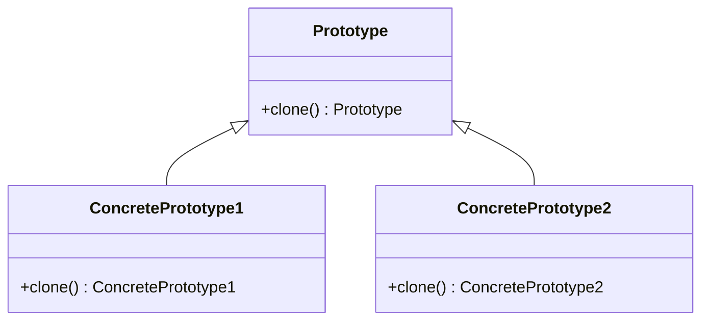

## 3.6.1 Implementing Prototype in Java

In the realm of software design patterns, the Prototype pattern stands out for its unique approach to object creation. This pattern is particularly useful when the cost of creating a new instance of a class is more expensive than copying an existing instance. In Java, the Prototype pattern is implemented using the `Cloneable` interface and the `clone()` method. This section will guide you through the intricacies of implementing the Prototype pattern in Java, providing insights into cloning methods, handling exceptions, and best practices.

### Understanding Java's `Cloneable` Interface and `clone()` Method

The `Cloneable` interface is a marker interface in Java, which means it does not contain any methods. Its primary purpose is to indicate that a class allows its objects to be cloned. The actual cloning process is performed by the `clone()` method, which is defined in the `Object` class.

```java
public class Example implements Cloneable {
    @Override
    protected Object clone() throws CloneNotSupportedException {
        return super.clone();
    }
}
```

In this example, the `Example` class implements `Cloneable` and overrides the `clone()` method. By calling `super.clone()`, we leverage the default cloning mechanism provided by the `Object` class, which performs a shallow copy of the object.

### Implementing the `clone()` Method Correctly

To implement the `clone()` method correctly, follow these guidelines:

1. **Implement the `Cloneable` Interface**: Ensure your class implements the `Cloneable` interface. This is crucial because the `clone()` method in the `Object` class checks whether the object is an instance of a class that implements `Cloneable`. If not, it throws a `CloneNotSupportedException`.

2. **Override the `clone()` Method**: Override the `clone()` method in your class to call `super.clone()`. This method returns a shallow copy of the object.

3. **Handle `CloneNotSupportedException`**: Since `clone()` throws `CloneNotSupportedException`, you must handle or declare this exception.

4. **Customize Cloning**: If your class contains mutable fields or references to other objects, consider customizing the `clone()` method to perform a deep copy.

### Overriding `clone()` in Subclasses

When dealing with inheritance, it's essential to override the `clone()` method in subclasses to ensure that the cloning process is appropriate for the subclass's fields. Here's an example:

```java
class BaseClass implements Cloneable {
    int baseValue;

    @Override
    protected Object clone() throws CloneNotSupportedException {
        return super.clone();
    }
}

class SubClass extends BaseClass {
    int subValue;

    @Override
    protected Object clone() throws CloneNotSupportedException {
        SubClass cloned = (SubClass) super.clone();
        // Customize cloning for SubClass if needed
        return cloned;
    }
}
```

In this example, `SubClass` overrides the `clone()` method to ensure that any additional fields or custom behavior are handled during cloning.

### Handling `CloneNotSupportedException`

The `CloneNotSupportedException` is a checked exception that must be handled or declared in the method signature. This exception is thrown if the object's class does not implement the `Cloneable` interface. Here's how you can handle it:

```java
try {
    SubClass obj = new SubClass();
    SubClass clonedObj = (SubClass) obj.clone();
} catch (CloneNotSupportedException e) {
    e.printStackTrace();
}
```

### Shallow Copy vs. Deep Copy

Understanding the difference between shallow and deep copies is crucial when implementing the Prototype pattern.

#### Shallow Copy

A shallow copy of an object is a new instance where the fields of the object are copied as they are. If the field is a reference to an object, only the reference is copied, not the actual object. This means both the original and the cloned object will refer to the same instance.

```java
class ShallowCopyExample implements Cloneable {
    int[] data;

    public ShallowCopyExample(int[] data) {
        this.data = data;
    }

    @Override
    protected Object clone() throws CloneNotSupportedException {
        return super.clone();
    }
}

public class Main {
    public static void main(String[] args) throws CloneNotSupportedException {
        int[] data = {1, 2, 3};
        ShallowCopyExample original = new ShallowCopyExample(data);
        ShallowCopyExample cloned = (ShallowCopyExample) original.clone();

        System.out.println(original.data == cloned.data); // true
    }
}
```

In this example, both `original` and `cloned` share the same `data` array.

#### Deep Copy

A deep copy involves creating a new instance of the object and recursively copying all objects referenced by the fields. This ensures that the cloned object is entirely independent of the original.

```java
class DeepCopyExample implements Cloneable {
    int[] data;

    public DeepCopyExample(int[] data) {
        this.data = data;
    }

    @Override
    protected Object clone() throws CloneNotSupportedException {
        DeepCopyExample cloned = (DeepCopyExample) super.clone();
        cloned.data = data.clone(); // Create a new array
        return cloned;
    }
}

public class Main {
    public static void main(String[] args) throws CloneNotSupportedException {
        int[] data = {1, 2, 3};
        DeepCopyExample original = new DeepCopyExample(data);
        DeepCopyExample cloned = (DeepCopyExample) original.clone();

        System.out.println(original.data == cloned.data); // false
    }
}
```

Here, the `clone()` method creates a new array for the `data` field, ensuring that `original` and `cloned` do not share the same array.

### Best Practices and Common Pitfalls

When implementing the Prototype pattern in Java, keep these best practices and common pitfalls in mind:

- **Immutable Objects**: If possible, design your classes to be immutable. Immutable objects are inherently thread-safe and do not require deep copying.

- **Avoid Cloning Complex Objects**: Cloning complex objects with intricate relationships can lead to subtle bugs. Consider using other design patterns, like the Factory pattern, if cloning becomes too complex.

- **Beware of Circular References**: When performing deep copies, be cautious of circular references, which can lead to infinite loops.

- **Use Serialization for Deep Copy**: For complex objects, consider using serialization to create deep copies. This approach involves serializing the object to a byte stream and then deserializing it back to a new object.

### Try It Yourself

To deepen your understanding of the Prototype pattern, try modifying the code examples provided:

- **Experiment with Mutable Fields**: Add mutable fields to the `ShallowCopyExample` and observe how changes to the original object affect the clone.

- **Implement a Deep Copy for a Complex Object**: Create a class with multiple fields, including collections and nested objects, and implement a deep copy mechanism.

- **Use Serialization for Cloning**: Implement a deep copy using Java's serialization mechanism and compare it with the manual deep copy approach.

### Visualizing the Prototype Pattern

To better understand the Prototype pattern, let's visualize the process of cloning objects using a class diagram.



In this diagram, `Prototype` is the interface with the `clone()` method, and `ConcretePrototype1` and `ConcretePrototype2` are classes that implement this interface.

### References and Further Reading

For more information on the Prototype pattern and object cloning in Java, consider the following resources:

- [Java Documentation on `Cloneable`](https://docs.oracle.com/javase/8/docs/api/java/lang/Cloneable.html)
- [Effective Java by Joshua Bloch](https://www.oreilly.com/library/view/effective-java-3rd/9780134686097/)
- [Design Patterns: Elements of Reusable Object-Oriented Software by Erich Gamma, Richard Helm, Ralph Johnson, John Vlissides](https://www.amazon.com/Design-Patterns-Elements-Reusable-Object-Oriented/dp/0201633612)

### Knowledge Check

To reinforce your understanding of the Prototype pattern, consider these questions:

- What is the primary purpose of the `Cloneable` interface in Java?
- How does a shallow copy differ from a deep copy?
- What are some potential pitfalls of cloning complex objects?
- How can serialization be used to implement a deep copy?

### Embrace the Journey

Remember, mastering design patterns like Prototype is a journey. As you continue to explore and implement these patterns, you'll gain a deeper understanding of their nuances and applications. Keep experimenting, stay curious, and enjoy the process of becoming a more proficient software engineer.

## Quiz Time!



### What is the primary purpose of the `Cloneable` interface in Java?

- [x] To indicate that a class allows its objects to be cloned.
- [ ] To provide a method for deep copying objects.
- [ ] To enforce implementation of the `clone()` method.
- [ ] To automatically handle `CloneNotSupportedException`.

> **Explanation:** The `Cloneable` interface is a marker interface that indicates a class allows its objects to be cloned using the `clone()` method.

### How does a shallow copy differ from a deep copy?

- [x] A shallow copy copies object references, while a deep copy duplicates the objects themselves.
- [ ] A shallow copy duplicates the objects, while a deep copy copies object references.
- [ ] Both shallow and deep copies duplicate objects.
- [ ] Both shallow and deep copies copy object references.

> **Explanation:** A shallow copy copies the references to objects, meaning the original and the clone share the same instances. A deep copy duplicates the objects, creating independent instances.

### What exception must be handled or declared when using the `clone()` method?

- [x] `CloneNotSupportedException`
- [ ] `IOException`
- [ ] `NullPointerException`
- [ ] `IllegalArgumentException`

> **Explanation:** The `clone()` method throws `CloneNotSupportedException` if the object's class does not implement the `Cloneable` interface.

### Which of the following is a common pitfall when cloning objects in Java?

- [x] Cloning objects with circular references can lead to infinite loops.
- [ ] Cloning immutable objects is complex and error-prone.
- [ ] Cloning objects always results in deep copies.
- [ ] Cloning objects automatically handles all exceptions.

> **Explanation:** Cloning objects with circular references can lead to infinite loops during deep copying. Cloning immutable objects is straightforward, and cloning does not automatically result in deep copies.

### What is a benefit of using serialization for deep copying?

- [x] It simplifies the deep copy process for complex objects.
- [ ] It automatically handles all exceptions.
- [ ] It ensures objects are always cloned as shallow copies.
- [ ] It reduces the need for implementing `Cloneable`.

> **Explanation:** Serialization simplifies the deep copy process for complex objects by serializing and deserializing them, creating independent instances.

### Why is it important to override the `clone()` method in subclasses?

- [x] To ensure that subclass-specific fields are correctly cloned.
- [ ] To prevent the superclass's `clone()` method from being called.
- [ ] To avoid handling `CloneNotSupportedException`.
- [ ] To automatically perform deep copying.

> **Explanation:** Overriding the `clone()` method in subclasses ensures that any additional fields or custom behavior specific to the subclass are correctly handled during cloning.

### What is a marker interface in Java?

- [x] An interface with no methods that indicates a special property of a class.
- [ ] An interface with one method that must be implemented.
- [ ] An interface that provides default method implementations.
- [ ] An interface that enforces a specific design pattern.

> **Explanation:** A marker interface, like `Cloneable`, has no methods and serves to indicate a special property or capability of a class.

### How can you customize the cloning process for a class with mutable fields?

- [x] Override the `clone()` method to perform a deep copy of mutable fields.
- [ ] Use the default `clone()` method from the `Object` class.
- [ ] Implement a separate interface for deep copying.
- [ ] Avoid implementing `Cloneable`.

> **Explanation:** To customize cloning for a class with mutable fields, override the `clone()` method to perform a deep copy of those fields.

### What is the result of calling `super.clone()` in the `clone()` method?

- [x] It creates a shallow copy of the object.
- [ ] It creates a deep copy of the object.
- [ ] It throws a `CloneNotSupportedException`.
- [ ] It returns a null reference.

> **Explanation:** Calling `super.clone()` creates a shallow copy of the object, copying the fields as they are, including references.

### True or False: Implementing the `Cloneable` interface automatically provides a deep copy mechanism.

- [ ] True
- [x] False

> **Explanation:** Implementing the `Cloneable` interface does not automatically provide a deep copy mechanism. It only indicates that the class allows its objects to be cloned, and the default `clone()` method performs a shallow copy.


