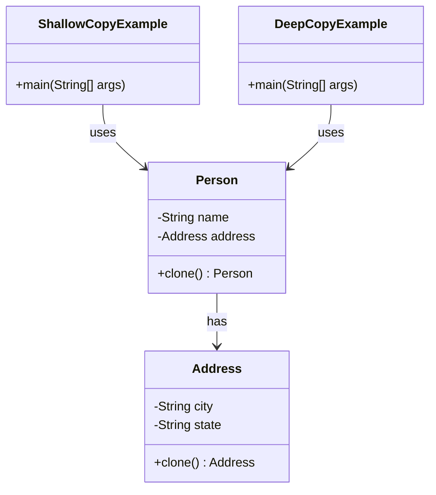

## 3.6.2 Shallow vs. Deep Copy in Java

In the realm of Java programming, understanding the nuances of object copying is crucial, especially when dealing with complex data structures. This section delves into the concepts of shallow and deep copying, their differences, and how they are applied within the Prototype pattern. We will explore practical examples, potential pitfalls, and strategies for implementing these copies effectively in Java.

### Understanding Shallow and Deep Copy

#### Shallow Copy

A shallow copy of an object is a new instance where the fields of the original object are copied to the new instance. However, if the field is a reference to an object, only the reference is copied, not the object itself. This means that both the original and the copied object share the same reference for any non-primitive fields.

**Key Characteristics of Shallow Copy:**
- Primitive data types are copied directly.
- Object references are copied, not the objects themselves.
- Changes to mutable objects in the copied instance reflect in the original instance.

#### Deep Copy

A deep copy, on the other hand, involves creating a new instance of the original object and recursively copying all objects referenced by the fields of the original object. This means that the copied object is completely independent of the original object.

**Key Characteristics of Deep Copy:**
- Both primitive data types and objects are copied.
- Each object referenced by the original object is also copied.
- Changes to mutable objects in the copied instance do not affect the original instance.

### Code Examples: Shallow and Deep Copy in Java

Let's illustrate these concepts with Java code examples.

#### Shallow Copy Example

Consider a simple class `Person` with a `name` and an `Address` object.

```java
class Address {
    String city;
    String state;

    Address(String city, String state) {
        this.city = city;
        this.state = state;
    }
}

class Person implements Cloneable {
    String name;
    Address address;

    Person(String name, Address address) {
        this.name = name;
        this.address = address;
    }

    // Shallow copy using clone method
    @Override
    protected Object clone() throws CloneNotSupportedException {
        return super.clone();
    }
}

public class ShallowCopyExample {
    public static void main(String[] args) {
        try {
            Address address = new Address("New York", "NY");
            Person person1 = new Person("John Doe", address);
            Person person2 = (Person) person1.clone();

            System.out.println("Before modification:");
            System.out.println("Person1 Address: " + person1.address.city);
            System.out.println("Person2 Address: " + person2.address.city);

            // Modify the address of person2
            person2.address.city = "Los Angeles";

            System.out.println("After modification:");
            System.out.println("Person1 Address: " + person1.address.city);
            System.out.println("Person2 Address: " + person2.address.city);
        } catch (CloneNotSupportedException e) {
            e.printStackTrace();
        }
    }
}
```

**Output Explanation:**
- Before modification, both `person1` and `person2` have the same address.
- After modifying `person2`'s address, `person1`'s address also changes, demonstrating that both objects share the same reference.

#### Deep Copy Example

To achieve a deep copy, we need to manually copy each object referenced by the original object.

```java
class Address implements Cloneable {
    String city;
    String state;

    Address(String city, String state) {
        this.city = city;
        this.state = state;
    }

    @Override
    protected Object clone() throws CloneNotSupportedException {
        return new Address(this.city, this.state);
    }
}

class Person implements Cloneable {
    String name;
    Address address;

    Person(String name, Address address) {
        this.name = name;
        this.address = address;
    }

    // Deep copy using clone method
    @Override
    protected Object clone() throws CloneNotSupportedException {
        Person cloned = (Person) super.clone();
        cloned.address = (Address) address.clone();
        return cloned;
    }
}

public class DeepCopyExample {
    public static void main(String[] args) {
        try {
            Address address = new Address("New York", "NY");
            Person person1 = new Person("John Doe", address);
            Person person2 = (Person) person1.clone();

            System.out.println("Before modification:");
            System.out.println("Person1 Address: " + person1.address.city);
            System.out.println("Person2 Address: " + person2.address.city);

            // Modify the address of person2
            person2.address.city = "Los Angeles";

            System.out.println("After modification:");
            System.out.println("Person1 Address: " + person1.address.city);
            System.out.println("Person2 Address: " + person2.address.city);
        } catch (CloneNotSupportedException e) {
            e.printStackTrace();
        }
    }
}
```

**Output Explanation:**
- Before modification, both `person1` and `person2` have the same address.
- After modifying `person2`'s address, `person1`'s address remains unchanged, demonstrating that each object has its own copy of the address.

### When to Use Shallow Copy vs. Deep Copy

The choice between shallow and deep copy depends on the specific requirements of your application:

- **Shallow Copy**: Use when the object has immutable fields or when shared references are acceptable. It is faster and consumes less memory.
- **Deep Copy**: Use when you need complete independence between the original and copied objects. It is necessary when dealing with mutable objects that should not share state.

### Potential Issues with Object Cloning

#### Complex Object Graphs

When dealing with complex object graphs, shallow copying can lead to unintended side effects due to shared references. Deep copying can become cumbersome and error-prone if not handled correctly.

#### Circular References

Objects with circular references can pose challenges for deep copying. Special care must be taken to avoid infinite loops during the copying process.

### Strategies for Implementing Deep Copies

#### Serialization

One common approach to deep copying is using serialization, which involves converting an object into a byte stream and then back into a new object.

```java
import java.io.*;

class Address implements Serializable {
    String city;
    String state;

    Address(String city, String state) {
        this.city = city;
        this.state = state;
    }
}

class Person implements Serializable {
    String name;
    Address address;

    Person(String name, Address address) {
        this.name = name;
        this.address = address;
    }

    // Deep copy using serialization
    public Person deepCopy() {
        try {
            ByteArrayOutputStream bos = new ByteArrayOutputStream();
            ObjectOutputStream out = new ObjectOutputStream(bos);
            out.writeObject(this);

            ByteArrayInputStream bis = new ByteArrayInputStream(bos.toByteArray());
            ObjectInputStream in = new ObjectInputStream(bis);
            return (Person) in.readObject();
        } catch (IOException | ClassNotFoundException e) {
            e.printStackTrace();
            return null;
        }
    }
}

public class SerializationDeepCopyExample {
    public static void main(String[] args) {
        Address address = new Address("New York", "NY");
        Person person1 = new Person("John Doe", address);
        Person person2 = person1.deepCopy();

        System.out.println("Before modification:");
        System.out.println("Person1 Address: " + person1.address.city);
        System.out.println("Person2 Address: " + person2.address.city);

        // Modify the address of person2
        person2.address.city = "Los Angeles";

        System.out.println("After modification:");
        System.out.println("Person1 Address: " + person1.address.city);
        System.out.println("Person2 Address: " + person2.address.city);
    }
}
```

**Advantages of Serialization:**
- Handles complex object graphs and circular references.
- Requires less manual effort compared to custom cloning methods.

**Disadvantages of Serialization:**
- Slower performance due to I/O operations.
- Requires all classes to implement `Serializable`.

#### Custom Cloning Methods

For more control over the deep copy process, you can implement custom cloning methods tailored to your application's needs. This approach allows you to handle specific cases and optimize performance.

### Visualizing Shallow vs. Deep Copy

To better understand the differences between shallow and deep copy, let's visualize these concepts using a class diagram.



**Diagram Explanation:**
- The `Person` class contains a reference to an `Address` object.
- In a shallow copy, the `Person` object shares the same `Address` reference.
- In a deep copy, the `Person` object has its own `Address` instance.

### Try It Yourself

Experiment with the provided code examples to deepen your understanding of shallow and deep copying. Try modifying the `Address` class to include additional fields or nested objects, and observe how the behavior changes with shallow and deep copies. Consider implementing a custom cloning method for a more complex object graph.

### Knowledge Check

- What is the primary difference between shallow and deep copy?
- How does modifying a mutable object in a shallow copy affect the original object?
- What are some potential issues with deep copying objects?
- Why might serialization be a preferred method for deep copying?
- How can circular references impact the deep copy process?

### Conclusion

Understanding the differences between shallow and deep copying is essential for effective use of the Prototype pattern in Java. By mastering these concepts, you can ensure that your applications handle object copying efficiently and correctly, avoiding common pitfalls and ensuring data integrity.

## Quiz Time!



### What is a shallow copy in Java?

- [x] A copy where only the object references are copied, not the objects themselves.
- [ ] A copy where all objects are recursively copied.
- [ ] A copy that involves serialization.
- [ ] A copy that uses reflection.

> **Explanation:** A shallow copy in Java copies the references to objects, meaning both the original and the copied object share the same references.

### How does a deep copy differ from a shallow copy?

- [x] A deep copy involves recursively copying all objects.
- [ ] A deep copy only copies primitive data types.
- [ ] A deep copy shares references between objects.
- [ ] A deep copy uses reflection.

> **Explanation:** A deep copy creates a new instance for each object, ensuring that no references are shared between the original and the copied object.

### What happens when you modify a mutable object in a shallow copy?

- [x] Changes affect both the original and the copied object.
- [ ] Changes only affect the copied object.
- [ ] Changes only affect the original object.
- [ ] Changes are not possible in a shallow copy.

> **Explanation:** Since a shallow copy shares references, modifying a mutable object affects both the original and the copied object.

### Why might serialization be used for deep copying?

- [x] It handles complex object graphs and circular references.
- [ ] It is the fastest method for copying objects.
- [ ] It does not require implementing `Serializable`.
- [ ] It uses less memory than other methods.

> **Explanation:** Serialization can handle complex object graphs and circular references, making it a robust method for deep copying.

### What is a potential issue with deep copying?

- [x] Handling circular references can be challenging.
- [ ] It always results in shared references.
- [ ] It is faster than shallow copying.
- [ ] It does not require any additional coding.

> **Explanation:** Deep copying can be challenging when dealing with circular references, as it may lead to infinite loops if not handled properly.

### Which method is faster, shallow copy or deep copy?

- [x] Shallow copy
- [ ] Deep copy
- [ ] Both are equally fast
- [ ] It depends on the object size

> **Explanation:** Shallow copy is generally faster because it only copies references, not the objects themselves.

### When should you use a deep copy?

- [x] When you need complete independence between the original and copied objects.
- [ ] When you want to share references between objects.
- [ ] When you are working with immutable objects.
- [ ] When you need to save memory.

> **Explanation:** A deep copy is used when you need the copied object to be completely independent of the original.

### What is a disadvantage of using serialization for deep copying?

- [x] It requires all classes to implement `Serializable`.
- [ ] It is the fastest method available.
- [ ] It does not handle complex object graphs.
- [ ] It always results in shared references.

> **Explanation:** Serialization requires all classes involved to implement `Serializable`, which can be a limitation.

### Can deep copying handle circular references?

- [x] Yes, but it requires careful handling to avoid infinite loops.
- [ ] No, deep copying cannot handle circular references.
- [ ] Yes, without any additional coding.
- [ ] No, only shallow copying can handle circular references.

> **Explanation:** Deep copying can handle circular references, but it requires careful handling to avoid infinite loops.

### True or False: A shallow copy is sufficient when dealing with immutable objects.

- [x] True
- [ ] False

> **Explanation:** A shallow copy is sufficient for immutable objects because their state cannot change, so shared references do not pose a problem.



Remember, mastering the concepts of shallow and deep copying is just the beginning. As you continue to develop your skills, you'll find more complex scenarios where these techniques are invaluable. Keep experimenting, stay curious, and enjoy the journey of becoming a Java expert!
