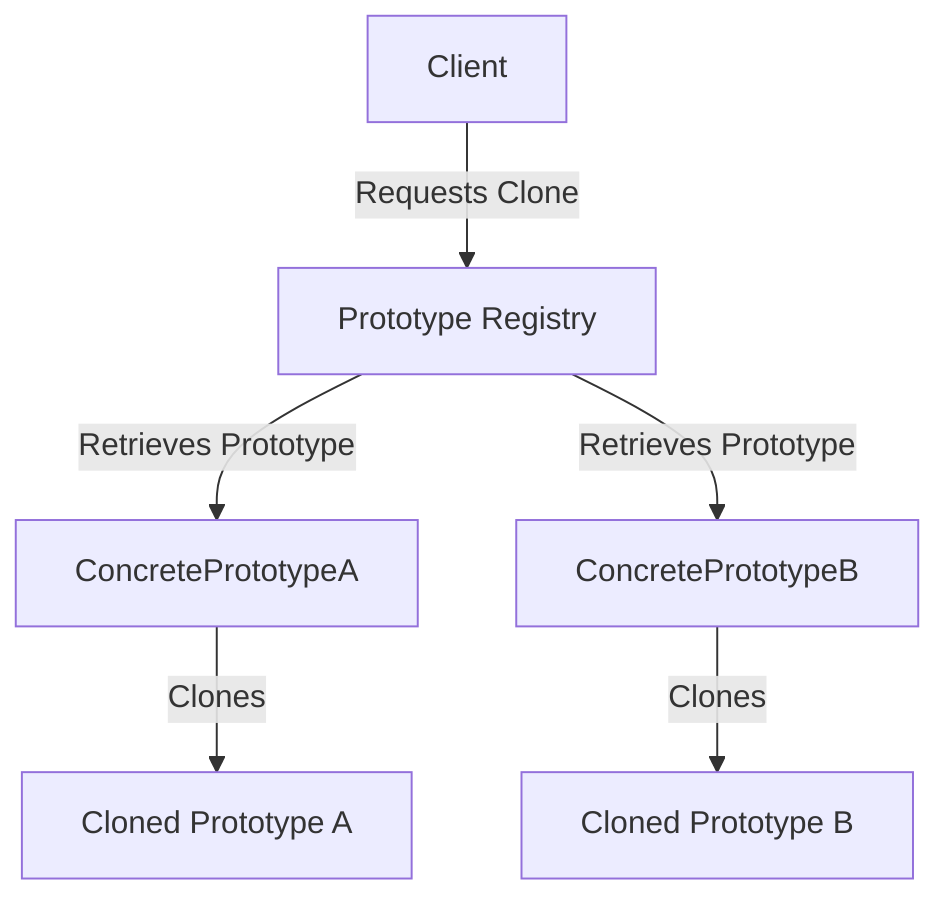

## 3.6.3 Prototype Registry

In the world of software design patterns, the Prototype Pattern stands out for its ability to efficiently create new objects by cloning existing ones, known as prototypes. Within this pattern, the concept of a **Prototype Registry** plays a crucial role. It acts as a repository for managing prototypes, allowing clients to access and clone objects without needing to know their concrete classes. This section delves into the intricacies of the Prototype Registry, its implementation in Java, and the benefits it brings to software development.

### Understanding the Prototype Registry

The Prototype Registry is a centralized repository that stores a collection of prototype objects. These prototypes are pre-configured instances of classes that can be cloned to create new objects. The registry provides an interface for adding, retrieving, and cloning prototypes, thus abstracting the complexity of object creation from the client.

#### Role in the Prototype Pattern

In the Prototype Pattern, the registry serves as a factory for creating objects. Instead of instantiating objects directly, clients request clones of prototypes stored in the registry. This approach decouples the client from the concrete classes of the objects it needs, promoting flexibility and scalability.

### Implementing a Prototype Registry in Java

To implement a Prototype Registry in Java, we typically use a `HashMap` or a similar data structure to store prototypes. Each prototype is associated with a unique key, allowing for easy retrieval and cloning.

#### Step-by-Step Implementation

1. **Define the Prototype Interface**

   The first step is to define a prototype interface that declares a `clone` method. This method will be implemented by concrete classes to perform the cloning operation.

   ```java
   public interface Prototype {
       Prototype clone();
   }
   ```

2. **Create Concrete Prototype Classes**

   Next, we create concrete classes that implement the `Prototype` interface. These classes define the specific behavior of the `clone` method.

   ```java
   public class ConcretePrototypeA implements Prototype {
       private String name;

       public ConcretePrototypeA(String name) {
           this.name = name;
       }

       @Override
       public Prototype clone() {
           return new ConcretePrototypeA(this.name);
       }

       @Override
       public String toString() {
           return "ConcretePrototypeA{name='" + name + "'}";
       }
   }

   public class ConcretePrototypeB implements Prototype {
       private int value;

       public ConcretePrototypeB(int value) {
           this.value = value;
       }

       @Override
       public Prototype clone() {
           return new ConcretePrototypeB(this.value);
       }

       @Override
       public String toString() {
           return "ConcretePrototypeB{value=" + value + "}";
       }
   }
   ```

3. **Implement the Prototype Registry**

   The registry is implemented using a `HashMap` to store prototypes. It provides methods to add, retrieve, and clone prototypes.

   ```java
   import java.util.HashMap;
   import java.util.Map;

   public class PrototypeRegistry {
       private Map<String, Prototype> prototypes = new HashMap<>();

       public void addPrototype(String key, Prototype prototype) {
           prototypes.put(key, prototype);
       }

       public Prototype getPrototype(String key) {
           return prototypes.get(key).clone();
       }
   }
   ```

4. **Using the Prototype Registry**

   Finally, we demonstrate how to use the registry to manage and clone prototypes.

   ```java
   public class PrototypeRegistryDemo {
       public static void main(String[] args) {
           PrototypeRegistry registry = new PrototypeRegistry();

           // Add prototypes to the registry
           registry.addPrototype("A", new ConcretePrototypeA("Prototype A"));
           registry.addPrototype("B", new ConcretePrototypeB(42));

           // Clone prototypes from the registry
           Prototype clonedA = registry.getPrototype("A");
           Prototype clonedB = registry.getPrototype("B");

           System.out.println(clonedA);
           System.out.println(clonedB);
       }
   }
   ```

### Benefits of Using a Prototype Registry

The Prototype Registry offers several advantages in managing object creation:

- **Improved Organization**: By centralizing prototypes in a registry, the system becomes more organized, making it easier to manage and maintain.

- **Scalability**: The registry allows for easy addition of new prototypes, enhancing the system's scalability.

- **Decoupling**: Clients interact with the registry rather than concrete classes, reducing dependencies and promoting flexibility.

- **Efficiency**: Cloning prototypes is often more efficient than creating new instances from scratch, especially for complex objects.

### Best Practices for Maintaining a Prototype Registry

To ensure the effectiveness of a Prototype Registry, consider the following best practices:

- **Consistent Naming**: Use clear and consistent keys for prototypes to avoid confusion and errors.

- **Prototype Updates**: Regularly update prototypes in the registry to reflect changes in requirements or design.

- **Error Handling**: Implement error handling to manage cases where a requested prototype does not exist in the registry.

- **Documentation**: Document the prototypes and their intended use to aid understanding and maintenance.

### Visualizing the Prototype Registry

To better understand the structure and flow of a Prototype Registry, consider the following diagram:



**Diagram Description**: This diagram illustrates how a client interacts with the Prototype Registry to clone prototypes. The registry retrieves the requested prototype and performs the cloning operation, returning the cloned object to the client.

### Try It Yourself

Experiment with the Prototype Registry by modifying the code examples. Try adding new prototype classes, changing the cloning logic, or implementing additional features in the registry. This hands-on approach will deepen your understanding of the Prototype Pattern and its applications.

### Knowledge Check

- **Question**: What is the primary role of a Prototype Registry in the Prototype Pattern?
- **Question**: How does a Prototype Registry improve the scalability of a system?
- **Question**: What data structure is commonly used to implement a Prototype Registry in Java?

### Conclusion

The Prototype Registry is a powerful tool in the Prototype Pattern, offering a structured approach to managing and cloning objects. By centralizing prototypes, it enhances organization, scalability, and efficiency, making it an invaluable asset in software development. As you continue to explore design patterns, remember to apply best practices and experiment with implementations to fully harness their potential.

## Quiz Time!



### What is the primary role of a Prototype Registry in the Prototype Pattern?

- [x] To store and manage prototypes for easy cloning
- [ ] To create new instances from scratch
- [ ] To enforce singleton behavior
- [ ] To manage memory allocation for objects

> **Explanation:** The Prototype Registry stores and manages prototypes, allowing for easy cloning without the need for direct instantiation.

### How does a Prototype Registry improve the scalability of a system?

- [x] By allowing easy addition of new prototypes
- [ ] By reducing memory usage
- [ ] By enforcing strict type checking
- [ ] By minimizing code duplication

> **Explanation:** The Prototype Registry allows for easy addition of new prototypes, enhancing the system's scalability.

### What data structure is commonly used to implement a Prototype Registry in Java?

- [x] HashMap
- [ ] ArrayList
- [ ] LinkedList
- [ ] TreeSet

> **Explanation:** A `HashMap` is commonly used to implement a Prototype Registry due to its efficient key-based retrieval.

### Which method is essential for a class to implement when using the Prototype Pattern?

- [x] clone()
- [ ] toString()
- [ ] equals()
- [ ] hashCode()

> **Explanation:** The `clone()` method is essential for creating copies of prototypes in the Prototype Pattern.

### What is a key benefit of using a Prototype Registry?

- [x] Decoupling clients from concrete classes
- [ ] Enforcing strict access control
- [ ] Reducing the number of classes
- [ ] Simplifying user interfaces

> **Explanation:** The Prototype Registry decouples clients from concrete classes, promoting flexibility and reducing dependencies.

### In the Prototype Pattern, what is the purpose of the `clone()` method?

- [x] To create a new object that is a copy of the prototype
- [ ] To delete a prototype from the registry
- [ ] To update the prototype's state
- [ ] To serialize the prototype

> **Explanation:** The `clone()` method creates a new object that is a copy of the prototype, enabling efficient object creation.

### How can error handling be implemented in a Prototype Registry?

- [x] By checking if a prototype exists before cloning
- [ ] By using a try-catch block around all operations
- [ ] By logging all registry operations
- [ ] By enforcing strict type constraints

> **Explanation:** Error handling can be implemented by checking if a prototype exists in the registry before attempting to clone it.

### What is a potential drawback of using a Prototype Registry?

- [x] Complexity in managing prototype updates
- [ ] Increased memory usage
- [ ] Reduced code readability
- [ ] Limited scalability

> **Explanation:** Managing prototype updates can be complex, requiring careful maintenance to ensure consistency.

### Which of the following is a best practice for maintaining a Prototype Registry?

- [x] Consistent naming of prototypes
- [ ] Frequent clearing of the registry
- [ ] Avoiding documentation
- [ ] Limiting the number of prototypes

> **Explanation:** Consistent naming of prototypes helps avoid confusion and errors, making the registry easier to manage.

### True or False: The Prototype Registry is primarily used to enforce singleton behavior.

- [ ] True
- [x] False

> **Explanation:** The Prototype Registry is not used to enforce singleton behavior; it is used to manage and clone prototypes.


