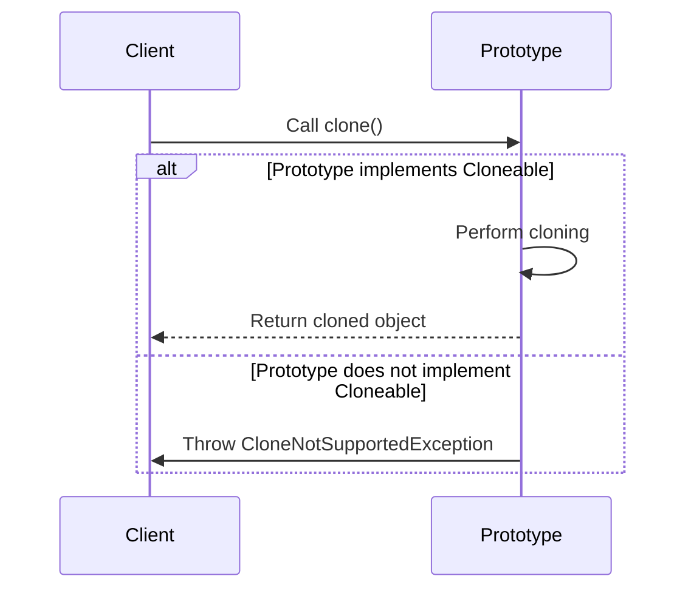

## 3.6.4 Handling `CloneNotSupportedException`

In the realm of Java programming, the Prototype Pattern is a creational design pattern that allows for the creation of new objects by copying an existing object, known as the prototype. This pattern is particularly useful when the cost of creating a new instance of a class is more expensive than copying an existing instance. However, when working with the Prototype Pattern, developers often encounter the `CloneNotSupportedException`. Understanding and handling this exception is crucial for ensuring robust and error-free cloning operations.

### Understanding `CloneNotSupportedException`

`CloneNotSupportedException` is a checked exception in Java that is thrown when an attempt is made to clone an object that does not implement the `Cloneable` interface. The `Cloneable` interface is a marker interface, meaning it does not contain any methods. Its sole purpose is to indicate that a class supports cloning.

#### When is `CloneNotSupportedException` Thrown?

The `CloneNotSupportedException` is thrown in the following scenarios:

1. **Non-Cloneable Classes**: When the `clone()` method is invoked on an object whose class does not implement the `Cloneable` interface.
2. **Improper `clone()` Method Implementation**: Even if a class implements `Cloneable`, if the `clone()` method is not properly overridden, the exception may still be thrown.

### Handling `CloneNotSupportedException`

To handle `CloneNotSupportedException`, developers can use two primary approaches: declaring the `clone()` method with `throws CloneNotSupportedException` or using try-catch blocks. Let's explore these approaches in detail.

#### Declaring `clone()` with `throws CloneNotSupportedException`

One way to handle the exception is by declaring the `clone()` method with `throws CloneNotSupportedException`. This approach allows the exception to propagate up the call stack, where it can be handled by the calling method.

```java
class Prototype implements Cloneable {
    private String name;

    public Prototype(String name) {
        this.name = name;
    }

    @Override
    protected Object clone() throws CloneNotSupportedException {
        return super.clone();
    }

    public String getName() {
        return name;
    }
}

public class Main {
    public static void main(String[] args) {
        try {
            Prototype prototype = new Prototype("Original");
            Prototype clonedPrototype = (Prototype) prototype.clone();
            System.out.println("Cloned Prototype Name: " + clonedPrototype.getName());
        } catch (CloneNotSupportedException e) {
            e.printStackTrace();
        }
    }
}
```

In this example, the `Prototype` class implements `Cloneable`, and the `clone()` method is declared with `throws CloneNotSupportedException`. The `main` method handles the exception using a try-catch block.

#### Using Try-Catch Blocks

Another approach is to handle the exception directly within the method using a try-catch block. This approach is useful when you want to provide specific error handling or logging within the method itself.

```java
class Prototype implements Cloneable {
    private String name;

    public Prototype(String name) {
        this.name = name;
    }

    public Prototype clonePrototype() {
        try {
            return (Prototype) super.clone();
        } catch (CloneNotSupportedException e) {
            e.printStackTrace();
            return null;
        }
    }

    public String getName() {
        return name;
    }
}

public class Main {
    public static void main(String[] args) {
        Prototype prototype = new Prototype("Original");
        Prototype clonedPrototype = prototype.clonePrototype();
        if (clonedPrototype != null) {
            System.out.println("Cloned Prototype Name: " + clonedPrototype.getName());
        } else {
            System.out.println("Cloning failed.");
        }
    }
}
```

In this example, the `clonePrototype()` method handles the `CloneNotSupportedException` internally and returns `null` if cloning fails.

### Alternative Approaches to Cloning

While the `Cloneable` interface and the `clone()` method are the traditional ways to implement cloning in Java, they have several limitations. For instance, the `clone()` method does not call constructors, and it performs a shallow copy by default. Here are some alternative approaches to cloning:

#### Copy Constructors

A copy constructor is a constructor that creates a new object as a copy of an existing object. This approach provides more control over the cloning process and can be used to implement deep copying.

```java
class Prototype {
    private String name;

    public Prototype(String name) {
        this.name = name;
    }

    // Copy constructor
    public Prototype(Prototype prototype) {
        this.name = prototype.name;
    }

    public String getName() {
        return name;
    }
}

public class Main {
    public static void main(String[] args) {
        Prototype prototype = new Prototype("Original");
        Prototype clonedPrototype = new Prototype(prototype);
        System.out.println("Cloned Prototype Name: " + clonedPrototype.getName());
    }
}
```

#### Serialization

Serialization can be used to create a deep copy of an object by serializing it to a byte stream and then deserializing it back into a new object. This approach is useful for objects with complex structures.

```java
import java.io.*;

class Prototype implements Serializable {
    private String name;

    public Prototype(String name) {
        this.name = name;
    }

    public String getName() {
        return name;
    }
}

public class Main {
    public static void main(String[] args) {
        try {
            Prototype prototype = new Prototype("Original");
            // Serialize the object
            ByteArrayOutputStream bos = new ByteArrayOutputStream();
            ObjectOutputStream oos = new ObjectOutputStream(bos);
            oos.writeObject(prototype);

            // Deserialize the object
            ByteArrayInputStream bis = new ByteArrayInputStream(bos.toByteArray());
            ObjectInputStream ois = new ObjectInputStream(bis);
            Prototype clonedPrototype = (Prototype) ois.readObject();

            System.out.println("Cloned Prototype Name: " + clonedPrototype.getName());
        } catch (IOException | ClassNotFoundException e) {
            e.printStackTrace();
        }
    }
}
```

### Importance of Robust Error Handling

Robust error handling is crucial for ensuring application stability, especially when dealing with cloning operations. Here are some best practices for handling `CloneNotSupportedException`:

- **Log Exceptions**: Always log exceptions to help diagnose issues during development and production.
- **Fail Gracefully**: Ensure that your application can recover from cloning failures without crashing.
- **Provide User Feedback**: If cloning is part of a user-facing feature, provide meaningful feedback to the user in case of failure.
- **Consider Alternatives**: Evaluate whether the `Cloneable` interface is the best choice for your use case. Consider using copy constructors or serialization for more control over the cloning process.

### Visualizing the Cloning Process

To better understand the cloning process and the role of `CloneNotSupportedException`, let's visualize the flow of a typical cloning operation in Java.



In this sequence diagram, the client attempts to clone a prototype object. If the prototype implements `Cloneable`, cloning proceeds, and the cloned object is returned. Otherwise, a `CloneNotSupportedException` is thrown.

### Try It Yourself

To deepen your understanding of handling `CloneNotSupportedException`, try modifying the code examples provided:

- **Experiment with Deep Copying**: Modify the copy constructor example to perform a deep copy of an object with nested objects.
- **Implement Custom Error Handling**: Enhance the try-catch block in the cloning method to include custom error messages or recovery logic.
- **Explore Serialization**: Use serialization to clone an object with a more complex structure, such as a list of objects.

### Conclusion

Handling `CloneNotSupportedException` is an essential skill for Java developers working with the Prototype Pattern. By understanding the scenarios in which this exception is thrown and implementing robust error handling strategies, you can ensure that your applications remain stable and reliable. Remember, the key to effective cloning lies in choosing the right approach for your specific use case, whether it's using the `Cloneable` interface, copy constructors, or serialization.

## Quiz Time!



### What is the primary reason for `CloneNotSupportedException` being thrown in Java?

- [x] The class does not implement the `Cloneable` interface.
- [ ] The class has a private constructor.
- [ ] The class does not override the `toString()` method.
- [ ] The class does not implement the `Serializable` interface.

> **Explanation:** `CloneNotSupportedException` is thrown when an attempt is made to clone an object that does not implement the `Cloneable` interface.

### How can you handle `CloneNotSupportedException` in a method?

- [x] By declaring the method with `throws CloneNotSupportedException`.
- [x] By using a try-catch block within the method.
- [ ] By overriding the `toString()` method.
- [ ] By implementing the `Serializable` interface.

> **Explanation:** You can handle `CloneNotSupportedException` by either declaring the method with `throws CloneNotSupportedException` or using a try-catch block to catch the exception.

### What is a copy constructor?

- [x] A constructor that creates a new object as a copy of an existing object.
- [ ] A constructor that initializes an object with default values.
- [ ] A constructor that creates a new object from a serialized byte stream.
- [ ] A constructor that initializes an object with random values.

> **Explanation:** A copy constructor is a constructor that creates a new object as a copy of an existing object, providing more control over the cloning process.

### Which of the following is an alternative to using the `Cloneable` interface for cloning objects?

- [x] Copy constructors
- [x] Serialization
- [ ] Reflection
- [ ] Annotations

> **Explanation:** Copy constructors and serialization are alternatives to using the `Cloneable` interface for cloning objects.

### What is the purpose of the `Cloneable` interface in Java?

- [x] To indicate that a class supports cloning.
- [ ] To provide a method for serializing objects.
- [ ] To enforce the implementation of a `clone()` method.
- [ ] To provide a method for comparing objects.

> **Explanation:** The `Cloneable` interface is a marker interface that indicates a class supports cloning.

### What is the default behavior of the `clone()` method in Java?

- [x] It performs a shallow copy of the object.
- [ ] It performs a deep copy of the object.
- [ ] It serializes the object.
- [ ] It compares the object with another object.

> **Explanation:** The default behavior of the `clone()` method in Java is to perform a shallow copy of the object.

### How can you ensure a deep copy of an object in Java?

- [x] By implementing a custom copy constructor.
- [x] By using serialization and deserialization.
- [ ] By using the `toString()` method.
- [ ] By using the `equals()` method.

> **Explanation:** A deep copy can be ensured by implementing a custom copy constructor or using serialization and deserialization.

### What is the role of the `super.clone()` method in cloning?

- [x] It performs the actual cloning of the object.
- [ ] It serializes the object.
- [ ] It compares the object with another object.
- [ ] It initializes the object with default values.

> **Explanation:** The `super.clone()` method performs the actual cloning of the object by creating a shallow copy.

### What is the significance of logging exceptions?

- [x] It helps diagnose issues during development and production.
- [ ] It prevents exceptions from being thrown.
- [ ] It automatically fixes the issues.
- [ ] It enhances the performance of the application.

> **Explanation:** Logging exceptions helps diagnose issues during development and production by providing insights into the errors that occur.

### True or False: The `Cloneable` interface contains methods that must be implemented by a class.

- [x] False
- [ ] True

> **Explanation:** The `Cloneable` interface is a marker interface and does not contain any methods that must be implemented by a class.


