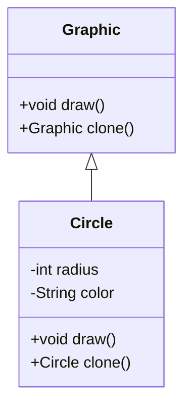

## 3.6.5 Use Cases and Examples

The Prototype Pattern is a creational design pattern that allows for the efficient creation of objects by cloning existing instances. This pattern is particularly useful when the cost of creating a new instance of an object is more expensive than copying an existing one. In this section, we will explore various real-world scenarios where the Prototype Pattern proves advantageous, such as cloning graphical objects in a drawing application, creating copies of objects in a game, and duplicating complex configurations or settings.

### Why Use the Prototype Pattern?

Before diving into specific examples, let's discuss why the Prototype Pattern is effective in certain scenarios:

1. **Performance Improvement**: Cloning can be significantly faster than instantiating a new object, especially when the object creation involves complex initialization processes.
2. **Reduced Code Complexity**: By using prototypes, you can avoid the complexity of creating objects from scratch, which can lead to cleaner and more maintainable code.
3. **Flexibility**: The Prototype Pattern allows for easy addition of new object types without altering existing code, facilitating scalability and adaptability.
4. **Resource Efficiency**: In scenarios where object creation is resource-intensive, cloning helps conserve resources by reusing existing instances.

### Real-World Examples

#### 1. Cloning Graphical Objects in a Drawing Application

In a drawing application, users often need to create multiple instances of similar graphical objects, such as shapes or icons. The Prototype Pattern can be used to clone these objects efficiently, allowing users to duplicate and modify them with ease.

**Code Example: Cloning Graphical Objects**

```java
// Abstract prototype for graphical objects
abstract class Graphic implements Cloneable {
    abstract void draw();
    abstract Graphic clone();
}

// Concrete implementation of a Circle
class Circle extends Graphic {
    private int radius;
    private String color;

    public Circle(int radius, String color) {
        this.radius = radius;
        this.color = color;
    }

    @Override
    void draw() {
        System.out.println("Drawing a " + color + " circle with radius " + radius);
    }

    @Override
    public Graphic clone() {
        try {
            return (Circle) super.clone();
        } catch (CloneNotSupportedException e) {
            throw new AssertionError();
        }
    }
}

// Client code
public class DrawingApp {
    public static void main(String[] args) {
        Circle originalCircle = new Circle(10, "red");
        originalCircle.draw();

        // Clone the original circle
        Circle clonedCircle = (Circle) originalCircle.clone();
        clonedCircle.draw();
    }
}
```

**Benefits**: By cloning graphical objects, the application can quickly generate multiple instances with similar properties, enhancing user experience and application performance.

#### 2. Creating Copies of Objects in a Game

In game development, it's common to have multiple instances of similar objects, such as enemies, weapons, or power-ups. The Prototype Pattern allows developers to clone these objects efficiently, reducing the overhead of creating new instances from scratch.

**Code Example: Cloning Game Objects**

```java
// Abstract prototype for game objects
abstract class GameObject implements Cloneable {
    abstract void render();
    abstract GameObject clone();
}

// Concrete implementation of an Enemy
class Enemy extends GameObject {
    private String type;
    private int health;

    public Enemy(String type, int health) {
        this.type = type;
        this.health = health;
    }

    @Override
    void render() {
        System.out.println("Rendering enemy of type " + type + " with health " + health);
    }

    @Override
    public GameObject clone() {
        try {
            return (Enemy) super.clone();
        } catch (CloneNotSupportedException e) {
            throw new AssertionError();
        }
    }
}

// Client code
public class Game {
    public static void main(String[] args) {
        Enemy originalEnemy = new Enemy("Orc", 100);
        originalEnemy.render();

        // Clone the original enemy
        Enemy clonedEnemy = (Enemy) originalEnemy.clone();
        clonedEnemy.render();
    }
}
```

**Benefits**: Cloning game objects can significantly improve performance by reducing the time and resources needed to create new instances, allowing for smoother gameplay and more dynamic environments.

#### 3. Duplicating Complex Configurations or Settings

In software applications, there are often complex configurations or settings that need to be duplicated across different environments or instances. The Prototype Pattern can be used to clone these configurations, ensuring consistency and reducing the risk of errors.

**Code Example: Cloning Configuration Settings**

```java
// Abstract prototype for configuration settings
abstract class Configuration implements Cloneable {
    abstract void apply();
    abstract Configuration clone();
}

// Concrete implementation of a DatabaseConfiguration
class DatabaseConfiguration extends Configuration {
    private String url;
    private String username;
    private String password;

    public DatabaseConfiguration(String url, String username, String password) {
        this.url = url;
        this.username = username;
        this.password = password;
    }

    @Override
    void apply() {
        System.out.println("Applying configuration to database at " + url);
    }

    @Override
    public Configuration clone() {
        try {
            return (DatabaseConfiguration) super.clone();
        } catch (CloneNotSupportedException e) {
            throw new AssertionError();
        }
    }
}

// Client code
public class ConfigurationManager {
    public static void main(String[] args) {
        DatabaseConfiguration originalConfig = new DatabaseConfiguration(
            "jdbc:mysql://localhost:3306/mydb", "user", "pass");
        originalConfig.apply();

        // Clone the original configuration
        DatabaseConfiguration clonedConfig = (DatabaseConfiguration) originalConfig.clone();
        clonedConfig.apply();
    }
}
```

**Benefits**: By cloning configurations, developers can quickly replicate settings across different environments, ensuring consistency and reducing the likelihood of configuration errors.

### Visualizing the Prototype Pattern

To better understand how the Prototype Pattern works, let's visualize the process of cloning objects using a class diagram.



**Diagram Description**: The diagram illustrates the relationship between the `Graphic` abstract class and its concrete implementation `Circle`. The `Circle` class implements the `clone` method, allowing it to create copies of itself.

### Try It Yourself

To gain a deeper understanding of the Prototype Pattern, try modifying the code examples provided:

1. **Experiment with Different Properties**: Add new properties to the `Circle` or `Enemy` classes and observe how cloning affects these properties.
2. **Implement Additional Object Types**: Create new classes that extend the `Graphic` or `GameObject` prototypes and implement the `clone` method.
3. **Test Deep vs. Shallow Cloning**: Modify the `clone` method to perform deep cloning and observe the differences in behavior.

### Knowledge Check

To reinforce your understanding of the Prototype Pattern, consider the following questions:

1. What are the primary benefits of using the Prototype Pattern in software development?
2. How does the Prototype Pattern improve performance in applications with resource-intensive object creation?
3. What are some potential challenges or limitations of using the Prototype Pattern?

### Conclusion

The Prototype Pattern is a powerful tool for efficiently creating objects in Java applications. By leveraging cloning, developers can improve performance, reduce code complexity, and enhance flexibility. Whether you're working on a drawing application, a game, or a complex software system, the Prototype Pattern can help streamline object creation and management.

Remember, this is just the beginning. As you progress, you'll discover more ways to apply the Prototype Pattern and other design patterns to create robust and scalable software. Keep experimenting, stay curious, and enjoy the journey!

## Quiz Time!



### What is a primary benefit of using the Prototype Pattern?

- [x] Performance improvement through efficient object cloning.
- [ ] Simplifying user interface design.
- [ ] Enhancing security features.
- [ ] Reducing network latency.

> **Explanation:** The Prototype Pattern improves performance by allowing objects to be cloned efficiently, reducing the overhead of creating new instances from scratch.

### In which scenario is the Prototype Pattern particularly useful?

- [x] When object creation is resource-intensive.
- [ ] When designing a user interface.
- [ ] When managing network connections.
- [ ] When optimizing database queries.

> **Explanation:** The Prototype Pattern is useful when object creation is resource-intensive, as it allows for efficient cloning of existing instances.

### How does the Prototype Pattern reduce code complexity?

- [x] By avoiding the need to create objects from scratch.
- [ ] By eliminating the need for error handling.
- [ ] By simplifying database interactions.
- [ ] By reducing the number of classes in a system.

> **Explanation:** The Prototype Pattern reduces code complexity by allowing objects to be cloned rather than created from scratch, leading to cleaner and more maintainable code.

### What is a potential challenge of using the Prototype Pattern?

- [x] Managing deep vs. shallow cloning.
- [ ] Simplifying user interface design.
- [ ] Enhancing security features.
- [ ] Reducing network latency.

> **Explanation:** A challenge of the Prototype Pattern is managing deep vs. shallow cloning, as it can affect how object properties are copied.

### Which method is typically used to implement cloning in Java?

- [x] The `clone()` method.
- [ ] The `toString()` method.
- [ ] The `equals()` method.
- [ ] The `hashCode()` method.

> **Explanation:** The `clone()` method is typically used to implement cloning in Java, allowing objects to create copies of themselves.

### What is a key advantage of using prototypes in a drawing application?

- [x] Quick duplication of graphical objects.
- [ ] Simplifying database queries.
- [ ] Enhancing network security.
- [ ] Reducing memory usage.

> **Explanation:** In a drawing application, prototypes allow for quick duplication of graphical objects, improving user experience and application performance.

### How can the Prototype Pattern enhance game development?

- [x] By allowing efficient cloning of game objects like enemies and weapons.
- [ ] By simplifying user interface design.
- [ ] By optimizing database queries.
- [ ] By reducing network latency.

> **Explanation:** The Prototype Pattern enhances game development by allowing efficient cloning of game objects, reducing the overhead of creating new instances.

### What is a benefit of cloning complex configurations?

- [x] Ensuring consistency across environments.
- [ ] Simplifying user interface design.
- [ ] Enhancing security features.
- [ ] Reducing network latency.

> **Explanation:** Cloning complex configurations ensures consistency across environments, reducing the likelihood of configuration errors.

### True or False: The Prototype Pattern is only useful for graphical applications.

- [ ] True
- [x] False

> **Explanation:** False. The Prototype Pattern is useful in various scenarios, including graphical applications, game development, and complex configuration management.

### What should developers consider when implementing the Prototype Pattern?

- [x] The choice between deep and shallow cloning.
- [ ] The design of user interfaces.
- [ ] The optimization of database queries.
- [ ] The management of network connections.

> **Explanation:** Developers should consider the choice between deep and shallow cloning, as it affects how object properties are copied and managed.




