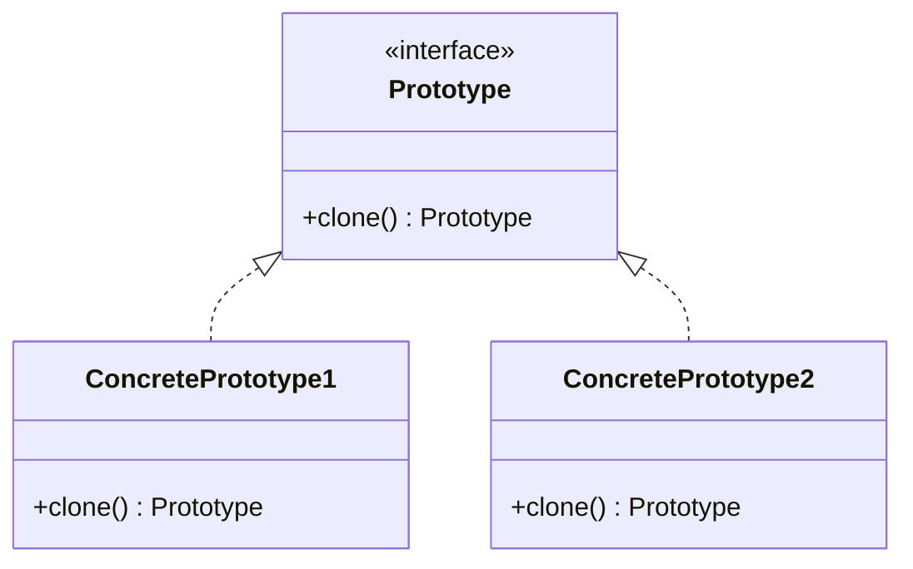
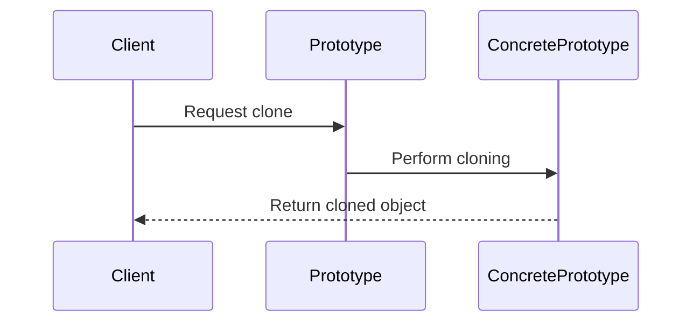

## 3.6 Prototype Pattern

In the realm of software design, creating objects efficiently and flexibly is a recurring challenge. The Prototype Pattern, a creational design pattern, addresses this challenge by allowing new objects to be created by copying an existing prototype. This pattern is particularly useful when object creation is resource-intensive or when the system needs to be decoupled from the specific classes of objects it must create.

### Understanding the Prototype Pattern

The Prototype Pattern is designed to create new objects by copying a prototypical instance. This approach can be more efficient than creating new instances from scratch, especially when the initialization of an object is costly. By cloning an existing object, the Prototype Pattern provides a way to create objects without specifying their exact classes, promoting flexibility and reducing the dependency on concrete classes.

#### Problem Addressed by the Prototype Pattern

In traditional object creation, a system must know the exact class of the object it needs to create. This can lead to tight coupling between the system and the classes, making it difficult to introduce new types of objects without modifying existing code. The Prototype Pattern solves this problem by allowing objects to be created through cloning, thus decoupling the system from the specific classes of objects it creates.

Additionally, when object creation involves complex initialization processes or when objects are resource-intensive to create, cloning an existing object can significantly improve performance. The Prototype Pattern is ideal in scenarios where the cost of creating a new instance is prohibitive, and a similar object already exists.

### Structure of the Prototype Pattern

The Prototype Pattern involves several key components:

1. **Prototype Interface**: This interface declares the `clone` method, which is used to clone objects. The `clone` method is typically defined in a way that allows for deep or shallow copying of the object.

2. **ConcretePrototype Classes**: These classes implement the Prototype interface and define the method for cloning themselves. Each ConcretePrototype class is responsible for creating a copy of itself.

3. **Client**: The client uses the Prototype interface to create new objects by cloning existing ones. The client is unaware of the specific classes of the objects being cloned, which enhances flexibility.

#### UML Diagram

To better understand the relationships within the Prototype Pattern, let's examine a UML diagram:



In this diagram, the `Prototype` interface defines the `clone` method. `ConcretePrototype1` and `ConcretePrototype2` are classes that implement this interface, providing their own cloning mechanisms.

### Benefits of the Prototype Pattern

The Prototype Pattern offers several advantages:

- **Flexibility**: By decoupling the client from the specific classes of objects it creates, the Prototype Pattern allows for greater flexibility in object creation. New types of objects can be introduced without modifying existing code.

- **Efficiency**: Cloning an existing object can be more efficient than creating a new instance from scratch, especially when object creation is resource-intensive or involves complex initialization.

- **Simplification**: The Prototype Pattern simplifies the creation of complex objects by allowing them to be cloned rather than constructed from scratch.

### When to Use the Prototype Pattern

The Prototype Pattern is beneficial in several scenarios:

- **Costly Object Creation**: When creating a new instance of an object is resource-intensive or involves complex initialization, cloning an existing object can improve performance.

- **Decoupling from Specific Classes**: When a system needs to be decoupled from the specific classes of objects it creates, the Prototype Pattern provides a way to create objects without specifying their exact classes.

- **Dynamic Object Creation**: When the types of objects to be created are determined at runtime, the Prototype Pattern allows for dynamic object creation by cloning existing prototypes.

### Implementing the Prototype Pattern in Java

Let's explore how to implement the Prototype Pattern in Java. We'll create a simple example involving shapes, where each shape can be cloned to create a new instance.

#### Step 1: Define the Prototype Interface

First, we'll define the `Prototype` interface, which declares the `clone` method:

```java
public interface Prototype {
    Prototype clone();
}
```

#### Step 2: Create ConcretePrototype Classes

Next, we'll create concrete classes that implement the `Prototype` interface. These classes will define their own cloning mechanisms.

```java
public class Circle implements Prototype {
    private int radius;

    public Circle(int radius) {
        this.radius = radius;
    }

    @Override
    public Prototype clone() {
        return new Circle(this.radius);
    }

    @Override
    public String toString() {
        return "Circle with radius: " + radius;
    }
}

public class Rectangle implements Prototype {
    private int width;
    private int height;

    public Rectangle(int width, int height) {
        this.width = width;
        this.height = height;
    }

    @Override
    public Prototype clone() {
        return new Rectangle(this.width, this.height);
    }

    @Override
    public String toString() {
        return "Rectangle with width: " + width + " and height: " + height;
    }
}
```

#### Step 3: Use the Prototype Pattern

Finally, we'll demonstrate how to use the Prototype Pattern to clone objects.

```java
public class PrototypeDemo {
    public static void main(String[] args) {
        Circle circle = new Circle(5);
        Circle clonedCircle = (Circle) circle.clone();
        System.out.println(clonedCircle);

        Rectangle rectangle = new Rectangle(10, 20);
        Rectangle clonedRectangle = (Rectangle) rectangle.clone();
        System.out.println(clonedRectangle);
    }
}
```

In this example, we create instances of `Circle` and `Rectangle` and then clone them using the `clone` method. The cloned objects are new instances with the same properties as the originals.

### Deep vs. Shallow Copy

When implementing the Prototype Pattern, it's important to understand the difference between deep and shallow copying:

- **Shallow Copy**: A shallow copy creates a new object, but does not create copies of objects that the original object references. Instead, it copies references to these objects. This means that changes to the referenced objects will affect both the original and the cloned object.

- **Deep Copy**: A deep copy creates a new object and recursively copies all objects that the original object references. This means that changes to the referenced objects will not affect the cloned object.

In Java, the `clone` method can be used to implement both shallow and deep copying, depending on the requirements of the application.

### Handling `CloneNotSupportedException`

In Java, the `Cloneable` interface is used to indicate that a class supports cloning. However, the `clone` method in the `Object` class throws a `CloneNotSupportedException` if the class does not implement `Cloneable`. To handle this exception, you can either catch it or declare it in the method signature.

```java
public class Circle implements Cloneable {
    private int radius;

    public Circle(int radius) {
        this.radius = radius;
    }

    @Override
    public Circle clone() throws CloneNotSupportedException {
        return (Circle) super.clone();
    }
}
```

### Prototype Registry

A Prototype Registry is a mechanism for managing a collection of prototypes. It allows clients to retrieve and clone prototypes without knowing their exact classes. This can be useful in scenarios where the types of objects to be created are determined at runtime.

```java
import java.util.HashMap;
import java.util.Map;

public class PrototypeRegistry {
    private Map<String, Prototype> prototypes = new HashMap<>();

    public void addPrototype(String key, Prototype prototype) {
        prototypes.put(key, prototype);
    }

    public Prototype getPrototype(String key) {
        return prototypes.get(key).clone();
    }
}
```

In this example, the `PrototypeRegistry` class manages a collection of prototypes. Clients can add prototypes to the registry and retrieve clones by key.

### Try It Yourself

To better understand the Prototype Pattern, try modifying the code examples to explore different scenarios:

- **Experiment with Deep Copying**: Modify the `clone` method to implement deep copying. Create a class with complex objects as fields and implement deep copying for these fields.

- **Implement a Prototype Registry**: Create a registry for managing prototypes. Add different types of prototypes to the registry and retrieve clones by key.

- **Handle `CloneNotSupportedException`**: Experiment with handling the `CloneNotSupportedException` in different ways. Try catching the exception and logging an error message.

### Visualizing the Prototype Pattern

To further illustrate the Prototype Pattern, let's visualize the process of cloning an object using a sequence diagram:



In this sequence diagram, the client requests a clone from the prototype. The prototype delegates the cloning process to the concrete prototype, which performs the cloning and returns the cloned object to the client.

### Knowledge Check

Before moving on, let's review some key concepts:

- **What is the Prototype Pattern?**: A creational design pattern that creates new objects by copying a prototypical instance.

- **When is the Prototype Pattern beneficial?**: When object creation is costly or when the system needs to be decoupled from specific classes.

- **What is the difference between deep and shallow copy?**: A shallow copy copies references to objects, while a deep copy recursively copies all referenced objects.

- **How can a Prototype Registry be useful?**: It manages a collection of prototypes, allowing clients to retrieve and clone prototypes without knowing their exact classes.

### Conclusion

The Prototype Pattern is a powerful tool for creating objects efficiently and flexibly. By allowing objects to be cloned rather than constructed from scratch, the Prototype Pattern reduces dependency on specific classes and improves performance in scenarios where object creation is costly. As you continue to explore design patterns, consider how the Prototype Pattern can be applied to your own projects to enhance flexibility and efficiency.

## Quiz Time!



### What is the main purpose of the Prototype Pattern?

- [x] To create new objects by copying an existing prototype.
- [ ] To define a family of algorithms and make them interchangeable.
- [ ] To provide a simplified interface to a complex subsystem.
- [ ] To encapsulate a request as an object.

> **Explanation:** The Prototype Pattern is used to create new objects by copying an existing prototype, promoting flexibility and efficiency in object creation.

### When is the Prototype Pattern particularly beneficial?

- [x] When object creation is costly or complex.
- [ ] When there is a need to define a family of related or dependent objects.
- [ ] When there is a need to provide a simplified interface to a complex subsystem.
- [ ] When there is a need to encapsulate a request as an object.

> **Explanation:** The Prototype Pattern is beneficial when object creation is costly or complex, as it allows new objects to be created by cloning existing ones.

### What is the difference between deep and shallow copy in the Prototype Pattern?

- [x] A shallow copy copies references, while a deep copy copies all referenced objects.
- [ ] A shallow copy copies all referenced objects, while a deep copy copies references.
- [ ] A shallow copy is faster than a deep copy.
- [ ] A deep copy is faster than a shallow copy.

> **Explanation:** A shallow copy copies references to objects, while a deep copy recursively copies all referenced objects, ensuring independence from the original.

### What role does the Prototype interface play in the Prototype Pattern?

- [x] It declares the clone method for creating copies of objects.
- [ ] It defines a family of algorithms for interchangeable use.
- [ ] It provides a simplified interface to a complex subsystem.
- [ ] It encapsulates a request as an object.

> **Explanation:** The Prototype interface declares the clone method, which is used to create copies of objects in the Prototype Pattern.

### How does a Prototype Registry enhance the Prototype Pattern?

- [x] By managing a collection of prototypes for easy retrieval and cloning.
- [ ] By defining a family of related or dependent objects.
- [ ] By providing a simplified interface to a complex subsystem.
- [ ] By encapsulating a request as an object.

> **Explanation:** A Prototype Registry manages a collection of prototypes, allowing clients to retrieve and clone prototypes without knowing their exact classes.

### What is a key advantage of using the Prototype Pattern?

- [x] It reduces dependency on specific classes.
- [ ] It provides a simplified interface to a complex subsystem.
- [ ] It encapsulates a request as an object.
- [ ] It defines a family of algorithms for interchangeable use.

> **Explanation:** The Prototype Pattern reduces dependency on specific classes by allowing objects to be created through cloning, enhancing flexibility.

### How can `CloneNotSupportedException` be handled in Java?

- [x] By catching the exception or declaring it in the method signature.
- [ ] By ignoring the exception.
- [ ] By using a try-catch block without declaring it.
- [ ] By using a finally block.

> **Explanation:** `CloneNotSupportedException` can be handled by catching the exception or declaring it in the method signature to ensure safe cloning.

### What is the purpose of the `clone` method in the Prototype Pattern?

- [x] To create a copy of an object.
- [ ] To define a family of algorithms for interchangeable use.
- [ ] To provide a simplified interface to a complex subsystem.
- [ ] To encapsulate a request as an object.

> **Explanation:** The `clone` method is used to create a copy of an object in the Prototype Pattern, facilitating efficient object creation.

### Which of the following is a scenario where the Prototype Pattern is not ideal?

- [x] When objects have complex interdependencies that are hard to clone.
- [ ] When object creation is costly or complex.
- [ ] When the system needs to be decoupled from specific classes.
- [ ] When new types of objects need to be introduced without modifying existing code.

> **Explanation:** The Prototype Pattern is not ideal when objects have complex interdependencies that are hard to clone, as it may complicate the cloning process.

### True or False: The Prototype Pattern can only be used with classes that implement the `Cloneable` interface in Java.

- [x] True
- [ ] False

> **Explanation:** In Java, the Prototype Pattern typically involves classes that implement the `Cloneable` interface to indicate support for cloning.


