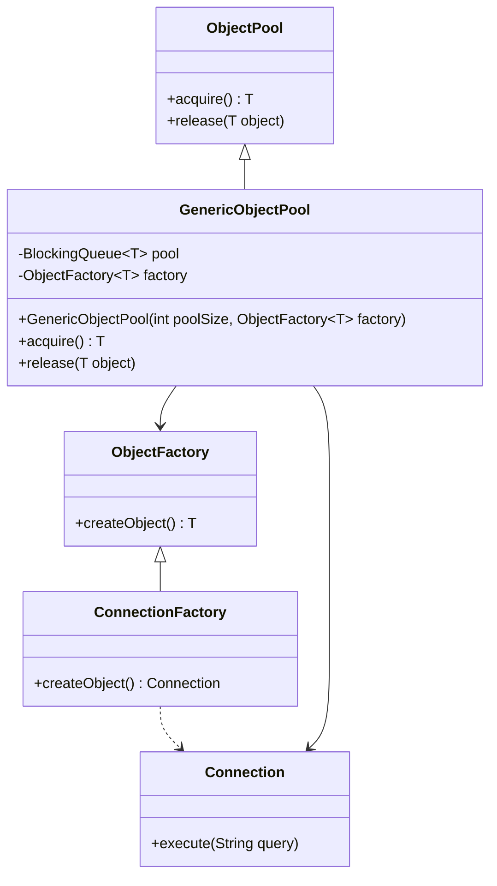

## 3.7.1 Implementing Object Pool in Java

The Object Pool Pattern is a creational design pattern that manages a pool of reusable objects. This pattern is particularly useful when the cost of creating and destroying objects is high, and when the number of instantiated objects is limited. By reusing objects from a pool, we can improve the performance of applications that require frequent use of similar objects.

### Understanding the Object Pool Pattern

The Object Pool Pattern involves creating a set of initialized objects that are kept ready to use, rather than allocating and destroying them on demand. This pattern is beneficial in scenarios where object creation is expensive, such as database connections, socket connections, or thread pools.

**Key Concepts:**

- **Pooling**: The process of maintaining a collection of reusable objects.
- **Allocation**: Providing an object from the pool to a client.
- **Deallocation**: Returning an object back to the pool for future reuse.

### Steps to Implement an Object Pool in Java

Let's explore the steps involved in implementing an Object Pool Pattern in Java.

#### 1. Define the Object Pool Interface

First, define an interface that outlines the basic operations of the object pool, such as acquiring and releasing objects.

```java
public interface ObjectPool<T> {
    T acquire();
    void release(T object);
}
```

#### 2. Implement the Object Pool Class

Create a class that implements the `ObjectPool` interface. This class will manage the pool of objects, ensuring efficient allocation and deallocation.

```java
import java.util.concurrent.BlockingQueue;
import java.util.concurrent.LinkedBlockingQueue;

public class GenericObjectPool<T> implements ObjectPool<T> {
    private final BlockingQueue<T> pool;
    private final ObjectFactory<T> factory;

    public GenericObjectPool(int poolSize, ObjectFactory<T> factory) {
        this.pool = new LinkedBlockingQueue<>(poolSize);
        this.factory = factory;
        initializePool(poolSize);
    }

    private void initializePool(int poolSize) {
        for (int i = 0; i < poolSize; i++) {
            pool.offer(factory.createObject());
        }
    }

    @Override
    public T acquire() {
        try {
            return pool.take();
        } catch (InterruptedException e) {
            Thread.currentThread().interrupt();
            throw new RuntimeException("Failed to acquire object from pool", e);
        }
    }

    @Override
    public void release(T object) {
        if (object != null) {
            pool.offer(object);
        }
    }
}
```

**Explanation:**

- **BlockingQueue**: We use a `BlockingQueue` to manage the pool of objects. This ensures thread-safe access to the pool.
- **ObjectFactory**: A factory interface is used to create new objects for the pool.

#### 3. Define the Object Factory Interface

The factory interface is responsible for creating new objects for the pool.

```java
public interface ObjectFactory<T> {
    T createObject();
}
```

#### 4. Implement the Object Factory

Implement the factory interface to create specific objects for your pool.

```java
public class ConnectionFactory implements ObjectFactory<Connection> {
    @Override
    public Connection createObject() {
        return new Connection(); // Assume Connection is a class representing a database connection
    }
}
```

#### 5. Utilize the Object Pool

Now, let's see how to use the object pool in a client application.

```java
public class Application {
    public static void main(String[] args) {
        ObjectPool<Connection> connectionPool = new GenericObjectPool<>(10, new ConnectionFactory());

        // Acquire a connection from the pool
        Connection connection = connectionPool.acquire();

        try {
            // Use the connection
            connection.execute("SELECT * FROM users");
        } finally {
            // Release the connection back to the pool
            connectionPool.release(connection);
        }
    }
}
```

### Thread Safety Considerations

When implementing an object pool, it's crucial to ensure thread safety, especially in a multi-threaded environment. The use of `BlockingQueue` helps manage concurrent access to the pool, as it handles synchronization internally.

### Managing Pool Size

The size of the pool should be carefully chosen based on the application's requirements and resource constraints. A pool that is too small may lead to resource contention, while a pool that is too large may waste resources.

### Object Validation and Cleanup

Implement mechanisms to validate and clean up objects before they are returned to the pool. This ensures that only healthy objects are reused.

```java
@Override
public void release(T object) {
    if (object != null && validate(object)) {
        pool.offer(object);
    } else {
        // Optionally, create a new object to replace the invalid one
        pool.offer(factory.createObject());
    }
}

private boolean validate(T object) {
    // Implement validation logic
    return true;
}
```

### Best Practices for Maintaining the Pool

- **Proper Synchronization**: Use thread-safe data structures like `BlockingQueue` to manage the pool.
- **Resource Management**: Ensure that resources are properly allocated and deallocated.
- **Monitoring and Logging**: Implement monitoring and logging to track the pool's usage and performance.

### Try It Yourself

To deepen your understanding, try modifying the code examples to:

- Implement a pool for a different type of object, such as threads or file handles.
- Experiment with different pool sizes and observe the impact on performance.
- Add logging to track when objects are acquired and released.

### Visualizing the Object Pool Pattern

To better understand the flow of the Object Pool Pattern, let's visualize it using a class diagram.



**Diagram Explanation:**

- **ObjectPool Interface**: Defines the contract for acquiring and releasing objects.
- **GenericObjectPool Class**: Implements the object pool using a `BlockingQueue`.
- **ObjectFactory Interface**: Provides a method for creating objects.
- **ConnectionFactory Class**: Implements the factory for creating `Connection` objects.
- **Connection Class**: Represents the objects being pooled.

### References and Links

For further reading and deeper understanding, you can explore the following resources:

- [Java Concurrency in Practice](https://www.oreilly.com/library/view/java-concurrency-in/0321349601/)
- [Effective Java](https://www.oreilly.com/library/view/effective-java-3rd/9780134686097/)
- [Java Documentation on BlockingQueue](https://docs.oracle.com/javase/8/docs/api/java/util/concurrent/BlockingQueue.html)

### Knowledge Check

To reinforce your understanding, consider these questions:

- What are the benefits of using an object pool?
- How does `BlockingQueue` help in managing thread safety?
- What factors should be considered when determining the pool size?

### Embrace the Journey

Remember, mastering design patterns is a journey. As you continue to explore and implement patterns like the Object Pool, you'll gain a deeper understanding of how to write efficient and maintainable code. Keep experimenting, stay curious, and enjoy the journey!

## Quiz Time!



### What is the primary purpose of the Object Pool Pattern?

- [x] To manage a pool of reusable objects efficiently.
- [ ] To create new objects on demand.
- [ ] To destroy unused objects immediately.
- [ ] To prevent object creation altogether.

> **Explanation:** The Object Pool Pattern is designed to manage a pool of reusable objects efficiently, reducing the overhead of creating and destroying objects frequently.

### Which Java data structure is commonly used to implement an object pool?

- [ ] ArrayList
- [ ] HashMap
- [x] BlockingQueue
- [ ] LinkedList

> **Explanation:** `BlockingQueue` is commonly used to implement an object pool in Java due to its built-in thread safety and blocking capabilities.

### What is the role of the ObjectFactory interface in the Object Pool Pattern?

- [x] To create new objects for the pool.
- [ ] To destroy objects in the pool.
- [ ] To manage the pool size.
- [ ] To log pool activity.

> **Explanation:** The ObjectFactory interface provides a method for creating new objects for the pool, ensuring that the pool can be replenished with new instances as needed.

### How does the Object Pool Pattern improve performance?

- [x] By reusing objects instead of creating new ones.
- [ ] By increasing the number of objects created.
- [ ] By reducing the number of threads.
- [ ] By decreasing memory usage.

> **Explanation:** The Object Pool Pattern improves performance by reusing objects instead of creating new ones, which reduces the overhead associated with object creation and destruction.

### What should be considered when determining the size of an object pool?

- [x] Resource constraints and application requirements.
- [ ] The number of classes in the application.
- [ ] The size of the source code.
- [ ] The number of developers on the team.

> **Explanation:** When determining the size of an object pool, it's important to consider resource constraints and application requirements to ensure optimal performance and resource utilization.

### What is a key benefit of using `BlockingQueue` in an object pool?

- [x] It provides thread-safe access to the pool.
- [ ] It increases the pool size automatically.
- [ ] It logs all pool activity.
- [ ] It prevents object creation.

> **Explanation:** `BlockingQueue` provides thread-safe access to the pool, ensuring that multiple threads can acquire and release objects without causing concurrency issues.

### How can object validation be incorporated into the Object Pool Pattern?

- [x] By implementing a validation method before returning objects to the pool.
- [ ] By increasing the pool size.
- [ ] By decreasing the pool size.
- [ ] By logging all object activity.

> **Explanation:** Object validation can be incorporated by implementing a validation method that checks the health of objects before they are returned to the pool, ensuring that only valid objects are reused.

### What is a potential drawback of having a pool size that is too large?

- [x] It may waste resources.
- [ ] It will increase object creation time.
- [ ] It will decrease object reuse.
- [ ] It will improve performance.

> **Explanation:** A pool size that is too large may waste resources, as unnecessary objects will consume memory and other resources without being used efficiently.

### Which of the following is a best practice for maintaining an object pool?

- [x] Implementing monitoring and logging for pool usage.
- [ ] Increasing the pool size indefinitely.
- [ ] Decreasing the pool size to zero.
- [ ] Ignoring resource constraints.

> **Explanation:** Implementing monitoring and logging for pool usage is a best practice, as it helps track the pool's performance and identify potential issues.

### True or False: The Object Pool Pattern is only useful for database connections.

- [ ] True
- [x] False

> **Explanation:** False. The Object Pool Pattern is useful for any scenario where object creation is expensive, such as database connections, socket connections, or thread pools.


