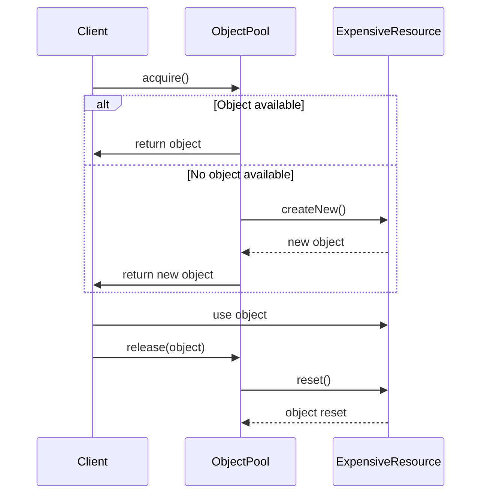

## 3.7.2 Resource Management and Reusability

In the realm of software engineering, efficient resource management and reusability are pivotal for building high-performance and scalable applications. The Object Pool pattern is a creational design pattern that addresses these needs by managing a pool of reusable objects. This section delves into the intricacies of the Object Pool pattern, explaining its benefits, use cases, and implementation strategies in Java.

### Understanding the Object Pool Pattern

The Object Pool pattern is a design pattern that allows for the reuse of objects that are expensive to create. Instead of creating and destroying objects repeatedly, an object pool maintains a collection of initialized objects that can be reused. This approach reduces the overhead associated with object creation and garbage collection, leading to improved application performance.

#### Key Benefits of Object Pooling

1. **Reduced Garbage Collection Overhead**: By reusing objects, the frequency of object creation and destruction decreases, which in turn reduces the load on the garbage collector. This leads to more predictable performance, especially in applications with high object churn.

2. **Improved Performance and Scalability**: Object pooling can significantly enhance the performance of applications by reducing the time spent in object creation. This is particularly beneficial in scenarios where object instantiation is costly or time-consuming.

3. **Efficient Resource Utilization**: Object pools ensure that resources are used efficiently by maintaining a limited number of objects that can be reused. This prevents resource exhaustion and allows for better management of system resources.

4. **Enhanced Reusability**: By reusing objects, the Object Pool pattern promotes reusability, which is a core principle of sustainable software development.

### Implementing the Object Pool Pattern in Java

To implement the Object Pool pattern in Java, we need to create a pool that manages the lifecycle of objects, including their creation, reuse, and destruction. Let's explore a step-by-step approach to implementing an object pool.

#### Step 1: Define the Object Interface

First, define an interface or abstract class that represents the objects to be pooled. This ensures that all pooled objects adhere to a common contract.

```java
public interface Poolable {
    void reset();
}
```

#### Step 2: Create the Object Pool Class

Next, create a class that manages the pool of objects. This class should handle the creation of new objects, provide objects to clients, and return objects to the pool.

```java
import java.util.concurrent.ConcurrentLinkedQueue;

public class ObjectPool<T extends Poolable> {
    private ConcurrentLinkedQueue<T> pool;
    private int maxSize;

    public ObjectPool(int maxSize) {
        this.pool = new ConcurrentLinkedQueue<>();
        this.maxSize = maxSize;
    }

    public T acquire() {
        T object = pool.poll();
        if (object == null) {
            object = createNew();
        }
        return object;
    }

    public void release(T object) {
        if (pool.size() < maxSize) {
            object.reset();
            pool.offer(object);
        }
    }

    protected T createNew() {
        // Implement object creation logic
        return null;
    }
}
```

#### Step 3: Implement the Pooled Object

Implement the class that represents the pooled object, ensuring it implements the `Poolable` interface.

```java
public class ExpensiveResource implements Poolable {
    // Resource-intensive fields

    public ExpensiveResource() {
        // Initialization logic
    }

    @Override
    public void reset() {
        // Reset object state
    }
}
```

#### Step 4: Use the Object Pool

Finally, use the object pool in your application to manage the lifecycle of pooled objects.

```java
public class Application {
    public static void main(String[] args) {
        ObjectPool<ExpensiveResource> pool = new ObjectPool<>(10);

        // Acquire an object from the pool
        ExpensiveResource resource = pool.acquire();

        // Use the resource
        // ...

        // Release the resource back to the pool
        pool.release(resource);
    }
}
```

### Considerations for Effective Object Pooling

While the Object Pool pattern offers numerous benefits, it also requires careful consideration to avoid potential pitfalls.

#### Resetting Object State

Before reusing an object, it's crucial to reset its state to ensure it doesn't carry over data from previous usage. This can be achieved by implementing a `reset` method in the `Poolable` interface, which is called before an object is returned to the pool.

#### Avoiding Memory Leaks

Memory leaks can occur if objects are not properly returned to the pool. To prevent this, ensure that every acquired object is eventually released back to the pool. Consider using try-finally blocks or Java's try-with-resources statement to guarantee that objects are returned even if an exception occurs.

#### Monitoring and Managing the Pool

Regularly monitor the object pool to ensure it is neither overutilized nor underutilized. Overutilization can lead to resource exhaustion, while underutilization can result in wasted resources. Implement logging and metrics to track pool usage and adjust the pool size as needed.

#### Handling Resource-Intensive Objects

Objects that are expensive to create, such as database connections, network sockets, or large data structures, are ideal candidates for pooling. By reusing these objects, you can significantly reduce the overhead associated with their creation and destruction.

### Visualizing the Object Pool Pattern

To better understand the Object Pool pattern, let's visualize the flow of object acquisition and release using a sequence diagram.



### Try It Yourself

To gain hands-on experience with the Object Pool pattern, try modifying the example code to include additional features:

1. **Implement a Timeout Mechanism**: Add a timeout feature to the `acquire` method, allowing the client to wait for a specified duration if no objects are available.

2. **Enhance Monitoring**: Integrate a monitoring system to log pool usage statistics, such as the number of active, idle, and total objects.

3. **Experiment with Different Object Types**: Create pools for different types of objects, such as database connections or network sockets, and observe the performance improvements.

### Conclusion

The Object Pool pattern is a powerful tool for optimizing resource management and enhancing reusability in Java applications. By reusing objects instead of creating new ones, you can reduce garbage collection overhead, improve performance, and achieve better scalability. However, it's essential to carefully manage the pool to avoid issues like memory leaks and resource exhaustion. By understanding and implementing the Object Pool pattern, you can build more efficient and scalable applications.

## Quiz Time!



### What is a primary benefit of using the Object Pool pattern?

- [x] Reduced garbage collection overhead
- [ ] Increased object creation time
- [ ] Decreased application performance
- [ ] Increased memory usage

> **Explanation:** The Object Pool pattern reduces garbage collection overhead by reusing objects instead of creating and destroying them repeatedly.

### Which method should be implemented to ensure an object's state is reset before reuse?

- [x] reset()
- [ ] initialize()
- [ ] destroy()
- [ ] finalize()

> **Explanation:** The `reset()` method is used to reset an object's state before it is returned to the pool for reuse.

### What is a potential risk if objects are not properly returned to the pool?

- [x] Memory leaks
- [ ] Faster object creation
- [ ] Reduced garbage collection
- [ ] Improved performance

> **Explanation:** If objects are not properly returned to the pool, it can lead to memory leaks as resources are not reclaimed.

### What type of objects are ideal candidates for pooling?

- [x] Resource-intensive objects
- [ ] Simple data objects
- [ ] Immutable objects
- [ ] Small objects

> **Explanation:** Resource-intensive objects, such as database connections or network sockets, are ideal candidates for pooling due to their expensive creation cost.

### How can you ensure objects are returned to the pool even if an exception occurs?

- [x] Use try-finally blocks
- [ ] Avoid using exceptions
- [ ] Use static methods
- [ ] Use synchronized blocks

> **Explanation:** Using try-finally blocks ensures that objects are returned to the pool even if an exception occurs during their use.

### What is the role of the `createNew()` method in the Object Pool pattern?

- [x] To create a new object when none are available in the pool
- [ ] To reset an object's state
- [ ] To destroy an object
- [ ] To monitor pool usage

> **Explanation:** The `createNew()` method is responsible for creating a new object when the pool is empty and a client requests an object.

### Which of the following is a strategy to monitor and manage an object pool?

- [x] Implement logging and metrics
- [ ] Increase pool size indefinitely
- [ ] Avoid monitoring to reduce overhead
- [ ] Use only one object in the pool

> **Explanation:** Implementing logging and metrics helps monitor and manage an object pool effectively, ensuring optimal resource utilization.

### What is a consequence of overutilizing an object pool?

- [x] Resource exhaustion
- [ ] Increased garbage collection
- [ ] Reduced application performance
- [ ] Increased object creation time

> **Explanation:** Overutilizing an object pool can lead to resource exhaustion, where there are not enough objects to meet demand.

### Which design pattern is primarily used to manage a pool of reusable objects?

- [x] Object Pool Pattern
- [ ] Singleton Pattern
- [ ] Factory Pattern
- [ ] Observer Pattern

> **Explanation:** The Object Pool pattern is specifically designed to manage a pool of reusable objects, optimizing resource management.

### True or False: The Object Pool pattern is only beneficial for applications with low object churn.

- [ ] True
- [x] False

> **Explanation:** The Object Pool pattern is particularly beneficial for applications with high object churn, where objects are frequently created and destroyed.


