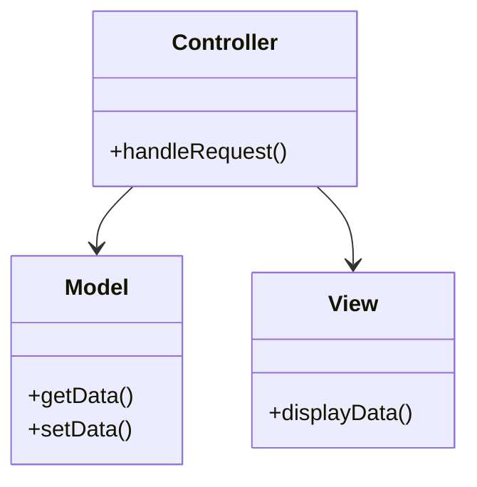

## 3.7.3 Controller

### Introduction to the Controller Principle

The Controller principle is a fundamental concept in software design, particularly within the realm of object-oriented programming. It is one of the GRASP (General Responsibility Assignment Software Patterns) principles, which provide guidelines for assigning responsibilities to classes and objects in a system. The Controller principle specifically addresses the assignment of responsibilities for handling system events to a non-UI class that represents the overall system or a specific use case.

### Defining the Controller Principle

The Controller principle dictates that a controller should be responsible for receiving or handling a system event. A system event is an event generated by an external actor, such as a user interaction or a system trigger. The controller acts as an intermediary between the user interface (UI) and the business logic, ensuring that the UI remains separate from the core functionality of the application.

### Role of a Controller in Separating UI from Business Logic

One of the primary roles of a controller is to decouple the UI from the business logic. This separation is crucial for maintaining a clean architecture, where changes to the UI do not affect the business logic and vice versa. By isolating these concerns, developers can achieve greater flexibility and scalability in their applications.

#### Benefits of Separation

- **Maintainability**: Changes in the UI or business logic can be made independently, reducing the risk of introducing bugs.
- **Reusability**: Business logic can be reused across different UIs or platforms.
- **Testability**: Business logic can be tested independently of the UI, facilitating automated testing.

### Examples of Controller Classes in Different Application Architectures

Controllers can be implemented in various application architectures, each serving a specific purpose and context. Below are examples of how controllers are used in different architectures:

#### 1. Model-View-Controller (MVC) Architecture

In the MVC architecture, the controller acts as the intermediary between the model (business logic) and the view (UI). It receives input from the user via the view, processes it using the model, and then updates the view accordingly.

```java
public class UserController {
    private UserService userService;
    
    public UserController(UserService userService) {
        this.userService = userService;
    }
    
    public void handleUserLogin(String username, String password) {
        boolean isAuthenticated = userService.authenticate(username, password);
        if (isAuthenticated) {
            // Update the view to show a successful login
        } else {
            // Update the view to show an error message
        }
    }
}
```

#### 2. Model-View-Presenter (MVP) Architecture

In the MVP architecture, the presenter takes on the role of the controller. It interacts with both the view and the model, handling user input and updating the view based on the model's state.

```java
public class UserPresenter {
    private UserView view;
    private UserService userService;
    
    public UserPresenter(UserView view, UserService userService) {
        this.view = view;
        this.userService = userService;
    }
    
    public void onLoginButtonClicked(String username, String password) {
        boolean isAuthenticated = userService.authenticate(username, password);
        if (isAuthenticated) {
            view.showSuccessMessage();
        } else {
            view.showErrorMessage();
        }
    }
}
```

#### 3. Model-View-ViewModel (MVVM) Architecture

In the MVVM architecture, the view model serves as the controller. It exposes data and commands to the view, allowing for data binding and separation of concerns.

```java
public class UserViewModel {
    private UserService userService;
    private StringProperty username = new SimpleStringProperty();
    private StringProperty password = new SimpleStringProperty();
    private BooleanProperty loginSuccessful = new SimpleBooleanProperty();
    
    public UserViewModel(UserService userService) {
        this.userService = userService;
    }
    
    public void login() {
        boolean isAuthenticated = userService.authenticate(username.get(), password.get());
        loginSuccessful.set(isAuthenticated);
    }
    
    // Getters and setters for properties
}
```

### Enhancing Code Organization and Maintainability

The use of controllers enhances code organization by clearly defining the responsibilities of each component in the system. This clarity leads to more maintainable code, as developers can easily identify where changes need to be made when requirements evolve.

#### Key Practices for Effective Controllers

- **Single Responsibility**: Ensure that each controller has a single responsibility, focusing on handling specific system events or use cases.
- **Loose Coupling**: Maintain loose coupling between the controller and other components, such as the model and view, to facilitate independent changes.
- **Consistent Naming**: Use consistent naming conventions for controllers to improve readability and understanding of the codebase.

### Relevance in MVC (Model-View-Controller) Patterns

The MVC pattern is one of the most widely used architectural patterns in software development. The controller plays a pivotal role in this pattern by managing the flow of data between the model and the view. It ensures that the view remains updated with the latest data from the model and that user inputs are correctly processed.

#### MVC Pattern Structure



*Diagram: The MVC pattern structure, showing the relationships between the controller, model, and view.*

### Participants in the Controller Pattern

- **Controller**: Handles user input and system events, coordinating between the model and view.
- **Model**: Contains the business logic and data of the application.
- **View**: Represents the UI, displaying data to the user and capturing user input.

### Collaborations and Interactions

The controller collaborates with the model and view to ensure that the application functions correctly. It receives input from the view, processes it using the model, and updates the view with the results.

### Consequences of Using the Controller Pattern

#### Benefits

- **Improved Organization**: Clear separation of concerns leads to better-organized code.
- **Scalability**: Applications can scale more easily as new features are added.
- **Flexibility**: Changes to the UI or business logic can be made independently.

#### Potential Drawbacks

- **Complexity**: Introducing controllers can add complexity to the system, particularly in large applications.
- **Overhead**: Additional layers of abstraction may introduce performance overhead.

### Implementation Guidelines

To implement the controller pattern effectively, consider the following guidelines:

- **Define Clear Interfaces**: Use interfaces to define the interactions between the controller, model, and view.
- **Use Dependency Injection**: Leverage dependency injection to manage dependencies between components, enhancing testability and flexibility.
- **Adopt Design Patterns**: Utilize design patterns such as the Observer pattern to manage updates between the model and view.

### Sample Code Snippets

Below is a sample implementation of a controller in a simple Java application:

```java
public class ProductController {
    private ProductService productService;
    private ProductView productView;
    
    public ProductController(ProductService productService, ProductView productView) {
        this.productService = productService;
        this.productView = productView;
    }
    
    public void displayProductDetails(int productId) {
        Product product = productService.getProductById(productId);
        productView.displayProduct(product);
    }
}
```

*Explanation: The `ProductController` class handles the responsibility of retrieving product details from the `ProductService` and displaying them using the `ProductView`.*

### Sample Use Cases

#### E-commerce Application

In an e-commerce application, a controller could manage user interactions such as adding items to a shopping cart, processing payments, and updating order statuses.

#### Banking System

In a banking system, controllers could handle transactions, account management, and customer interactions, ensuring that the business logic is separate from the UI.

### Related Patterns

The controller pattern is closely related to other design patterns, such as:

- **Observer Pattern**: Used to manage updates between the model and view.
- **Facade Pattern**: Provides a simplified interface to a complex subsystem, similar to how a controller simplifies interactions between the UI and business logic.

### Known Uses

Controllers are widely used in frameworks and libraries, such as:

- **Spring MVC**: A popular Java framework that implements the MVC pattern, with controllers managing HTTP requests and responses.
- **JavaFX**: Utilizes controllers in its MVC-like architecture to manage user interactions and UI updates.

### Conclusion

The Controller principle is a vital component of modern software design, offering a structured approach to managing system events and separating concerns within an application. By leveraging controllers, developers can create more maintainable, scalable, and testable applications, ultimately leading to higher-quality software.

---

## Test Your Knowledge: Mastering the Controller Principle in Java Design Patterns



### What is the primary role of a controller in software design?

- [x] To handle system events and separate UI from business logic.
- [ ] To manage database connections.
- [ ] To render the user interface.
- [ ] To perform data validation.

> **Explanation:** The controller's main role is to handle system events and ensure a clear separation between the UI and business logic.

### In the MVC architecture, which component does the controller interact with?

- [x] Model
- [x] View
- [ ] Database
- [ ] Network

> **Explanation:** The controller interacts with both the model and the view to manage the flow of data and user interactions.

### How does the controller enhance code maintainability?

- [x] By separating concerns and allowing independent changes to UI and business logic.
- [ ] By reducing the number of classes in the application.
- [ ] By directly embedding business logic in the UI.
- [ ] By minimizing the use of design patterns.

> **Explanation:** The separation of concerns facilitated by the controller allows for independent changes, improving maintainability.

### Which design pattern is closely related to the controller pattern?

- [x] Observer Pattern
- [ ] Singleton Pattern
- [ ] Factory Pattern
- [ ] Decorator Pattern

> **Explanation:** The Observer pattern is often used alongside controllers to manage updates between the model and view.

### What is a potential drawback of using controllers in large applications?

- [x] Increased complexity
- [ ] Reduced flexibility
- [ ] Poor scalability
- [ ] Lack of testability

> **Explanation:** Introducing controllers can add complexity, especially in large applications with many components.

### In which architecture does the presenter act as the controller?

- [x] Model-View-Presenter (MVP)
- [ ] Model-View-Controller (MVC)
- [ ] Model-View-ViewModel (MVVM)
- [ ] Client-Server

> **Explanation:** In the MVP architecture, the presenter takes on the role of the controller, managing interactions between the view and model.

### What is a key practice for effective controllers?

- [x] Single Responsibility
- [ ] Tight Coupling
- [ ] Embedding UI logic
- [ ] Direct database access

> **Explanation:** Ensuring that each controller has a single responsibility helps maintain clarity and focus in the codebase.

### Which Java framework implements the MVC pattern with controllers?

- [x] Spring MVC
- [ ] Hibernate
- [ ] JUnit
- [ ] Apache Kafka

> **Explanation:** Spring MVC is a popular Java framework that implements the MVC pattern, with controllers managing HTTP requests and responses.

### What is the benefit of using dependency injection with controllers?

- [x] Enhances testability and flexibility
- [ ] Reduces the number of classes
- [ ] Simplifies database access
- [ ] Embeds business logic in the UI

> **Explanation:** Dependency injection allows for better management of dependencies, improving testability and flexibility.

### True or False: Controllers should directly manipulate the user interface.

- [ ] True
- [x] False

> **Explanation:** Controllers should not directly manipulate the UI; instead, they should coordinate between the model and view.



---
