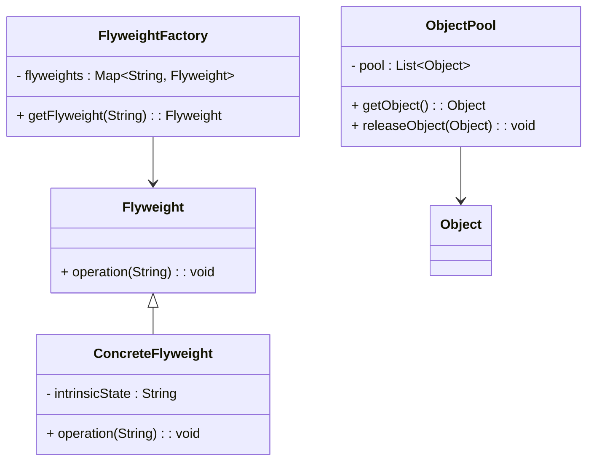

## 3.7.3 Object Pool vs. Flyweight Pattern

In the realm of software design patterns, the Object Pool and Flyweight patterns are both instrumental in optimizing resource usage. However, they achieve this goal in distinct ways and are suitable for different scenarios. In this section, we will explore these two patterns, compare their functionalities, and provide guidance on when to use each.

### Understanding the Object Pool Pattern

The Object Pool pattern is a creational design pattern that focuses on reusing objects that are expensive to create. This pattern is particularly useful in scenarios where object creation is costly in terms of time or resources, and the number of instances in use at any given time is limited.

#### Key Characteristics of Object Pool Pattern

- **Reusability**: Objects are reused rather than created and destroyed, reducing the overhead of object creation.
- **Resource Management**: Helps manage limited resources, such as database connections or thread pools.
- **Lifecycle Control**: The pool manages the lifecycle of objects, ensuring that they are properly initialized and cleaned up before reuse.

#### Example Use Cases for Object Pool Pattern

1. **Database Connection Pools**: Managing a pool of database connections to avoid the overhead of establishing a new connection for each request.
2. **Thread Pools**: Reusing threads for executing tasks, which is more efficient than creating a new thread for each task.
3. **Graphics and Game Development**: Reusing complex graphical objects or game entities to improve performance.

#### Java Implementation of Object Pool Pattern

Let's consider a simple implementation of an object pool for database connections:

```java
import java.sql.Connection;
import java.sql.DriverManager;
import java.sql.SQLException;
import java.util.concurrent.BlockingQueue;
import java.util.concurrent.LinkedBlockingQueue;

public class ConnectionPool {
    private BlockingQueue<Connection> pool;
    private static final int MAX_POOL_SIZE = 10;
    private String url;
    private String user;
    private String password;

    public ConnectionPool(String url, String user, String password) {
        this.url = url;
        this.user = user;
        this.password = password;
        pool = new LinkedBlockingQueue<>(MAX_POOL_SIZE);
        for (int i = 0; i < MAX_POOL_SIZE; i++) {
            try {
                pool.add(createNewConnection());
            } catch (SQLException e) {
                e.printStackTrace();
            }
        }
    }

    private Connection createNewConnection() throws SQLException {
        return DriverManager.getConnection(url, user, password);
    }

    public Connection getConnection() throws InterruptedException {
        return pool.take();
    }

    public void releaseConnection(Connection connection) {
        if (connection != null) {
            pool.offer(connection);
        }
    }
}
```

### Understanding the Flyweight Pattern

The Flyweight pattern is a structural design pattern that focuses on minimizing memory usage by sharing as much data as possible with similar objects. This pattern is particularly useful when dealing with a large number of objects that share common data.

#### Key Characteristics of Flyweight Pattern

- **Intrinsic and Extrinsic State**: Separates shared (intrinsic) state from unique (extrinsic) state.
- **Memory Efficiency**: Reduces memory footprint by sharing common data among multiple objects.
- **Fine-Grained Objects**: Ideal for scenarios with many small objects that can share data.

#### Example Use Cases for Flyweight Pattern

1. **Text Editors**: Sharing character glyphs among multiple text documents.
2. **Game Development**: Sharing textures or models among multiple game entities.
3. **GUI Applications**: Reusing UI components with shared properties.

#### Java Implementation of Flyweight Pattern

Let's consider a simple implementation of the Flyweight pattern for a text editor:

```java
import java.util.HashMap;
import java.util.Map;

interface Glyph {
    void draw(String context);
}

class Character implements Glyph {
    private char symbol;

    public Character(char symbol) {
        this.symbol = symbol;
    }

    @Override
    public void draw(String context) {
        System.out.println("Drawing " + symbol + " in context: " + context);
    }
}

class GlyphFactory {
    private Map<Character, Glyph> glyphs = new HashMap<>();

    public Glyph getGlyph(char symbol) {
        Glyph glyph = glyphs.get(symbol);
        if (glyph == null) {
            glyph = new Character(symbol);
            glyphs.put(symbol, glyph);
        }
        return glyph;
    }
}
```

### Comparing Object Pool and Flyweight Patterns

Now that we have a basic understanding of both patterns, let's compare them to highlight their differences and similarities.

#### Intent and Purpose

- **Object Pool Pattern**: Focuses on reusing heavyweight objects to reduce the overhead of creation and destruction. It is suitable for managing resources that are expensive to acquire and release.
- **Flyweight Pattern**: Aims to minimize memory usage by sharing common data among many lightweight objects. It is ideal for scenarios with a large number of similar objects that can share intrinsic state.

#### Resource Optimization

- **Object Pool**: Optimizes resource usage by reusing objects, thus reducing the need for frequent allocation and deallocation.
- **Flyweight**: Optimizes memory usage by sharing intrinsic state among objects, reducing the overall memory footprint.

#### Use Cases

- **Object Pool**: Suitable for scenarios with limited resources, such as database connections, threads, or network sockets.
- **Flyweight**: Suitable for scenarios with many similar objects, such as characters in a text editor, game entities, or UI components.

#### Implementation Complexity

- **Object Pool**: Typically involves managing a pool of objects, which can be complex if the objects require synchronization or have complex lifecycles.
- **Flyweight**: Involves separating intrinsic and extrinsic state, which can add complexity in managing the shared data.

### When to Choose Object Pool vs. Flyweight

Choosing between the Object Pool and Flyweight patterns depends on the specific requirements of your application. Here are some guidelines to help you decide:

- **Choose Object Pool** when:
  - You need to manage a limited number of expensive-to-create objects.
  - The objects have a significant cost associated with creation and destruction.
  - You need to control the lifecycle of objects to ensure proper initialization and cleanup.

- **Choose Flyweight** when:
  - You have a large number of similar objects that can share common data.
  - Memory usage is a concern, and you want to minimize the memory footprint.
  - The objects can be divided into intrinsic and extrinsic state, allowing for data sharing.

### Visualizing the Differences

Let's use a diagram to visualize the differences between the Object Pool and Flyweight patterns:



### Try It Yourself

To deepen your understanding of these patterns, try modifying the code examples provided:

- **For Object Pool**: Experiment with different pool sizes and observe the impact on performance.
- **For Flyweight**: Add more glyphs to the `GlyphFactory` and see how it affects memory usage.

### References and Further Reading

- [Java Design Patterns](https://www.oracle.com/java/technologies/javase/design-patterns.html)
- [Flyweight Pattern on Wikipedia](https://en.wikipedia.org/wiki/Flyweight_pattern)
- [Object Pool Pattern on Wikipedia](https://en.wikipedia.org/wiki/Object_pool_pattern)

### Knowledge Check

Before we conclude, let's reinforce what we've learned with a few questions.

## Quiz Time!



### Which pattern is best suited for managing a limited number of expensive-to-create objects?

- [x] Object Pool Pattern
- [ ] Flyweight Pattern
- [ ] Singleton Pattern
- [ ] Factory Pattern

> **Explanation:** The Object Pool pattern is designed to manage a limited number of expensive-to-create objects by reusing them.

### What is the primary goal of the Flyweight pattern?

- [ ] Reusing heavyweight objects
- [x] Minimizing memory usage
- [ ] Managing object lifecycles
- [ ] Simplifying object creation

> **Explanation:** The Flyweight pattern aims to minimize memory usage by sharing intrinsic state among many lightweight objects.

### Which pattern involves separating intrinsic and extrinsic state?

- [ ] Object Pool Pattern
- [x] Flyweight Pattern
- [ ] Singleton Pattern
- [ ] Builder Pattern

> **Explanation:** The Flyweight pattern involves separating intrinsic (shared) and extrinsic (unique) state to optimize memory usage.

### In which scenario would you choose the Object Pool pattern?

- [x] When managing database connections
- [ ] When sharing character glyphs
- [ ] When creating a large number of similar objects
- [ ] When implementing a singleton

> **Explanation:** The Object Pool pattern is suitable for managing resources like database connections, which are expensive to create and destroy.

### Which pattern is ideal for scenarios with many similar objects?

- [ ] Object Pool Pattern
- [x] Flyweight Pattern
- [ ] Singleton Pattern
- [ ] Factory Pattern

> **Explanation:** The Flyweight pattern is ideal for scenarios with many similar objects that can share common data.

### What is a key characteristic of the Object Pool pattern?

- [x] Reusability of objects
- [ ] Sharing intrinsic state
- [ ] Simplifying object creation
- [ ] Encapsulation of construction logic

> **Explanation:** The Object Pool pattern focuses on reusability by managing a pool of objects to reduce creation overhead.

### Which pattern would you use to optimize memory usage in a text editor?

- [ ] Object Pool Pattern
- [x] Flyweight Pattern
- [ ] Singleton Pattern
- [ ] Factory Pattern

> **Explanation:** The Flyweight pattern is used to optimize memory usage by sharing character glyphs in a text editor.

### What is a common use case for the Flyweight pattern?

- [ ] Managing thread pools
- [x] Sharing textures in game development
- [ ] Handling database connections
- [ ] Implementing a singleton

> **Explanation:** The Flyweight pattern is commonly used in game development to share textures among multiple game entities.

### Which pattern is more complex to implement due to managing shared data?

- [ ] Object Pool Pattern
- [x] Flyweight Pattern
- [ ] Singleton Pattern
- [ ] Builder Pattern

> **Explanation:** The Flyweight pattern can be complex due to the need to manage shared intrinsic data and separate it from extrinsic state.

### True or False: Both Object Pool and Flyweight patterns aim to optimize resource usage.

- [x] True
- [ ] False

> **Explanation:** Both patterns aim to optimize resource usage, but they do so through different means: Object Pool focuses on reusing objects, while Flyweight focuses on sharing data.



Remember, understanding these patterns is just the beginning. As you continue your journey in software engineering, you'll find opportunities to apply these patterns in various contexts. Keep experimenting, stay curious, and enjoy the process of learning and growing as a developer!
