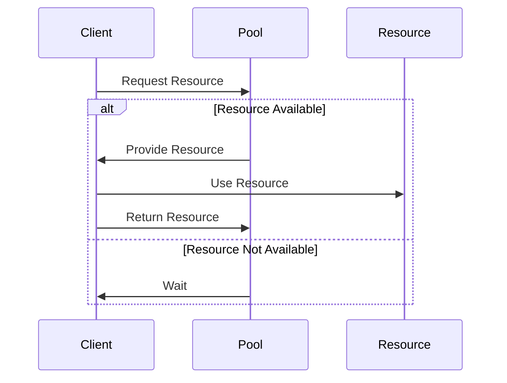

## 3.7.4 Use Cases and Examples

In the realm of software engineering, efficient resource management is paramount, especially when dealing with objects that are expensive to create and manage. The Object Pool Pattern is a creational design pattern that addresses this need by reusing objects that are costly to instantiate. This section delves into practical use cases of the Object Pool Pattern, focusing on thread pools, database connection pools, and socket pools, while providing detailed examples and code snippets to illustrate its implementation in Java.

### Understanding the Object Pool Pattern

Before we dive into specific use cases, let's briefly revisit what the Object Pool Pattern entails. This pattern involves creating a pool of reusable objects that clients can borrow and return, thus minimizing the overhead of object creation and destruction. It is particularly useful in scenarios where:

- **Object creation is costly**: For instance, establishing a database connection or creating a new thread.
- **Frequent object creation and destruction**: This can lead to significant performance bottlenecks.
- **Limited resources**: Such as a limited number of database connections or network sockets.

### Use Case 1: Thread Pools in Concurrent Applications

#### Why Use Thread Pools?

In concurrent applications, managing threads efficiently is crucial for performance and resource optimization. Creating and destroying threads repeatedly can be resource-intensive and lead to performance degradation. Thread pools address this by maintaining a pool of threads that can be reused for executing tasks.

#### Implementing a Thread Pool in Java

Java provides robust support for thread pools through the `java.util.concurrent` package. The `ExecutorService` interface and its implementations, such as `ThreadPoolExecutor`, facilitate the creation and management of thread pools.

```java
import java.util.concurrent.ExecutorService;
import java.util.concurrent.Executors;

public class ThreadPoolExample {
    public static void main(String[] args) {
        // Create a thread pool with a fixed number of threads
        ExecutorService executor = Executors.newFixedThreadPool(5);

        // Submit tasks to the executor
        for (int i = 0; i < 10; i++) {
            executor.submit(() -> {
                System.out.println("Executing task: " + Thread.currentThread().getName());
                // Simulate task processing
                try {
                    Thread.sleep(1000);
                } catch (InterruptedException e) {
                    Thread.currentThread().interrupt();
                }
            });
        }

        // Shutdown the executor
        executor.shutdown();
    }
}
```

In this example, a fixed thread pool with 5 threads is created. Tasks are submitted to the pool, and threads are reused to execute these tasks, reducing the overhead of thread creation.

#### Benefits of Using Thread Pools

- **Improved Performance**: By reusing threads, the application avoids the overhead of creating and destroying threads.
- **Resource Management**: Limits the number of concurrent threads, preventing resource exhaustion.
- **Scalability**: Easily scales with the number of tasks by adjusting the pool size.

### Use Case 2: Database Connection Pools in Web Servers

#### The Need for Connection Pools

Database connections are expensive to establish and maintain. In web applications, where multiple users may request data simultaneously, creating a new connection for each request can lead to latency and resource exhaustion. Connection pools mitigate this by reusing existing connections.

#### Implementing a Database Connection Pool in Java

Java applications often use libraries like HikariCP or Apache DBCP to manage database connection pools. Here's an example using HikariCP:

```java
import com.zaxxer.hikari.HikariConfig;
import com.zaxxer.hikari.HikariDataSource;

import java.sql.Connection;
import java.sql.SQLException;

public class ConnectionPoolExample {
    private static HikariDataSource dataSource;

    static {
        HikariConfig config = new HikariConfig();
        config.setJdbcUrl("jdbc:mysql://localhost:3306/mydatabase");
        config.setUsername("user");
        config.setPassword("password");
        config.setMaximumPoolSize(10);

        dataSource = new HikariDataSource(config);
    }

    public static Connection getConnection() throws SQLException {
        return dataSource.getConnection();
    }

    public static void main(String[] args) {
        try (Connection connection = getConnection()) {
            System.out.println("Connection obtained: " + connection);
            // Perform database operations
        } catch (SQLException e) {
            e.printStackTrace();
        }
    }
}
```

This example demonstrates setting up a connection pool using HikariCP. The pool is configured with a maximum size, and connections are obtained from the pool for database operations.

#### Benefits of Using Connection Pools

- **Reduced Latency**: Connections are reused, reducing the time taken to establish new connections.
- **Efficient Resource Utilization**: Limits the number of open connections, preventing database overload.
- **Scalability**: Supports high concurrency by efficiently managing connections.

### Use Case 3: Socket Pools in Network Applications

#### Importance of Socket Pools

Network applications often require multiple socket connections for communication. Creating and destroying sockets for each communication can be inefficient and lead to performance issues. Socket pools allow for the reuse of socket connections.

#### Implementing a Socket Pool in Java

While Java does not provide a built-in socket pool, you can implement one using a similar approach to thread and connection pools. Here's a basic example:

```java
import java.io.IOException;
import java.net.Socket;
import java.util.concurrent.ArrayBlockingQueue;
import java.util.concurrent.BlockingQueue;

public class SocketPool {
    private final BlockingQueue<Socket> pool;

    public SocketPool(int poolSize, String host, int port) throws IOException {
        pool = new ArrayBlockingQueue<>(poolSize);
        for (int i = 0; i < poolSize; i++) {
            pool.add(new Socket(host, port));
        }
    }

    public Socket borrowSocket() throws InterruptedException {
        return pool.take();
    }

    public void returnSocket(Socket socket) {
        if (socket != null) {
            pool.offer(socket);
        }
    }

    public static void main(String[] args) {
        try {
            SocketPool socketPool = new SocketPool(5, "localhost", 8080);
            Socket socket = socketPool.borrowSocket();
            // Use the socket for communication
            socketPool.returnSocket(socket);
        } catch (IOException | InterruptedException e) {
            e.printStackTrace();
        }
    }
}
```

In this example, a pool of socket connections is created. Sockets are borrowed from the pool for communication and returned after use.

#### Benefits of Using Socket Pools

- **Reduced Overhead**: Reusing sockets reduces the cost of creating and destroying connections.
- **Improved Performance**: Minimizes latency in network communication.
- **Resource Management**: Controls the number of active socket connections.

### Visualizing Object Pool Pattern

To better understand the flow of the Object Pool Pattern, let's visualize it using a sequence diagram.



This diagram illustrates the interaction between the client, the pool, and the resource. The client requests a resource from the pool, uses it, and returns it to the pool. If no resources are available, the client waits until one becomes available.

### Encouraging Object Pooling in Your Applications

As we have seen, object pooling is a powerful pattern for managing expensive resources efficiently. Here are some key takeaways and considerations for implementing object pooling in your applications:

- **Identify Expensive Resources**: Determine which resources in your application are costly to create and manage.
- **Evaluate Pooling Libraries**: Use existing libraries and frameworks that provide pooling mechanisms, such as `ExecutorService` for threads and HikariCP for database connections.
- **Configure Pools Appropriately**: Set pool sizes and configurations based on your application's concurrency and resource requirements.
- **Monitor and Tune**: Continuously monitor the performance of your pools and adjust configurations as needed to optimize resource utilization.

### Try It Yourself

To deepen your understanding of the Object Pool Pattern, try modifying the examples provided:

- **Experiment with Different Pool Sizes**: Change the pool size in the thread pool and connection pool examples to see how it affects performance.
- **Implement a Custom Object Pool**: Create a pool for a different type of resource, such as file handles or custom objects.
- **Integrate with a Real Application**: Use the connection pool example in a simple web application to see how it improves performance under load.

### Conclusion

The Object Pool Pattern is an essential tool in the software engineer's toolkit, offering significant benefits in terms of performance, resource management, and scalability. By understanding and applying this pattern, you can optimize the use of expensive resources in your applications, leading to more efficient and responsive systems.

## Quiz Time!



### What is the primary purpose of the Object Pool Pattern?

- [x] To reuse objects that are expensive to create
- [ ] To create new objects for each request
- [ ] To destroy objects after use
- [ ] To limit the number of objects in an application

> **Explanation:** The Object Pool Pattern is designed to reuse objects that are costly to create, reducing the overhead of object creation and destruction.

### Which Java package provides support for thread pools?

- [x] java.util.concurrent
- [ ] java.util.thread
- [ ] java.lang.thread
- [ ] java.concurrent.thread

> **Explanation:** The `java.util.concurrent` package provides support for thread pools and other concurrency utilities.

### What is a key benefit of using a database connection pool?

- [x] Reduced latency in establishing connections
- [ ] Increased number of database connections
- [ ] Faster database queries
- [ ] Simplified database schema

> **Explanation:** Connection pools reduce latency by reusing existing connections, avoiding the overhead of establishing new connections for each request.

### In the context of socket pools, what is a primary advantage?

- [x] Reduced overhead of creating and destroying sockets
- [ ] Increased number of sockets
- [ ] Faster data transmission
- [ ] Simplified network protocol

> **Explanation:** Socket pools reduce the overhead of creating and destroying sockets by reusing existing connections.

### What is a common library for managing database connection pools in Java?

- [x] HikariCP
- [ ] Apache Commons
- [ ] Log4j
- [ ] JUnit

> **Explanation:** HikariCP is a popular library for managing database connection pools in Java applications.

### Which method is used to submit tasks to a thread pool in Java?

- [x] submit()
- [ ] execute()
- [ ] run()
- [ ] start()

> **Explanation:** The `submit()` method is used to submit tasks to a thread pool for execution.

### What does the `ExecutorService` interface in Java provide?

- [x] A framework for managing thread pools
- [ ] A method for creating new threads
- [ ] A utility for synchronizing threads
- [ ] A tool for debugging threads

> **Explanation:** The `ExecutorService` interface provides a framework for managing thread pools and executing tasks asynchronously.

### How can you obtain a connection from a HikariCP connection pool?

- [x] Using the `getConnection()` method
- [ ] Using the `openConnection()` method
- [ ] Using the `createConnection()` method
- [ ] Using the `connect()` method

> **Explanation:** The `getConnection()` method is used to obtain a connection from a HikariCP connection pool.

### What is a key consideration when configuring an object pool?

- [x] Setting the appropriate pool size
- [ ] Choosing the fastest algorithm
- [ ] Minimizing the number of objects
- [ ] Maximizing the number of threads

> **Explanation:** Setting the appropriate pool size is crucial to ensure efficient resource utilization and performance.

### True or False: Object pooling is only useful for managing database connections.

- [ ] True
- [x] False

> **Explanation:** Object pooling is useful for managing various types of expensive resources, including threads, sockets, and custom objects.



Remember, mastering the Object Pool Pattern is just one step in your journey to becoming an expert software engineer. Keep exploring, experimenting, and applying these concepts to build efficient and scalable applications.
