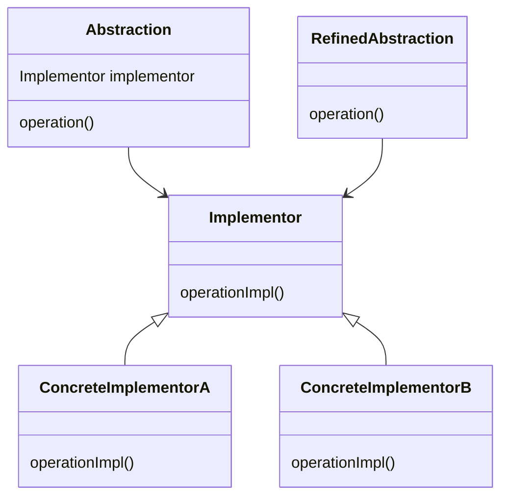

## 3.7.8 Indirection

### Introduction to Indirection

The **Indirection** principle is a fundamental concept in software design that involves using intermediary objects to decouple classes and promote reuse. By introducing a level of indirection, developers can create more flexible and maintainable code structures. This principle is particularly valuable in large-scale applications where direct dependencies between classes can lead to tightly coupled systems that are difficult to modify and extend.

### Defining the Indirection Principle

Indirection is the practice of inserting an intermediary between two entities to reduce direct dependencies. This intermediary, often referred to as a "mediator" or "proxy," acts as a go-between, handling interactions and communications. The primary goal of indirection is to achieve **decoupling**, which allows for greater flexibility and reusability in software design.

### Benefits of Indirection

- **Decoupling**: By reducing direct dependencies, indirection allows components to change independently without affecting others.
- **Reusability**: Intermediary objects can be reused across different parts of an application, promoting code reuse.
- **Flexibility**: Indirection enables more flexible code structures, making it easier to introduce new features or modify existing ones.
- **Maintainability**: Decoupled systems are generally easier to maintain and extend, as changes in one part of the system do not ripple through the entire codebase.

### Illustrating Indirection with Examples

Consider a scenario where a client needs to interact with a service. Without indirection, the client would directly depend on the service, leading to a tightly coupled system. By introducing an intermediary, such as a proxy, the client can interact with the proxy instead, which in turn communicates with the service.

#### Example: Indirection with a Proxy

```java
// Service interface
interface Service {
    void performOperation();
}

// Real service implementation
class RealService implements Service {
    @Override
    public void performOperation() {
        System.out.println("Performing operation in RealService");
    }
}

// Proxy class
class ServiceProxy implements Service {
    private RealService realService;

    @Override
    public void performOperation() {
        if (realService == null) {
            realService = new RealService();
        }
        System.out.println("Proxy: Delegating operation to RealService");
        realService.performOperation();
    }
}

// Client code
public class Client {
    public static void main(String[] args) {
        Service service = new ServiceProxy();
        service.performOperation();
    }
}
```

In this example, the `ServiceProxy` acts as an intermediary between the client and the `RealService`. The client interacts with the proxy, which manages the instantiation and delegation of operations to the real service.

### Trade-offs of Introducing Indirection

While indirection offers numerous benefits, it also introduces certain trade-offs that developers must consider:

- **Added Complexity**: Introducing intermediary objects can increase the complexity of the system, making it harder to understand and debug.
- **Performance Overhead**: Indirection can introduce additional layers of abstraction, potentially impacting performance.
- **Overuse**: Excessive use of indirection can lead to an over-engineered system with unnecessary complexity.

### Relating Indirection to Design Patterns

Indirection is a key principle in several design patterns, including the **Bridge** and **Proxy** patterns. These patterns leverage indirection to achieve specific design goals.

#### Bridge Pattern

The Bridge pattern separates an abstraction from its implementation, allowing them to vary independently. It uses indirection to decouple the abstraction from the implementation, promoting flexibility and extensibility.



*Diagram: The Bridge pattern uses indirection to separate an abstraction from its implementation.*

#### Proxy Pattern

The Proxy pattern provides a surrogate or placeholder for another object, controlling access to it. It uses indirection to manage access and add additional behavior without modifying the original object.

### Guidance on Applying Indirection Effectively

To apply indirection effectively, consider the following guidelines:

- **Identify Direct Dependencies**: Look for areas in your code where classes are tightly coupled and consider introducing an intermediary to decouple them.
- **Evaluate Complexity**: Weigh the benefits of decoupling against the added complexity of introducing indirection.
- **Use Design Patterns**: Leverage design patterns like Bridge and Proxy to implement indirection in a structured and maintainable way.
- **Avoid Overuse**: Use indirection judiciously to avoid unnecessary complexity and performance overhead.

### Conclusion

The Indirection principle is a powerful tool for achieving decoupling and promoting reusability in software design. By introducing intermediary objects, developers can create more flexible and maintainable code structures. However, it is essential to balance the benefits of indirection with the potential trade-offs of added complexity and performance overhead. By understanding and applying indirection effectively, developers can build robust and adaptable systems that are easier to maintain and extend.

### Key Takeaways

- Indirection reduces direct dependencies, promoting decoupling and reusability.
- It is a core principle in design patterns like Bridge and Proxy.
- While beneficial, indirection can introduce complexity and performance overhead.
- Apply indirection judiciously to achieve a balance between flexibility and simplicity.

### Exercises

1. Implement a simple caching mechanism using the Proxy pattern to demonstrate indirection.
2. Refactor a tightly coupled system by introducing a mediator to decouple components.
3. Analyze a real-world system and identify areas where indirection could improve flexibility and maintainability.

### Reflection

Consider how the Indirection principle can be applied to your current projects. Are there areas where introducing an intermediary could reduce dependencies and improve maintainability? How can you leverage design patterns to implement indirection effectively?

## Test Your Knowledge: Indirection in Java Design Patterns



### What is the primary goal of the Indirection principle?

- [x] To decouple classes and promote reuse
- [ ] To increase performance
- [ ] To simplify code
- [ ] To add more features

> **Explanation:** The primary goal of the Indirection principle is to decouple classes and promote reuse by introducing intermediary objects.

### Which design pattern uses indirection to separate an abstraction from its implementation?

- [x] Bridge Pattern
- [ ] Singleton Pattern
- [ ] Observer Pattern
- [ ] Factory Pattern

> **Explanation:** The Bridge pattern uses indirection to separate an abstraction from its implementation, allowing them to vary independently.

### What is a potential drawback of introducing indirection?

- [x] Added complexity
- [ ] Increased simplicity
- [ ] Reduced flexibility
- [ ] Decreased maintainability

> **Explanation:** A potential drawback of introducing indirection is added complexity, which can make the system harder to understand and debug.

### In the Proxy pattern, what role does the proxy play?

- [x] It acts as a surrogate or placeholder for another object.
- [ ] It directly implements the client's functionality.
- [ ] It simplifies the client's interface.
- [ ] It reduces the number of classes.

> **Explanation:** In the Proxy pattern, the proxy acts as a surrogate or placeholder for another object, controlling access to it.

### How does indirection promote reusability?

- [x] By allowing intermediary objects to be reused across different parts of an application
- [ ] By reducing the number of classes
- [ ] By simplifying the code
- [ ] By increasing performance

> **Explanation:** Indirection promotes reusability by allowing intermediary objects to be reused across different parts of an application.

### Which of the following is a benefit of using indirection?

- [x] Decoupling
- [ ] Increased complexity
- [ ] Reduced flexibility
- [ ] Decreased maintainability

> **Explanation:** A benefit of using indirection is decoupling, which allows components to change independently without affecting others.

### When should you consider using indirection?

- [x] When classes are tightly coupled and need to be decoupled
- [ ] When you want to increase performance
- [ ] When you want to simplify the code
- [ ] When you want to add more features

> **Explanation:** You should consider using indirection when classes are tightly coupled and need to be decoupled to improve flexibility and maintainability.

### What is the role of a mediator in indirection?

- [x] To act as an intermediary between two entities
- [ ] To directly implement the client's functionality
- [ ] To simplify the client's interface
- [ ] To reduce the number of classes

> **Explanation:** The role of a mediator in indirection is to act as an intermediary between two entities, reducing direct dependencies.

### How can indirection impact performance?

- [x] It can introduce additional layers of abstraction, potentially impacting performance.
- [ ] It always increases performance.
- [ ] It simplifies the code, improving performance.
- [ ] It has no impact on performance.

> **Explanation:** Indirection can introduce additional layers of abstraction, potentially impacting performance.

### True or False: Indirection should be used excessively to achieve maximum decoupling.

- [ ] True
- [x] False

> **Explanation:** Indirection should not be used excessively, as it can lead to unnecessary complexity and performance overhead.



By understanding and applying the Indirection principle effectively, developers can create more robust and adaptable systems that are easier to maintain and extend.
