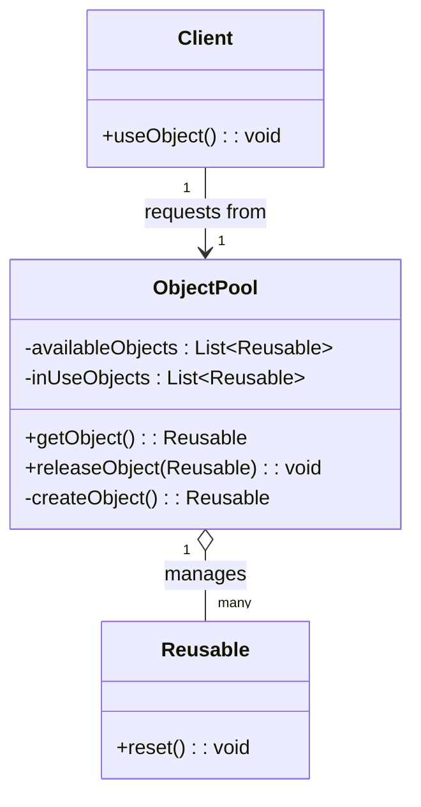
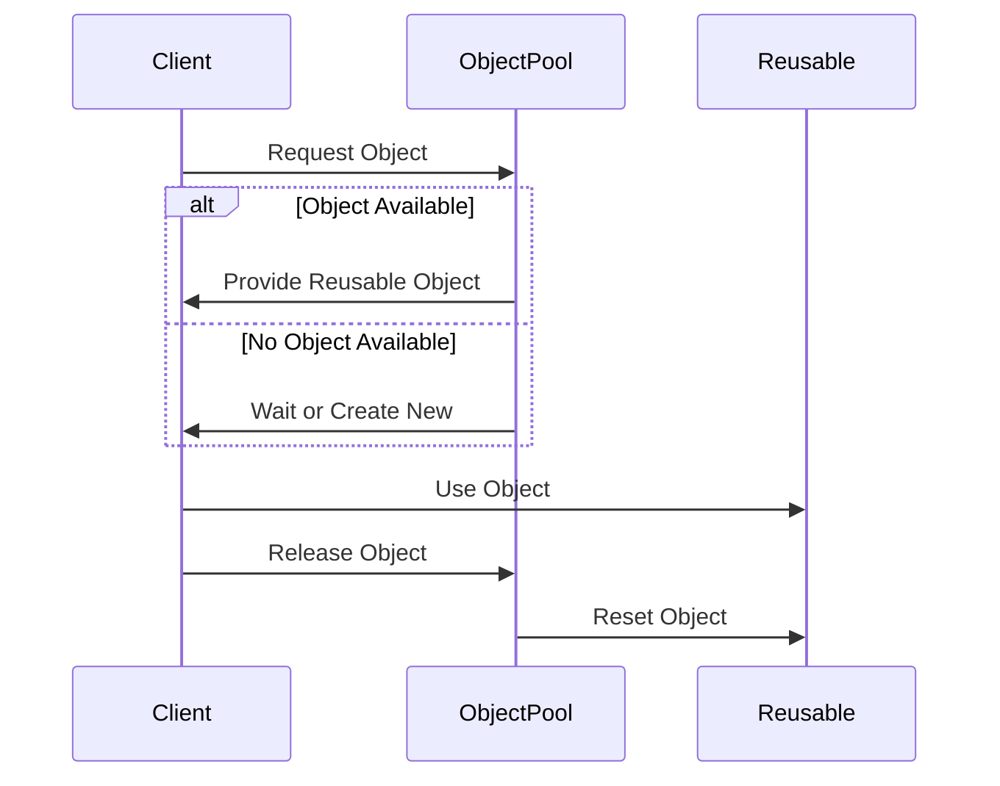

## 3.7 Object Pool Pattern

In the realm of software design, efficiency and resource management are paramount, especially in high-load environments where performance can make or break an application. The Object Pool Pattern is a creational design pattern that addresses these concerns by managing a pool of reusable objects. This pattern is particularly beneficial when the cost of creating and destroying objects is high, and when you need to manage resources efficiently.

### Introduction to the Object Pool Pattern

The Object Pool Pattern is designed to optimize resource utilization by reusing objects that are expensive to create. Instead of instantiating a new object every time one is needed, the pattern provides a pool of pre-created objects that can be reused. This approach minimizes the overhead of object creation and destruction, leading to improved performance and reduced resource consumption.

#### Intent of the Object Pool Pattern

The primary intent of the Object Pool Pattern is to manage a set of initialized objects that are ready to use. When a client needs an object, it requests one from the pool. Once the client is done with the object, it returns it to the pool for future use. This reuse of objects is particularly advantageous in scenarios where object creation is costly in terms of time or system resources.

### Problem Solved by the Object Pool Pattern

In many applications, certain objects are expensive to create due to complex initialization processes, resource allocation, or network operations. For instance, database connections, thread pools, and large data structures often require significant resources to instantiate. Creating and destroying these objects repeatedly can lead to performance bottlenecks and increased garbage collection overhead.

The Object Pool Pattern solves this problem by maintaining a pool of reusable objects. By reusing objects, the pattern reduces the need for frequent creation and destruction, thereby improving application performance and resource utilization.

### How the Object Pool Pattern Works

The Object Pool Pattern works by maintaining a pool of objects that can be reused by clients. When a client needs an object, it requests one from the pool. If an object is available, the pool provides it to the client. If no objects are available, the pool can either create a new object or wait for one to be returned. Once the client is finished with the object, it returns it to the pool for future use.

#### Components of the Object Pool Pattern

The Object Pool Pattern consists of several key components:

1. **Pool**: The central component that manages the lifecycle of reusable objects. It handles requests from clients, provides objects, and manages the return of objects to the pool.

2. **Client**: The entity that requests objects from the pool and uses them for specific tasks. The client is responsible for returning the object to the pool once it is no longer needed.

3. **Reusable Object**: The object that is managed by the pool. These objects are typically expensive to create and are reused to optimize performance.

### UML Diagram of the Object Pool Pattern

To better understand the relationships and workflows within the Object Pool Pattern, let's examine a UML diagram that illustrates the pattern's structure:



**Diagram Explanation**: 
- The `ObjectPool` class manages a collection of `Reusable` objects. It provides methods to get and release objects.
- The `Reusable` class represents the objects that are being pooled. These objects have a `reset` method to prepare them for reuse.
- The `Client` class interacts with the `ObjectPool` to obtain and use `Reusable` objects.

### Scenarios for Using the Object Pool Pattern

The Object Pool Pattern is particularly beneficial in scenarios where:

- **High Resource Cost**: Objects are expensive to create or destroy, such as database connections or network sockets.
- **Frequent Use**: Objects are used frequently and repeatedly, making it inefficient to create and destroy them each time.
- **Limited Resources**: The system has limited resources, and efficient resource management is crucial for performance.

### Implementation Details and Considerations

Implementing the Object Pool Pattern requires careful consideration of several factors:

- **Thread Safety**: Ensure that the pool is thread-safe if it will be accessed by multiple threads simultaneously.
- **Object Lifecycle**: Manage the lifecycle of pooled objects, including initialization, reset, and cleanup.
- **Pool Size**: Determine the optimal size of the pool to balance resource utilization and performance.
- **Timeouts and Limits**: Implement timeouts and limits to handle scenarios where objects are not returned to the pool promptly.

In the following sections, we will delve into the implementation of the Object Pool Pattern in Java, exploring code examples, best practices, and real-world applications.

### Code Example: Implementing an Object Pool in Java

Let's explore a practical implementation of the Object Pool Pattern in Java. We'll create a simple object pool for managing database connections.

```java
import java.sql.Connection;
import java.sql.DriverManager;
import java.sql.SQLException;
import java.util.ArrayList;
import java.util.List;

public class ConnectionPool {
    private List<Connection> availableConnections = new ArrayList<>();
    private List<Connection> inUseConnections = new ArrayList<>();
    private final int MAX_POOL_SIZE = 10;
    private final String URL = "jdbc:mysql://localhost:3306/mydatabase";
    private final String USER = "user";
    private final String PASSWORD = "password";

    public ConnectionPool() {
        for (int i = 0; i < MAX_POOL_SIZE; i++) {
            availableConnections.add(createConnection());
        }
    }

    private Connection createConnection() {
        try {
            return DriverManager.getConnection(URL, USER, PASSWORD);
        } catch (SQLException e) {
            throw new RuntimeException("Error creating connection", e);
        }
    }

    public synchronized Connection getConnection() {
        if (availableConnections.isEmpty()) {
            throw new RuntimeException("No available connections");
        }
        Connection connection = availableConnections.remove(availableConnections.size() - 1);
        inUseConnections.add(connection);
        return connection;
    }

    public synchronized void releaseConnection(Connection connection) {
        inUseConnections.remove(connection);
        availableConnections.add(connection);
    }
}
```

**Code Explanation**:
- The `ConnectionPool` class manages a pool of `Connection` objects.
- The constructor initializes the pool with a predefined number of connections.
- The `getConnection` method retrieves a connection from the pool, adding it to the list of in-use connections.
- The `releaseConnection` method returns a connection to the pool, making it available for future use.

### Try It Yourself

To experiment with the Object Pool Pattern, try modifying the code example to:

- **Increase the Pool Size**: Adjust the `MAX_POOL_SIZE` to see how it affects performance.
- **Add Timeout Handling**: Implement a timeout mechanism for obtaining connections.
- **Enhance Thread Safety**: Use Java's `ReentrantLock` or `Semaphore` to manage concurrent access to the pool.

### Visualizing the Object Pool Pattern in Action

To further illustrate the Object Pool Pattern, let's visualize the workflow of obtaining and releasing objects within the pool:



**Diagram Explanation**:
- The `Client` requests an object from the `ObjectPool`.
- If an object is available, the pool provides it to the client. Otherwise, it waits or creates a new object.
- The client uses the object and then releases it back to the pool.
- The pool resets the object, preparing it for future use.

### Benefits of the Object Pool Pattern

The Object Pool Pattern offers several benefits, including:

- **Performance Improvement**: By reusing objects, the pattern reduces the overhead of object creation and destruction, leading to improved performance.
- **Resource Optimization**: The pattern optimizes resource utilization by maintaining a pool of reusable objects.
- **Scalability**: The pattern enhances scalability by efficiently managing resources in high-load environments.

### Challenges and Considerations

While the Object Pool Pattern offers significant benefits, it also presents some challenges:

- **Complexity**: Implementing and managing an object pool can add complexity to the application.
- **Resource Management**: Proper management of pooled objects is crucial to avoid resource leaks and ensure optimal performance.
- **Thread Safety**: Ensuring thread safety in a multi-threaded environment can be challenging and requires careful design.

### Real-World Applications of the Object Pool Pattern

The Object Pool Pattern is widely used in various real-world applications, including:

- **Database Connection Pools**: Managing a pool of database connections to optimize resource utilization and improve performance.
- **Thread Pools**: Reusing threads to handle multiple tasks efficiently in concurrent applications.
- **Graphics and Game Development**: Reusing objects like sprites and textures to optimize performance in graphics-intensive applications.

### Conclusion

The Object Pool Pattern is a powerful tool for optimizing performance and resource utilization in software design. By managing a pool of reusable objects, the pattern reduces the overhead of object creation and destruction, leading to improved application performance and scalability. As you implement this pattern, consider the specific needs of your application and the challenges associated with managing pooled resources.

Remember, the journey of mastering design patterns is ongoing. Keep experimenting, stay curious, and enjoy the process of building efficient and scalable software solutions.

## Quiz Time!



### What is the primary intent of the Object Pool Pattern?

- [x] To manage a set of initialized objects that are ready to use.
- [ ] To create new objects for each client request.
- [ ] To destroy objects after each use.
- [ ] To limit the number of objects in an application.

> **Explanation:** The Object Pool Pattern aims to manage a set of reusable objects that are expensive to create, optimizing resource utilization.

### Which component of the Object Pool Pattern manages the lifecycle of reusable objects?

- [x] Pool
- [ ] Client
- [ ] Reusable Object
- [ ] Factory

> **Explanation:** The Pool is responsible for managing the lifecycle of reusable objects, including their creation, allocation, and return.

### In which scenario is the Object Pool Pattern particularly beneficial?

- [x] When objects are expensive to create and destroy.
- [ ] When objects are cheap to create.
- [ ] When objects are rarely used.
- [ ] When objects are immutable.

> **Explanation:** The Object Pool Pattern is beneficial when objects are expensive to create and destroy, as it reduces the overhead by reusing objects.

### What method is used to return an object to the pool in the provided Java example?

- [x] releaseConnection
- [ ] getConnection
- [ ] createConnection
- [ ] destroyConnection

> **Explanation:** The `releaseConnection` method is used to return a connection to the pool, making it available for future use.

### What is a key challenge when implementing the Object Pool Pattern?

- [x] Ensuring thread safety in a multi-threaded environment.
- [ ] Creating new objects for each request.
- [ ] Destroying objects after each use.
- [ ] Limiting the number of clients.

> **Explanation:** Ensuring thread safety is a key challenge when implementing the Object Pool Pattern, especially in a multi-threaded environment.

### What is the role of the Reusable Object in the Object Pool Pattern?

- [x] To be managed and reused by the pool.
- [ ] To manage the pool.
- [ ] To request objects from the pool.
- [ ] To destroy objects in the pool.

> **Explanation:** The Reusable Object is managed by the pool and is reused to optimize performance and resource utilization.

### How can the Object Pool Pattern improve performance?

- [x] By reducing the overhead of object creation and destruction.
- [ ] By creating new objects for each request.
- [ ] By destroying objects after each use.
- [ ] By limiting the number of clients.

> **Explanation:** The Object Pool Pattern improves performance by reusing objects, reducing the overhead associated with their creation and destruction.

### What is a common real-world application of the Object Pool Pattern?

- [x] Database connection pools
- [ ] Immutable objects
- [ ] Simple data structures
- [ ] Static methods

> **Explanation:** Database connection pools are a common real-world application of the Object Pool Pattern, as they manage a pool of reusable connections to optimize performance.

### True or False: The Object Pool Pattern is only useful in single-threaded environments.

- [ ] True
- [x] False

> **Explanation:** The Object Pool Pattern is useful in both single-threaded and multi-threaded environments, although thread safety must be considered in the latter.

### What is a potential downside of using the Object Pool Pattern?

- [x] Increased complexity in managing pooled objects.
- [ ] Reduced performance due to object reuse.
- [ ] Increased resource consumption.
- [ ] Limited scalability.

> **Explanation:** A potential downside of using the Object Pool Pattern is the increased complexity in managing the lifecycle and state of pooled objects.


