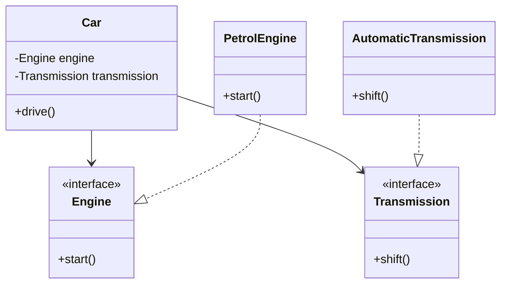

## 3.8.1 Implementing Dependency Injection in Java

Dependency Injection (DI) is a fundamental design pattern in software engineering that promotes loose coupling and enhances testability and maintainability. In Java, DI can be implemented using constructors, setters, and interfaces. This section will delve into each method, providing detailed explanations, code examples, and best practices for expert software engineers.

### Understanding Dependency Injection

Dependency Injection is a technique where an object receives its dependencies from an external source rather than creating them itself. This approach aligns with the Dependency Inversion Principle, one of the SOLID principles of object-oriented design, which states that high-level modules should not depend on low-level modules but on abstractions.

### Why Use Dependency Injection?

- **Loose Coupling**: By injecting dependencies, classes become less dependent on specific implementations, making them easier to change and extend.
- **Enhanced Testability**: Dependencies can be easily mocked or stubbed, facilitating unit testing.
- **Improved Maintainability**: Changes in dependencies do not require modifications in dependent classes.
- **Flexibility**: Different implementations of a dependency can be injected without altering the dependent class.

### Types of Dependency Injection

1. **Constructor Injection**
2. **Setter Injection**
3. **Interface Injection**

Each type has its use cases and advantages, which we will explore in detail.

### Constructor Injection

Constructor Injection involves passing dependencies through a class's constructor. This method ensures that a class is always fully initialized with its required dependencies.

#### Advantages of Constructor Injection

- **Immutability**: Dependencies are set at the time of object creation, promoting immutability.
- **Mandatory Dependencies**: Ensures that all required dependencies are provided, preventing incomplete object states.
- **Thread-Safety**: Immutable objects are inherently thread-safe.

#### Implementing Constructor Injection

Let's consider a simple example where we have a `Car` class that depends on an `Engine` and `Transmission`.

```java
// Engine interface
public interface Engine {
    void start();
}

// Transmission interface
public interface Transmission {
    void shift();
}

// Car class with constructor injection
public class Car {
    private final Engine engine;
    private final Transmission transmission;

    // Constructor Injection
    public Car(Engine engine, Transmission transmission) {
        this.engine = engine;
        this.transmission = transmission;
    }

    public void drive() {
        engine.start();
        transmission.shift();
        System.out.println("Car is driving");
    }
}

// Implementations of Engine and Transmission
public class PetrolEngine implements Engine {
    public void start() {
        System.out.println("Petrol engine started");
    }
}

public class AutomaticTransmission implements Transmission {
    public void shift() {
        System.out.println("Automatic transmission shifted");
    }
}

// Main class to demonstrate constructor injection
public class Main {
    public static void main(String[] args) {
        Engine engine = new PetrolEngine();
        Transmission transmission = new AutomaticTransmission();
        Car car = new Car(engine, transmission);
        car.drive();
    }
}
```

In this example, the `Car` class receives its dependencies (`Engine` and `Transmission`) through its constructor, ensuring that it cannot be instantiated without them.

#### When to Use Constructor Injection

- **Mandatory Dependencies**: When all dependencies are required for the object to function correctly.
- **Immutability**: When you want to create immutable objects.
- **Thread-Safety**: When thread safety is a concern.

### Setter Injection

Setter Injection involves providing dependencies through setter methods after the object is constructed. This method is useful for optional dependencies or when dependencies need to be changed after object creation.

#### Advantages of Setter Injection

- **Flexibility**: Allows changing dependencies at runtime.
- **Optional Dependencies**: Suitable for dependencies that are not mandatory.
- **Ease of Use**: Simple to implement and understand.

#### Implementing Setter Injection

Let's modify our `Car` example to use setter injection.

```java
// Car class with setter injection
public class Car {
    private Engine engine;
    private Transmission transmission;

    // Setter Injection
    public void setEngine(Engine engine) {
        this.engine = engine;
    }

    public void setTransmission(Transmission transmission) {
        this.transmission = transmission;
    }

    public void drive() {
        if (engine == null || transmission == null) {
            throw new IllegalStateException("Engine and Transmission must be set");
        }
        engine.start();
        transmission.shift();
        System.out.println("Car is driving");
    }
}

// Main class to demonstrate setter injection
public class Main {
    public static void main(String[] args) {
        Car car = new Car();
        car.setEngine(new PetrolEngine());
        car.setTransmission(new AutomaticTransmission());
        car.drive();
    }
}
```

In this example, the `Car` class allows its dependencies to be set via setter methods, providing flexibility in changing them after object creation.

#### When to Use Setter Injection

- **Optional Dependencies**: When dependencies are not mandatory for the object's functionality.
- **Runtime Flexibility**: When dependencies need to be changed at runtime.
- **Complex Initialization**: When dependencies require complex initialization that cannot be handled in the constructor.

### Interface Injection

Interface Injection involves defining an interface that provides a method for injecting dependencies. This method is less common in Java but can be useful in certain scenarios.

#### Advantages of Interface Injection

- **Decoupling**: Further decouples the dependency injection logic from the dependent class.
- **Flexibility**: Allows for more flexible dependency management.

#### Implementing Interface Injection

Let's extend our `Car` example to demonstrate interface injection.

```java
// DependencyInjector interface
public interface DependencyInjector {
    void inject(Car car);
}

// Concrete implementation of DependencyInjector
public class CarDependencyInjector implements DependencyInjector {
    public void inject(Car car) {
        car.setEngine(new PetrolEngine());
        car.setTransmission(new AutomaticTransmission());
    }
}

// Main class to demonstrate interface injection
public class Main {
    public static void main(String[] args) {
        Car car = new Car();
        DependencyInjector injector = new CarDependencyInjector();
        injector.inject(car);
        car.drive();
    }
}
```

In this example, the `CarDependencyInjector` class implements the `DependencyInjector` interface to inject dependencies into the `Car` class.

#### When to Use Interface Injection

- **Complex Dependency Management**: When managing dependencies through interfaces provides additional flexibility.
- **Framework Integration**: When integrating with frameworks that support interface injection.

### Handling Optional Dependencies

In some cases, dependencies may be optional. To handle optional dependencies:

- **Use Setter Injection**: This method naturally supports optional dependencies.
- **Default Implementations**: Provide default implementations for optional dependencies.
- **Null Checks**: Implement null checks to handle cases where optional dependencies are not provided.

### Managing Circular Dependencies

Circular dependencies occur when two or more classes depend on each other, creating a cycle. To manage circular dependencies:

- **Refactor Code**: Break the cycle by refactoring the code to remove direct dependencies.
- **Use Interfaces**: Introduce interfaces to decouple the dependencies.
- **Lazy Initialization**: Use lazy initialization to delay the creation of dependencies until they are needed.

### Best Practices for Implementing Dependency Injection

- **Favor Constructor Injection**: Use constructor injection for mandatory dependencies to ensure objects are fully initialized.
- **Use Setter Injection for Optional Dependencies**: This method provides flexibility in managing optional dependencies.
- **Avoid Circular Dependencies**: Refactor code to eliminate circular dependencies.
- **Design for Testability**: Use DI to enhance testability by allowing dependencies to be easily mocked.
- **Keep Classes Open for Extension but Closed for Modification**: Follow the Open/Closed Principle to design classes that can be extended without modifying existing code.

### Implementing Dependency Injection Without Frameworks

While frameworks like Spring provide powerful DI capabilities, it's important to understand how to implement DI manually. This knowledge enhances your understanding of DI principles and allows you to apply them in environments where frameworks are not available.

#### Manual Dependency Injection Example

Let's implement a simple DI container manually.

```java
// Simple DI container
public class SimpleDIContainer {
    private final Map<Class<?>, Object> services = new HashMap<>();

    public <T> void registerService(Class<T> serviceClass, T serviceInstance) {
        services.put(serviceClass, serviceInstance);
    }

    public <T> T getService(Class<T> serviceClass) {
        return serviceClass.cast(services.get(serviceClass));
    }
}

// Main class to demonstrate manual DI
public class Main {
    public static void main(String[] args) {
        SimpleDIContainer container = new SimpleDIContainer();
        container.registerService(Engine.class, new PetrolEngine());
        container.registerService(Transmission.class, new AutomaticTransmission());

        Engine engine = container.getService(Engine.class);
        Transmission transmission = container.getService(Transmission.class);

        Car car = new Car(engine, transmission);
        car.drive();
    }
}
```

In this example, we create a simple DI container that registers and retrieves services, demonstrating how DI can be implemented without frameworks.

### Try It Yourself

Experiment with the code examples provided:

- **Modify Dependencies**: Try changing the `Engine` and `Transmission` implementations to see how the `Car` class adapts.
- **Add New Dependencies**: Introduce a new dependency, such as `Fuel`, and implement it using different DI methods.
- **Handle Optional Dependencies**: Implement a feature where the `Car` can optionally have a `GPS` system.

### Visualizing Dependency Injection

To better understand the flow of dependencies in DI, let's visualize the process using a class diagram.



This diagram illustrates the relationships between the `Car`, `Engine`, and `Transmission` classes, highlighting how dependencies are injected.

### Conclusion

Implementing Dependency Injection in Java enhances the flexibility, testability, and maintainability of your code. By understanding and applying constructor, setter, and interface injection, you can design robust applications that adhere to best practices and design principles. Remember, this is just the beginning. As you progress, you'll build more complex and interactive applications. Keep experimenting, stay curious, and enjoy the journey!

## Quiz Time!



### What is the primary benefit of using Dependency Injection?

- [x] Loose coupling between classes
- [ ] Faster execution of code
- [ ] Reduced memory usage
- [ ] Simplified syntax

> **Explanation:** Dependency Injection promotes loose coupling by allowing dependencies to be injected externally, making classes less dependent on specific implementations.

### Which type of injection is best suited for mandatory dependencies?

- [x] Constructor Injection
- [ ] Setter Injection
- [ ] Interface Injection
- [ ] Field Injection

> **Explanation:** Constructor Injection is ideal for mandatory dependencies as it ensures that all required dependencies are provided at the time of object creation.

### What is a potential drawback of Setter Injection?

- [ ] Immutability
- [x] Incomplete object state
- [ ] Increased coupling
- [ ] Reduced flexibility

> **Explanation:** Setter Injection can lead to incomplete object states if required dependencies are not set before the object is used.

### How can circular dependencies be managed?

- [ ] By using more constructors
- [x] By refactoring code to remove direct dependencies
- [ ] By adding more dependencies
- [ ] By ignoring them

> **Explanation:** Circular dependencies can be managed by refactoring code to remove direct dependencies, often by introducing interfaces or using lazy initialization.

### Which method of injection allows for changing dependencies at runtime?

- [ ] Constructor Injection
- [x] Setter Injection
- [ ] Interface Injection
- [ ] Field Injection

> **Explanation:** Setter Injection allows for changing dependencies at runtime, providing flexibility in managing dependencies.

### What is a best practice when implementing DI without frameworks?

- [ ] Use only constructor injection
- [ ] Avoid using interfaces
- [x] Create a simple DI container
- [ ] Hard-code dependencies

> **Explanation:** Creating a simple DI container is a best practice when implementing DI without frameworks, as it helps manage dependencies systematically.

### What principle does Dependency Injection align with?

- [ ] Single Responsibility Principle
- [ ] Open/Closed Principle
- [x] Dependency Inversion Principle
- [ ] Liskov Substitution Principle

> **Explanation:** Dependency Injection aligns with the Dependency Inversion Principle, which states that high-level modules should depend on abstractions, not on low-level modules.

### Which injection method is less common in Java?

- [ ] Constructor Injection
- [ ] Setter Injection
- [x] Interface Injection
- [ ] Field Injection

> **Explanation:** Interface Injection is less common in Java compared to Constructor and Setter Injection.

### What is the role of a Dependency Injector in Interface Injection?

- [ ] To create dependencies
- [x] To inject dependencies into a class
- [ ] To manage memory
- [ ] To compile code

> **Explanation:** In Interface Injection, a Dependency Injector is responsible for injecting dependencies into a class.

### True or False: Dependency Injection can enhance the testability of code.

- [x] True
- [ ] False

> **Explanation:** True. Dependency Injection enhances testability by allowing dependencies to be easily mocked or stubbed, facilitating unit testing.


