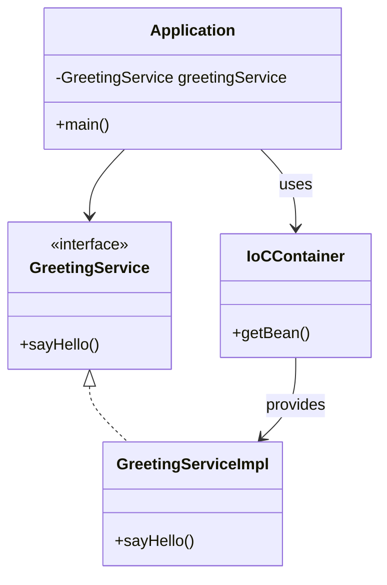

## 3.8.2 Inversion of Control Containers

In the realm of software engineering, particularly in Java application development, managing dependencies can become a daunting task as the complexity of the application grows. This is where **Inversion of Control (IoC) Containers** come into play, offering a structured way to manage object lifecycles and dependencies. In this section, we will delve into the concept of IoC containers, explore popular frameworks like Spring and Google Guice, and understand how they facilitate Dependency Injection (DI) to streamline application development.

### Understanding Inversion of Control (IoC)

**Inversion of Control (IoC)** is a design principle used to invert the control flow of a program. In traditional programming, the custom code calls into reusable libraries to accomplish tasks. However, in IoC, the framework takes control of the flow of the program and calls into the custom code. This principle is a cornerstone of Dependency Injection, where the control of creating and managing dependencies is transferred from the application code to a container or framework.

### What Are IoC Containers?

**IoC Containers** are frameworks that manage the instantiation, configuration, and lifecycle of objects in an application. They are responsible for injecting dependencies into objects at runtime, thus promoting loose coupling and enhancing testability. By using IoC containers, developers can focus on defining the relationships between objects rather than managing their lifecycles.

### Popular Java DI Frameworks

#### Spring Framework

The **Spring Framework** is one of the most popular Java frameworks that provides comprehensive infrastructure support for developing Java applications. It is renowned for its powerful IoC container and Dependency Injection capabilities. Spring allows developers to configure beans in a variety of ways, including XML, annotations, and Java-based configuration.

#### Google Guice

**Google Guice** is another popular DI framework for Java, developed by Google. It is known for its simplicity and ease of use. Guice uses annotations to define dependencies and is particularly appreciated for its lightweight nature and performance.

### Simplifying Dependency Management

IoC containers simplify dependency management by allowing developers to define dependencies externally, either through configuration files or annotations. This external configuration decouples the application components, making the system more modular and easier to maintain.

#### Configuration Files

In frameworks like Spring, XML configuration files can be used to define beans and their dependencies. This approach provides a clear separation between the configuration and the application logic.

#### Annotations

Modern DI frameworks, including Spring and Guice, support annotations to define dependencies directly in the code. This approach reduces the need for extensive configuration files and makes the code more readable.

### Configuring and Using DI Frameworks in Java Applications

Let's explore how to configure and use DI frameworks in Java applications with practical examples.

#### Example: Configuring Spring Framework

```java
// Define a simple service interface
public interface GreetingService {
    void sayHello();
}

// Implement the service interface
public class GreetingServiceImpl implements GreetingService {
    @Override
    public void sayHello() {
        System.out.println("Hello, World!");
    }
}

// Define a configuration class using annotations
import org.springframework.context.annotation.Bean;
import org.springframework.context.annotation.Configuration;

@Configuration
public class AppConfig {
    @Bean
    public GreetingService greetingService() {
        return new GreetingServiceImpl();
    }
}

// Main application class
import org.springframework.context.ApplicationContext;
import org.springframework.context.annotation.AnnotationConfigApplicationContext;

public class Application {
    public static void main(String[] args) {
        ApplicationContext context = new AnnotationConfigApplicationContext(AppConfig.class);
        GreetingService greetingService = context.getBean(GreetingService.class);
        greetingService.sayHello();
    }
}
```

In this example, we define a `GreetingService` interface and its implementation. The `AppConfig` class is annotated with `@Configuration` to indicate that it is a source of bean definitions. The `@Bean` annotation is used to define a bean for the `GreetingService`. The `Application` class retrieves the bean from the Spring IoC container and invokes the `sayHello` method.

#### Example: Configuring Google Guice

```java
// Define a simple service interface
public interface GreetingService {
    void sayHello();
}

// Implement the service interface
public class GreetingServiceImpl implements GreetingService {
    @Override
    public void sayHello() {
        System.out.println("Hello, World!");
    }
}

// Define a Guice module to configure bindings
import com.google.inject.AbstractModule;

public class AppModule extends AbstractModule {
    @Override
    protected void configure() {
        bind(GreetingService.class).to(GreetingServiceImpl.class);
    }
}

// Main application class
import com.google.inject.Guice;
import com.google.inject.Injector;

public class Application {
    public static void main(String[] args) {
        Injector injector = Guice.createInjector(new AppModule());
        GreetingService greetingService = injector.getInstance(GreetingService.class);
        greetingService.sayHello();
    }
}
```

In this Guice example, we define a `GreetingService` interface and its implementation. The `AppModule` class extends `AbstractModule` and overrides the `configure` method to bind the `GreetingService` interface to its implementation. The `Application` class uses the `Guice` injector to retrieve the `GreetingService` instance and invoke the `sayHello` method.

### Benefits of Using a DI Framework

Using a DI framework like Spring or Guice offers several benefits:

- **Reduced Boilerplate Code**: DI frameworks handle the creation and management of dependencies, reducing the amount of boilerplate code.
- **Centralized Configuration**: Dependencies are defined in a central location, making it easier to manage and modify them.
- **Enhanced Testability**: By decoupling components, DI frameworks make it easier to test individual components in isolation.
- **Improved Modularity**: Components can be developed and maintained independently, promoting modular design.

### Considerations When Choosing a DI Framework

When choosing a DI framework, consider the following factors:

- **Project Size and Complexity**: For small projects, a lightweight framework like Guice may be sufficient. For larger, more complex projects, Spring's comprehensive ecosystem may be more suitable.
- **Learning Curve**: Consider the learning curve associated with the framework. Spring offers a wide range of features, which may require more time to learn compared to Guice.
- **Community and Support**: Evaluate the community support and documentation available for the framework. Spring has a large community and extensive documentation, making it a popular choice for enterprise applications.

### Visualizing IoC Containers

To better understand how IoC containers work, let's visualize the process of dependency injection using a class diagram.



**Diagram Description**: The diagram illustrates the relationship between the `Application`, `GreetingService`, `GreetingServiceImpl`, and the `IoCContainer`. The `Application` depends on the `GreetingService` interface, and the `IoCContainer` provides an instance of `GreetingServiceImpl` to the `Application`.

### Try It Yourself

To deepen your understanding of IoC containers, try modifying the examples provided:

- **Experiment with Different Configurations**: Change the configuration from annotations to XML in the Spring example and observe the differences.
- **Add New Services**: Introduce additional services and dependencies to see how the IoC container manages them.
- **Test Different Frameworks**: Implement the same functionality using both Spring and Guice to compare their approaches.

### Knowledge Check

- **What is the primary purpose of an IoC container?**
- **How does Dependency Injection promote loose coupling?**
- **What are the benefits of using annotations for configuration?**

### Summary

In this section, we've explored the concept of Inversion of Control Containers and their role in facilitating Dependency Injection in Java applications. We've examined popular frameworks like Spring and Google Guice, and demonstrated how they simplify dependency management through configuration files and annotations. By leveraging these frameworks, developers can reduce boilerplate code, enhance testability, and improve modularity in their applications.

## Quiz Time!



### What is the primary role of an IoC container in Java?

- [x] To manage the instantiation and lifecycle of objects.
- [ ] To compile Java code into bytecode.
- [ ] To handle network communication.
- [ ] To provide a graphical user interface.

> **Explanation:** An IoC container manages the instantiation, configuration, and lifecycle of objects, facilitating Dependency Injection.

### Which of the following is a popular Java DI framework?

- [x] Spring Framework
- [x] Google Guice
- [ ] Apache Hadoop
- [ ] JUnit

> **Explanation:** Spring Framework and Google Guice are popular DI frameworks used for managing dependencies in Java applications.

### How do annotations simplify dependency management in DI frameworks?

- [x] By allowing dependencies to be defined directly in the code.
- [ ] By eliminating the need for any configuration.
- [ ] By automatically generating code.
- [ ] By providing runtime error checking.

> **Explanation:** Annotations allow developers to define dependencies directly in the code, reducing the need for extensive configuration files.

### What is a key benefit of using a DI framework?

- [x] Reduced boilerplate code
- [ ] Increased code complexity
- [ ] Slower application performance
- [ ] More manual configuration

> **Explanation:** DI frameworks reduce boilerplate code by handling the creation and management of dependencies.

### Which factor should be considered when choosing a DI framework?

- [x] Project size and complexity
- [x] Learning curve
- [ ] Color scheme of the IDE
- [ ] Number of lines of code

> **Explanation:** Project size, complexity, and the learning curve are important factors to consider when choosing a DI framework.

### What is the purpose of the `@Bean` annotation in Spring?

- [x] To define a bean in the Spring IoC container.
- [ ] To start a new thread.
- [ ] To handle exceptions.
- [ ] To create a new database connection.

> **Explanation:** The `@Bean` annotation is used to define a bean in the Spring IoC container.

### In Google Guice, what is the role of a module?

- [x] To configure bindings between interfaces and implementations.
- [ ] To manage database connections.
- [ ] To handle user input.
- [ ] To compile Java code.

> **Explanation:** In Google Guice, a module is used to configure bindings between interfaces and their implementations.

### What is a common use case for IoC containers?

- [x] Managing dependencies in large-scale applications.
- [ ] Compiling Java code.
- [ ] Rendering HTML pages.
- [ ] Sending emails.

> **Explanation:** IoC containers are commonly used to manage dependencies in large-scale applications.

### Which of the following is a benefit of centralized configuration in DI frameworks?

- [x] Easier management and modification of dependencies.
- [ ] Increased code complexity.
- [ ] Slower application startup.
- [ ] More manual configuration.

> **Explanation:** Centralized configuration makes it easier to manage and modify dependencies in DI frameworks.

### True or False: IoC containers eliminate the need for any configuration in Java applications.

- [ ] True
- [x] False

> **Explanation:** IoC containers simplify configuration but do not eliminate the need for it entirely. Configuration can be done through files or annotations.



Remember, this is just the beginning. As you progress, you'll build more complex and interactive applications using IoC containers. Keep experimenting, stay curious, and enjoy the journey!
