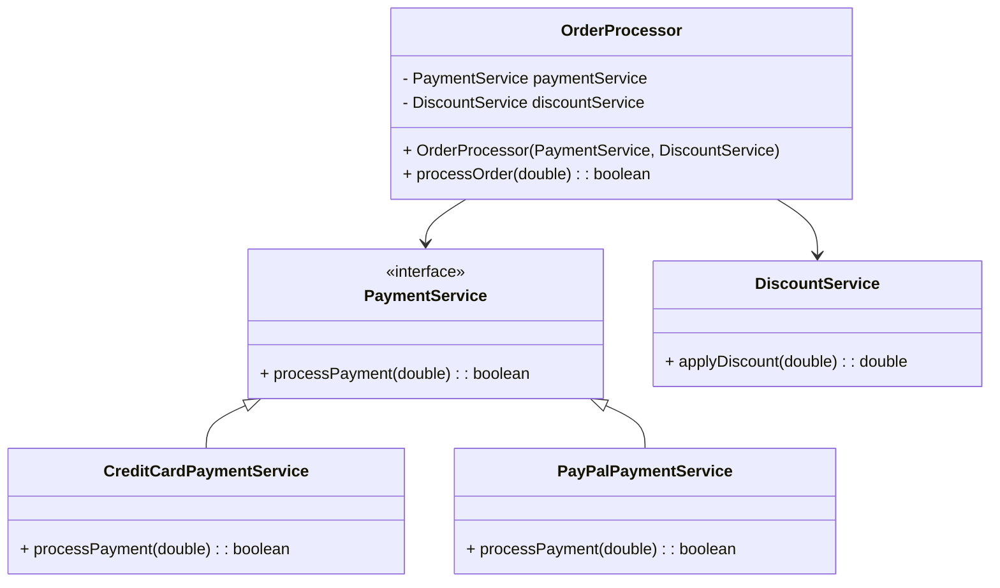

## 3.8.3 Benefits in Testing and Flexibility

In the realm of software engineering, the ability to create flexible and testable code is paramount. Dependency Injection (DI) is a design pattern that significantly enhances these aspects by promoting loose coupling and enabling easy substitution of dependencies. In this section, we will delve into how DI contributes to testing and flexibility, providing practical examples and insights into its application in Java.

### Understanding Dependency Injection

Dependency Injection is a design pattern that allows a class to receive its dependencies from an external source rather than creating them internally. This approach decouples the creation of an object from its usage, facilitating easier testing and greater flexibility in software design.

#### Key Concepts

- **Inversion of Control (IoC):** DI is a form of IoC where the control of creating dependencies is inverted from the class itself to an external entity.
- **Loose Coupling:** By injecting dependencies, classes are less dependent on specific implementations, allowing for easier modification and extension.
- **Testability:** DI enables the use of mock or stub implementations, simplifying unit testing.

### Enhancing Testability with Dependency Injection

One of the primary benefits of DI is its ability to enhance testability. By allowing dependencies to be injected, classes can be tested in isolation using mock or stub objects. This section explores how DI facilitates unit testing and provides examples to illustrate its effectiveness.

#### Substituting Dependencies with Mocks and Stubs

In testing, mocks and stubs are used to simulate the behavior of real objects. DI makes it straightforward to substitute these objects for real dependencies, allowing for controlled testing environments.

```java
// Example of a service interface
public interface PaymentService {
    boolean processPayment(double amount);
}

// Real implementation of the service
public class CreditCardPaymentService implements PaymentService {
    @Override
    public boolean processPayment(double amount) {
        // Logic to process payment
        return true;
    }
}

// Mock implementation for testing
public class MockPaymentService implements PaymentService {
    @Override
    public boolean processPayment(double amount) {
        // Simulate successful payment
        return true;
    }
}

// Class using dependency injection
public class OrderProcessor {
    private final PaymentService paymentService;

    public OrderProcessor(PaymentService paymentService) {
        this.paymentService = paymentService;
    }

    public boolean processOrder(double amount) {
        return paymentService.processPayment(amount);
    }
}

// Unit test using the mock
public class OrderProcessorTest {
    @Test
    public void testProcessOrder() {
        PaymentService mockService = new MockPaymentService();
        OrderProcessor orderProcessor = new OrderProcessor(mockService);

        assertTrue(orderProcessor.processOrder(100.0));
    }
}
```

In the example above, `OrderProcessor` is dependent on `PaymentService`. By injecting a mock implementation (`MockPaymentService`), we can test `OrderProcessor` without relying on the real payment processing logic.

#### Simplifying Unit Testing

DI simplifies unit testing by allowing dependencies to be injected at runtime. This flexibility means that tests can be written to focus solely on the behavior of the class under test, without concern for the behavior of its dependencies.

```java
// Using Mockito for mocking
public class OrderProcessorTest {
    @Test
    public void testProcessOrderWithMockito() {
        // Create a mock PaymentService
        PaymentService mockService = Mockito.mock(PaymentService.class);
        Mockito.when(mockService.processPayment(100.0)).thenReturn(true);

        OrderProcessor orderProcessor = new OrderProcessor(mockService);

        assertTrue(orderProcessor.processOrder(100.0));
        Mockito.verify(mockService).processPayment(100.0);
    }
}
```

In this example, we use Mockito, a popular Java mocking framework, to create a mock `PaymentService`. This approach allows us to verify interactions and outcomes without needing a real implementation.

### Achieving Flexibility Through Loose Coupling

Dependency Injection promotes loose coupling, which is crucial for creating flexible software systems. By decoupling classes from their dependencies, DI allows components to be modified or replaced without affecting others.

#### Modifying Components Independently

When components are loosely coupled, changes to one component do not necessitate changes to others. This independence is achieved through DI by relying on interfaces or abstract classes rather than concrete implementations.

```java
// New implementation of PaymentService
public class PayPalPaymentService implements PaymentService {
    @Override
    public boolean processPayment(double amount) {
        // Logic to process payment via PayPal
        return true;
    }
}

// Switching implementations
public class Application {
    public static void main(String[] args) {
        PaymentService paymentService = new PayPalPaymentService(); // Switch to PayPal
        OrderProcessor orderProcessor = new OrderProcessor(paymentService);

        orderProcessor.processOrder(150.0);
    }
}
```

In this scenario, switching from `CreditCardPaymentService` to `PayPalPaymentService` requires no changes to `OrderProcessor`, demonstrating the flexibility provided by DI.

#### Configuring Implementations Dynamically

DI allows for dynamic configuration of implementations, enabling different behaviors or configurations without altering the codebase. This capability is particularly useful in environments where different configurations are required for development, testing, and production.

```java
// Using a configuration file or environment variable to determine implementation
public class PaymentServiceFactory {
    public static PaymentService createPaymentService() {
        String serviceType = System.getenv("PAYMENT_SERVICE_TYPE");
        if ("PayPal".equals(serviceType)) {
            return new PayPalPaymentService();
        } else {
            return new CreditCardPaymentService();
        }
    }
}

// Application setup
public class Application {
    public static void main(String[] args) {
        PaymentService paymentService = PaymentServiceFactory.createPaymentService();
        OrderProcessor orderProcessor = new OrderProcessor(paymentService);

        orderProcessor.processOrder(200.0);
    }
}
```

Here, `PaymentServiceFactory` determines the implementation based on an environment variable, allowing for seamless switching between different payment services.

### Leveraging Dependency Injection for Quality and Maintainability

By embracing Dependency Injection, developers can significantly improve the quality and maintainability of their applications. DI encourages best practices such as separation of concerns and single responsibility, leading to cleaner, more manageable codebases.

#### Encouraging Separation of Concerns

DI naturally enforces separation of concerns by ensuring that classes focus on their primary responsibilities without being burdened by the creation or management of dependencies.

```java
// Separation of concerns example
public class OrderService {
    private final OrderRepository orderRepository;
    private final PaymentService paymentService;

    public OrderService(OrderRepository orderRepository, PaymentService paymentService) {
        this.orderRepository = orderRepository;
        this.paymentService = paymentService;
    }

    public void placeOrder(Order order) {
        if (paymentService.processPayment(order.getAmount())) {
            orderRepository.save(order);
        }
    }
}
```

In this example, `OrderService` is responsible for order processing, while `OrderRepository` and `PaymentService` handle data persistence and payment processing, respectively.

#### Improving Maintainability

With DI, maintaining and updating applications becomes more straightforward. Changes to dependencies or their configurations can be made without impacting the classes that use them, reducing the risk of introducing bugs.

```java
// Updating a dependency
public class DiscountService {
    public double applyDiscount(double amount) {
        // New discount logic
        return amount * 0.9;
    }
}

// Injecting the updated service
public class OrderProcessor {
    private final PaymentService paymentService;
    private final DiscountService discountService;

    public OrderProcessor(PaymentService paymentService, DiscountService discountService) {
        this.paymentService = paymentService;
        this.discountService = discountService;
    }

    public boolean processOrder(double amount) {
        double discountedAmount = discountService.applyDiscount(amount);
        return paymentService.processPayment(discountedAmount);
    }
}
```

In this case, `DiscountService` has been updated, and the new logic is injected into `OrderProcessor` without requiring changes to the order processing logic.

### Try It Yourself

To fully appreciate the benefits of Dependency Injection, try modifying the examples provided:

1. **Create a new implementation** of `PaymentService` that simulates a different payment method, such as cryptocurrency.
2. **Use a DI framework** like Spring to manage the injection of dependencies automatically.
3. **Experiment with different configurations** by using environment variables or configuration files to switch between implementations dynamically.

### Visualizing Dependency Injection

To better understand the flow and structure of Dependency Injection, let's visualize it using a class diagram.



**Diagram Description:** This class diagram illustrates the relationships between `OrderProcessor`, `PaymentService`, `DiscountService`, and their implementations. It highlights how `OrderProcessor` depends on interfaces, allowing for flexible substitution of implementations.

### References and Further Reading

- [Spring Framework Documentation](https://spring.io/projects/spring-framework): Explore how Spring facilitates Dependency Injection.
- [Mockito Documentation](https://site.mockito.org/): Learn more about using Mockito for mocking in Java.
- [Effective Java by Joshua Bloch](https://www.oreilly.com/library/view/effective-java-3rd/9780134686097/): A comprehensive guide to best practices in Java, including Dependency Injection.

### Knowledge Check

Before we conclude, let's reinforce our understanding with a few questions:

1. How does Dependency Injection enhance testability in Java applications?
2. What is the role of mocks and stubs in testing with DI?
3. How does DI promote loose coupling and flexibility?
4. Why is separation of concerns important in software design?
5. How can DI frameworks like Spring simplify dependency management?

### Embrace the Journey

Remember, mastering Dependency Injection is a journey. As you continue to explore and implement DI in your projects, you'll discover new ways to enhance the flexibility and testability of your applications. Keep experimenting, stay curious, and enjoy the process of creating robust, maintainable software.

## Quiz Time!



### How does Dependency Injection enhance testability?

- [x] By allowing dependencies to be easily substituted with mocks or stubs
- [ ] By making classes dependent on specific implementations
- [ ] By increasing the complexity of the code
- [ ] By reducing the number of classes

> **Explanation:** Dependency Injection allows for easy substitution of dependencies with mock or stub implementations, which enhances testability by enabling isolated testing of classes.

### What is a primary benefit of loose coupling achieved through Dependency Injection?

- [x] Components can be modified or replaced without affecting others
- [ ] It increases the dependency on specific implementations
- [ ] It makes the code harder to maintain
- [ ] It reduces the number of classes in the application

> **Explanation:** Loose coupling allows components to be modified or replaced independently, enhancing flexibility and maintainability.

### Which Java framework is commonly used for Dependency Injection?

- [x] Spring
- [ ] Hibernate
- [ ] JUnit
- [ ] Mockito

> **Explanation:** Spring is a popular Java framework that provides comprehensive support for Dependency Injection.

### In the context of DI, what are mocks and stubs used for?

- [x] Simulating the behavior of real objects in tests
- [ ] Increasing the complexity of the application
- [ ] Reducing the number of classes
- [ ] Making the code dependent on specific implementations

> **Explanation:** Mocks and stubs are used to simulate the behavior of real objects, allowing for controlled testing environments.

### How does DI encourage separation of concerns?

- [x] By ensuring classes focus on their primary responsibilities without managing dependencies
- [ ] By making classes responsible for creating their dependencies
- [ ] By increasing the coupling between classes
- [ ] By reducing the number of classes in the application

> **Explanation:** DI enforces separation of concerns by decoupling the creation and management of dependencies from the classes that use them.

### What is the role of a DI framework like Spring?

- [x] To manage the injection of dependencies automatically
- [ ] To increase the complexity of the application
- [ ] To reduce the number of classes
- [ ] To make classes dependent on specific implementations

> **Explanation:** DI frameworks like Spring automate the management of dependencies, simplifying the development process.

### How can DI improve maintainability?

- [x] By allowing changes to dependencies without impacting dependent classes
- [ ] By making the code harder to understand
- [ ] By increasing the number of classes
- [ ] By reducing the flexibility of the application

> **Explanation:** DI improves maintainability by enabling changes to dependencies without affecting the classes that use them.

### What is a common use case for Dependency Injection?

- [x] Configuring different implementations or configurations without changing code
- [ ] Reducing the number of classes in the application
- [ ] Making the code dependent on specific implementations
- [ ] Increasing the complexity of the application

> **Explanation:** DI allows for dynamic configuration of implementations, enhancing flexibility and adaptability.

### Which of the following is a key concept of Dependency Injection?

- [x] Inversion of Control
- [ ] Increased dependency on specific implementations
- [ ] Reduced number of classes
- [ ] Increased complexity

> **Explanation:** Inversion of Control is a key concept of Dependency Injection, where the control of creating dependencies is inverted from the class itself to an external entity.

### True or False: Dependency Injection reduces the flexibility of an application.

- [ ] True
- [x] False

> **Explanation:** False. Dependency Injection enhances the flexibility of an application by promoting loose coupling and enabling easy substitution of dependencies.


