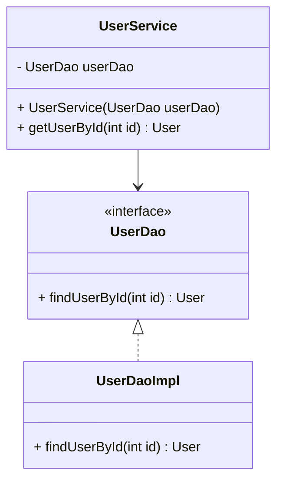

## 3.8.4 Use Cases and Examples

In this section, we delve into practical use cases of the Dependency Injection (DI) pattern in Java, illustrating how it decouples components in enterprise applications. By exploring scenarios such as decoupling data access layers from business logic, configuring different logging mechanisms, and switching between service implementations like payment gateways, we will see how DI enhances modularity and maintainability. 

### Understanding Dependency Injection

Dependency Injection is a design pattern that allows for the separation of concerns within an application. It involves injecting dependencies into a class, rather than having the class create them itself. This approach promotes loose coupling and enhances testability, as dependencies can be easily swapped out for different implementations or mocked during testing.

### Decoupling Data Access Layers from Business Logic

One of the most common use cases for DI is decoupling the data access layer from business logic. In a typical enterprise application, the business logic layer relies on data access objects (DAOs) to interact with the database. By using DI, we can inject the DAO implementations into the business logic classes, allowing for greater flexibility and easier testing.

#### Code Example: Decoupling Data Access Layers

```java
// Define a DAO interface
public interface UserDao {
    User findUserById(int id);
}

// Implement the DAO interface
public class UserDaoImpl implements UserDao {
    @Override
    public User findUserById(int id) {
        // Database access logic here
        return new User(id, "John Doe");
    }
}

// Business logic class
public class UserService {
    private final UserDao userDao;

    // Constructor injection
    public UserService(UserDao userDao) {
        this.userDao = userDao;
    }

    public User getUserById(int id) {
        return userDao.findUserById(id);
    }
}

// Main class to demonstrate DI
public class Main {
    public static void main(String[] args) {
        UserDao userDao = new UserDaoImpl();
        UserService userService = new UserService(userDao);
        
        User user = userService.getUserById(1);
        System.out.println("User: " + user.getName());
    }
}
```

In this example, the `UserService` class does not need to know the details of how `UserDaoImpl` accesses the database. Instead, it relies on the `UserDao` interface, which can be implemented in various ways.

#### Benefits

- **Modularity**: The business logic is separated from the data access logic, making the codebase more modular.
- **Testability**: We can easily mock `UserDao` for testing purposes, allowing us to test `UserService` independently of the database.

### Configuring Different Logging Mechanisms

Another practical scenario for DI is configuring different logging mechanisms. In many applications, logging is a critical aspect that needs to be flexible and configurable. DI allows us to inject different logging implementations based on the environment or requirements.

#### Code Example: Configuring Logging Mechanisms

```java
// Define a Logger interface
public interface Logger {
    void log(String message);
}

// Implement a ConsoleLogger
public class ConsoleLogger implements Logger {
    @Override
    public void log(String message) {
        System.out.println("ConsoleLogger: " + message);
    }
}

// Implement a FileLogger
public class FileLogger implements Logger {
    @Override
    public void log(String message) {
        // Logic to write to a file
        System.out.println("FileLogger: " + message);
    }
}

// Application class using DI for logging
public class Application {
    private final Logger logger;

    // Constructor injection
    public Application(Logger logger) {
        this.logger = logger;
    }

    public void performTask() {
        logger.log("Task performed");
    }
}

// Main class to demonstrate DI
public class Main {
    public static void main(String[] args) {
        Logger logger = new ConsoleLogger(); // Or new FileLogger();
        Application app = new Application(logger);
        
        app.performTask();
    }
}
```

By using DI, we can easily switch between `ConsoleLogger` and `FileLogger` without modifying the `Application` class.

#### Benefits

- **Flexibility**: Easily switch logging mechanisms without changing application code.
- **Environment-Specific Configurations**: Use different loggers for development and production environments.

### Switching Between Different Service Implementations

In enterprise applications, it's common to have multiple implementations of a service, such as payment gateways. DI allows us to switch between these implementations seamlessly, providing the flexibility to adapt to different business needs or external service providers.

#### Code Example: Switching Payment Gateways

```java
// Define a PaymentService interface
public interface PaymentService {
    void processPayment(double amount);
}

// Implement a PayPalPaymentService
public class PayPalPaymentService implements PaymentService {
    @Override
    public void processPayment(double amount) {
        System.out.println("Processing payment with PayPal: $" + amount);
    }
}

// Implement a StripePaymentService
public class StripePaymentService implements PaymentService {
    @Override
    public void processPayment(double amount) {
        System.out.println("Processing payment with Stripe: $" + amount);
    }
}

// Order processing class using DI for payment service
public class OrderProcessor {
    private final PaymentService paymentService;

    // Constructor injection
    public OrderProcessor(PaymentService paymentService) {
        this.paymentService = paymentService;
    }

    public void processOrder(double amount) {
        paymentService.processPayment(amount);
    }
}

// Main class to demonstrate DI
public class Main {
    public static void main(String[] args) {
        PaymentService paymentService = new PayPalPaymentService(); // Or new StripePaymentService();
        OrderProcessor orderProcessor = new OrderProcessor(paymentService);
        
        orderProcessor.processOrder(100.0);
    }
}
```

In this example, `OrderProcessor` can use either `PayPalPaymentService` or `StripePaymentService` without any changes to its code.

#### Benefits

- **Interchangeability**: Easily switch between different service providers.
- **Adaptability**: Quickly adapt to new business requirements or external changes.

### Try It Yourself

To deepen your understanding of Dependency Injection, try modifying the examples above:

- **Experiment with Different DAOs**: Create additional DAO implementations and inject them into the `UserService`.
- **Switch Logging Mechanisms**: Implement a new logging mechanism, such as a `DatabaseLogger`, and inject it into the `Application`.
- **Add More Payment Services**: Implement additional payment services and test switching between them in the `OrderProcessor`.

### Visualizing Dependency Injection

To better understand how DI works, let's visualize the relationships between components using a class diagram.



**Diagram Description**: This class diagram shows how `UserService` depends on the `UserDao` interface, which is implemented by `UserDaoImpl`. The dependency is injected into `UserService`, allowing for flexibility and modularity.

### Benefits of Dependency Injection

Implementing DI in your projects can lead to several benefits:

- **Increased Modularity**: By decoupling components, your codebase becomes more modular and easier to manage.
- **Enhanced Testability**: Dependencies can be easily mocked or stubbed, making unit testing more straightforward.
- **Improved Maintainability**: Changes to one component do not necessitate changes to others, reducing the risk of introducing bugs.
- **Flexibility and Scalability**: Easily switch between different implementations or configurations as your application grows.

### Applying DI Principles in Your Projects

As you work on your projects, consider how DI can enhance your design quality. Here are some tips:

- **Identify Dependencies**: Determine which components depend on others and how they can be injected.
- **Use Interfaces**: Define interfaces for your dependencies to allow for multiple implementations.
- **Leverage DI Frameworks**: Consider using DI frameworks like Spring or Guice to manage dependencies and configurations.
- **Focus on Constructor Injection**: Prefer constructor injection over field or setter injection for mandatory dependencies.

### References and Links

For further reading on Dependency Injection and its applications, consider exploring the following resources:

- [Spring Framework Documentation](https://spring.io/projects/spring-framework)
- [Google Guice Documentation](https://github.com/google/guice)
- [Martin Fowler's Article on Dependency Injection](https://martinfowler.com/articles/injection.html)

### Knowledge Check

To reinforce your understanding of Dependency Injection, consider the following questions:

- How does DI improve testability in applications?
- What are the advantages of using interfaces in DI?
- How can DI frameworks simplify dependency management?

Remember, this is just the beginning. As you progress, you'll build more complex and interactive applications. Keep experimenting, stay curious, and enjoy the journey!

## Quiz Time!



### What is the primary benefit of using Dependency Injection in software design?

- [x] It promotes loose coupling between components.
- [ ] It increases the complexity of the code.
- [ ] It reduces the need for interfaces.
- [ ] It makes the code harder to test.

> **Explanation:** Dependency Injection promotes loose coupling by allowing dependencies to be injected rather than hardcoded, making the system more flexible and easier to test.

### In the context of Dependency Injection, what is the role of an interface?

- [x] To define a contract for multiple implementations.
- [ ] To increase the complexity of the system.
- [ ] To ensure that only one implementation is possible.
- [ ] To make the code less readable.

> **Explanation:** Interfaces define a contract that multiple implementations can follow, allowing for flexibility and interchangeability in Dependency Injection.

### Which of the following is a common use case for Dependency Injection?

- [x] Switching between different service implementations.
- [ ] Hardcoding dependencies within classes.
- [ ] Avoiding the use of interfaces.
- [ ] Making the code less modular.

> **Explanation:** Dependency Injection is commonly used to switch between different service implementations, enhancing modularity and flexibility.

### How does Dependency Injection enhance testability?

- [x] By allowing dependencies to be easily mocked or stubbed.
- [ ] By making the code more complex.
- [ ] By reducing the number of interfaces.
- [ ] By hardcoding dependencies.

> **Explanation:** Dependency Injection enhances testability by allowing dependencies to be mocked or stubbed, making it easier to test components in isolation.

### What is the advantage of using constructor injection over field or setter injection?

- [x] It ensures that dependencies are provided at the time of object creation.
- [ ] It makes the code harder to read.
- [ ] It reduces the number of constructors needed.
- [ ] It allows for optional dependencies.

> **Explanation:** Constructor injection ensures that all necessary dependencies are provided at the time of object creation, making the object fully initialized and ready to use.

### Which DI framework is commonly used in Java for managing dependencies?

- [x] Spring
- [ ] Django
- [ ] React
- [ ] Angular

> **Explanation:** Spring is a popular DI framework in Java that helps manage dependencies and configurations.

### What is a potential downside of not using Dependency Injection?

- [x] Increased coupling between components.
- [ ] Decreased complexity in the code.
- [ ] Easier testing of components.
- [ ] More flexible codebase.

> **Explanation:** Without Dependency Injection, components may become tightly coupled, making the system less flexible and harder to test.

### How can Dependency Injection contribute to scalability?

- [x] By allowing easy switching between different implementations as the application grows.
- [ ] By reducing the number of classes in the application.
- [ ] By making the code more complex.
- [ ] By hardcoding dependencies.

> **Explanation:** Dependency Injection allows for easy switching between different implementations, making it easier to scale the application as needed.

### What is the primary focus of Dependency Injection?

- [x] Decoupling components by managing their dependencies.
- [ ] Increasing the number of classes in the application.
- [ ] Making the code harder to read.
- [ ] Reducing the use of interfaces.

> **Explanation:** The primary focus of Dependency Injection is to decouple components by managing their dependencies, promoting flexibility and modularity.

### True or False: Dependency Injection can help in configuring different logging mechanisms without changing application code.

- [x] True
- [ ] False

> **Explanation:** True. Dependency Injection allows for different logging mechanisms to be configured and injected without changing the application code, enhancing flexibility.


