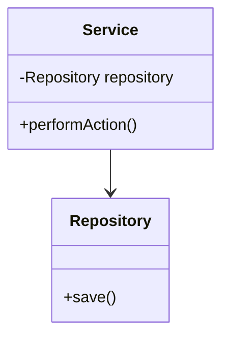

## 3.8 Dependency Injection Pattern

In the realm of software engineering, the Dependency Injection (DI) pattern stands as a beacon for creating flexible, maintainable, and testable code. By promoting the decoupling of components, DI allows developers to pass dependencies to a class rather than hard-coding them, thus enhancing the overall architecture of software systems.

### Understanding Dependency Injection

Dependency Injection is a design pattern used to implement IoC (Inversion of Control), allowing the creation of dependent objects outside of a class and providing those objects to a class through various means. This pattern is particularly useful in managing dependencies in complex systems, where direct instantiation of objects can lead to tight coupling and reduced flexibility.

#### The Problem: Tight Coupling

In traditional software design, classes often create their dependencies internally. This approach can lead to tight coupling, where changes in one class necessitate changes in another, making the system fragile and difficult to maintain. Additionally, tightly coupled systems are challenging to test because substituting mock objects or stubs for testing purposes becomes cumbersome.

#### The Solution: Dependency Injection

Dependency Injection addresses these issues by externalizing the creation and management of dependencies. By injecting dependencies into a class, DI promotes loose coupling, making it easier to modify, extend, and test the system.

### Types of Dependency Injection

There are three primary types of dependency injection: constructor injection, setter injection, and interface injection. Each type offers different advantages and is suited to different scenarios.

#### Constructor Injection

Constructor Injection involves passing dependencies to a class through its constructor. This method ensures that a class is always in a valid state, as all required dependencies are provided at the time of object creation.

```java
public class Service {
    private final Repository repository;

    // Constructor Injection
    public Service(Repository repository) {
        this.repository = repository;
    }

    public void performAction() {
        repository.save();
    }
}
```

**Advantages:**
- Ensures immutability by making dependencies final.
- Promotes clear and explicit dependency requirements.

#### Setter Injection

Setter Injection involves providing dependencies through setter methods. This method offers more flexibility, as dependencies can be changed or updated after object creation.

```java
public class Service {
    private Repository repository;

    // Setter Injection
    public void setRepository(Repository repository) {
        this.repository = repository;
    }

    public void performAction() {
        if (repository != null) {
            repository.save();
        }
    }
}
```

**Advantages:**
- Allows optional dependencies.
- Supports changing dependencies at runtime.

#### Interface Injection

Interface Injection involves defining an interface that a class must implement to receive its dependencies. This method is less common and often used in specific frameworks.

```java
public interface RepositoryAware {
    void setRepository(Repository repository);
}

public class Service implements RepositoryAware {
    private Repository repository;

    @Override
    public void setRepository(Repository repository) {
        this.repository = repository;
    }

    public void performAction() {
        if (repository != null) {
            repository.save();
        }
    }
}
```

**Advantages:**
- Decouples the dependency injection logic from the class implementation.
- Provides flexibility in dependency management.

### Supporting the Dependency Inversion Principle

The Dependency Injection pattern aligns with the Dependency Inversion Principle (DIP), one of the SOLID principles of object-oriented design. DIP states that high-level modules should not depend on low-level modules, but both should depend on abstractions. DI facilitates this by allowing high-level modules to depend on interfaces or abstract classes rather than concrete implementations.

### Visualizing Dependency Injection

To better understand the impact of Dependency Injection, let's visualize the dependency relationships with and without DI using UML diagrams.

#### Without Dependency Injection



In this diagram, the `Service` class directly depends on the `Repository` class, leading to tight coupling.

#### With Dependency Injection

```mermaid
classDiagram
    class Service {
        -Repository repository
        +Service(Repository repository)
        +performAction()
    }
    interface IRepository {
        +save()
    }
    class Repository implements IRepository {
        +save()
    }
    Service --> IRepository
    Repository --> IRepository
```

Here, the `Service` class depends on the `IRepository` interface, promoting loose coupling and flexibility.

### Benefits of Dependency Injection

Dependency Injection offers several benefits that enhance software design:

1. **Loose Coupling:** By decoupling classes from their dependencies, DI allows for more flexible and maintainable code.
2. **Enhanced Testability:** DI makes it easier to substitute mock objects or stubs during testing, facilitating unit testing and TDD (Test-Driven Development).
3. **Improved Maintainability:** With dependencies managed externally, changes to one part of the system have minimal impact on others.
4. **Increased Reusability:** Components can be reused across different contexts without modification.
5. **Simplified Configuration Management:** DI frameworks often provide configuration management capabilities, streamlining the setup process.

### Practical Implementation Strategies

Implementing Dependency Injection in Java can be done manually or with the help of DI frameworks. Let's explore both approaches.

#### Manual Dependency Injection

In manual DI, dependencies are explicitly passed to objects through constructors or setters. While this approach provides full control, it can become cumbersome in large systems.

```java
public class Application {
    public static void main(String[] args) {
        // Manual Dependency Injection
        Repository repository = new RepositoryImpl();
        Service service = new Service(repository);

        service.performAction();
    }
}
```

#### Using DI Frameworks

DI frameworks automate the process of dependency injection, providing a more scalable solution for complex applications. Popular DI frameworks in Java include Spring, Google Guice, and CDI (Contexts and Dependency Injection).

##### Spring Framework

Spring is one of the most widely used DI frameworks in Java, offering comprehensive support for dependency injection through annotations and XML configuration.

```java
import org.springframework.beans.factory.annotation.Autowired;
import org.springframework.stereotype.Component;

@Component
public class Service {
    private final Repository repository;

    @Autowired
    public Service(Repository repository) {
        this.repository = repository;
    }

    public void performAction() {
        repository.save();
    }
}
```

In this example, the `@Autowired` annotation is used to inject the `Repository` dependency into the `Service` class.

##### Google Guice

Google Guice is a lightweight DI framework that uses annotations to manage dependencies.

```java
import com.google.inject.Inject;
import com.google.inject.Singleton;

@Singleton
public class Service {
    private final Repository repository;

    @Inject
    public Service(Repository repository) {
        this.repository = repository;
    }

    public void performAction() {
        repository.save();
    }
}
```

Guice uses the `@Inject` annotation to indicate which constructor should be used for dependency injection.

##### CDI (Contexts and Dependency Injection)

CDI is a part of the Java EE platform, providing a standard for dependency injection.

```java
import javax.inject.Inject;
import javax.enterprise.context.ApplicationScoped;

@ApplicationScoped
public class Service {
    private Repository repository;

    @Inject
    public void setRepository(Repository repository) {
        this.repository = repository;
    }

    public void performAction() {
        repository.save();
    }
}
```

CDI uses the `@Inject` annotation to inject dependencies, similar to Guice.

### Preparing for DI Frameworks

When preparing to use DI frameworks, consider the following best practices:

1. **Define Interfaces:** Use interfaces or abstract classes to define dependencies, promoting flexibility and loose coupling.
2. **Minimize Constructor Logic:** Keep constructors simple, focusing on dependency injection rather than complex logic.
3. **Avoid Circular Dependencies:** Ensure that dependencies do not form circular references, which can lead to runtime errors.
4. **Leverage Annotations:** Use annotations provided by DI frameworks to simplify configuration and reduce boilerplate code.
5. **Configure External Resources:** Use DI frameworks to manage external resources, such as database connections and configuration files.

### Try It Yourself

To deepen your understanding of Dependency Injection, try modifying the code examples provided. Experiment with different types of injection and explore the use of DI frameworks in a sample project. Consider the following challenges:

- Implement a new service that depends on multiple repositories and inject them using constructor injection.
- Use setter injection to change the behavior of a service at runtime by swapping out its dependencies.
- Create a simple application using Spring or Guice to manage dependencies and observe how the framework handles configuration and lifecycle management.

### Conclusion

The Dependency Injection pattern is a powerful tool for creating flexible, maintainable, and testable software systems. By decoupling components and promoting loose coupling, DI enhances the architecture of applications, making them easier to manage and evolve. Whether implemented manually or through DI frameworks, this pattern is essential for modern software development.

Remember, this is just the beginning. As you progress, you'll build more complex and interactive applications. Keep experimenting, stay curious, and enjoy the journey!

## Quiz Time!



### What is the primary purpose of the Dependency Injection pattern?

- [x] To promote loose coupling by externalizing dependency management
- [ ] To increase the number of dependencies in a class
- [ ] To hard-code dependencies within a class
- [ ] To reduce the number of classes in a system

> **Explanation:** The primary purpose of Dependency Injection is to promote loose coupling by managing dependencies outside of a class, enhancing flexibility and testability.

### Which type of dependency injection involves passing dependencies through a class constructor?

- [x] Constructor Injection
- [ ] Setter Injection
- [ ] Interface Injection
- [ ] Field Injection

> **Explanation:** Constructor Injection involves passing dependencies through a class constructor, ensuring all required dependencies are provided at object creation.

### What is a key benefit of using Dependency Injection?

- [x] Enhanced testability
- [ ] Increased coupling
- [ ] Reduced code readability
- [ ] Hard-coded dependencies

> **Explanation:** Dependency Injection enhances testability by allowing easy substitution of mock objects or stubs during testing.

### Which of the following is a popular DI framework in Java?

- [x] Spring
- [ ] Hibernate
- [ ] JUnit
- [ ] Log4j

> **Explanation:** Spring is a popular DI framework in Java, providing comprehensive support for dependency injection.

### How does Dependency Injection support the Dependency Inversion Principle?

- [x] By allowing high-level modules to depend on abstractions
- [ ] By making low-level modules depend on high-level modules
- [ ] By increasing the number of dependencies in a system
- [ ] By hard-coding dependencies within classes

> **Explanation:** Dependency Injection supports the Dependency Inversion Principle by allowing high-level modules to depend on abstractions rather than concrete implementations.

### What is a potential drawback of manual Dependency Injection?

- [x] It can become cumbersome in large systems
- [ ] It simplifies configuration management
- [ ] It reduces the number of dependencies
- [ ] It enhances code readability

> **Explanation:** Manual Dependency Injection can become cumbersome in large systems due to the need for explicit dependency management.

### Which annotation is commonly used in Spring for dependency injection?

- [x] @Autowired
- [ ] @Inject
- [ ] @Resource
- [ ] @Component

> **Explanation:** The `@Autowired` annotation is commonly used in Spring for dependency injection, indicating that a dependency should be injected automatically.

### What is the role of a DI framework?

- [x] To automate the process of dependency injection
- [ ] To increase the number of dependencies in a system
- [ ] To hard-code dependencies within classes
- [ ] To reduce the number of classes in a system

> **Explanation:** A DI framework automates the process of dependency injection, providing a scalable solution for managing dependencies in complex applications.

### Which type of injection allows dependencies to be changed at runtime?

- [x] Setter Injection
- [ ] Constructor Injection
- [ ] Interface Injection
- [ ] Field Injection

> **Explanation:** Setter Injection allows dependencies to be changed at runtime, offering more flexibility than constructor injection.

### True or False: Dependency Injection can help reduce the complexity of configuration management.

- [x] True
- [ ] False

> **Explanation:** True. Dependency Injection can help reduce the complexity of configuration management by externalizing dependency management and using DI frameworks.


