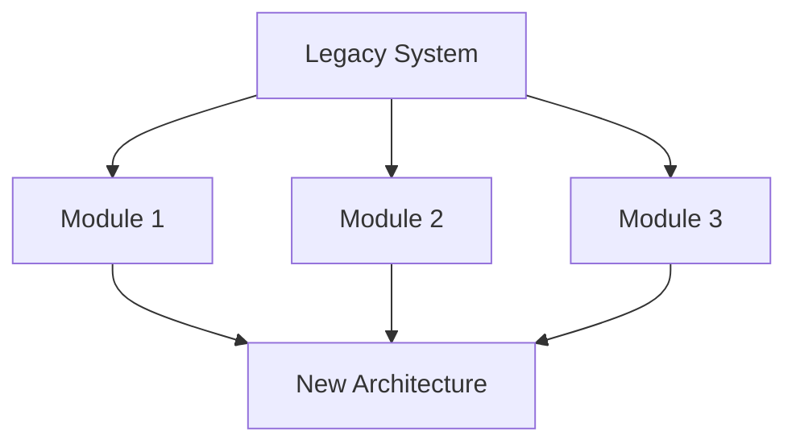

## 30.3 Incremental Migration Strategies

In the ever-evolving landscape of software development, organizations often face the challenge of migrating legacy systems to modern architectures. This process is fraught with risks, including potential downtime, data loss, and disruption to business operations. Incremental migration strategies offer a pragmatic approach to mitigate these risks by allowing for gradual transition and continuous operation. This section delves into the importance of incremental migration, explores various strategies, and provides a comprehensive guide to planning and executing a successful migration.

### The Importance of Incremental Migration

Incremental migration is favored over the "big bang" approach, which involves replacing the entire system in one go. The latter can lead to significant disruptions and unforeseen issues that are difficult to resolve quickly. Incremental migration, on the other hand, allows for:

- **Reduced Risk**: By migrating in stages, you can identify and address issues early, minimizing the impact on the overall system.
- **Continuous Operation**: Systems can continue to function during the migration process, ensuring business continuity.
- **Flexibility**: Adjustments can be made along the way based on feedback and changing requirements.
- **Stakeholder Engagement**: Incremental changes allow for ongoing communication and involvement from stakeholders, ensuring alignment with business goals.

### Key Strategies for Incremental Migration

#### Modular Decomposition

**Modular decomposition** involves breaking down a legacy system into smaller, manageable modules that can be migrated independently. This strategy leverages the principles of modularity and encapsulation, allowing for isolated changes and testing.

- **Identify Modules**: Analyze the legacy system to identify logical modules or components. These could be based on functionality, data, or user interfaces.
- **Define Interfaces**: Establish clear interfaces between modules to ensure they can communicate effectively post-migration.
- **Migrate Independently**: Migrate each module separately, ensuring it integrates seamlessly with both the legacy system and the new architecture.

*Diagram: Modular decomposition of a legacy system into independent modules for migration.*

#### Phased Replacement

**Phased replacement** involves gradually replacing parts of the legacy system with new components. This strategy is particularly useful when dealing with tightly coupled systems where modular decomposition is challenging.

- **Prioritize Components**: Determine which components are most critical or beneficial to replace first.
- **Develop New Components**: Build new components that replicate or enhance the functionality of the legacy components.
- **Integrate and Test**: Integrate new components with the existing system and conduct thorough testing to ensure compatibility and performance.

#### Parallel Runs

**Parallel runs** involve running the legacy system and the new system simultaneously for a period. This strategy provides a safety net, allowing for comparison and validation before fully switching to the new system.

- **Set Up Parallel Environments**: Establish environments where both systems can operate concurrently.
- **Monitor Performance**: Compare outputs and performance metrics to ensure the new system meets or exceeds the legacy system's capabilities.
- **Gradual Transition**: Gradually shift users and data to the new system, monitoring for issues and making adjustments as needed.

### Role of CI/CD in Migration

Continuous Integration and Continuous Deployment (CI/CD) play a crucial role in incremental migration by automating the build, test, and deployment processes. This ensures that changes are integrated smoothly and issues are detected early.

- **Automate Testing**: Implement automated tests to validate each migrated module or component.
- **Continuous Feedback**: Use CI/CD pipelines to provide continuous feedback to developers, allowing for rapid iteration and improvement.
- **Deployment Automation**: Automate the deployment of new components to reduce manual errors and ensure consistency across environments.

### Planning and Executing an Incremental Migration

#### Planning Steps

1. **Assess the Legacy System**: Conduct a thorough analysis to understand the system's architecture, dependencies, and limitations.
2. **Define Objectives**: Clearly articulate the goals of the migration, including performance improvements, scalability, and maintainability.
3. **Engage Stakeholders**: Involve key stakeholders from the outset to ensure alignment with business objectives and gather valuable insights.
4. **Develop a Roadmap**: Create a detailed migration roadmap outlining the sequence of steps, timelines, and resources required.

#### Execution Steps

1. **Prepare the Environment**: Set up development, testing, and production environments to support the migration process.
2. **Migrate Incrementally**: Follow the chosen strategy (e.g., modular decomposition, phased replacement) to migrate components or modules incrementally.
3. **Conduct Testing**: Perform rigorous testing at each stage to validate functionality, performance, and integration.
4. **Monitor and Adjust**: Continuously monitor the system for issues and make necessary adjustments to the migration plan.

### Tools and Techniques for Migration

- **Code Analysis Tools**: Use tools like SonarQube or Checkstyle to analyze legacy code and identify areas for improvement.
- **Containerization**: Leverage Docker or Kubernetes to containerize applications, facilitating easier deployment and scaling.
- **API Gateways**: Implement API gateways to manage communication between legacy and new systems, ensuring seamless integration.
- **Data Migration Tools**: Utilize tools like Apache NiFi or Talend for efficient data migration and transformation.

### Communication and Stakeholder Involvement

Effective communication and stakeholder involvement are critical to the success of an incremental migration. Regular updates, demonstrations, and feedback sessions help maintain transparency and build trust.

- **Regular Updates**: Provide stakeholders with regular updates on progress, challenges, and successes.
- **Demonstrations**: Conduct demonstrations of new features or components to showcase progress and gather feedback.
- **Feedback Mechanisms**: Establish channels for stakeholders to provide feedback and raise concerns, ensuring they are addressed promptly.

### Conclusion

Incremental migration strategies offer a structured and risk-averse approach to transitioning legacy systems to modern architectures. By leveraging strategies such as modular decomposition, phased replacement, and parallel runs, organizations can achieve a seamless migration while maintaining business continuity. The integration of CI/CD practices further enhances the migration process, ensuring rapid iteration and continuous improvement. Effective planning, execution, and stakeholder communication are essential to the success of any migration effort.

---

## Test Your Knowledge: Incremental Migration Strategies Quiz



### What is a primary advantage of incremental migration over a "big bang" approach?

- [x] Reduced risk and continuous operation
- [ ] Faster completion
- [ ] Lower initial cost
- [ ] Simpler planning

> **Explanation:** Incremental migration reduces risk by allowing for gradual changes and continuous operation, unlike the "big bang" approach which can lead to significant disruptions.

### Which strategy involves breaking down a system into smaller, manageable modules?

- [x] Modular decomposition
- [ ] Phased replacement
- [ ] Parallel runs
- [ ] Big bang

> **Explanation:** Modular decomposition involves breaking down a system into smaller modules that can be migrated independently.

### What is the role of CI/CD in incremental migration?

- [x] Automating build, test, and deployment processes
- [ ] Reducing system complexity
- [ ] Increasing manual testing
- [ ] Simplifying stakeholder communication

> **Explanation:** CI/CD automates the build, test, and deployment processes, ensuring smooth integration and early detection of issues.

### In phased replacement, what is the first step?

- [x] Prioritize components to replace
- [ ] Develop new components
- [ ] Integrate and test
- [ ] Monitor performance

> **Explanation:** The first step in phased replacement is to prioritize which components are most critical or beneficial to replace first.

### Which tool is useful for analyzing legacy code?

- [x] SonarQube
- [ ] Docker
- [ ] Kubernetes
- [ ] Apache NiFi

> **Explanation:** SonarQube is a tool used for analyzing legacy code and identifying areas for improvement.

### What is a key benefit of running parallel systems during migration?

- [x] Provides a safety net for comparison and validation
- [ ] Reduces hardware costs
- [ ] Simplifies data migration
- [ ] Eliminates the need for testing

> **Explanation:** Running parallel systems allows for comparison and validation, providing a safety net before fully switching to the new system.

### What is an essential aspect of stakeholder involvement in migration?

- [x] Regular updates and feedback sessions
- [ ] Limiting communication to critical issues
- [ ] Focusing solely on technical details
- [ ] Avoiding demonstrations

> **Explanation:** Regular updates and feedback sessions are essential for maintaining transparency and building trust with stakeholders.

### Which tool can be used for efficient data migration and transformation?

- [x] Talend
- [ ] SonarQube
- [ ] Docker
- [ ] Kubernetes

> **Explanation:** Talend is a tool used for efficient data migration and transformation.

### What is the first step in planning an incremental migration?

- [x] Assess the legacy system
- [ ] Develop a roadmap
- [ ] Engage stakeholders
- [ ] Prepare the environment

> **Explanation:** The first step in planning an incremental migration is to assess the legacy system to understand its architecture, dependencies, and limitations.

### True or False: Incremental migration strategies are only suitable for small systems.

- [ ] True
- [x] False

> **Explanation:** Incremental migration strategies are suitable for systems of all sizes, as they allow for gradual transition and continuous operation.


