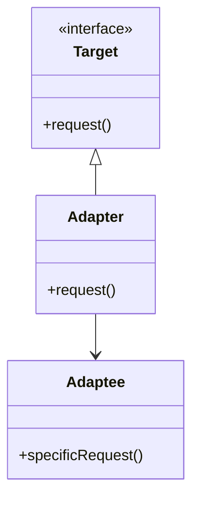

## 30.4 Adapter Pattern for Legacy Integration

### Introduction

In the ever-evolving landscape of software development, integrating modern applications with legacy systems is a common challenge. Legacy systems, often built with outdated technologies, can be difficult to replace entirely due to their critical role in business operations. The Adapter Pattern offers a solution by enabling new components to interface seamlessly with these older systems, facilitating interoperability and easing the migration process.

### Understanding the Adapter Pattern

#### Intent

The Adapter Pattern, a structural design pattern, allows incompatible interfaces to work together. It acts as a bridge between two incompatible interfaces, enabling them to communicate effectively. This pattern is particularly useful in scenarios where you need to integrate new systems with legacy code without altering the existing codebase.

#### Also Known As

- Wrapper
- Translator

#### Motivation

Consider a scenario where a company has a legacy billing system that is crucial for its operations. The system is stable but built on outdated technology. The company wants to introduce a new customer management system that uses modern Java technologies. Direct integration is challenging due to incompatible interfaces. The Adapter Pattern can be employed to create an intermediary that translates requests from the new system into a format the legacy system understands.

#### Applicability

- When you want to use an existing class, and its interface does not match the one you need.
- When you need to create a reusable class that cooperates with unrelated or unforeseen classes.
- When you want to integrate a new system with a legacy system without modifying the legacy code.

### Structure



**Caption**: The Adapter Pattern structure showing the relationship between the Target, Adapter, and Adaptee.

### Participants

- **Target**: Defines the domain-specific interface that the Client uses.
- **Adapter**: Adapts the interface of the Adaptee to the Target interface.
- **Adaptee**: Defines an existing interface that needs adapting.
- **Client**: Collaborates with objects conforming to the Target interface.

### Collaborations

The Client calls operations on the Adapter instance. The Adapter translates these calls into calls to the Adaptee's methods. The Adaptee performs the actual work, and the results are returned to the Client through the Adapter.

### Consequences

- **Benefits**:
  - **Interoperability**: Facilitates communication between new and legacy systems.
  - **Decoupling**: Reduces the dependency between systems, allowing for independent evolution.
  - **Flexibility**: Enables gradual migration by allowing new systems to coexist with legacy systems.

- **Drawbacks**:
  - **Complexity**: Introduces additional layers, which can complicate the system architecture.
  - **Performance Overhead**: May introduce latency due to the translation layer.

### Implementation

#### Implementation Guidelines

1. **Identify the Incompatible Interfaces**: Determine the interfaces that need to be adapted.
2. **Design the Adapter**: Create a class that implements the Target interface and holds a reference to an instance of the Adaptee.
3. **Implement the Adapter Methods**: Translate the Target interface methods into calls to the Adaptee's methods.
4. **Test the Integration**: Ensure that the Adapter correctly translates and forwards requests.

#### Sample Code Snippets

```java
// Target interface
interface CustomerManagement {
    void addCustomer(String name, String contact);
}

// Adaptee class
class LegacyBillingSystem {
    void addClient(String fullName, String phoneNumber) {
        System.out.println("Client added: " + fullName + ", " + phoneNumber);
    }
}

// Adapter class
class BillingAdapter implements CustomerManagement {
    private LegacyBillingSystem legacyBillingSystem;

    public BillingAdapter(LegacyBillingSystem legacyBillingSystem) {
        this.legacyBillingSystem = legacyBillingSystem;
    }

    @Override
    public void addCustomer(String name, String contact) {
        // Translate the request to the legacy system's format
        legacyBillingSystem.addClient(name, contact);
    }
}

// Client code
public class AdapterPatternDemo {
    public static void main(String[] args) {
        LegacyBillingSystem legacySystem = new LegacyBillingSystem();
        CustomerManagement customerManagement = new BillingAdapter(legacySystem);

        customerManagement.addCustomer("John Doe", "123-456-7890");
    }
}
```

**Explanation**: In this example, the `BillingAdapter` class implements the `CustomerManagement` interface and adapts the `LegacyBillingSystem` to work with it. The `addCustomer` method in the adapter translates the call to the `addClient` method of the legacy system.

### Sample Use Cases

- **Enterprise Resource Planning (ERP) Systems**: Integrating modern modules with legacy ERP systems to enhance functionality without a complete overhaul.
- **Banking Systems**: Allowing new financial products to interface with existing core banking systems.
- **Healthcare Systems**: Enabling new patient management systems to communicate with legacy electronic health record (EHR) systems.

### Related Patterns

- **Facade Pattern**: While both patterns provide a unified interface, the Facade Pattern simplifies interactions with a subsystem, whereas the Adapter Pattern makes two incompatible interfaces compatible.
- **Decorator Pattern**: Both patterns involve wrapping, but the Decorator Pattern adds new behavior, while the Adapter Pattern changes the interface.

### Known Uses

- **Java I/O Streams**: The `InputStreamReader` class acts as an adapter between byte streams and character streams.
- **Spring Framework**: The `HandlerAdapter` in Spring MVC adapts various handler types to the `DispatcherServlet`.

### Best Practices

- **Encapsulation**: Keep the adapter logic encapsulated to prevent leakage of legacy code into the new system.
- **Performance**: Monitor the performance impact of the adapter, especially in high-throughput systems.
- **Scalability**: Design adapters to be scalable, considering future extensions and modifications.
- **Testing**: Thoroughly test adapters to ensure they handle all edge cases and exceptions.

### Conclusion

The Adapter Pattern is a powerful tool for integrating modern Java applications with legacy systems. By acting as a bridge between incompatible interfaces, it facilitates interoperability and eases the migration process. When implemented correctly, it can significantly reduce coupling and allow for gradual system evolution. However, developers must be mindful of the potential complexity and performance overhead introduced by adapters. By following best practices, such as encapsulation and thorough testing, developers can create maintainable and scalable adapters that enhance system integration.

## Test Your Knowledge: Adapter Pattern for Legacy Integration Quiz



### What is the primary purpose of the Adapter Pattern?

- [x] To allow incompatible interfaces to work together.
- [ ] To simplify complex interfaces.
- [ ] To add new functionality to existing classes.
- [ ] To improve system performance.

> **Explanation:** The Adapter Pattern enables two incompatible interfaces to communicate, facilitating integration between new and legacy systems.

### Which of the following is a key benefit of using the Adapter Pattern?

- [x] Reduces coupling between systems.
- [ ] Increases system complexity.
- [ ] Decreases system flexibility.
- [ ] Eliminates the need for testing.

> **Explanation:** The Adapter Pattern reduces coupling by allowing systems to interact through a common interface, enhancing flexibility and maintainability.

### In the Adapter Pattern, what role does the Adapter class play?

- [x] It adapts the interface of the Adaptee to the Target interface.
- [ ] It defines the domain-specific interface used by the Client.
- [ ] It performs the actual work requested by the Client.
- [ ] It simplifies the subsystem interface.

> **Explanation:** The Adapter class translates requests from the Target interface to the Adaptee's methods, enabling communication between incompatible interfaces.

### Which pattern is similar to the Adapter Pattern but focuses on simplifying subsystem interactions?

- [x] Facade Pattern
- [ ] Decorator Pattern
- [ ] Singleton Pattern
- [ ] Observer Pattern

> **Explanation:** The Facade Pattern provides a simplified interface to a complex subsystem, whereas the Adapter Pattern enables compatibility between interfaces.

### What is a potential drawback of using the Adapter Pattern?

- [x] It may introduce performance overhead.
- [ ] It eliminates the need for legacy systems.
- [ ] It reduces system flexibility.
- [ ] It complicates testing.

> **Explanation:** The Adapter Pattern can introduce performance overhead due to the additional translation layer between interfaces.

### Which of the following is a real-world example of the Adapter Pattern?

- [x] Java's InputStreamReader class
- [ ] Java's ArrayList class
- [ ] Java's HashMap class
- [ ] Java's Thread class

> **Explanation:** The InputStreamReader class acts as an adapter between byte streams and character streams, exemplifying the Adapter Pattern.

### How does the Adapter Pattern facilitate gradual system migration?

- [x] By allowing new systems to coexist with legacy systems.
- [ ] By eliminating the need for legacy systems.
- [ ] By simplifying the legacy system's interface.
- [ ] By increasing system complexity.

> **Explanation:** The Adapter Pattern enables new systems to interact with legacy systems, allowing for gradual migration without disrupting existing operations.

### What is a best practice when designing adapters?

- [x] Keep the adapter logic encapsulated.
- [ ] Expose legacy code through the adapter.
- [ ] Minimize testing of the adapter.
- [ ] Increase system complexity.

> **Explanation:** Encapsulating adapter logic prevents legacy code from leaking into the new system, maintaining clean separation and reducing complexity.

### Which pattern adds new behavior to existing classes, unlike the Adapter Pattern?

- [x] Decorator Pattern
- [ ] Facade Pattern
- [ ] Singleton Pattern
- [ ] Observer Pattern

> **Explanation:** The Decorator Pattern adds new behavior to existing classes, while the Adapter Pattern changes the interface to enable compatibility.

### True or False: The Adapter Pattern can only be used with object-oriented programming languages.

- [x] True
- [ ] False

> **Explanation:** The Adapter Pattern is primarily used in object-oriented programming to enable communication between incompatible interfaces.


