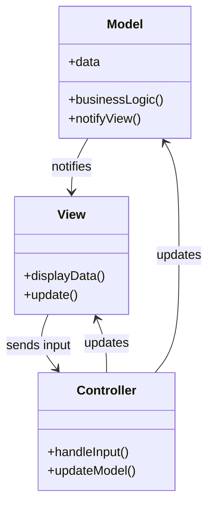

## 31.1.1 Overview of MVC

The Model-View-Controller (MVC) pattern is a cornerstone of software architecture, especially in the realm of user interface design. This pattern is instrumental in creating applications that are both robust and maintainable. By dividing an application into three interconnected components, MVC facilitates a clean separation of concerns, which enhances modularity and testability.

### Defining the MVC Pattern

The MVC pattern is an architectural design pattern that divides an application into three main components: **Model**, **View**, and **Controller**. Each component has a distinct responsibility, and together they work to create a cohesive application structure.

- **Model**: Represents the data and the business logic of the application. It is responsible for managing the data, logic, and rules of the application. The Model notifies the View of any changes to the data, ensuring that the user interface is always up-to-date.

- **View**: The View is the user interface of the application. It displays the data to the user and sends user commands to the Controller. The View is responsible for rendering the Model's data and reflecting any changes in the Model.

- **Controller**: Acts as an intermediary between the Model and the View. It receives user input from the View, processes it (often by invoking methods on the Model), and returns the results to the View. The Controller interprets user inputs, making it possible to update the Model or change the View.

### Roles of the MVC Components

#### Model

The Model is the central component of the MVC pattern. It directly manages the data, logic, and rules of the application. The Model component is independent of the user interface, which allows it to be reused across different Views. In Java, the Model is often implemented using JavaBeans or POJOs (Plain Old Java Objects).

#### View

The View component is responsible for presenting the data to the user. It is the visual representation of the Model. The View listens for changes in the Model and updates the user interface accordingly. In Java, Views can be implemented using various frameworks and libraries such as JavaFX, Swing, or JSP (JavaServer Pages).

#### Controller

The Controller is the glue that binds the Model and the View together. It handles user input and updates the Model based on that input. The Controller also updates the View when the Model changes. In Java, Controllers are often implemented as servlets or as part of a framework like Spring MVC.

### Promoting Separation of Concerns

One of the primary benefits of the MVC pattern is its ability to promote separation of concerns. By dividing the application into three distinct components, developers can work on each component independently. This separation allows for more modular code, making it easier to maintain and test.

- **Modularity**: Each component can be developed and tested independently, which leads to a more modular and flexible application architecture.

- **Testability**: The separation of concerns makes it easier to write unit tests for each component. The Model can be tested independently of the View and Controller, ensuring that the business logic is correct.

- **Maintainability**: Changes to one component do not affect the others, making it easier to update and maintain the application over time.

### Historical Context and Evolution of MVC

The MVC pattern was first introduced by Trygve Reenskaug in the late 1970s while working on the Smalltalk-76 programming language. Since then, it has evolved and been adapted for use in various programming languages and frameworks. In Java, MVC has become a fundamental pattern for building web applications, especially with the advent of frameworks like Spring MVC and JavaServer Faces (JSF).

### Benefits of Using MVC

The MVC pattern offers several benefits that make it an attractive choice for developers:

- **Scalability**: By separating the application into distinct components, MVC makes it easier to scale the application as needed.

- **Reusability**: The Model can be reused across different Views, reducing code duplication and improving consistency.

- **Flexibility**: Developers can easily swap out or update components without affecting the entire application.

- **Collaboration**: Teams can work on different components simultaneously, improving collaboration and reducing development time.

### Diagram: Interactions Between MVC Components

To better understand the interactions between the MVC components, consider the following diagram:

**Caption**: This diagram illustrates the interactions between the Model, View, and Controller components in the MVC pattern. The Model notifies the View of changes, the View sends user input to the Controller, and the Controller updates both the Model and the View.

### Practical Applications of MVC

The MVC pattern is widely used in various types of applications, from desktop applications to web applications. In web development, MVC frameworks like Spring MVC and JSF provide a structured way to build scalable and maintainable applications. In desktop applications, JavaFX and Swing can be used to implement the MVC pattern, providing a clear separation between the user interface and the business logic.

### Conclusion

The Model-View-Controller pattern is a powerful tool for creating well-structured and maintainable applications. By promoting separation of concerns, modularity, and testability, MVC allows developers to build applications that are both robust and flexible. Whether you're building a web application or a desktop application, understanding and implementing the MVC pattern can greatly enhance the quality and maintainability of your code.

---

## Test Your Knowledge: Mastering MVC in Java Quiz



### What is the primary purpose of the MVC pattern?

- [x] To separate concerns in user interface design
- [ ] To increase the speed of application development
- [ ] To reduce the number of lines of code
- [ ] To eliminate the need for testing

> **Explanation:** The MVC pattern is designed to separate concerns in user interface design, making applications more modular and maintainable.

### Which component of MVC is responsible for handling user input?

- [ ] Model
- [ ] View
- [x] Controller
- [ ] All of the above

> **Explanation:** The Controller component is responsible for handling user input and updating the Model and View accordingly.

### How does the MVC pattern promote testability?

- [x] By separating the application into distinct components
- [ ] By reducing the number of classes
- [ ] By eliminating the need for a database
- [ ] By using only one programming language

> **Explanation:** The separation of concerns in MVC allows each component to be tested independently, improving testability.

### What is a common implementation of the Model component in Java?

- [x] JavaBeans or POJOs
- [ ] Servlets
- [ ] JSP
- [ ] JavaFX

> **Explanation:** The Model component is often implemented using JavaBeans or POJOs to manage data and business logic.

### Which framework is commonly used for implementing MVC in Java web applications?

- [x] Spring MVC
- [ ] Hibernate
- [ ] Apache Kafka
- [ ] JUnit

> **Explanation:** Spring MVC is a popular framework for implementing the MVC pattern in Java web applications.

### What is the role of the View component in MVC?

- [x] To display data to the user
- [ ] To handle business logic
- [ ] To manage user input
- [ ] To update the database

> **Explanation:** The View component is responsible for displaying data to the user and reflecting changes in the Model.

### How does the MVC pattern enhance collaboration among development teams?

- [x] By allowing teams to work on different components simultaneously
- [ ] By reducing the number of developers needed
- [ ] By eliminating the need for documentation
- [ ] By using a single programming language

> **Explanation:** The separation of concerns in MVC allows different teams to work on the Model, View, and Controller independently, enhancing collaboration.

### What is the historical origin of the MVC pattern?

- [x] It was introduced by Trygve Reenskaug in the late 1970s
- [ ] It was developed by Oracle in the 1990s
- [ ] It originated from the C programming language
- [ ] It was first used in web development

> **Explanation:** The MVC pattern was introduced by Trygve Reenskaug while working on the Smalltalk-76 programming language in the late 1970s.

### Which component of MVC is responsible for notifying the View of changes?

- [x] Model
- [ ] View
- [ ] Controller
- [ ] All of the above

> **Explanation:** The Model component is responsible for notifying the View of any changes to the data.

### True or False: The MVC pattern is only applicable to web applications.

- [ ] True
- [x] False

> **Explanation:** The MVC pattern is applicable to various types of applications, including desktop and web applications.



---

This comprehensive overview of the MVC pattern in Java provides a solid foundation for understanding its components, benefits, and applications. By mastering MVC, developers can create applications that are both efficient and maintainable, enhancing their overall software development skills.
