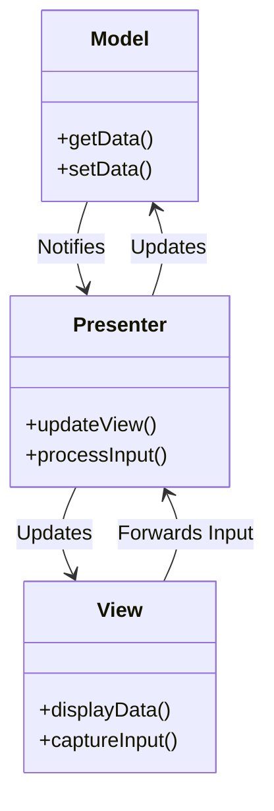
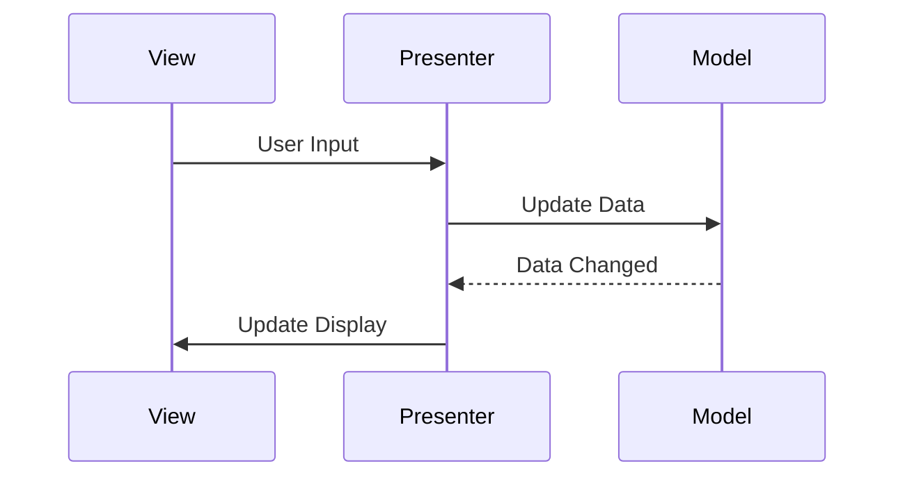

## 31.2.1 Overview of MVP

The **Model-View-Presenter (MVP)** design pattern is a derivative of the Model-View-Controller (MVC) pattern, tailored to enhance the separation of concerns and improve testability in software applications. MVP is particularly prevalent in Java applications, especially those with complex user interfaces, due to its ability to decouple the presentation logic from the UI framework.

### Defining the MVP Pattern

The MVP pattern divides an application into three interconnected components:

- **Model**: Represents the data and business logic of the application. It is responsible for retrieving, storing, and manipulating data, often interacting with databases or web services.
- **View**: The UI component that displays data to the user and captures user input. It is passive and does not contain any logic to manipulate the data.
- **Presenter**: Acts as an intermediary between the Model and the View. It retrieves data from the Model and formats it for display in the View. It also handles user input, updating the Model accordingly.

### Roles of MVP Components

#### Model

The **Model** in MVP is responsible for the core functionality of the application. It manages the data, ensuring that it is consistent and up-to-date. The Model is independent of the View and Presenter, making it reusable and easy to test.

#### View

The **View** is the user interface of the application. It is responsible for rendering the data provided by the Presenter and capturing user interactions. The View is typically implemented using Java UI frameworks such as Swing, JavaFX, or Android UI components. It is designed to be as simple as possible, delegating all logic to the Presenter.

#### Presenter

The **Presenter** is the central component in the MVP pattern. It acts as a mediator between the Model and the View. The Presenter retrieves data from the Model, processes it if necessary, and updates the View. It also handles user input from the View, updating the Model as needed. The Presenter contains the application logic and is responsible for coordinating the interactions between the Model and the View.

### Communication Flow in MVP

In the MVP pattern, the communication flow is unidirectional:

1. **View to Presenter**: The View captures user input and forwards it to the Presenter.
2. **Presenter to Model**: The Presenter processes the input and updates the Model.
3. **Model to Presenter**: The Model notifies the Presenter of any data changes.
4. **Presenter to View**: The Presenter updates the View with the new data.

This flow ensures a clear separation of concerns, with each component having a distinct responsibility.

### Comparing MVP with MVC

While both MVP and MVC aim to separate concerns in an application, they differ in their approach and structure:

- **Controller vs. Presenter**: In MVC, the Controller handles user input and updates the Model and View. In MVP, the Presenter takes on this role, but with a more explicit separation between the View and the Presenter. The View in MVP is passive and does not directly interact with the Model.
- **View's Role**: In MVC, the View can directly query the Model for data. In MVP, the View is completely decoupled from the Model, relying on the Presenter to provide data.
- **Testability**: MVP enhances testability by isolating the presentation logic in the Presenter, making it easier to write unit tests for the application logic without involving the UI.

### Diagrams Illustrating MVP

To better understand the structure and flow of the MVP pattern, consider the following diagrams:

*Diagram 1: Class diagram illustrating the structure of the MVP pattern.*

*Diagram 2: Sequence diagram showing the communication flow in the MVP pattern.*

### Scenarios Where MVP is Beneficial

MVP is particularly advantageous in scenarios where:

- **Complex UI Logic**: Applications with intricate UI logic benefit from the clear separation of concerns provided by MVP.
- **Testability**: MVP's decoupled architecture facilitates unit testing of the presentation logic without involving the UI.
- **Platform Independence**: MVP allows for the View to be implemented using different UI frameworks, making it easier to port applications across platforms.
- **Maintainability**: The separation of concerns in MVP enhances maintainability, allowing developers to modify the UI or business logic independently.

### Conclusion

The Model-View-Presenter pattern is a powerful tool for Java developers seeking to build maintainable, testable, and scalable applications. By clearly delineating the responsibilities of the Model, View, and Presenter, MVP promotes a clean architecture that is easy to understand and extend. As you explore the MVP pattern, consider how its principles can be applied to your projects to enhance their structure and quality.

---

## Test Your Knowledge: Mastering MVP Design Pattern in Java



### What is the primary role of the Presenter in the MVP pattern?

- [x] Mediates between the Model and the View
- [ ] Directly updates the Model
- [ ] Handles all user interactions
- [ ] Manages the UI layout

> **Explanation:** The Presenter acts as an intermediary, coordinating interactions between the Model and the View.

### How does the View communicate with the Presenter in MVP?

- [x] By forwarding user input
- [ ] By directly querying the Model
- [ ] By updating the Model
- [ ] By rendering data

> **Explanation:** The View captures user input and forwards it to the Presenter for processing.

### In MVP, which component is responsible for data manipulation?

- [x] Model
- [ ] View
- [ ] Presenter
- [ ] Controller

> **Explanation:** The Model handles data retrieval, storage, and manipulation.

### What is a key advantage of using MVP over MVC?

- [x] Enhanced testability
- [ ] Simpler architecture
- [ ] Direct View-Model interaction
- [ ] Reduced code complexity

> **Explanation:** MVP enhances testability by isolating presentation logic in the Presenter.

### Which Java UI frameworks are commonly used with MVP?

- [x] Swing
- [x] JavaFX
- [ ] Spring
- [ ] Hibernate

> **Explanation:** Swing and JavaFX are popular Java UI frameworks suitable for implementing the View in MVP.

### What is the communication flow direction in MVP?

- [x] Unidirectional
- [ ] Bidirectional
- [ ] Circular
- [ ] Random

> **Explanation:** MVP follows a unidirectional flow, ensuring clear separation of concerns.

### How does the Presenter update the View in MVP?

- [x] By providing formatted data
- [ ] By directly modifying the UI
- [ ] By querying the Model
- [ ] By capturing user input

> **Explanation:** The Presenter formats data from the Model and updates the View accordingly.

### What is the primary benefit of decoupling the View from the Model in MVP?

- [x] Improved maintainability
- [ ] Faster data processing
- [ ] Simplified UI design
- [ ] Direct data access

> **Explanation:** Decoupling enhances maintainability by allowing independent modifications to the UI and business logic.

### Which component in MVP is passive and does not contain logic?

- [x] View
- [ ] Model
- [ ] Presenter
- [ ] Controller

> **Explanation:** The View is passive and relies on the Presenter for logic and data updates.

### True or False: In MVP, the View can directly interact with the Model.

- [ ] True
- [x] False

> **Explanation:** In MVP, the View does not directly interact with the Model; it relies on the Presenter for data.



---
