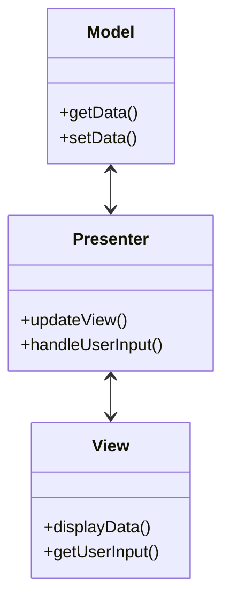

## 31.2.2 Implementing MVP in Java

The Model-View-Presenter (MVP) pattern is a derivative of the Model-View-Controller (MVC) pattern, designed to improve the separation of concerns in software applications. MVP is particularly useful in Java applications, both for desktop and web contexts, as it enhances testability and maintainability. This guide provides a comprehensive exploration of implementing the MVP pattern in Java, focusing on structure, decoupling, and best practices.

### Structure of an MVP-Based Application in Java

The MVP pattern divides an application into three interconnected components:

1. **Model**: Represents the data and business logic of the application. It is responsible for managing the data, responding to requests for data, and updating the data.
2. **View**: Displays the data to the user and sends user commands to the Presenter. It is responsible for the UI and user interaction.
3. **Presenter**: Acts as an intermediary between the Model and the View. It retrieves data from the Model and formats it for display in the View.

The MVP pattern can be visualized as follows:



*Diagram: The structure of the MVP pattern showing the interaction between Model, View, and Presenter.*

### Implementing MVP in Java

#### Defining Models, Views, and Presenters

To implement MVP in Java, begin by defining the Model, View, and Presenter components. Let's consider a simple example of a calculator application.

**Model**

The Model is responsible for the business logic and data management. In our calculator example, it will handle arithmetic operations.

```java
public class CalculatorModel {
    private double result;

    public double add(double a, double b) {
        result = a + b;
        return result;
    }

    public double subtract(double a, double b) {
        result = a - b;
        return result;
    }

    // Additional operations like multiply and divide
}
```

**View**

The View is responsible for displaying data to the user and capturing user input. It should be as passive as possible, delegating logic to the Presenter.

```java
public interface CalculatorView {
    void setDisplay(String value);
    String getInput();
    void addCalculateListener(ActionListener listener);
}
```

**Presenter**

The Presenter acts as a mediator between the Model and the View. It handles user input and updates the View accordingly.

```java
public class CalculatorPresenter {
    private CalculatorModel model;
    private CalculatorView view;

    public CalculatorPresenter(CalculatorModel model, CalculatorView view) {
        this.model = model;
        this.view = view;
        this.view.addCalculateListener(e -> calculate());
    }

    private void calculate() {
        String input = view.getInput();
        // Parse input and perform calculation
        double result = model.add(1, 2); // Example operation
        view.setDisplay(String.valueOf(result));
    }
}
```

### Decoupling the View from the Presenter

Decoupling the View from the Presenter is crucial for enhancing testability. This can be achieved by using interfaces for the View and Presenter, allowing for easy mocking during unit tests.

#### Using Interfaces for Views and Presenters

By defining interfaces for the View and Presenter, you can create mock implementations for testing purposes. This approach ensures that the Presenter can be tested independently of the View.

**View Interface**

```java
public interface CalculatorView {
    void setDisplay(String value);
    String getInput();
    void addCalculateListener(ActionListener listener);
}
```

**Presenter Interface**

```java
public interface CalculatorPresenter {
    void calculate();
}
```

### Best Practices for Event Handling and Updating the View

1. **Use Interfaces**: Define interfaces for Views and Presenters to facilitate testing and decoupling.
2. **Keep Views Passive**: Views should only be responsible for displaying data and capturing user input. All logic should reside in the Presenter.
3. **Handle Events in the Presenter**: All user interactions should be handled by the Presenter, which then updates the Model and View.
4. **Use Dependency Injection**: Inject dependencies into the Presenter to enhance testability and flexibility.

### Common Challenges and How to Overcome Them

1. **Complexity in Large Applications**: As applications grow, managing numerous Presenters and Views can become complex. Use a consistent naming convention and organize code into packages to maintain clarity.
2. **Testing**: Ensure that each component is tested independently. Use mock objects to simulate interactions between components.
3. **State Management**: Keep state management within the Model to avoid inconsistencies between the View and Presenter.

### Sample Use Cases

1. **Desktop Applications**: JavaFX applications can benefit from the MVP pattern by separating UI logic from business logic, enhancing testability.
2. **Web Applications**: In web contexts, MVP can be used with frameworks like Spring MVC to separate concerns and improve maintainability.

### Related Patterns

- **Model-View-Controller (MVC)**: MVP is a derivative of MVC, focusing on improving separation of concerns.
- **Model-View-ViewModel (MVVM)**: Similar to MVP, MVVM is often used in data-binding scenarios, particularly in WPF applications.

### Known Uses

- **Google Web Toolkit (GWT)**: Uses MVP to separate UI logic from business logic.
- **Android Development**: MVP is commonly used in Android applications to improve testability and maintainability.

### Conclusion

Implementing the MVP pattern in Java applications can significantly enhance the separation of concerns, testability, and maintainability. By following best practices and addressing common challenges, developers can create robust and efficient applications. Experiment with the provided code examples and consider how MVP can be applied to your projects.

## Test Your Knowledge: Implementing MVP in Java Quiz



### What is the primary role of the Presenter in the MVP pattern?

- [x] To act as an intermediary between the Model and the View.
- [ ] To manage the user interface.
- [ ] To store application data.
- [ ] To handle database interactions.

> **Explanation:** The Presenter acts as an intermediary between the Model and the View, handling user input and updating the View.

### How does the MVP pattern improve testability?

- [x] By decoupling the View from the Presenter using interfaces.
- [ ] By combining the Model and View into a single component.
- [ ] By using a single class for all logic.
- [ ] By eliminating the need for unit tests.

> **Explanation:** MVP improves testability by decoupling the View from the Presenter using interfaces, allowing for independent testing.

### In the MVP pattern, where should business logic reside?

- [x] In the Model.
- [ ] In the View.
- [ ] In the Presenter.
- [ ] In the Controller.

> **Explanation:** Business logic should reside in the Model, which is responsible for data management and operations.

### What is a common challenge when implementing MVP in large applications?

- [x] Managing numerous Presenters and Views.
- [ ] Integrating with databases.
- [ ] Handling user input.
- [ ] Displaying data to the user.

> **Explanation:** Managing numerous Presenters and Views can become complex in large applications, requiring careful organization.

### Which of the following is a best practice for event handling in MVP?

- [x] Handle events in the Presenter.
- [ ] Handle events in the View.
- [ ] Handle events in the Model.
- [ ] Handle events in the Controller.

> **Explanation:** Events should be handled in the Presenter, which updates the Model and View accordingly.

### How can dependency injection benefit MVP implementations?

- [x] By enhancing testability and flexibility.
- [ ] By reducing the number of classes.
- [ ] By eliminating the need for interfaces.
- [ ] By combining the Model and View.

> **Explanation:** Dependency injection enhances testability and flexibility by allowing dependencies to be injected into the Presenter.

### What is the main advantage of using interfaces for Views and Presenters?

- [x] It facilitates testing and decoupling.
- [ ] It reduces the number of classes.
- [ ] It simplifies the user interface.
- [ ] It eliminates the need for a Model.

> **Explanation:** Using interfaces facilitates testing and decoupling, allowing for easy mocking during unit tests.

### In which type of applications is the MVP pattern particularly beneficial?

- [x] Desktop and web applications.
- [ ] Command-line applications.
- [ ] Embedded systems.
- [ ] Database applications.

> **Explanation:** The MVP pattern is particularly beneficial in desktop and web applications, enhancing testability and maintainability.

### How does MVP differ from MVC?

- [x] MVP focuses on improving separation of concerns by decoupling the View from the Presenter.
- [ ] MVP combines the Model and View into a single component.
- [ ] MVP eliminates the need for a Controller.
- [ ] MVP uses a single class for all logic.

> **Explanation:** MVP focuses on improving separation of concerns by decoupling the View from the Presenter, unlike MVC.

### True or False: The View in MVP should contain business logic.

- [x] False
- [ ] True

> **Explanation:** The View in MVP should not contain business logic; it should only display data and capture user input.



By understanding and implementing the MVP pattern in Java, developers can create applications that are not only robust and maintainable but also easier to test and extend. This guide provides the foundational knowledge and practical examples needed to apply MVP effectively in both desktop and web contexts.
