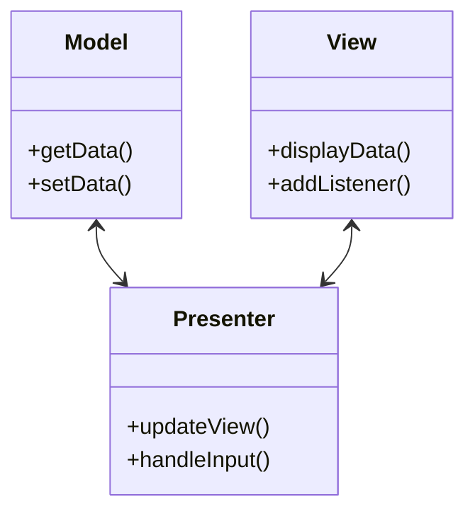

## 31.2.3 MVP in Desktop Applications

The Model-View-Presenter (MVP) pattern is a derivative of the Model-View-Controller (MVC) pattern, designed to improve the separation of concerns in software architecture. In desktop applications, particularly those built with Java technologies like Swing or JavaFX, MVP offers a robust framework for creating modular, testable, and maintainable code. This section delves into the practical application of the MVP pattern in Java desktop applications, focusing on handling user input, managing events, and implementing data binding.

### Understanding MVP in Desktop Applications

#### Intent

The MVP pattern aims to separate the presentation layer from the business logic, allowing developers to create applications that are easier to test and maintain. In this pattern, the **Model** represents the data and business logic, the **View** is the user interface, and the **Presenter** acts as an intermediary that handles user input and updates the View.

#### Historical Context

The MVP pattern evolved from the MVC pattern, which was first introduced in the 1970s for the Smalltalk programming language. As user interfaces became more complex, the need for a more refined separation of concerns led to the development of MVP, which provides a clearer distinction between the View and the Presenter.

### Implementing MVP with Swing

Swing is a widely used Java toolkit for building graphical user interfaces. Implementing MVP in Swing involves creating separate classes for the Model, View, and Presenter, each with distinct responsibilities.

#### Structure



**Diagram Explanation**: This diagram illustrates the interaction between the Model, View, and Presenter in the MVP pattern. The Presenter communicates with both the Model and the View, updating the View based on changes in the Model and handling user input.

#### Participants

- **Model**: Manages the data and business logic.
- **View**: Displays the data and captures user input.
- **Presenter**: Acts as a mediator, updating the View and processing user input.

#### Code Example

Let's consider a simple desktop application that displays and updates a user's profile information.

**Model.java**

```java
public class UserModel {
    private String name;
    private String email;

    public String getName() {
        return name;
    }

    public void setName(String name) {
        this.name = name;
    }

    public String getEmail() {
        return email;
    }

    public void setEmail(String email) {
        this.email = email;
    }
}
```

**View.java**

```java
import javax.swing.*;
import java.awt.event.ActionListener;

public class UserView extends JFrame {
    private JTextField nameField = new JTextField(20);
    private JTextField emailField = new JTextField(20);
    private JButton updateButton = new JButton("Update");

    public UserView() {
        JPanel panel = new JPanel();
        panel.add(new JLabel("Name:"));
        panel.add(nameField);
        panel.add(new JLabel("Email:"));
        panel.add(emailField);
        panel.add(updateButton);
        this.setContentPane(panel);
        this.pack();
        this.setDefaultCloseOperation(JFrame.EXIT_ON_CLOSE);
    }

    public String getName() {
        return nameField.getText();
    }

    public String getEmail() {
        return emailField.getText();
    }

    public void setName(String name) {
        nameField.setText(name);
    }

    public void setEmail(String email) {
        emailField.setText(email);
    }

    public void addUpdateListener(ActionListener listener) {
        updateButton.addActionListener(listener);
    }
}
```

**Presenter.java**

```java
import java.awt.event.ActionEvent;
import java.awt.event.ActionListener;

public class UserPresenter {
    private UserModel model;
    private UserView view;

    public UserPresenter(UserModel model, UserView view) {
        this.model = model;
        this.view = view;

        this.view.addUpdateListener(new ActionListener() {
            @Override
            public void actionPerformed(ActionEvent e) {
                updateModel();
                updateView();
            }
        });

        updateView();
    }

    private void updateModel() {
        model.setName(view.getName());
        model.setEmail(view.getEmail());
    }

    private void updateView() {
        view.setName(model.getName());
        view.setEmail(model.getEmail());
    }
}
```

**Main.java**

```java
public class Main {
    public static void main(String[] args) {
        UserModel model = new UserModel();
        UserView view = new UserView();
        UserPresenter presenter = new UserPresenter(model, view);
        view.setVisible(true);
    }
}
```

#### Explanation

In this example, the `UserModel` class represents the data, the `UserView` class is responsible for the user interface, and the `UserPresenter` class handles the logic of updating the model and view. The Presenter listens for user actions in the View and updates the Model accordingly.

### Handling User Input and Events

In the MVP pattern, the Presenter is responsible for handling user input and events. This separation allows for better testability and modularity, as the Presenter can be tested independently of the View.

#### Event Handling in the Presenter

The Presenter should register listeners for user actions in the View and update the Model based on the input. This approach ensures that the View remains passive, only responsible for displaying data and capturing user input.

### Data Binding Techniques

Java Swing does not provide built-in support for data binding, which can make synchronizing the Model and View challenging. However, developers can implement custom data binding techniques to achieve this synchronization.

#### Custom Data Binding

One approach to data binding in Swing is to use property change listeners. This technique involves adding listeners to the Model that notify the Presenter of changes, allowing the Presenter to update the View accordingly.

**Example: Implementing Property Change Listeners**

```java
import java.beans.PropertyChangeListener;
import java.beans.PropertyChangeSupport;

public class UserModel {
    private String name;
    private String email;
    private PropertyChangeSupport support;

    public UserModel() {
        support = new PropertyChangeSupport(this);
    }

    public String getName() {
        return name;
    }

    public void setName(String name) {
        String oldName = this.name;
        this.name = name;
        support.firePropertyChange("name", oldName, name);
    }

    public String getEmail() {
        return email;
    }

    public void setEmail(String email) {
        String oldEmail = this.email;
        this.email = email;
        support.firePropertyChange("email", oldEmail, email);
    }

    public void addPropertyChangeListener(PropertyChangeListener listener) {
        support.addPropertyChangeListener(listener);
    }

    public void removePropertyChangeListener(PropertyChangeListener listener) {
        support.removePropertyChangeListener(listener);
    }
}
```

**Presenter.java (Updated)**

```java
public class UserPresenter {
    private UserModel model;
    private UserView view;

    public UserPresenter(UserModel model, UserView view) {
        this.model = model;
        this.view = view;

        this.model.addPropertyChangeListener(evt -> {
            if ("name".equals(evt.getPropertyName())) {
                view.setName((String) evt.getNewValue());
            } else if ("email".equals(evt.getPropertyName())) {
                view.setEmail((String) evt.getNewValue());
            }
        });

        this.view.addUpdateListener(e -> updateModel());

        updateView();
    }

    private void updateModel() {
        model.setName(view.getName());
        model.setEmail(view.getEmail());
    }

    private void updateView() {
        view.setName(model.getName());
        view.setEmail(model.getEmail());
    }
}
```

### Benefits of MVP in Desktop Applications

The MVP pattern offers several advantages for desktop applications:

- **Modularity**: Separating the presentation logic from the UI allows for more modular code, making it easier to manage and extend.
- **Testability**: The Presenter can be tested independently of the View, facilitating unit testing and improving code quality.
- **Maintainability**: Clear separation of concerns simplifies maintenance and reduces the risk of introducing bugs when modifying the codebase.

### Implementing MVP with JavaFX

JavaFX is another popular Java toolkit for building rich desktop applications. It provides a more modern approach to UI development compared to Swing, with support for CSS styling and FXML for defining UI layouts.

#### JavaFX MVP Structure

The structure of MVP in JavaFX is similar to that in Swing, with distinct classes for the Model, View, and Presenter.

#### Code Example

Let's implement a similar user profile application using JavaFX.

**UserModel.java**

```java
import javafx.beans.property.SimpleStringProperty;
import javafx.beans.property.StringProperty;

public class UserModel {
    private StringProperty name = new SimpleStringProperty();
    private StringProperty email = new SimpleStringProperty();

    public StringProperty nameProperty() {
        return name;
    }

    public StringProperty emailProperty() {
        return email;
    }

    public String getName() {
        return name.get();
    }

    public void setName(String name) {
        this.name.set(name);
    }

    public String getEmail() {
        return email.get();
    }

    public void setEmail(String email) {
        this.email.set(email);
    }
}
```

**UserView.java**

```java
import javafx.scene.Scene;
import javafx.scene.control.Button;
import javafx.scene.control.Label;
import javafx.scene.control.TextField;
import javafx.scene.layout.VBox;
import javafx.stage.Stage;

public class UserView {
    private TextField nameField = new TextField();
    private TextField emailField = new TextField();
    private Button updateButton = new Button("Update");

    public void start(Stage primaryStage) {
        VBox root = new VBox();
        root.getChildren().addAll(new Label("Name:"), nameField, new Label("Email:"), emailField, updateButton);

        Scene scene = new Scene(root, 300, 200);
        primaryStage.setScene(scene);
        primaryStage.setTitle("User Profile");
        primaryStage.show();
    }

    public TextField getNameField() {
        return nameField;
    }

    public TextField getEmailField() {
        return emailField;
    }

    public Button getUpdateButton() {
        return updateButton;
    }
}
```

**UserPresenter.java**

```java
import javafx.beans.binding.Bindings;

public class UserPresenter {
    private UserModel model;
    private UserView view;

    public UserPresenter(UserModel model, UserView view) {
        this.model = model;
        this.view = view;

        Bindings.bindBidirectional(view.getNameField().textProperty(), model.nameProperty());
        Bindings.bindBidirectional(view.getEmailField().textProperty(), model.emailProperty());

        view.getUpdateButton().setOnAction(e -> updateModel());
    }

    private void updateModel() {
        model.setName(view.getNameField().getText());
        model.setEmail(view.getEmailField().getText());
    }
}
```

**Main.java**

```java
import javafx.application.Application;
import javafx.stage.Stage;

public class Main extends Application {
    @Override
    public void start(Stage primaryStage) {
        UserModel model = new UserModel();
        UserView view = new UserView();
        new UserPresenter(model, view);
        view.start(primaryStage);
    }

    public static void main(String[] args) {
        launch(args);
    }
}
```

#### Explanation

In this JavaFX implementation, the `UserModel` uses JavaFX properties to facilitate data binding. The `UserPresenter` binds the text properties of the `TextField` components in the `UserView` to the properties in the `UserModel`, ensuring that changes in the View are automatically reflected in the Model and vice versa.

### Conclusion

The MVP pattern is a powerful tool for building modular, testable, and maintainable desktop applications in Java. By clearly separating the Model, View, and Presenter, developers can create applications that are easier to manage and extend. Whether using Swing or JavaFX, the principles of MVP remain the same, providing a consistent framework for developing robust user interfaces.

### Key Takeaways

- **Separation of Concerns**: MVP provides a clear separation between the UI and business logic, enhancing modularity and testability.
- **Event Handling**: The Presenter handles user input and events, allowing the View to remain passive.
- **Data Binding**: Custom data binding techniques can be implemented in Swing, while JavaFX offers built-in support for property binding.
- **Flexibility**: MVP can be adapted to various Java UI toolkits, including Swing and JavaFX, providing a versatile approach to desktop application development.

### Exercises

1. Modify the Swing example to include additional fields, such as a phone number, and update the Presenter to handle these changes.
2. Implement a JavaFX application using the MVP pattern that manages a list of items, allowing users to add, remove, and edit items.
3. Experiment with different data binding techniques in Swing, such as using third-party libraries like JGoodies Binding.

### References

- Oracle Java Documentation: [Java Documentation](https://docs.oracle.com/en/java/)
- Microsoft: [Cloud Design Patterns](https://learn.microsoft.com/en-us/azure/architecture/patterns/)

## Test Your Knowledge: Mastering MVP in Java Desktop Applications



### What is the primary benefit of using the MVP pattern in desktop applications?

- [x] It separates the presentation layer from the business logic.
- [ ] It simplifies the user interface design.
- [ ] It reduces the number of classes needed.
- [ ] It eliminates the need for event handling.

> **Explanation:** The MVP pattern separates the presentation layer from the business logic, allowing for more modular and testable code.

### In the MVP pattern, which component is responsible for handling user input?

- [ ] Model
- [x] Presenter
- [ ] View
- [ ] Controller

> **Explanation:** The Presenter is responsible for handling user input and updating the Model and View accordingly.

### How does JavaFX facilitate data binding in the MVP pattern?

- [x] Through the use of properties and bindings.
- [ ] By providing built-in event listeners.
- [ ] By using XML configuration files.
- [ ] By automatically generating code.

> **Explanation:** JavaFX uses properties and bindings to facilitate data binding, allowing for automatic synchronization between the Model and View.

### What is a common technique for implementing data binding in Swing?

- [ ] Using XML configuration files.
- [x] Implementing property change listeners.
- [ ] Utilizing built-in Swing bindings.
- [ ] Relying on JavaFX properties.

> **Explanation:** In Swing, property change listeners are a common technique for implementing data binding, as Swing does not have built-in support for bindings.

### Which Java toolkit provides CSS styling and FXML for UI layouts?

- [ ] Swing
- [x] JavaFX
- [ ] AWT
- [ ] SWT

> **Explanation:** JavaFX provides CSS styling and FXML for defining UI layouts, offering a more modern approach to UI development.

### What is the role of the View in the MVP pattern?

- [ ] To handle business logic.
- [ ] To manage data storage.
- [x] To display data and capture user input.
- [ ] To update the Model.

> **Explanation:** The View is responsible for displaying data and capturing user input, while the Presenter handles the logic of updating the Model and View.

### In the provided Swing example, what does the `UserPresenter` class do?

- [x] It updates the Model and View based on user input.
- [ ] It directly modifies the UI components.
- [ ] It stores user data in a database.
- [ ] It handles network communication.

> **Explanation:** The `UserPresenter` class updates the Model and View based on user input, acting as a mediator between the two.

### What is a key advantage of using MVP over MVC in desktop applications?

- [ ] MVP requires fewer classes.
- [x] MVP provides a clearer separation between the View and the Presenter.
- [ ] MVP eliminates the need for a Model.
- [ ] MVP simplifies event handling.

> **Explanation:** MVP provides a clearer separation between the View and the Presenter, enhancing modularity and testability compared to MVC.

### How can developers test the Presenter independently of the View?

- [ ] By using mock objects for the View.
- [x] By separating the logic into distinct classes.
- [ ] By integrating the View into the Presenter.
- [ ] By using a single class for both Presenter and View.

> **Explanation:** Developers can test the Presenter independently by using mock objects for the View, allowing for isolated unit testing of the presentation logic.

### True or False: The MVP pattern can only be used with JavaFX.

- [x] False
- [ ] True

> **Explanation:** The MVP pattern can be used with various Java UI toolkits, including Swing and JavaFX, making it a versatile approach for desktop application development.


