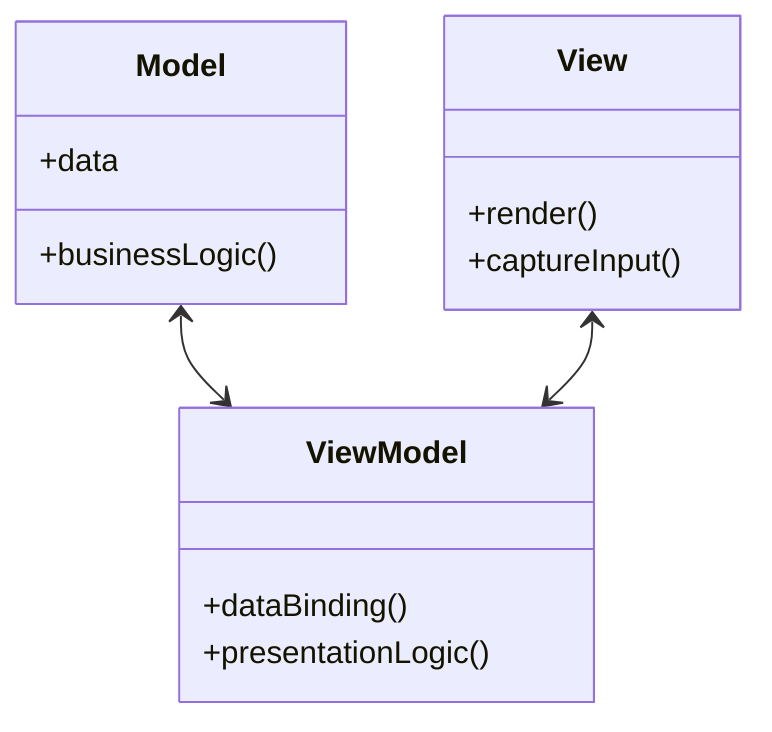

## 31.3.1 Overview of MVVM

### Introduction to MVVM

The **Model-View-ViewModel (MVVM)** pattern is a software architectural pattern that facilitates a clear separation between the user interface (UI) and business logic in applications. Originating from Microsoft's development ecosystem, MVVM has gained widespread adoption in various platforms, including Java, due to its ability to enhance maintainability, testability, and scalability of applications. This section delves into the components of MVVM, its purpose, and its advantages in modern UI development.

### Defining the MVVM Pattern

The MVVM pattern is designed to separate the development of the graphical user interface from the business logic or back-end logic (the data model). This separation is achieved through three core components:

- **Model**: Represents the data and business logic of the application. It is responsible for managing the data, business rules, and logic. The Model is independent of the UI and can be reused across different applications.

- **View**: The visual representation of the data. It is the UI component that displays the data and captures user interactions. The View is typically a passive interface that relies on the ViewModel to provide the data and handle user input.

- **ViewModel**: Acts as an intermediary between the View and the Model. It holds the presentation logic and state of the View. The ViewModel is responsible for exposing data from the Model in a way that the View can easily consume, often through data binding.

### Roles of MVVM Components

#### Model

The Model in MVVM is a representation of the application's data and business logic. It is responsible for:

- **Data Management**: Handling data retrieval, storage, and manipulation.
- **Business Logic**: Implementing the core functionality and rules of the application.
- **Independence**: Being independent of the UI, allowing for reuse and easier testing.

In Java, the Model can be implemented using Plain Old Java Objects (POJOs), JavaBeans, or any other data structure that encapsulates the application's data and logic.

#### View

The View is the UI layer of the application. It is responsible for:

- **Rendering Data**: Displaying data to the user in a visually appealing manner.
- **User Interaction**: Capturing user inputs and gestures.
- **Minimal Logic**: Containing minimal logic, primarily focusing on UI rendering.

JavaFX is a popular choice for implementing Views in Java applications, offering a rich set of UI components and controls.

#### ViewModel

The ViewModel serves as a bridge between the View and the Model. It is responsible for:

- **Data Binding**: Facilitating the automatic synchronization of data between the View and the Model.
- **Presentation Logic**: Holding the logic required to present data to the View.
- **State Management**: Maintaining the state of the View, such as selected items or input values.

In Java, the ViewModel can be implemented using classes that expose properties and methods for the View to bind to, often leveraging JavaFX's property binding capabilities.

### Facilitating Data Binding

One of the key features of MVVM is its support for **data binding**, which allows for automatic synchronization between the View and the ViewModel. Data binding reduces the need for boilerplate code and enhances the responsiveness of the UI. In JavaFX, data binding can be achieved using properties and listeners, enabling seamless updates between the UI and the underlying data model.

```java
import javafx.beans.property.StringProperty;
import javafx.beans.property.SimpleStringProperty;

public class PersonViewModel {
    private final StringProperty name = new SimpleStringProperty();

    public StringProperty nameProperty() {
        return name;
    }

    public String getName() {
        return name.get();
    }

    public void setName(String name) {
        this.name.set(name);
    }
}
```

In this example, the `PersonViewModel` class exposes a `nameProperty` that can be bound to a UI component, such as a `TextField`, allowing for automatic updates when the property changes.

### Reducing Code-Behind in Views

By leveraging data binding and the separation of concerns provided by MVVM, developers can significantly reduce the amount of code-behind in Views. Code-behind refers to the logic embedded directly within the UI layer, which can lead to tightly coupled and difficult-to-maintain code. MVVM encourages a clean separation, where the ViewModel handles the logic, and the View focuses solely on presentation.

### Comparing MVVM with MVC and MVP

The MVVM pattern is often compared to other architectural patterns, such as Model-View-Controller (MVC) and Model-View-Presenter (MVP). Understanding the differences between these patterns can help developers choose the right approach for their applications.

#### MVC (Model-View-Controller)

- **Controller**: Acts as an intermediary between the Model and the View, handling user input and updating the Model.
- **View**: Displays data and sends user actions to the Controller.
- **Model**: Manages data and business logic.

MVC is suitable for applications with simple UI logic, but as complexity increases, the Controller can become a bottleneck, leading to tightly coupled code.

#### MVP (Model-View-Presenter)

- **Presenter**: Similar to the Controller, but with more responsibility for presentation logic.
- **View**: Passive interface that delegates user input to the Presenter.
- **Model**: Manages data and business logic.

MVP offers better separation of concerns than MVC, but it can still lead to complex Presenter logic as the application grows.

#### MVVM (Model-View-ViewModel)

- **ViewModel**: Handles presentation logic and data binding, reducing the need for code-behind.
- **View**: Focuses on rendering and user interaction, with minimal logic.
- **Model**: Manages data and business logic.

MVVM excels in scenarios where data binding and UI responsiveness are critical, offering a clean separation of concerns and reducing boilerplate code.

### Diagrams Illustrating MVVM Architecture

To better understand the MVVM architecture, consider the following diagram:



**Caption**: The diagram illustrates the relationships between the Model, View, and ViewModel components in the MVVM pattern. The ViewModel acts as a mediator, facilitating data binding and presentation logic.

### Advantages of MVVM in Modern UI Development

The MVVM pattern offers several advantages in modern UI development:

- **Separation of Concerns**: By clearly separating the UI from the business logic, MVVM enhances maintainability and testability.
- **Data Binding**: Automatic synchronization between the View and the ViewModel reduces boilerplate code and improves UI responsiveness.
- **Scalability**: MVVM's modular architecture supports the development of scalable applications, as components can be developed and tested independently.
- **Testability**: With the business logic encapsulated in the ViewModel, unit testing becomes more straightforward, as the UI can be tested independently of the logic.

### Conclusion

The Model-View-ViewModel (MVVM) pattern is a powerful architectural pattern that enhances the separation between the UI and business logic in Java applications. By leveraging data binding and the clear separation of concerns, MVVM facilitates the development of maintainable, testable, and scalable applications. As modern UI development continues to evolve, MVVM remains a valuable tool for developers seeking to build responsive and robust applications.

---

## Test Your Knowledge: MVVM Pattern in Java Quiz



### What is the primary purpose of the MVVM pattern?

- [x] To separate the UI from business logic
- [ ] To combine UI and business logic
- [ ] To enhance database performance
- [ ] To simplify network communication

> **Explanation:** The MVVM pattern is designed to separate the UI from business logic, enhancing maintainability and testability.

### Which component in MVVM is responsible for data binding?

- [x] ViewModel
- [ ] Model
- [ ] View
- [ ] Controller

> **Explanation:** The ViewModel is responsible for data binding, facilitating automatic synchronization between the View and the Model.

### How does MVVM reduce code-behind in Views?

- [x] By using data binding to handle UI updates
- [ ] By embedding logic directly in the View
- [ ] By eliminating the need for a ViewModel
- [ ] By combining the View and Model

> **Explanation:** MVVM reduces code-behind by using data binding, allowing the ViewModel to handle UI updates and logic.

### What is a key advantage of MVVM over MVC?

- [x] Better separation of concerns
- [ ] Simpler architecture
- [ ] More complex Controllers
- [ ] Less modularity

> **Explanation:** MVVM offers better separation of concerns compared to MVC, enhancing maintainability and testability.

### In MVVM, which component is typically passive?

- [x] View
- [ ] Model
- [ ] ViewModel
- [ ] Controller

> **Explanation:** The View is typically passive in MVVM, focusing on rendering and user interaction with minimal logic.

### Which Java framework is commonly used for implementing Views in MVVM?

- [x] JavaFX
- [ ] Swing
- [ ] AWT
- [ ] Hibernate

> **Explanation:** JavaFX is commonly used for implementing Views in MVVM due to its rich set of UI components and data binding capabilities.

### What is the role of the Model in MVVM?

- [x] Managing data and business logic
- [ ] Handling UI rendering
- [ ] Facilitating data binding
- [ ] Capturing user input

> **Explanation:** The Model is responsible for managing data and business logic, independent of the UI.

### How does MVVM enhance testability?

- [x] By encapsulating business logic in the ViewModel
- [ ] By embedding logic in the View
- [ ] By combining the View and Model
- [ ] By eliminating the need for testing

> **Explanation:** MVVM enhances testability by encapsulating business logic in the ViewModel, allowing for independent testing of the UI and logic.

### What is a common pitfall of tightly coupled code in UI development?

- [x] Difficult maintenance and testing
- [ ] Improved performance
- [ ] Easier debugging
- [ ] Simplified architecture

> **Explanation:** Tightly coupled code can lead to difficult maintenance and testing, as changes in one part of the code can affect others.

### True or False: MVVM is only applicable to desktop applications.

- [ ] True
- [x] False

> **Explanation:** MVVM is applicable to various types of applications, including desktop, web, and mobile, due to its flexible architecture.



---
