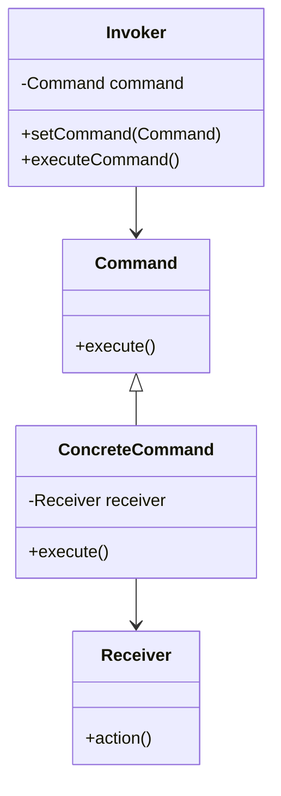

## 31.5.2 Command Pattern in UI

### Introduction

The Command pattern is a behavioral design pattern that turns a request into a stand-alone object containing all the information about the request. This transformation allows for parameterizing clients with queues, requests, and operations, and supports undoable operations. In the context of user interface (UI) applications, the Command pattern is particularly useful for encapsulating actions as objects, which enables flexible and reusable command execution.

### Understanding the Command Pattern

#### Intent

- **Description**: The Command pattern aims to encapsulate a request as an object, thereby allowing for parameterization of clients with queues, requests, and operations. It also facilitates logging of changes, undo/redo functionality, and macro recording.

#### Also Known As

- **Alternate Names**: Action, Transaction

#### Motivation

In UI applications, actions such as button clicks, menu selections, and toolbar interactions often trigger specific operations. By encapsulating these operations as command objects, developers can decouple the UI components from the business logic, leading to more modular and maintainable code. This separation also allows for advanced features like undo/redo and macro recording, enhancing the user experience.

#### Applicability

- **Guidelines**: Use the Command pattern when you need to:
  - Parameterize objects with operations.
  - Queue operations for execution.
  - Support undo and redo functionality.
  - Log changes for auditing or debugging purposes.
  - Structure a system around high-level operations built on primitive operations.

### Structure

#### Diagram



- **Caption**: The Command pattern structure involves the Command interface, ConcreteCommand classes, a Receiver, and an Invoker.

### Participants

- **Command**: Declares an interface for executing an operation.
- **ConcreteCommand**: Implements the Command interface and defines a binding between a Receiver object and an action.
- **Receiver**: Knows how to perform the operations associated with carrying out a request.
- **Invoker**: Asks the command to carry out the request.
- **Client**: Creates a ConcreteCommand object and sets its receiver.

### Collaborations

- The client creates a ConcreteCommand object and sets its receiver.
- An Invoker object stores the ConcreteCommand object.
- The Invoker calls the execute() method on the command.
- The ConcreteCommand object invokes operations on its receiver to carry out the request.

### Consequences

- **Decoupling**: The Command pattern decouples the object that invokes the operation from the one that knows how to perform it.
- **Undo/Redo**: Commands can be stored for undo/redo operations.
- **Macro Recording**: Commands can be composed into macro commands.
- **Complexity**: The pattern can introduce additional complexity due to the number of classes involved.

### Implementation

#### Implementation Guidelines

1. **Define the Command Interface**: Create an interface with an execute() method.
2. **Create ConcreteCommand Classes**: Implement the Command interface in concrete classes, each encapsulating a specific action.
3. **Implement the Receiver**: Define the class that performs the actual work.
4. **Design the Invoker**: Create a class that holds a command and invokes its execute() method.
5. **Client Setup**: Instantiate ConcreteCommand objects and associate them with receivers.

#### Sample Code Snippets

```java
// Command interface
interface Command {
    void execute();
}

// Receiver class
class Light {
    public void turnOn() {
        System.out.println("The light is on");
    }

    public void turnOff() {
        System.out.println("The light is off");
    }
}

// ConcreteCommand classes
class LightOnCommand implements Command {
    private Light light;

    public LightOnCommand(Light light) {
        this.light = light;
    }

    @Override
    public void execute() {
        light.turnOn();
    }
}

class LightOffCommand implements Command {
    private Light light;

    public LightOffCommand(Light light) {
        this.light = light;
    }

    @Override
    public void execute() {
        light.turnOff();
    }
}

// Invoker class
class RemoteControl {
    private Command command;

    public void setCommand(Command command) {
        this.command = command;
    }

    public void pressButton() {
        command.execute();
    }
}

// Client code
public class CommandPatternDemo {
    public static void main(String[] args) {
        Light livingRoomLight = new Light();
        Command lightOn = new LightOnCommand(livingRoomLight);
        Command lightOff = new LightOffCommand(livingRoomLight);

        RemoteControl remote = new RemoteControl();
        remote.setCommand(lightOn);
        remote.pressButton();
        remote.setCommand(lightOff);
        remote.pressButton();
    }
}
```

- **Explanation**: This example demonstrates a simple implementation of the Command pattern where a remote control (Invoker) can turn a light (Receiver) on and off using command objects.

### Sample Use Cases

- **Menu Actions**: In a text editor, each menu item can be associated with a command object that performs the corresponding action.
- **Toolbar Buttons**: Each button on a toolbar can trigger a command, allowing for easy customization and extension of functionality.
- **Undo/Redo Functionality**: Commands can be stored in a stack to facilitate undo and redo operations.
- **Macro Recording**: Users can record a sequence of commands to automate repetitive tasks.

### Related Patterns

- **[6.6 Singleton Pattern]( "Singleton Pattern")**: Often used to manage the lifecycle of command objects.
- **[7.3 Strategy Pattern]( "Strategy Pattern")**: Similar in that both patterns encapsulate algorithms, but the Command pattern focuses on actions rather than strategies.

### Known Uses

- **Java Swing**: The Action interface in Java Swing is a form of the Command pattern.
- **Eclipse Platform**: Uses commands extensively for menu and toolbar actions.

### Advantages of the Command Pattern in UI

1. **Decoupling UI from Business Logic**: By encapsulating actions as command objects, the UI is decoupled from the business logic, allowing for more modular and maintainable code.
2. **Undo/Redo Functionality**: Commands can be stored and replayed, enabling undo and redo operations, which are crucial for user-friendly applications.
3. **Macro Recording**: Users can record sequences of commands to automate repetitive tasks, enhancing productivity.
4. **Flexibility and Reusability**: Commands can be reused across different parts of the application, promoting code reuse and reducing duplication.

### Managing Command Lifecycles and State

When implementing the Command pattern, consider how to manage the lifecycle and state of command objects:

- **Stateful Commands**: If a command needs to maintain state, ensure that it is properly managed and reset as needed.
- **Command Queues**: Use queues to manage the execution order of commands, especially in asynchronous environments.
- **Garbage Collection**: Be mindful of memory management and ensure that unused command objects are eligible for garbage collection.

### Conclusion

The Command pattern is a powerful tool for UI development in Java, offering flexibility, reusability, and enhanced user experience through features like undo/redo and macro recording. By decoupling UI components from business logic, developers can create more maintainable and scalable applications. As you implement the Command pattern, consider the lifecycle and state management of command objects to ensure efficient and effective execution.

### Encouragement for Exploration

Experiment with the provided code examples by adding new commands or modifying existing ones. Consider how the Command pattern can be applied to your own projects to improve modularity and maintainability. Reflect on the advantages of decoupling UI components from business logic and explore how this pattern can enhance the user experience in your applications.

---

## Test Your Knowledge: Command Pattern in UI Quiz



### What is the primary benefit of using the Command pattern in UI applications?

- [x] It decouples UI components from business logic.
- [ ] It increases the complexity of the code.
- [ ] It reduces the need for user input.
- [ ] It simplifies the user interface design.

> **Explanation:** The Command pattern decouples UI components from business logic, allowing for more modular and maintainable code.

### Which of the following is NOT a participant in the Command pattern?

- [ ] Command
- [ ] Receiver
- [ ] Invoker
- [x] Adapter

> **Explanation:** The Adapter is not a participant in the Command pattern. The main participants are Command, Receiver, and Invoker.

### How does the Command pattern facilitate undo/redo functionality?

- [x] By storing commands in a stack for replay.
- [ ] By directly modifying the UI components.
- [ ] By using a single command object for all actions.
- [ ] By simplifying the user interface.

> **Explanation:** The Command pattern facilitates undo/redo functionality by storing commands in a stack, allowing them to be replayed or reversed.

### In the Command pattern, what role does the Invoker play?

- [x] It calls the execute() method on the command.
- [ ] It performs the actual work of the command.
- [ ] It defines the command interface.
- [ ] It creates the command objects.

> **Explanation:** The Invoker calls the execute() method on the command, triggering the associated action.

### Which Java feature is commonly associated with the Command pattern?

- [x] Java Swing's Action interface
- [ ] Java's Stream API
- [ ] Java's Reflection API
- [ ] Java's Serialization API

> **Explanation:** Java Swing's Action interface is a form of the Command pattern, used for menu and toolbar actions.

### What is a potential drawback of the Command pattern?

- [x] It can introduce additional complexity.
- [ ] It reduces code reusability.
- [ ] It limits the number of UI components.
- [ ] It makes the code less modular.

> **Explanation:** The Command pattern can introduce additional complexity due to the number of classes involved.

### How can the Command pattern enhance user productivity?

- [x] By enabling macro recording.
- [ ] By simplifying the UI design.
- [ ] By reducing the number of commands.
- [ ] By limiting user interactions.

> **Explanation:** The Command pattern can enhance user productivity by enabling macro recording, allowing users to automate repetitive tasks.

### What is the role of the Receiver in the Command pattern?

- [x] It performs the actual work of the command.
- [ ] It stores the command objects.
- [ ] It defines the command interface.
- [ ] It triggers the command execution.

> **Explanation:** The Receiver performs the actual work of the command, executing the requested action.

### How does the Command pattern promote code reuse?

- [x] By encapsulating actions as reusable command objects.
- [ ] By reducing the number of classes.
- [ ] By simplifying the user interface.
- [ ] By limiting the number of commands.

> **Explanation:** The Command pattern promotes code reuse by encapsulating actions as reusable command objects that can be used across different parts of the application.

### True or False: The Command pattern is only applicable to UI applications.

- [ ] True
- [x] False

> **Explanation:** False. While the Command pattern is commonly used in UI applications, it is also applicable to other domains where encapsulating actions as objects is beneficial.


