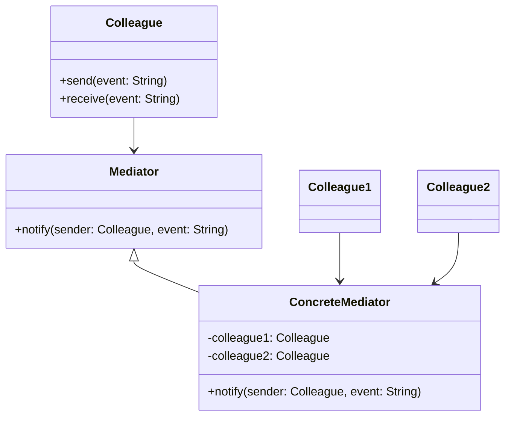

## 31.5.3 Mediator Pattern for Event Management

### Introduction

In the realm of software design, managing complex interactions between components is a common challenge, especially in user interface (UI) applications. The **Mediator Pattern** offers a solution by centralizing communication between components, thereby reducing coupling and enhancing maintainability. This section delves into the Mediator Pattern's application in Java UI frameworks, providing insights into its implementation, benefits, and potential limitations.

### Understanding the Mediator Pattern

#### Definition

The **Mediator Pattern** is a behavioral design pattern that defines an object, known as the mediator, to encapsulate how a set of objects interact. This pattern promotes loose coupling by preventing objects from referring to each other explicitly and allowing their interaction to be varied independently.

#### Intent

The primary purpose of the Mediator Pattern is to manage complex communications and control logic between related objects. By centralizing this logic in a mediator, the pattern simplifies the interactions and dependencies between objects.

#### Historical Context

The Mediator Pattern was first introduced in the "Gang of Four" book, *Design Patterns: Elements of Reusable Object-Oriented Software*, as a way to manage object interactions in a decoupled manner. Over time, it has become a staple in UI design patterns, particularly in event-driven architectures.

### Applying the Mediator Pattern in UI Applications

#### Motivation

In UI applications, components such as buttons, text fields, and sliders often need to interact with each other. Without a mediator, these components would have direct references to each other, leading to a tightly coupled system that is difficult to maintain and extend. The Mediator Pattern addresses this by centralizing the communication logic, allowing components to remain unaware of each other's existence.

#### Applicability

The Mediator Pattern is particularly useful in scenarios where:

- Multiple components need to interact in complex ways.
- The interactions between components are subject to frequent changes.
- You want to promote loose coupling and enhance maintainability.

#### Structure

The structure of the Mediator Pattern involves several key participants:

- **Mediator**: Defines an interface for communicating with Colleague objects.
- **ConcreteMediator**: Implements the Mediator interface and coordinates communication between Colleague objects.
- **Colleague**: Represents the components that communicate through the mediator.



*Diagram: Structure of the Mediator Pattern, illustrating the relationships between the Mediator, ConcreteMediator, and Colleague components.*

### Implementation in Java

#### Implementation Guidelines

To implement the Mediator Pattern in a Java UI application, follow these steps:

1. **Define the Mediator Interface**: Create an interface that declares methods for communication between components.

2. **Implement the Concrete Mediator**: Develop a class that implements the Mediator interface and manages the interactions between components.

3. **Create Colleague Classes**: Design the components that will communicate through the mediator. Each component should have a reference to the mediator.

4. **Implement Communication Logic**: In the Concrete Mediator, implement the logic for handling events and coordinating interactions between components.

#### Sample Code Snippets

Below is a Java implementation of the Mediator Pattern in a simple UI application:

```java
// Mediator interface
interface Mediator {
    void notify(Component sender, String event);
}

// Concrete Mediator
class DialogMediator implements Mediator {
    private Button okButton;
    private TextBox textBox;
    private Label label;

    public DialogMediator(Button okButton, TextBox textBox, Label label) {
        this.okButton = okButton;
        this.textBox = textBox;
        this.label = label;
    }

    @Override
    public void notify(Component sender, String event) {
        if (sender == okButton && event.equals("click")) {
            System.out.println("OK Button clicked");
            label.setText("Button clicked");
        } else if (sender == textBox && event.equals("textChanged")) {
            System.out.println("Text changed: " + textBox.getText());
            label.setText("Text: " + textBox.getText());
        }
    }
}

// Abstract Colleague
abstract class Component {
    protected Mediator mediator;

    public Component(Mediator mediator) {
        this.mediator = mediator;
    }

    public void setMediator(Mediator mediator) {
        this.mediator = mediator;
    }
}

// Concrete Colleague: Button
class Button extends Component {
    public Button(Mediator mediator) {
        super(mediator);
    }

    public void click() {
        mediator.notify(this, "click");
    }
}

// Concrete Colleague: TextBox
class TextBox extends Component {
    private String text;

    public TextBox(Mediator mediator) {
        super(mediator);
    }

    public void setText(String text) {
        this.text = text;
        mediator.notify(this, "textChanged");
    }

    public String getText() {
        return text;
    }
}

// Concrete Colleague: Label
class Label extends Component {
    private String text;

    public Label(Mediator mediator) {
        super(mediator);
    }

    public void setText(String text) {
        this.text = text;
        System.out.println("Label text set to: " + text);
    }
}

// Client code
public class MediatorPatternDemo {
    public static void main(String[] args) {
        Button okButton = new Button(null);
        TextBox textBox = new TextBox(null);
        Label label = new Label(null);

        DialogMediator mediator = new DialogMediator(okButton, textBox, label);

        okButton.setMediator(mediator);
        textBox.setMediator(mediator);
        label.setMediator(mediator);

        textBox.setText("Hello, World!");
        okButton.click();
    }
}
```

*Explanation*: In this example, the `DialogMediator` class coordinates interactions between a `Button`, `TextBox`, and `Label`. The `Button` and `TextBox` notify the mediator of events, which then updates the `Label` accordingly.

#### Encouraging Experimentation

To deepen understanding, readers are encouraged to modify the code by adding new components or events. For instance, try adding a `Checkbox` component that triggers an event when checked, and observe how the mediator manages this new interaction.

### Benefits of the Mediator Pattern

#### Reduced Coupling

By centralizing communication in a mediator, components remain decoupled from each other. This separation simplifies maintenance and allows for easier modifications and extensions.

#### Improved Maintainability

With the interaction logic encapsulated in a single mediator, changes to the communication protocol can be made in one place, reducing the risk of errors and inconsistencies.

#### Enhanced Flexibility

The Mediator Pattern allows for flexible interaction protocols. New components can be added without altering existing ones, as long as they adhere to the mediator's communication interface.

### Best Practices for Implementing Mediators in Java UI Frameworks

1. **Keep the Mediator Simple**: Avoid overloading the mediator with too much logic. Delegate responsibilities to components where appropriate.

2. **Use Descriptive Event Names**: Clearly define event names to ensure readability and maintainability.

3. **Leverage Java Features**: Utilize Java's functional programming features, such as lambda expressions, to simplify event handling within the mediator.

4. **Test Thoroughly**: Ensure that all interactions are tested, especially when adding new components or events.

### Potential Limitations and Mitigation Strategies

#### Complexity

While the Mediator Pattern reduces coupling, it can introduce complexity by centralizing control logic. To mitigate this, ensure that the mediator remains focused on communication and delegate other responsibilities to components.

#### Performance

In systems with a large number of components, the mediator can become a bottleneck. Consider optimizing the mediator's logic or distributing responsibilities among multiple mediators if necessary.

### Sample Use Cases

#### Real-World Scenarios

- **Chat Applications**: In a chat application, a mediator can manage interactions between users, chat rooms, and message notifications.
- **Form Validation**: In a form with multiple fields, a mediator can coordinate validation logic and update the UI based on user input.

### Related Patterns

- **Observer Pattern**: While both patterns deal with communication, the Observer Pattern focuses on one-to-many relationships, whereas the Mediator Pattern centralizes communication.
- **Facade Pattern**: The Facade Pattern provides a simplified interface to a complex subsystem, similar to how a mediator simplifies interactions between components.

### Known Uses

- **Java Swing**: The Mediator Pattern is often used in Java Swing applications to manage interactions between UI components.
- **Android Development**: In Android, mediators can be used to coordinate activities and fragments, enhancing modularity and reusability.

### Conclusion

The Mediator Pattern is a powerful tool for managing complex interactions in Java UI applications. By centralizing communication, it reduces coupling, enhances maintainability, and provides flexibility in managing component interactions. While it introduces some complexity, careful implementation and adherence to best practices can mitigate potential drawbacks. As you explore the Mediator Pattern, consider how it can be applied to your own projects to streamline communication and improve system architecture.

## Test Your Knowledge: Mediator Pattern in Java UI Applications



### What is the primary purpose of the Mediator Pattern?

- [x] To centralize communication between components
- [ ] To increase coupling between components
- [ ] To simplify component interfaces
- [ ] To enhance component independence

> **Explanation:** The Mediator Pattern centralizes communication between components, reducing coupling and simplifying interactions.

### In which scenario is the Mediator Pattern most beneficial?

- [x] When multiple components need to interact in complex ways
- [ ] When components are independent and do not interact
- [ ] When a single component handles all logic
- [ ] When components have static interactions

> **Explanation:** The Mediator Pattern is beneficial when components have complex interactions that need to be managed centrally.

### How does the Mediator Pattern improve maintainability?

- [x] By centralizing interaction logic in one place
- [ ] By increasing the number of direct references between components
- [ ] By simplifying component interfaces
- [ ] By reducing the number of components

> **Explanation:** Centralizing interaction logic in the mediator simplifies maintenance and reduces the risk of errors.

### What is a potential drawback of the Mediator Pattern?

- [x] It can introduce complexity by centralizing control logic
- [ ] It increases coupling between components
- [ ] It reduces flexibility in component interactions
- [ ] It makes testing more difficult

> **Explanation:** While the Mediator Pattern reduces coupling, it can introduce complexity by centralizing control logic.

### Which Java feature can simplify event handling in a mediator?

- [x] Lambda expressions
- [ ] Generics
- [ ] Annotations
- [ ] Reflection

> **Explanation:** Lambda expressions can simplify event handling by providing concise syntax for defining event handlers.

### How can you mitigate the complexity introduced by the Mediator Pattern?

- [x] Keep the mediator focused on communication
- [ ] Increase the number of components
- [ ] Use more direct references between components
- [ ] Avoid using the mediator pattern

> **Explanation:** Keeping the mediator focused on communication helps mitigate complexity.

### What is a common use case for the Mediator Pattern in UI applications?

- [x] Form validation
- [ ] Database access
- [ ] File I/O operations
- [ ] Network communication

> **Explanation:** The Mediator Pattern is commonly used in UI applications for coordinating form validation logic.

### How does the Mediator Pattern relate to the Observer Pattern?

- [x] Both manage communication, but the Mediator centralizes it
- [ ] Both increase coupling between components
- [ ] Both simplify component interfaces
- [ ] Both reduce the number of components

> **Explanation:** While both patterns manage communication, the Mediator Pattern centralizes it, whereas the Observer Pattern handles one-to-many relationships.

### Which pattern provides a simplified interface to a complex subsystem?

- [x] Facade Pattern
- [ ] Observer Pattern
- [ ] Singleton Pattern
- [ ] Factory Pattern

> **Explanation:** The Facade Pattern provides a simplified interface to a complex subsystem, similar to how a mediator simplifies interactions.

### True or False: The Mediator Pattern is often used in Java Swing applications.

- [x] True
- [ ] False

> **Explanation:** The Mediator Pattern is commonly used in Java Swing applications to manage interactions between UI components.



By understanding and applying the Mediator Pattern, Java developers can create more maintainable and flexible UI applications, effectively managing complex interactions between components.
