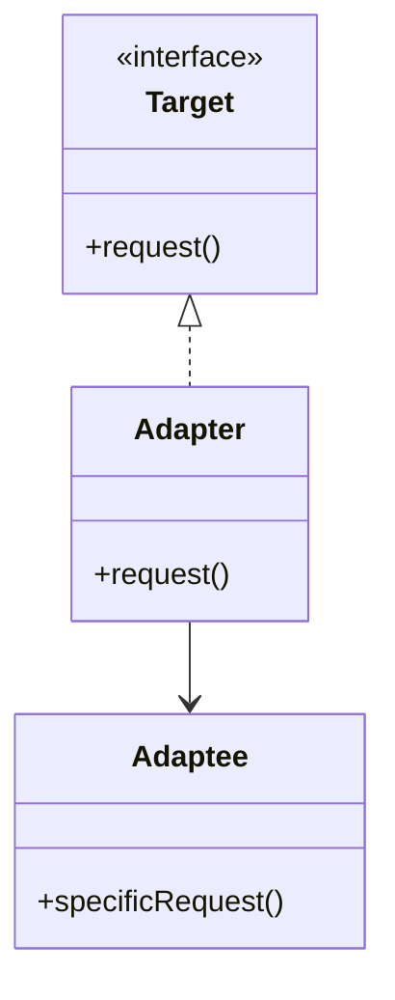
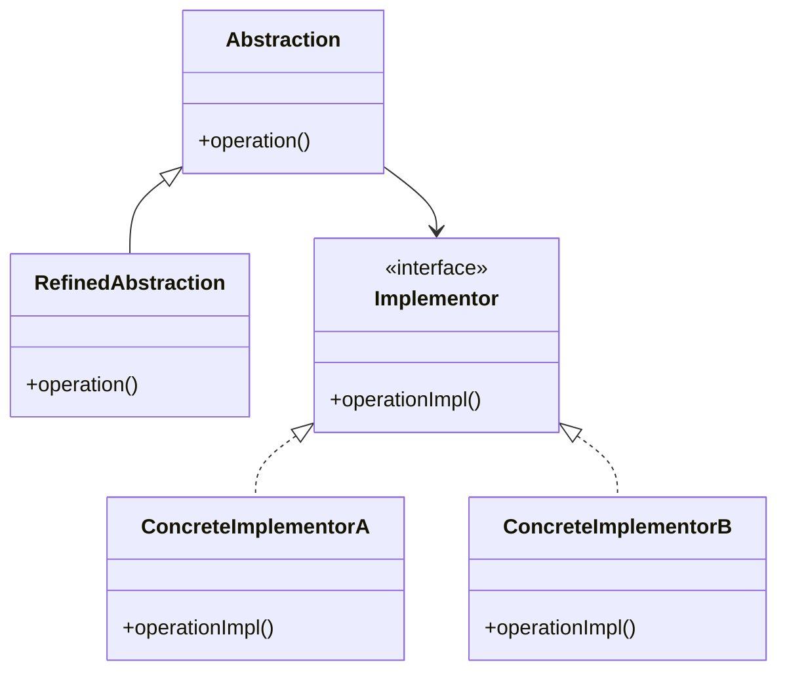
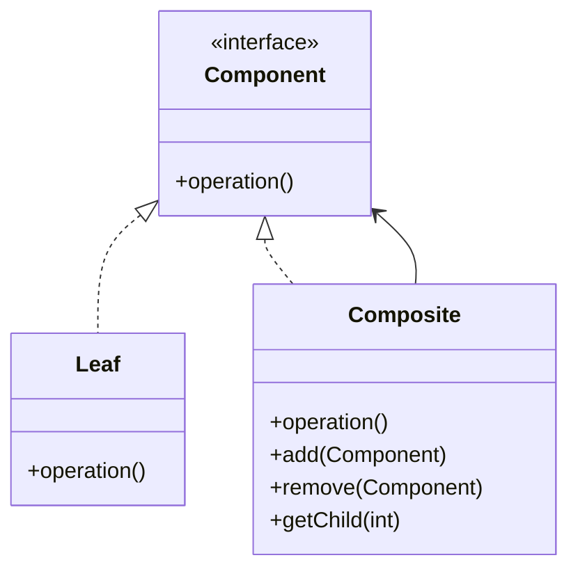

## 4.1 Overview of Structural Patterns

In the realm of object-oriented design, structural patterns play a pivotal role in defining how classes and objects can be composed to form larger, more complex structures. These patterns focus on simplifying relationships between entities, ensuring that the resulting structures are both flexible and efficient. By leveraging structural patterns, developers can create scalable and maintainable codebases that are easier to understand and modify.

### Understanding Structural Patterns

Structural design patterns are concerned with the composition of classes and objects. They help define clear relationships between components, facilitating the creation of complex systems without sacrificing flexibility. These patterns are essential for organizing code in a way that promotes reusability and reduces redundancy.

#### Purpose of Structural Patterns

The primary goal of structural patterns is to ease the design of complex systems by defining simple ways to assemble objects and classes. They address common challenges such as:

- **Managing Complexity**: By organizing code into well-defined structures, structural patterns help manage complexity, making systems easier to understand and maintain.
- **Enhancing Flexibility**: These patterns allow for the dynamic composition of objects, enabling systems to adapt to changing requirements without significant rework.
- **Promoting Reusability**: By defining clear interfaces and relationships, structural patterns facilitate the reuse of components across different parts of a system or even across different projects.

### Key Structural Patterns

Let's explore the structural patterns that will be covered in this section. Each pattern addresses specific challenges in software development, providing solutions that enhance the flexibility and maintainability of codebases.

#### 1. Adapter Pattern

The Adapter Pattern allows incompatible interfaces to work together. It acts as a bridge between two incompatible interfaces, enabling them to communicate effectively. This pattern is particularly useful when integrating legacy systems with new components.

**Example Use Case**: Integrating a third-party library with an existing system that uses a different interface.

#### 2. Bridge Pattern

The Bridge Pattern decouples an abstraction from its implementation, allowing the two to vary independently. This pattern is useful when a system needs to support multiple implementations of an abstraction.

**Example Use Case**: Developing a graphics application that supports multiple rendering engines.

#### 3. Composite Pattern

The Composite Pattern allows individual objects and compositions of objects to be treated uniformly. It is ideal for representing part-whole hierarchies, such as file systems or organizational structures.

**Example Use Case**: Building a GUI framework where individual widgets and containers are treated the same way.

#### 4. Decorator Pattern

The Decorator Pattern attaches additional responsibilities to an object dynamically. It provides a flexible alternative to subclassing for extending functionality.

**Example Use Case**: Adding features to a window object in a GUI application, such as scrollbars or borders.

#### 5. Facade Pattern

The Facade Pattern provides a simplified interface to a complex subsystem. It hides the complexities of the subsystem from the client, making it easier to use.

**Example Use Case**: Simplifying access to a complex library by providing a single entry point.

#### 6. Flyweight Pattern

The Flyweight Pattern uses sharing to support large numbers of fine-grained objects efficiently. It is particularly useful in scenarios where memory usage is a concern.

**Example Use Case**: Rendering a large number of characters in a text editor.

#### 7. Proxy Pattern

The Proxy Pattern provides a surrogate or placeholder for another object to control access to it. It is useful for implementing lazy initialization, access control, or logging.

**Example Use Case**: Implementing a virtual proxy that loads an image only when it is needed.

#### 8. Private Class Data Pattern

The Private Class Data Pattern controls access to class attributes to increase security and flexibility. It encapsulates data within a class, protecting it from unauthorized access.

**Example Use Case**: Managing sensitive data in a banking application.

#### 9. Extension Object Pattern

The Extension Object Pattern allows functionality to be added to objects dynamically by attaching new extension objects. This pattern is useful for creating flexible and modular systems.

**Example Use Case**: Implementing a plugin system for an application.

### Visualizing Structural Patterns

To better understand how structural patterns affect class and object relationships, let's explore some diagrams that illustrate these concepts.

#### Adapter Pattern Diagram

*Caption*: The Adapter Pattern allows the `Adapter` class to work with the `Target` interface by using the `Adaptee` class.

#### Bridge Pattern Diagram

*Caption*: The Bridge Pattern separates the abstraction (`Abstraction`) from its implementation (`Implementor`), allowing them to vary independently.

#### Composite Pattern Diagram

*Caption*: The Composite Pattern allows `Leaf` and `Composite` objects to be treated uniformly through the `Component` interface.

### Importance of Structural Patterns

Structural patterns are crucial for creating scalable and maintainable codebases. They provide a blueprint for organizing code in a way that promotes flexibility and reusability. By understanding and applying these patterns, developers can design systems that are easier to extend and modify, reducing the risk of introducing errors during maintenance.

### Preparing for In-Depth Discussions

In the subsequent subsections, we will delve deeper into each structural pattern, exploring their implementation in Java and discussing real-world use cases. We will also examine the benefits and trade-offs of each pattern, providing you with the knowledge needed to apply them effectively in your projects.

Remember, mastering structural patterns is a journey. As you progress, you'll gain a deeper understanding of how these patterns can transform your code, making it more robust and adaptable. Keep experimenting, stay curious, and enjoy the journey!

## Quiz Time!



### What is the primary goal of structural patterns?

- [x] To ease the design of complex systems by defining simple ways to assemble objects and classes.
- [ ] To improve the performance of algorithms.
- [ ] To enhance the security of software applications.
- [ ] To simplify user interface design.

> **Explanation:** Structural patterns focus on organizing code into well-defined structures, making systems easier to understand and maintain.

### Which pattern allows incompatible interfaces to work together?

- [x] Adapter Pattern
- [ ] Bridge Pattern
- [ ] Composite Pattern
- [ ] Decorator Pattern

> **Explanation:** The Adapter Pattern acts as a bridge between two incompatible interfaces, enabling them to communicate effectively.

### What is the main benefit of the Bridge Pattern?

- [x] It decouples an abstraction from its implementation, allowing the two to vary independently.
- [ ] It provides a simplified interface to a complex subsystem.
- [ ] It attaches additional responsibilities to an object dynamically.
- [ ] It uses sharing to support large numbers of fine-grained objects efficiently.

> **Explanation:** The Bridge Pattern separates the abstraction from its implementation, allowing for independent variation.

### Which pattern is ideal for representing part-whole hierarchies?

- [x] Composite Pattern
- [ ] Adapter Pattern
- [ ] Proxy Pattern
- [ ] Facade Pattern

> **Explanation:** The Composite Pattern allows individual objects and compositions of objects to be treated uniformly, making it ideal for part-whole hierarchies.

### How does the Decorator Pattern extend functionality?

- [x] By attaching additional responsibilities to an object dynamically.
- [ ] By providing a simplified interface to a complex subsystem.
- [ ] By decoupling an abstraction from its implementation.
- [ ] By using sharing to support large numbers of fine-grained objects efficiently.

> **Explanation:** The Decorator Pattern provides a flexible alternative to subclassing for extending functionality.

### What is the purpose of the Facade Pattern?

- [x] To provide a simplified interface to a complex subsystem.
- [ ] To decouple an abstraction from its implementation.
- [ ] To attach additional responsibilities to an object dynamically.
- [ ] To use sharing to support large numbers of fine-grained objects efficiently.

> **Explanation:** The Facade Pattern hides the complexities of a subsystem from the client, making it easier to use.

### Which pattern is useful for implementing lazy initialization?

- [x] Proxy Pattern
- [ ] Adapter Pattern
- [ ] Composite Pattern
- [ ] Flyweight Pattern

> **Explanation:** The Proxy Pattern provides a surrogate or placeholder for another object, which can be used for lazy initialization.

### What does the Private Class Data Pattern control?

- [x] Access to class attributes to increase security and flexibility.
- [ ] The composition of objects to form larger structures.
- [ ] The dynamic addition of responsibilities to an object.
- [ ] The sharing of fine-grained objects to reduce memory usage.

> **Explanation:** The Private Class Data Pattern encapsulates data within a class, protecting it from unauthorized access.

### How does the Extension Object Pattern add functionality?

- [x] By attaching new extension objects to existing objects dynamically.
- [ ] By decoupling an abstraction from its implementation.
- [ ] By providing a simplified interface to a complex subsystem.
- [ ] By using sharing to support large numbers of fine-grained objects efficiently.

> **Explanation:** The Extension Object Pattern allows functionality to be added to objects dynamically, enhancing flexibility.

### True or False: Structural patterns are only useful for small-scale applications.

- [ ] True
- [x] False

> **Explanation:** Structural patterns are crucial for creating scalable and maintainable codebases, making them valuable for both small-scale and large-scale applications.


