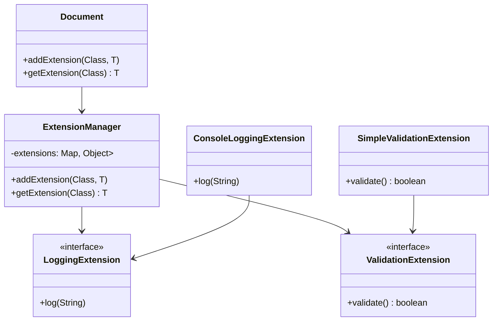

## 4.10.1 Implementing Extension Object in Java

The Extension Object pattern is a structural design pattern that allows you to add new functionality to objects dynamically. This pattern is particularly useful when you need to extend the behavior of objects without modifying their existing code, making it a powerful tool for achieving flexibility and scalability in software design.

### Understanding the Extension Object Pattern

The Extension Object pattern involves defining extension interfaces that represent additional behaviors. These interfaces can be implemented by extension classes, which can then be attached to or retrieved from the subjects they extend. This pattern leverages the principles of composition and delegation to achieve its goals.

#### Key Concepts

- **Extension Interfaces**: Define the additional behaviors that can be attached to objects.
- **Extension Classes**: Implement the extension interfaces, providing the actual behavior.
- **Subjects**: The objects to which extensions are attached.
- **Extension Manager**: A mechanism for managing the attachment and retrieval of extensions.

### Defining Extension Interfaces

To implement the Extension Object pattern, start by defining extension interfaces. These interfaces specify the additional behaviors that can be added to objects. Each extension interface should focus on a specific aspect of behavior.

```java
// Define an extension interface for logging behavior
public interface LoggingExtension {
    void log(String message);
}

// Define an extension interface for validation behavior
public interface ValidationExtension {
    boolean validate();
}
```

### Implementing Extension Classes

Next, implement the extension interfaces in concrete classes. These classes provide the actual behavior for the extensions.

```java
// Implement the LoggingExtension interface
public class ConsoleLoggingExtension implements LoggingExtension {
    @Override
    public void log(String message) {
        System.out.println("Log: " + message);
    }
}

// Implement the ValidationExtension interface
public class SimpleValidationExtension implements ValidationExtension {
    @Override
    public boolean validate() {
        // Simple validation logic
        return true;
    }
}
```

### Attaching and Retrieving Extensions

To manage extensions, you'll need a mechanism for attaching and retrieving them from subjects. This can be achieved using a map to store extensions by their type.

```java
import java.util.HashMap;
import java.util.Map;

// Define a class to manage extensions
public class ExtensionManager {
    private Map<Class<?>, Object> extensions = new HashMap<>();

    // Attach an extension to the manager
    public <T> void addExtension(Class<T> extensionType, T extension) {
        extensions.put(extensionType, extension);
    }

    // Retrieve an extension from the manager
    public <T> T getExtension(Class<T> extensionType) {
        return extensionType.cast(extensions.get(extensionType));
    }
}
```

### Using the Extension Object Pattern

With the extension interfaces, classes, and manager in place, you can now use the Extension Object pattern to dynamically add behavior to objects.

```java
public class Document {
    private ExtensionManager extensionManager = new ExtensionManager();

    // Attach an extension to the document
    public <T> void addExtension(Class<T> extensionType, T extension) {
        extensionManager.addExtension(extensionType, extension);
    }

    // Retrieve an extension from the document
    public <T> T getExtension(Class<T> extensionType) {
        return extensionManager.getExtension(extensionType);
    }
}

// Demonstrate the use of the Extension Object pattern
public class Main {
    public static void main(String[] args) {
        Document document = new Document();

        // Attach extensions to the document
        document.addExtension(LoggingExtension.class, new ConsoleLoggingExtension());
        document.addExtension(ValidationExtension.class, new SimpleValidationExtension());

        // Retrieve and use the logging extension
        LoggingExtension loggingExtension = document.getExtension(LoggingExtension.class);
        if (loggingExtension != null) {
            loggingExtension.log("Document created.");
        }

        // Retrieve and use the validation extension
        ValidationExtension validationExtension = document.getExtension(ValidationExtension.class);
        if (validationExtension != null) {
            boolean isValid = validationExtension.validate();
            System.out.println("Document is valid: " + isValid);
        }
    }
}
```

### Design Techniques: Delegation and Dynamic Typing

The Extension Object pattern relies on delegation to achieve dynamic behavior extension. By delegating responsibilities to extension classes, you can add new functionality without altering existing code. This approach promotes the open/closed principle, allowing your system to be open for extension but closed for modification.

Dynamic typing is another important aspect of this pattern. By using a map to store extensions, you can attach and retrieve extensions of any type at runtime. This flexibility allows you to add new behaviors as needed, without being constrained by static type definitions.

### Ensuring Type Safety

While dynamic typing offers flexibility, it also introduces the risk of runtime type errors. To mitigate this risk, use Java's generics and type casting carefully. The `getExtension` method in the `ExtensionManager` class uses type casting to ensure that the retrieved extension is of the expected type.

### Managing Extensions Effectively

To manage extensions effectively, consider the following best practices:

- **Use Clear and Descriptive Names**: Name your extension interfaces and classes clearly to indicate their purpose.
- **Document Extension Interfaces**: Provide documentation for each extension interface to explain its intended use and behavior.
- **Limit the Number of Extensions**: Avoid overloading objects with too many extensions, as this can lead to complexity and maintenance challenges.
- **Test Extensions Thoroughly**: Ensure that each extension is thoroughly tested to verify its behavior and interactions with other extensions.

### Visualizing the Extension Object Pattern

To better understand the structure and flow of the Extension Object pattern, let's visualize it using a class diagram.



### Try It Yourself

Now that we've covered the basics of the Extension Object pattern, try experimenting with the code examples. Here are a few suggestions:

- **Add a New Extension**: Create a new extension interface and class, then attach it to the `Document` class.
- **Modify an Existing Extension**: Change the behavior of the `ConsoleLoggingExtension` class to log messages to a file instead of the console.
- **Test Type Safety**: Introduce a type mismatch error in the `getExtension` method and observe how the code handles it.

### References and Further Reading

- [Design Patterns: Elements of Reusable Object-Oriented Software](https://en.wikipedia.org/wiki/Design_Patterns) by Erich Gamma, Richard Helm, Ralph Johnson, and John Vlissides
- [Effective Java](https://www.oreilly.com/library/view/effective-java-3rd/9780134686097/) by Joshua Bloch
- [Java Generics and Collections](https://www.oreilly.com/library/view/java-generics-and/0596527756/) by Maurice Naftalin and Philip Wadler

### Knowledge Check

Before moving on, let's review some key concepts:

- **What is the purpose of the Extension Object pattern?**
- **How do extension interfaces and classes work together?**
- **What role does the Extension Manager play in this pattern?**
- **How can you ensure type safety when using dynamic typing?**

### Embrace the Journey

Remember, implementing design patterns like the Extension Object pattern is just the beginning of your journey as a software engineer. As you continue to explore and experiment with different patterns, you'll gain a deeper understanding of how to build flexible, scalable, and maintainable software systems. Keep experimenting, stay curious, and enjoy the journey!

## Quiz Time!



### What is the primary purpose of the Extension Object pattern?

- [x] To add new functionality to objects dynamically without modifying existing code
- [ ] To improve the performance of existing code
- [ ] To simplify the user interface of an application
- [ ] To enhance security features in software

> **Explanation:** The Extension Object pattern allows for dynamic addition of new functionality to objects without altering their existing code, promoting flexibility and scalability.

### What are extension interfaces used for in the Extension Object pattern?

- [x] To define additional behaviors that can be attached to objects
- [ ] To manage the lifecycle of objects
- [ ] To handle error logging in applications
- [ ] To improve database connectivity

> **Explanation:** Extension interfaces specify the additional behaviors that can be added to objects, allowing for dynamic extension of functionality.

### How do extension classes relate to extension interfaces?

- [x] Extension classes implement extension interfaces to provide actual behavior
- [ ] Extension classes are used to store data for extension interfaces
- [ ] Extension classes manage the memory allocation for objects
- [ ] Extension classes are responsible for user authentication

> **Explanation:** Extension classes implement the extension interfaces, providing the concrete behavior for the extensions.

### What is the role of the Extension Manager in the Extension Object pattern?

- [x] To manage the attachment and retrieval of extensions from subjects
- [ ] To handle network communication between objects
- [ ] To optimize the performance of the application
- [ ] To provide security features for the application

> **Explanation:** The Extension Manager is responsible for managing the attachment and retrieval of extensions, ensuring that objects can be dynamically extended with new behaviors.

### Which design principle does the Extension Object pattern promote?

- [x] Open/Closed Principle
- [ ] Single Responsibility Principle
- [ ] Liskov Substitution Principle
- [ ] Interface Segregation Principle

> **Explanation:** The Extension Object pattern promotes the Open/Closed Principle by allowing systems to be open for extension but closed for modification.

### How can type safety be ensured when using dynamic typing in the Extension Object pattern?

- [x] By using Java's generics and type casting carefully
- [ ] By avoiding the use of interfaces
- [ ] By implementing custom memory management
- [ ] By using static variables

> **Explanation:** Type safety can be ensured by using Java's generics and type casting carefully, allowing for dynamic behavior extension without runtime errors.

### What is a potential risk of using dynamic typing in the Extension Object pattern?

- [x] Runtime type errors
- [ ] Increased memory usage
- [ ] Slower execution speed
- [ ] Limited scalability

> **Explanation:** While dynamic typing offers flexibility, it introduces the risk of runtime type errors if not managed carefully.

### What is a best practice for managing extensions effectively?

- [x] Use clear and descriptive names for extension interfaces and classes
- [ ] Avoid using interfaces altogether
- [ ] Implement all extensions in a single class
- [ ] Use global variables for managing extensions

> **Explanation:** Using clear and descriptive names for extension interfaces and classes helps manage extensions effectively by indicating their purpose and behavior.

### What is a suggested experiment to try with the Extension Object pattern?

- [x] Add a new extension interface and class to the existing code
- [ ] Remove all extension interfaces from the code
- [ ] Convert the code to use only static methods
- [ ] Implement the pattern in a different programming language

> **Explanation:** Adding a new extension interface and class to the existing code allows for experimentation and understanding of how the pattern can be extended and modified.

### True or False: The Extension Object pattern is useful for achieving flexibility and scalability in software design.

- [x] True
- [ ] False

> **Explanation:** True. The Extension Object pattern is useful for achieving flexibility and scalability by allowing objects to be dynamically extended with new behaviors without altering existing code.


