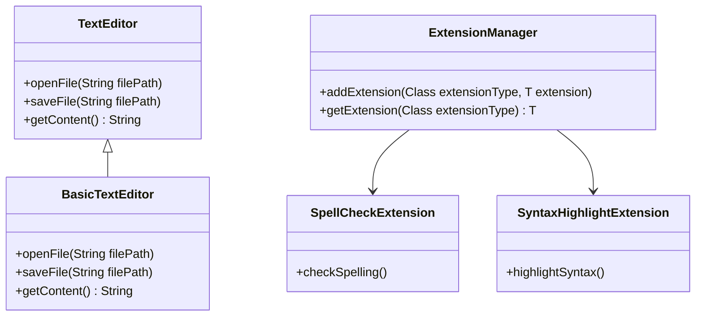

## 4.10.2 Adding Functionality at Runtime

In the world of software engineering, the ability to adapt and extend applications without altering existing code is a hallmark of robust design. The Extension Object Pattern is a powerful tool in achieving this flexibility, allowing developers to add functionality to objects at runtime. This section explores the intricacies of this pattern, its applications, and the benefits it brings to software development.

### Understanding the Need for Runtime Extensibility

As software systems grow in complexity, the need to adapt to changing requirements becomes paramount. Consider scenarios where:

- **User Requirements Evolve**: Applications need to accommodate new user demands without a complete overhaul.
- **Modular Systems**: Systems are designed to be modular, allowing for components to be added or removed as needed.
- **Plugin Architectures**: Applications support plugins, enabling third-party developers to extend functionality.
- **Dynamic Environments**: Systems operate in environments where conditions change, necessitating adaptive behavior.

In these scenarios, the ability to add or modify behavior at runtime is crucial. The Extension Object Pattern provides a structured approach to achieve this.

### The Extension Object Pattern: An Overview

The Extension Object Pattern allows objects to have additional behaviors or properties added at runtime. This is achieved by defining a set of interfaces or classes that represent the extensions, which can be dynamically attached to the core object. This pattern supports:

- **Decoupling**: Separating core functionality from extended behavior.
- **Flexibility**: Allowing new behaviors to be added without modifying existing code.
- **Scalability**: Enabling systems to grow by adding new features as extensions.

### Implementing the Extension Object Pattern in Java

To implement the Extension Object Pattern in Java, follow these steps:

1. **Define the Core Interface**: Create an interface for the core functionality that all objects will implement.
2. **Create Extension Interfaces**: Define interfaces for each type of extension that can be added.
3. **Implement Core and Extensions**: Develop classes that implement the core interface and extension interfaces.
4. **Extension Manager**: Create a manager class to handle the addition and retrieval of extensions.

#### Example: A Simple Plugin System

Let's consider a simple plugin system for a text editor application. The core functionality involves basic text editing, while extensions provide additional features like spell checking and syntax highlighting.

```java
// Core interface for the text editor
public interface TextEditor {
    void openFile(String filePath);
    void saveFile(String filePath);
    String getContent();
}

// Extension interface for spell checking
public interface SpellCheckExtension {
    void checkSpelling();
}

// Extension interface for syntax highlighting
public interface SyntaxHighlightExtension {
    void highlightSyntax();
}

// Core text editor implementation
public class BasicTextEditor implements TextEditor {
    private String content = "";

    @Override
    public void openFile(String filePath) {
        // Logic to open and read file
        content = "File content from " + filePath;
    }

    @Override
    public void saveFile(String filePath) {
        // Logic to save content to file
        System.out.println("Saving content to " + filePath);
    }

    @Override
    public String getContent() {
        return content;
    }
}

// Extension manager to handle extensions
public class ExtensionManager {
    private Map<Class<?>, Object> extensions = new HashMap<>();

    public <T> void addExtension(Class<T> extensionType, T extension) {
        extensions.put(extensionType, extension);
    }

    public <T> T getExtension(Class<T> extensionType) {
        return extensionType.cast(extensions.get(extensionType));
    }
}

// Usage example
public class Main {
    public static void main(String[] args) {
        TextEditor editor = new BasicTextEditor();
        ExtensionManager manager = new ExtensionManager();

        // Adding spell check extension
        manager.addExtension(SpellCheckExtension.class, new SpellCheckExtension() {
            @Override
            public void checkSpelling() {
                System.out.println("Checking spelling...");
            }
        });

        // Adding syntax highlight extension
        manager.addExtension(SyntaxHighlightExtension.class, new SyntaxHighlightExtension() {
            @Override
            public void highlightSyntax() {
                System.out.println("Highlighting syntax...");
            }
        });

        editor.openFile("example.txt");
        System.out.println(editor.getContent());

        // Using extensions
        SpellCheckExtension spellCheck = manager.getExtension(SpellCheckExtension.class);
        if (spellCheck != null) {
            spellCheck.checkSpelling();
        }

        SyntaxHighlightExtension syntaxHighlight = manager.getExtension(SyntaxHighlightExtension.class);
        if (syntaxHighlight != null) {
            syntaxHighlight.highlightSyntax();
        }
    }
}
```

### Advantages of the Extension Object Pattern

The Extension Object Pattern offers several advantages:

- **Scalability**: As new requirements emerge, extensions can be added without altering the core system.
- **Adaptability**: Systems can adapt to different environments by loading appropriate extensions.
- **Modularity**: Extensions can be developed and maintained independently, promoting modular design.
- **Reusability**: Extensions can be reused across different projects or systems.

### Challenges and Considerations

While the Extension Object Pattern provides significant benefits, it also presents challenges:

- **Dependency Management**: Ensuring that extensions do not introduce conflicting dependencies.
- **Compatibility**: Maintaining compatibility between the core system and extensions.
- **Performance**: Managing the overhead of dynamically loading and managing extensions.
- **Security**: Ensuring that extensions do not introduce vulnerabilities.

### Visualizing the Extension Object Pattern

To better understand the Extension Object Pattern, let's visualize the relationship between the core object, extensions, and the extension manager.



### Real-World Applications

The Extension Object Pattern is widely used in real-world applications, particularly in systems that require high levels of customization and flexibility. Examples include:

- **Integrated Development Environments (IDEs)**: Supporting plugins for additional language support, tools, and utilities.
- **Content Management Systems (CMS)**: Allowing users to add themes, plugins, and modules to extend functionality.
- **Enterprise Software**: Enabling customization for different business processes and workflows.

### Try It Yourself

To gain a deeper understanding of the Extension Object Pattern, try modifying the example code:

- **Add a New Extension**: Implement a new extension, such as a grammar checker, and integrate it with the text editor.
- **Modify Existing Extensions**: Experiment with changing the behavior of existing extensions to see how they interact with the core system.
- **Test Compatibility**: Introduce a scenario where two extensions might conflict and explore ways to resolve the issue.

### Conclusion

The Extension Object Pattern is a powerful design pattern that enables the dynamic addition of functionality at runtime. By decoupling core functionality from extensions, it allows systems to adapt and scale with ease. While it presents challenges, such as dependency management and compatibility, the benefits of flexibility and modularity make it an invaluable tool in the software engineer's toolkit.

Remember, this is just the beginning. As you progress, you'll build more complex and interactive systems. Keep experimenting, stay curious, and enjoy the journey!

## Quiz Time!



### What is the primary benefit of using the Extension Object Pattern?

- [x] It allows adding functionality at runtime without altering existing code.
- [ ] It improves the performance of the application.
- [ ] It simplifies the codebase by reducing the number of classes.
- [ ] It ensures that all code is type-safe.

> **Explanation:** The Extension Object Pattern's primary benefit is enabling the addition of functionality at runtime without modifying existing code, enhancing flexibility and adaptability.

### Which of the following scenarios is NOT a typical use case for the Extension Object Pattern?

- [ ] Plugin systems
- [ ] Modular applications
- [x] Static code analysis
- [ ] Dynamic environments

> **Explanation:** Static code analysis does not typically require runtime extensibility, as it involves analyzing code without execution.

### In the provided Java example, what role does the `ExtensionManager` class play?

- [x] It manages the addition and retrieval of extensions.
- [ ] It implements the core text editor functionality.
- [ ] It provides spell checking capabilities.
- [ ] It handles file I/O operations.

> **Explanation:** The `ExtensionManager` class is responsible for managing the addition and retrieval of extensions, allowing the core system to remain unchanged.

### How does the Extension Object Pattern enhance scalability?

- [x] By allowing new features to be added as extensions without modifying the core system.
- [ ] By reducing the number of classes in the application.
- [ ] By improving the performance of existing features.
- [ ] By ensuring that all code is executed in parallel.

> **Explanation:** The pattern enhances scalability by enabling new features to be added as extensions, allowing the system to grow without altering the core.

### What is a potential challenge when using the Extension Object Pattern?

- [ ] Improved performance
- [x] Managing dependencies among extensions
- [ ] Simplified codebase
- [ ] Enhanced security

> **Explanation:** Managing dependencies among extensions can be challenging, as conflicts may arise, requiring careful handling to maintain compatibility.

### Which of the following is an example of an application that benefits from runtime extensibility?

- [ ] A static website
- [x] An integrated development environment (IDE)
- [ ] A basic calculator app
- [ ] A command-line utility

> **Explanation:** An IDE benefits from runtime extensibility, allowing developers to add plugins for additional language support and tools.

### What is a key advantage of using extensions in software design?

- [x] Extensions can be developed and maintained independently.
- [ ] Extensions always improve application performance.
- [ ] Extensions eliminate the need for testing.
- [ ] Extensions ensure that all code is type-safe.

> **Explanation:** Extensions promote modularity by allowing independent development and maintenance, enhancing the flexibility of the software design.

### How can the Extension Object Pattern improve adaptability in software systems?

- [x] By allowing systems to load appropriate extensions based on the environment.
- [ ] By reducing the number of methods in a class.
- [ ] By ensuring that all code is executed in sequence.
- [ ] By simplifying the user interface.

> **Explanation:** The pattern improves adaptability by enabling systems to load extensions dynamically, allowing them to adjust to different environments or requirements.

### What is the role of interfaces in the Extension Object Pattern?

- [x] They define the contracts for core and extension functionalities.
- [ ] They handle file I/O operations.
- [ ] They manage user input and output.
- [ ] They ensure that all code is executed in parallel.

> **Explanation:** Interfaces define the contracts for core and extension functionalities, enabling the dynamic addition of behaviors at runtime.

### True or False: The Extension Object Pattern can introduce security vulnerabilities if not managed properly.

- [x] True
- [ ] False

> **Explanation:** True. If extensions are not managed properly, they can introduce security vulnerabilities, making it essential to ensure that extensions are secure and compatible.


