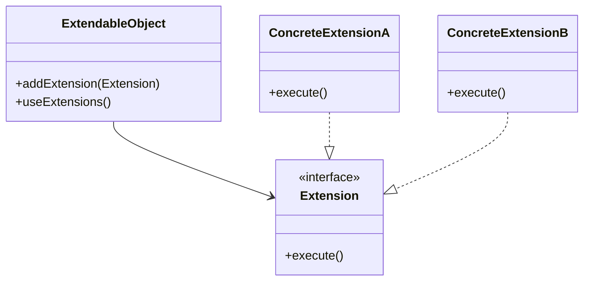

## 4.10.3 Use Cases and Examples

The Extension Object pattern is a powerful design pattern that allows for dynamic extensibility in software applications. This pattern is particularly useful in scenarios where systems need to adapt to different environments or user preferences, or where a core set of features is enhanced with optional extensions. In this section, we will explore several practical applications of the Extension Object pattern, including plugin systems and modular applications, and provide detailed examples and code snippets to illustrate its implementation in Java.

### Understanding the Extension Object Pattern

Before diving into the use cases, let's briefly revisit the core concept of the Extension Object pattern. This pattern allows objects to have additional functionalities added to them dynamically without altering their structure. It achieves this by defining an interface for extensions and a mechanism for objects to support these extensions.

#### Key Components

1. **Extension Interface**: Defines the additional functionality that can be added to objects.
2. **Concrete Extension**: Implements the extension interface, providing specific behavior.
3. **Extendable Object**: The object that can be dynamically extended with new functionalities.
4. **Extension Manager**: Manages the extensions and facilitates their interaction with the extendable object.

### Use Case 1: Plugin Systems

One of the most common applications of the Extension Object pattern is in plugin systems. These systems allow users to install plugins to extend the functionality of a software application. This approach is widely used in web browsers, integrated development environments (IDEs), and content management systems (CMS).

#### Example: A Simple Plugin System

Consider a text editor application that supports plugins for additional features like spell checking, grammar checking, and syntax highlighting. The Extension Object pattern can be used to implement this plugin system.

```java
// Define the Extension interface
interface Plugin {
    void execute();
}

// Concrete Extension: SpellCheckerPlugin
class SpellCheckerPlugin implements Plugin {
    @Override
    public void execute() {
        System.out.println("Spell checking executed.");
    }
}

// Concrete Extension: GrammarCheckerPlugin
class GrammarCheckerPlugin implements Plugin {
    @Override
    public void execute() {
        System.out.println("Grammar checking executed.");
    }
}

// Extendable Object: TextEditor
class TextEditor {
    private List<Plugin> plugins = new ArrayList<>();

    public void addPlugin(Plugin plugin) {
        plugins.add(plugin);
    }

    public void executePlugins() {
        for (Plugin plugin : plugins) {
            plugin.execute();
        }
    }
}

// Usage
public class PluginSystemExample {
    public static void main(String[] args) {
        TextEditor editor = new TextEditor();
        editor.addPlugin(new SpellCheckerPlugin());
        editor.addPlugin(new GrammarCheckerPlugin());

        editor.executePlugins(); // Output: Spell checking executed. Grammar checking executed.
    }
}
```

In this example, the `TextEditor` class is the extendable object, and it can be dynamically extended with different plugins that implement the `Plugin` interface. This design allows users to add new functionalities to the text editor without modifying its core code.

#### Benefits

- **Flexibility**: Users can customize the application by adding or removing plugins based on their needs.
- **Scalability**: New plugins can be developed and integrated without altering the existing codebase.
- **Maintainability**: The core application remains clean and focused on its primary responsibilities.

### Use Case 2: Modular Applications

Modular applications are designed to adapt to different environments or user preferences by enabling or disabling modules. The Extension Object pattern supports this modularity by allowing modules to be added or removed dynamically.

#### Example: A Modular E-commerce Platform

Consider an e-commerce platform that offers various modules such as payment processing, inventory management, and customer reviews. Each module can be implemented as an extension to the core platform.

```java
// Define the Extension interface
interface Module {
    void activate();
}

// Concrete Extension: PaymentModule
class PaymentModule implements Module {
    @Override
    public void activate() {
        System.out.println("Payment module activated.");
    }
}

// Concrete Extension: InventoryModule
class InventoryModule implements Module {
    @Override
    public void activate() {
        System.out.println("Inventory module activated.");
    }
}

// Extendable Object: ECommercePlatform
class ECommercePlatform {
    private List<Module> modules = new ArrayList<>();

    public void addModule(Module module) {
        modules.add(module);
    }

    public void activateModules() {
        for (Module module : modules) {
            module.activate();
        }
    }
}

// Usage
public class ModularApplicationExample {
    public static void main(String[] args) {
        ECommercePlatform platform = new ECommercePlatform();
        platform.addModule(new PaymentModule());
        platform.addModule(new InventoryModule());

        platform.activateModules(); // Output: Payment module activated. Inventory module activated.
    }
}
```

In this example, the `ECommercePlatform` class is the extendable object, and it can be dynamically extended with different modules that implement the `Module` interface. This design allows the platform to adapt to different business needs by enabling or disabling specific modules.

#### Benefits

- **Adaptability**: The platform can be customized to meet specific business requirements by adding or removing modules.
- **Reusability**: Modules can be reused across different applications or projects.
- **Ease of Integration**: New modules can be integrated without disrupting the existing functionality.

### Use Case 3: Frameworks with Core Features and Optional Extensions

Frameworks often provide a core set of features with optional extensions that developers can use to enhance functionality. The Extension Object pattern is ideal for implementing such frameworks, as it allows developers to extend the framework's capabilities without modifying its core.

#### Example: A Web Framework with Middleware Extensions

Consider a web framework that supports middleware extensions for logging, authentication, and caching. Each middleware can be implemented as an extension to the core framework.

```java
// Define the Extension interface
interface Middleware {
    void handleRequest();
}

// Concrete Extension: LoggingMiddleware
class LoggingMiddleware implements Middleware {
    @Override
    public void handleRequest() {
        System.out.println("Request logged.");
    }
}

// Concrete Extension: AuthenticationMiddleware
class AuthenticationMiddleware implements Middleware {
    @Override
    public void handleRequest() {
        System.out.println("Authentication checked.");
    }
}

// Extendable Object: WebFramework
class WebFramework {
    private List<Middleware> middlewares = new ArrayList<>();

    public void addMiddleware(Middleware middleware) {
        middlewares.add(middleware);
    }

    public void processRequest() {
        for (Middleware middleware : middlewares) {
            middleware.handleRequest();
        }
    }
}

// Usage
public class WebFrameworkExample {
    public static void main(String[] args) {
        WebFramework framework = new WebFramework();
        framework.addMiddleware(new LoggingMiddleware());
        framework.addMiddleware(new AuthenticationMiddleware());

        framework.processRequest(); // Output: Request logged. Authentication checked.
    }
}
```

In this example, the `WebFramework` class is the extendable object, and it can be dynamically extended with different middleware that implements the `Middleware` interface. This design allows developers to customize the framework's behavior by adding or removing middleware extensions.

#### Benefits

- **Customization**: Developers can tailor the framework to meet specific application requirements by adding or removing middleware.
- **Separation of Concerns**: Middleware extensions encapsulate specific functionalities, promoting a clean separation of concerns.
- **Extensibility**: The framework can be easily extended with new middleware without altering its core.

### Visualizing the Extension Object Pattern

To better understand the Extension Object pattern, let's visualize its components and interactions using a class diagram.



In this diagram, the `ExtendableObject` class represents the object that can be dynamically extended with new functionalities. The `Extension` interface defines the additional functionality, and `ConcreteExtensionA` and `ConcreteExtensionB` are specific implementations of the extension interface.

### Encouraging Dynamic Extensibility

The Extension Object pattern is a versatile design pattern that supports dynamic extensibility in software systems. By allowing functionalities to be added or removed at runtime, this pattern enables developers to build flexible, adaptable, and scalable applications. When designing systems that require dynamic extensibility, consider the Extension Object pattern to achieve these benefits.

### Try It Yourself

To gain a deeper understanding of the Extension Object pattern, try modifying the code examples provided in this section. Here are some suggestions:

- **Add New Extensions**: Implement additional plugins, modules, or middleware to extend the functionality of the examples.
- **Implement Extension Manager**: Create an extension manager to handle the registration and management of extensions.
- **Experiment with Different Use Cases**: Apply the Extension Object pattern to other scenarios, such as game development or data processing.

### Conclusion

The Extension Object pattern is a powerful tool for achieving dynamic extensibility in software applications. By allowing functionalities to be added or removed at runtime, this pattern supports flexibility, adaptability, and scalability. Whether you're building a plugin system, a modular application, or a framework with optional extensions, the Extension Object pattern can help you design systems that meet diverse and evolving requirements.

## Quiz Time!



### What is the primary purpose of the Extension Object pattern?

- [x] To allow objects to have additional functionalities added dynamically
- [ ] To enforce a strict hierarchy of classes
- [ ] To simplify object creation processes
- [ ] To manage object lifecycles

> **Explanation:** The Extension Object pattern allows objects to have additional functionalities added dynamically without altering their structure.

### In the context of the Extension Object pattern, what role does the `ExtendableObject` play?

- [x] It is the object that can be dynamically extended with new functionalities
- [ ] It defines the additional functionality that can be added
- [ ] It implements specific behavior for extensions
- [ ] It manages the extensions and facilitates their interaction

> **Explanation:** The `ExtendableObject` is the object that can be dynamically extended with new functionalities by adding extensions.

### Which of the following is a benefit of using the Extension Object pattern in plugin systems?

- [x] Flexibility and scalability
- [ ] Increased complexity
- [ ] Reduced functionality
- [ ] Limited customization

> **Explanation:** The Extension Object pattern provides flexibility and scalability by allowing users to customize applications with plugins.

### How does the Extension Object pattern support modular applications?

- [x] By allowing modules to be added or removed dynamically
- [ ] By enforcing a strict module hierarchy
- [ ] By simplifying module creation processes
- [ ] By managing module lifecycles

> **Explanation:** The Extension Object pattern supports modular applications by allowing modules to be added or removed dynamically, adapting to different environments or user preferences.

### What is a common use case for the Extension Object pattern?

- [x] Plugin systems
- [ ] Data serialization
- [ ] Object pooling
- [ ] Thread synchronization

> **Explanation:** Plugin systems are a common use case for the Extension Object pattern, as they require dynamic extensibility.

### In the provided code examples, what interface do plugins implement?

- [x] Plugin
- [ ] Module
- [ ] Middleware
- [ ] ExtensionManager

> **Explanation:** In the provided code examples, plugins implement the `Plugin` interface, which defines the additional functionality.

### What is the role of the `Extension Manager` in the Extension Object pattern?

- [x] It manages the extensions and facilitates their interaction with the extendable object
- [ ] It defines the additional functionality that can be added
- [ ] It implements specific behavior for extensions
- [ ] It is the object that can be dynamically extended

> **Explanation:** The `Extension Manager` manages the extensions and facilitates their interaction with the extendable object.

### Which of the following is NOT a benefit of using the Extension Object pattern?

- [ ] Flexibility
- [ ] Scalability
- [ ] Maintainability
- [x] Increased complexity

> **Explanation:** The Extension Object pattern aims to reduce complexity by allowing dynamic extensibility, not increase it.

### In the context of frameworks, how does the Extension Object pattern enhance customization?

- [x] By allowing developers to add or remove middleware extensions
- [ ] By enforcing a strict framework hierarchy
- [ ] By simplifying framework creation processes
- [ ] By managing framework lifecycles

> **Explanation:** The Extension Object pattern enhances customization in frameworks by allowing developers to add or remove middleware extensions.

### True or False: The Extension Object pattern is only applicable to plugin systems.

- [ ] True
- [x] False

> **Explanation:** False. The Extension Object pattern is applicable to various scenarios, including plugin systems, modular applications, and frameworks with optional extensions.


